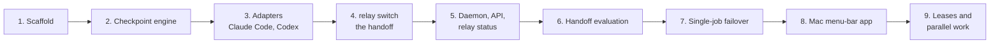

# relay roadmap

Last updated 2026-10-07.

This file is the big picture: what we build, in what order, and which decisions are
still open. The task board for the jstack loop is kept privately. The details live in two
other places:

- `openspec/changes/` holds a detailed proposal for each piece of the first version.
  A proposal is built only after Josué approves it.
- `docs/research/` holds the research behind the plan:
  - `provider-control-surfaces.md`: what Claude Code, Codex, Cursor, T3 Code and
    OpenCode expose for starting, streaming, interrupting, resuming, hooks, usage
    signals, multiple accounts and unattended runs;
  - `architecture.md`: runtime, local API, state, git checkpoints, the handoff,
    stop detection, leases, the Mac app, distribution and testing;
  - `security.md`: the local API, credentials, secrets in handoffs, repository
    safety, unattended runs, provider terms, supply chain;
  - `prior-art-and-pricing.md`: similar tools, licensing, lifetime licenses,
    payments, landing page references;
  - `handoff-sources.md`: what Anthropic, OpenAI and Cognition have published on
    handing work from one agent or context window to the next, and the changes it
    led to in the handoff notes request.

## What the research changed

- **The gap is real.** More than ten tools run agents in parallel; none carries a
  job's working state from one provider or account to another. relay's position is
  "your job keeps going when an agent stops", not another agent manager.
- **T3 Code is a neighbour, not a target.** Its provider switch inside a thread is in
  a nightly build and its own notes call it "lossy". relay's edge is a handoff built
  from git checkpoints and an event log that works with any client, plus rollback.
- **Provider terms shape the product.** Anthropic forbids third-party products from
  routing through subscription plans or handling claude.ai credentials, and says
  subscription limits assume ordinary individual use. OpenAI forbids circumventing
  rate limits. So relay only drives the official tools the person signed into
  themselves, never touches credentials, and keeps automatic switching between two
  accounts of the same provider off by default.
- **Real limit signals exist.** Claude Code has a `StopFailure` hook with
  `rate_limit` and reset times in its status-line data; Codex's app server reads rate
  limits with a reset time. Automatic failover can be built on supported signals.
- **No network port.** The local API is a Unix socket only; similar tools were
  attacked from web pages through local ports.
- **Git is an attack path.** relay runs git with hooks and `fsmonitor` disabled and
  writes checkpoints to hidden refs, never to the person's branch.

## Decisions made

On 2026-10-07 Josué approved building the first version with every recommendation in
the six OpenSpec changes and in the table below, and asked for it to be built end to
end without waiting for him. Specifically:

| Date | Decision |
|---|---|
| 2026-10-07 | Runtime: TypeScript on Bun, compiled to one binary per platform (macOS arm64, Linux x64). |
| 2026-10-07 | Local API: Unix socket only, no TCP port. |
| 2026-10-07 | Automatic switching between two accounts of the same provider: off; manual only. |
| 2026-10-07 | relay only drives the official tools the person signed into; it never touches credentials. Demo assumes the tools are already signed in. |
| 2026-10-07 | `.relay/` stays local; checkpoint refs are not pushed. |
| 2026-10-07 | Provider allow list per project, confirmation before the first handoff to a new provider. |
| 2026-10-07 | License: Apache 2.0. The repository stays private for now; releases are installed with `gh` (Josué is signed in). |
| 2026-10-07 | The Mac menu-bar app: SwiftUI, built and tested on GitHub's macOS runners (not on Josué's Mac), unsigned until there is an Apple Developer account. |
| 2026-10-07 | The website: deployed to Azure Static Web Apps in Josué's Azure subscription (signed in on Omarchy). |
| 2026-10-07 | One small real handoff (Claude Code to Codex on a scratch repository) may run on Omarchy with the accounts already signed in there; everything else uses fake providers. |
| 2026-10-07 | Design: `DESIGN.md` and `docs/design/preview.html` (current direction; may still change). |
| 2026-10-07 | Business model: a one-time payment (a lifetime license for the paid features); the core stays free. |
| 2026-10-07 | Payment provider: Stripe, following Stripe's own implementation guides and best practices. Build in Stripe test mode until Josué adds live keys. |
| 2026-10-07 | No Apple Developer account for now: the CLI never needs one, and the Mac app works unsigned (first launch: right-click, Open). Only a smooth public download of the Mac app would need it later. |

## Decisions still open

| Decision | Recommendation | What it blocks |
|---|---|---|
| Ask Anthropic and OpenAI directly | Yes, before a public release: driving the unmodified programs, unattended, across a person's own accounts. | Public release, marketing |
| Relationship with T3 Code | Integrate: a T3 adapter and a relay view inside T3, while working everywhere else too. | Positioning |
| The name | T3 Code already has a component called "T3 Connect Relay". Check whether "relay" is clear enough for search, a domain and a Homebrew name before a public release. | Public release |

## Phases

Each phase produces something Josué can use on his own work. Phases 1 to 6 are the
first version; each has a detailed OpenSpec proposal.

1. **Scaffold.** One Bun TypeScript project with the `relay` binary, `RELAY_HOME`,
   `~/.relay/config.toml`, logging, and release builds for macOS arm64 and Linux x64.
2. **Checkpoint engine.** `relay init`, `relay checkpoint`, `relay rollback`, with
   scratch-repository tests proving the person's branch, index and uncommitted work
   are never touched.
3. **Adapters.** The adapter interface, fake agents for tests, then Claude Code and
   Codex adapters on their documented interfaces, with account profiles.
4. **`relay switch`.** The handoff builder (tiers 0 and 1), relay re-running the
   recorded checks, the secret scan, the provider allow list, starting the next agent.
5. **Daemon, API and status.** The Unix-socket API, SQLite for live state, the event
   log, `relay hook` for provider hooks, `relay status` in the lanes style, and the
   daemon starting itself from the CLI.
6. **Handoff evaluation.** The same real task handed off at different points; compare
   outcomes before adding any automation.
7. **Single-job failover.** Supported limit signals start a handoff; reset times
   are timer events; per-provider policy switches.
8. **The Mac menu-bar app.** The tiny and expanded card from `DESIGN.md`, over the
   socket API, notarized, with updates.
9. **Leases and parallel work.** Tasks, leases with heartbeats, worktrees per task, a
   priority queue, migration cost; first on the Omarchy machine.

## Later

T3 Code adapter and a relay view inside T3; Cursor and OpenCode adapters; the job
lineage view; a public release with security review items from
`docs/research/security.md`; and, if wanted, the paid tier and cloud features. The website
(the landing page) is proposed in `openspec/changes/add-website/`.
