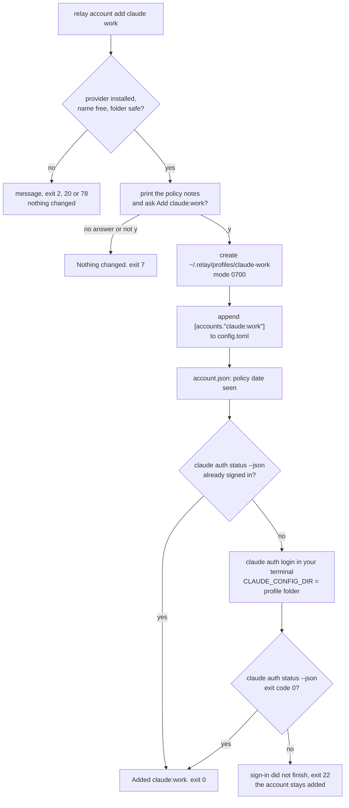
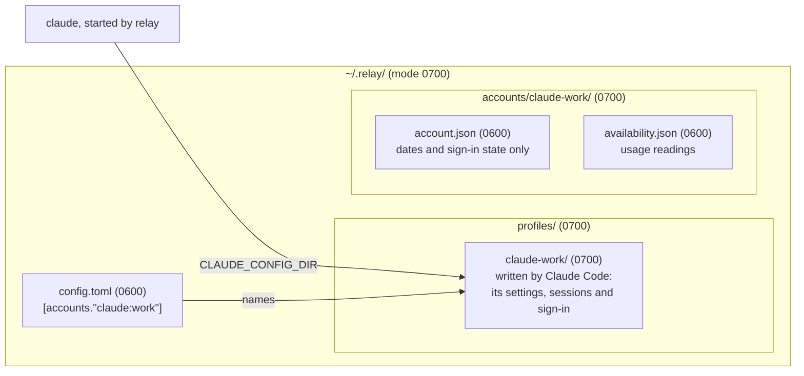

# Accounts

An account is one sign-in with one provider, named `provider:name`, for example `claude:work` or
`codex:personal`. You can hold several accounts of the same provider. relay runs each account in
its own profile folder, where the provider's own program keeps that account's sign-in, so relay
always starts an agent with the right account and never touches a password or a token itself.

This page explains how to add an account, how the provider's own folders and API keys work, what
relay stores about an account and what it never stores, and how to remove an account and sign out.
The design is decisions 6, 9, 10, 11 and 12 of `openspec/changes/add-provider-adapters/design.md`,
and the rules are in its `provider-accounts` and `provider-policies` specs.

## Adding an account

```sh
relay account add claude work
```

relay checks that the provider's program is installed, prints relay's notes on the provider's
terms with their check date and links, and asks `Add claude:work? [y/N]`. After a `y`, relay:

1. creates the profile folder `~/.relay/profiles/claude-work` with mode 0700, inside
   `~/.relay/profiles/`, which also has mode 0700;
2. appends the table `[accounts."claude:work"]` to `config.toml`, after a comment
   `# Added by relay on <date>.`, and keeps every other line of the file as it was;
3. records in `~/.relay/accounts/claude-work/account.json` which version of the notes you saw;
4. runs the provider's own login, `claude auth login` or `codex login`, in your terminal, with
   `CLAUDE_CONFIG_DIR` or `CODEX_HOME` set to the profile folder. relay does not read your terminal
   while the login runs;
5. checks the result with `claude auth status --json` or `codex login status` and prints a summary:

```
Added claude:work.
  Profile    ~/.relay/profiles/claude-work
  Signed in  yes (claude.ai)
```



The diagram shows the order of the steps. Every check runs before relay changes anything, so a
refusal or a "no" leaves no folder and no setting behind. The login comes last: when it does not
finish, the account is already in `config.toml` and you can sign in later with
`relay account login claude:work`.

Options of `relay account add`:

| Option | Meaning |
|---|---|
| `--profile-dir <dir>` | Use this folder as the profile folder instead of `~/.relay/profiles/<provider>-<name>`. |
| `--api-key-env <VAR>` | The account uses the API key in this variable. relay skips the login. |
| `--kind personal\|work` | Record whether this is a personal or a work account. |
| `--no-login` | Add the account without signing in now. |
| `--yes` | Do not ask. Without a terminal, relay needs `--yes`. |

## The profile folder



The diagram shows where each part of an account lives. The profile folder belongs to the
provider's program: Claude Code or Codex writes its settings, its sessions and its sign-in there,
because relay points `CLAUDE_CONFIG_DIR` or `CODEX_HOME` at it. relay writes nothing in it except,
later, its hooks. relay's own facts about the account live apart, under `accounts/`.

relay refuses to use a profile folder that is a symbolic link, that belongs to another user, or
that the group or other users can change:

```
Other users can change ~/.relay/profiles/claude-work. Run chmod 700 on it, then try again.
```

relay exits with code 78 then. It sets mode 0700 only on folders it creates itself and never
changes the mode of a folder it did not create. Two accounts cannot share a profile folder.

## The provider's own folders

Claude Code keeps its sign-in in `~/.claude` and Codex in `~/.codex` when no variable says
otherwise. To use the sign-in you already have, give that folder:

```sh
relay account add claude personal --profile-dir ~/.claude
relay account add codex personal --profile-dir ~/.codex
```

When the program is already signed in there, no login runs. For these two folders relay leaves
`CLAUDE_CONFIG_DIR` and `CODEX_HOME` unset when it starts the program, so the program finds its
sign-in exactly as it does when you start it yourself. Claude Code ties its macOS Keychain entry
to the configuration folder, and setting the variable to `~/.claude` might not find the same entry.

## Accounts that use an API key

```sh
relay account add claude api --api-key-env ANTHROPIC_API_KEY --yes
```

relay records only the variable's name, in `credential_env = ["ANTHROPIC_API_KEY"]`, skips the
login and prints:

```
claude:api uses the key in $ANTHROPIC_API_KEY. relay passes that variable to Claude Code and never stores its value.
```

When relay starts this account's agent, it copies the variable from its own environment. A
Claude Code account may name only `ANTHROPIC_` variables and `CLAUDE_CODE_OAUTH_TOKEN`, and a Codex
account only `OPENAI_` and `CODEX_` variables other than `CODEX_HOME`. Every other credential
variable is removed from the environment of every agent relay starts, so a key exported in your
shell never reaches an account that does not name it, and one provider's key never reaches
another provider's program. `docs/adapters.md`, "The agent's environment", lists the variables.

## Listing and checking accounts

```sh
relay account list
relay account status claude:work
relay providers
```

`relay account list` prints one line per account with its profile folder and the last sign-in
state relay recorded. It runs no provider command. `--json` prints the same as JSON.

`relay account status <account>` runs the provider's status command and prints the sign-in, the
profile folder, the account's availability with its source and age, and whether relay's hooks and
status line are installed:

```
claude:work
  Profile       ~/.relay/profiles/claude-work
  Signed in     yes (claude.ai)
  Availability  limit, resets 14:00 (status line, 12 min ago)
  Hooks         not installed
  Status line   not installed
```

The availability comes from `~/.relay/accounts/<provider>-<name>/availability.json`, where relay
records each reading with its source. When a limit's reset time has passed, relay reports
`unknown` with "The reset time has passed; relay has not measured since.", because it never
assumes that a limit has ended. Without any reading the availability is `unknown`. Readings
reach this file from later parts of relay: Claude Code's stream, hooks and status line, and the
Codex app server.

`relay providers` shows each provider's program, its version and how relay drives it, and
`relay providers --json` adds the capabilities of each transport (`docs/adapters.md`).

## Signing in again

```sh
relay account login codex:personal
```

runs the provider's login for that account exactly as `relay account add` does, then prints
`codex:personal is signed in.` and exits with code 0, or exits with code 22 when the status
command does not report the account as signed in.

## What relay stores and what it never stores

relay stores, for each account:

- in `config.toml`: the account's name, its profile folder when you chose one, its kind, and the
  names of its key variables;
- in `accounts/<provider>-<name>/account.json`: when the account was added, which version of the
  policy notes you saw and when, whether the last status check found the account signed in, the
  sign-in method the provider reported (such as `claude.ai` or `ChatGPT`), and when hooks and the
  status line were installed;
- in `accounts/<provider>-<name>/availability.json`: usage readings with their source and time.

relay never reads, copies, stores or logs a password, a token, an API key's value, an email
address or a provider account ID. The provider's status output is read only for its exit code and
the sign-in method; everything else in it is discarded. The sign-in itself stays in the profile
folder, written by the provider's own program.

## Provider policy notes

Each provider's terms limit what relay may do with an account. relay shows its notes on those
terms before it adds an account and with `relay policy show <provider>`:

```sh
relay policy show claude
```

The notes say how you can sign in, which usage signals relay reads, whether unattended use on a
subscription is allowed, what is unclear, the links to the terms and the date relay last checked
them. When that date is more than 90 days old, the output adds "This may be out of date.".
Automatic switching between two accounts of the same provider is off, and no setting changes
that. `docs/adapters.md`, "Provider policies", describes the policy files.

## Removing an account

```sh
relay account remove claude:work
```

After you confirm, relay removes the `[accounts."claude:work"]` table from `config.toml` and
prints:

```
Removed claude:work. Its profile folder is still at ~/.relay/profiles/claude-work. To sign out, run CLAUDE_CONFIG_DIR=~/.relay/profiles/claude-work claude auth logout, then delete the folder yourself.
```

relay never deletes or changes the profile folder, because it holds the provider's sign-in and
your sessions. To sign out, run the provider's own logout with the profile variable set, as the
message shows (for Codex, `CODEX_HOME=<folder> codex logout`), then delete the folder yourself.
For `~/.claude` and `~/.codex`, relay only removes the account from its settings.

relay refuses to remove an account while a `[[projects]]` allow list names it, and also while
`[defaults]`, `[t3]` or `[limits]` name it, and exits with code 2. Remove it there first. When the
account was written in another form, with dotted keys or as an inline table, relay cannot find its
table, says so and exits with code 1; remove it in `config.toml` yourself.

## How relay changes config.toml

`src/core/config/edit.ts` is the only code that writes `config.toml`. It appends whole tables or
removes one whole `[accounts."<id>"]` table and keeps every other byte, so your comments and order
survive. It checks the new text with the same checks as loading, writes it to a temporary file
with mode 0600 and renames it over the old file. When the new text does not pass, the file keeps
its old bytes and relay exits with code 70.

## Exit codes

| Code | When |
|---|---|
| 0 | Done. |
| 1 | The account's table is not in a form relay can remove. |
| 2 | Wrong arguments, an unsupported provider, an existing account, a shared profile folder, or an account still named elsewhere in `config.toml`. |
| 7 | relay needs your answer and has no terminal, or you answered no. |
| 20 | The provider's program is not installed. |
| 21 | The account is not in `config.toml`. |
| 22 | The sign-in did not finish. |
| 70 | A change to `config.toml` did not pass relay's checks; nothing was saved. |
| 78 | The profile folder is unsafe, or the settings are wrong. |
