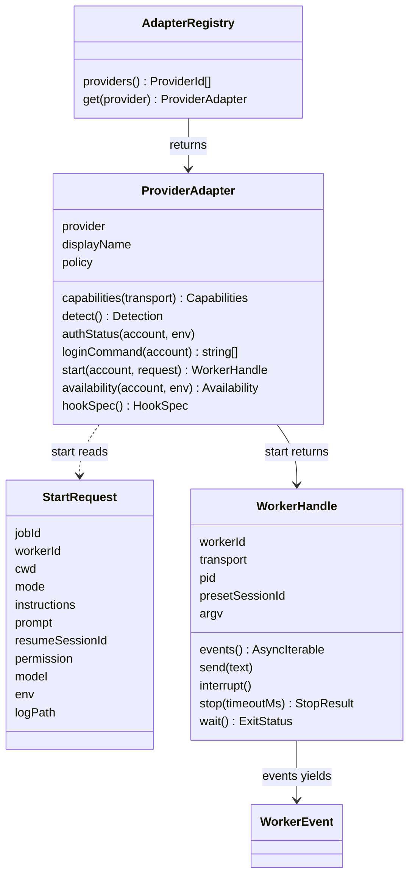
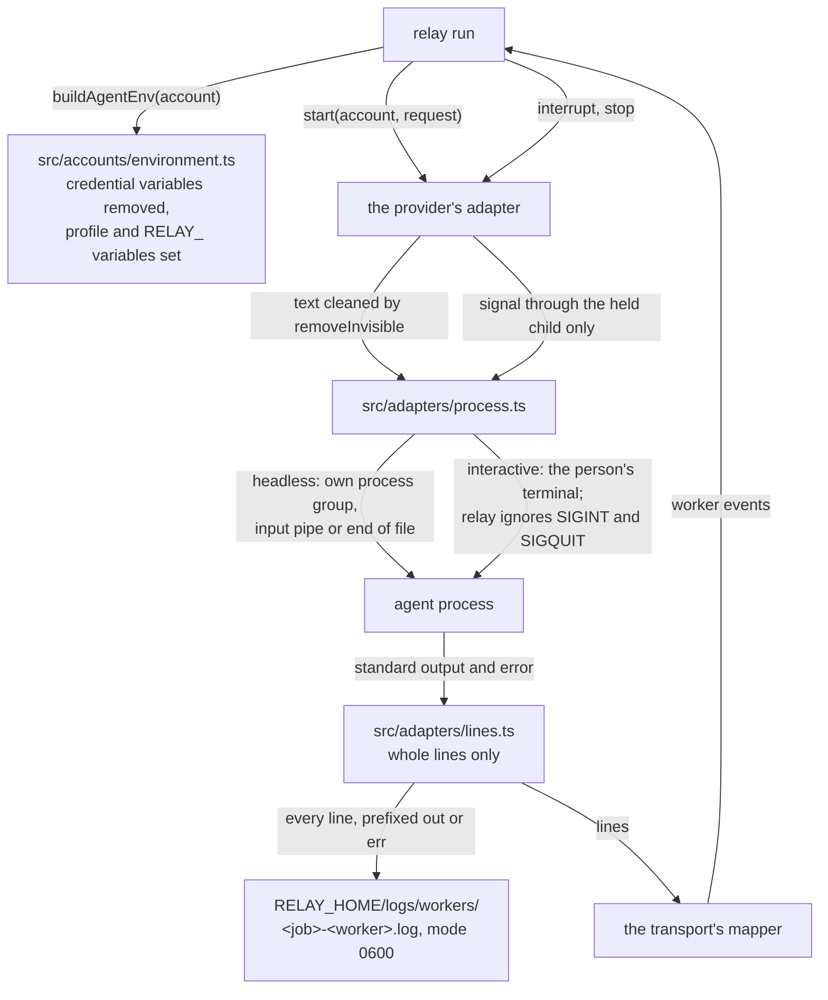
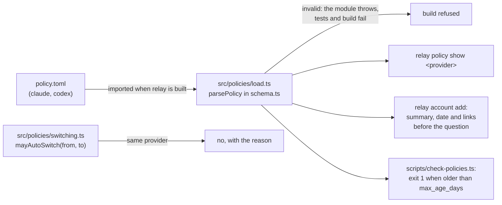
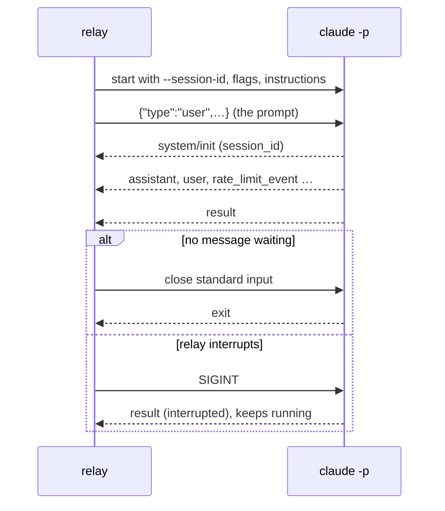
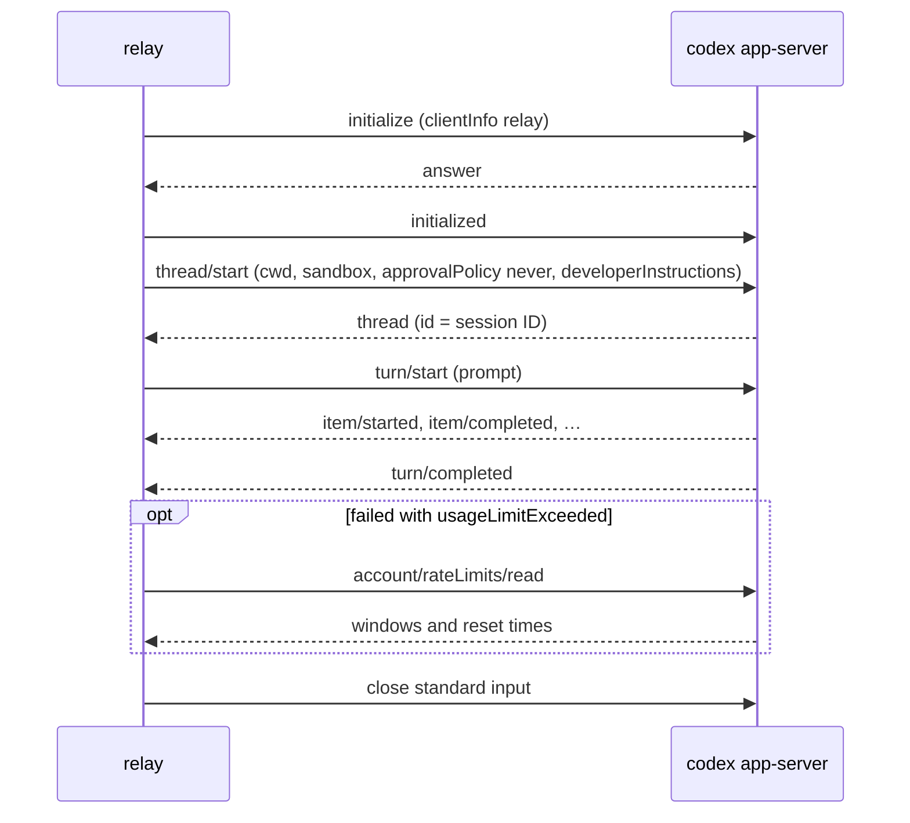
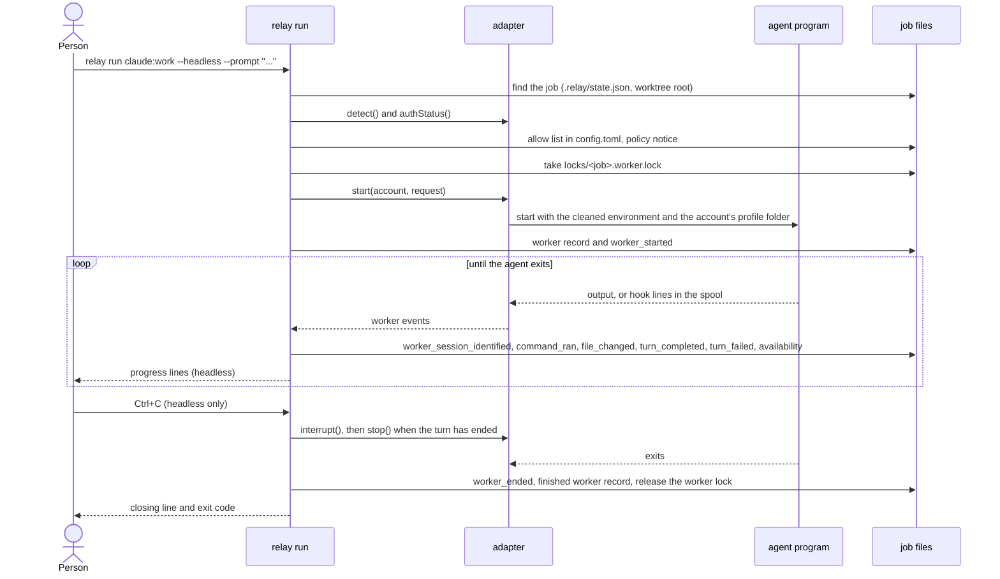

# Provider adapters

An adapter is the part of relay that knows how one coding agent works. relay has one adapter per
provider: Claude Code (`claude`) and Codex (`codex`). Everything else in relay, such as
`relay run`, `relay switch` and the daemon, talks to an agent only through the adapter interface
described here, so it never needs to know which provider it is talking to.

This page describes the interface, how relay starts and supervises an agent process, the events an
adapter reports, the reasons a turn can fail, the availability states of an account, and what each
transport can do. The design is decisions 1 to 8 and 16 of
`openspec/changes/add-provider-adapters/design.md`. `docs/testing-adapters.md` describes the fake
agents that the tests use instead of the real programs.

What exists today: the interface in `src/adapters/types.ts`, the registry in
`src/adapters/registry.ts`, process supervision in `src/adapters/process.ts`, the line splitter in
`src/adapters/lines.ts`, reset-time reading in `src/adapters/reset-time.ts`, TOML string encoding in
`src/adapters/text.ts`, the agent environment in `src/accounts/environment.ts`, the redaction of
facts in `src/secrets/redact.ts`, and the clock in `src/platform/clock.ts`. The Claude Code and
Codex adapters are in `src/adapters/claude/` and `src/adapters/codex/`; `src/adapters/program.ts`
finds their programs, `src/adapters/mapper.ts` and `src/adapters/worker.ts` hold the parts their
workers share. The sections "The Claude Code adapter" and "The Codex adapter" below describe how
each one drives its program. `relay run`, in `src/run/`, is the first command that starts an agent
through this interface; the section "Running an agent" at the end of this page describes it.
`docs/accounts.md` describes the accounts that use these adapters, and
`docs/hooks.md` the hooks and the status line.

## Words used on this page

| Term | Meaning |
|---|---|
| Transport | The way relay drives a program: `claude-print` (`claude -p` with stream JSON), `claude-interactive`, `codex-app-server`, `codex-exec` (`codex exec --json`) and `codex-interactive`. |
| Worker | One run of one agent program on one account. Its handle lets relay read its events, send messages, interrupt it, stop it and wait for its end. |
| Turn | One request to the agent and everything it does until it answers: messages, commands, file edits. |
| Headless | The agent runs without a person typing; relay supplies the input and reads structured output. |
| Interactive | The agent runs in the person's own terminal and the person types. |
| Reading | One measurement of an account's usage or limit, with the time and the source it came from. |

## The interface



The diagram shows the four parts of the interface. `createAdapterRegistry()` returns the registry,
which gives the adapter of a provider; a test passes overrides, such as the in-process fake adapter,
and the production registry never holds a fake. An adapter detects the installed program and its
version, checks the sign-in, names the provider's own login command, reads an account's
availability and names the hooks it can install. Its `start` takes a `StartRequest` and returns a
`WorkerHandle`. The handle yields worker events until the agent exits. Its `argv` holds the
program's arguments as relay records them, with the instructions and the prompt replaced by
`<instructions>` and `<prompt>`.

A `StartRequest` always carries the job's worktree root as `cwd`, relay's own instructions, the
environment built for the account, and the path of the worker log. A headless worker also needs a
prompt. `permission` is `read-only` or `edit-in-workspace`; relay refuses `full-access` before it
calls an adapter, and never passes a permission-bypass flag.

An adapter that cannot do something says so instead of pretending: `send` on a transport without
streaming input throws `UnsupportedOperation` with a message such as "Codex in codex exec mode
cannot receive a message while it runs."

## Transports and their capabilities

Each adapter declares what each of its transports can do, because the providers differ a lot:
only Codex reads usage before a limit, and only Claude Code lets relay choose the session ID in
advance.

| Transport | streamingInput | cleanInterrupt | nativeResume | limitPercentBeforeHit | limitSignalOnHit | observesExternalSessions |
|---|---|---|---|---|---|---|
| `claude-print` | true | true | true | false | structured | hooks |
| `claude-interactive` | false | false | true | true (status line, when installed) | structured (hook) | hooks |
| `codex-app-server` | true | true | true | true | structured | hooks |
| `codex-exec` | false | true | true | false | text | hooks |
| `codex-interactive` | false | false | true | false | none | hooks |

| Capability | Meaning |
|---|---|
| `streamingInput` | relay can send another message to a running worker. |
| `cleanInterrupt` | relay can end a turn through the tool's official interrupt and the worker keeps running. |
| `nativeResume` | relay can resume a provider session by its ID. |
| `limitPercentBeforeHit` | relay can read how much of a usage window is used before the limit is reached. |
| `limitSignalOnHit` | How the tool says it reached a limit: a `structured` field, only `text`, or `none`. |
| `observesExternalSessions` | How relay learns about sessions it did not start: through `hooks`, by `poll`, or `none`. |

## How relay supervises an agent process



The diagram shows one worker from start to end. `relay run` builds the agent's environment and
asks the adapter to start the worker. The adapter removes invisible characters from relay's
instructions and the prompt, then asks `src/adapters/process.ts`, the only module that starts agent
processes, to run the program. A test fails if any other file under `src/adapters/` starts a
process.

A headless agent starts with `detached: true`, which puts it in its own process group, so a Ctrl+C
in the terminal reaches relay only and relay decides what to do. Its standard input is a pipe for
transports that read messages from it (`claude-print`, `codex-app-server`) and end of file at once
for a transport that takes its prompt as an argument (`codex-exec`), so the agent never waits for
input that will not come. An interactive agent inherits the person's terminal; while it runs, relay
ignores SIGINT and SIGQUIT the way a shell does, so only the agent handles Ctrl+C, and relay's own
handlers come back when the agent exits.

relay reads both outputs of a headless agent continuously from start to exit, so the agent is never
blocked on a full pipe. The line splitter passes a line on only once its newline has arrived, and
never cuts a line, however long. Every line goes, unchanged and prefixed with `out ` or `err `, to
the worker log under `RELAY_HOME/logs/workers/`, created with mode 0600 in a folder with mode 0700,
and then to the transport's mapper, which turns the tool's output into worker events. A line that is
not valid JSON is skipped and counted; an empty line is ignored. relay refuses a log folder or log
file that is a symbolic link, belongs to another user or is not a regular file, and makes an
existing log folder private. If a program that the agent started keeps the agent's output open
after the agent exits, relay stops reading 2 seconds after the exit; a last line cut off this way
goes to the log but not to the mapper. `relay run` deletes worker logs, named
`<job>-<worker>.log`, last changed more than 14 days ago when it starts; it deletes nothing when
`logs/` or `logs/workers/` is a symbolic link or belongs to another user.

relay signals only the child process it started and still holds. A headless agent leads its own
process group, so relay sends the signal to that group, which also reaches the programs the agent
started, as Ctrl+C in a terminal would. Once the child has exited, a signal sends nothing, so a
signal can never reach another process that later got the same process ID. relay never signals a
process found by name, by port or by a process ID read from a file. When relay itself exits while
an agent still runs, including after SIGHUP from a closed terminal, it sends that agent SIGTERM.

## Stopping a worker

`stop` ends a worker that relay started and still holds. `relay switch` uses it before it hands a
job to the next agent.

| `how` | When |
|---|---|
| `clean` | A headless worker ended its turn after the tool's official interrupt, relay closed its input, and it exited. |
| `terminated` | An interactive worker exited after SIGTERM. Claude Code exits with code 143. |
| `killed` | The worker was still running when the time limit passed (30 seconds unless the caller gives another), so relay sent SIGKILL. |
| `already_exited` | The worker had already exited; relay sent no signal. |

The result also holds the exit code, the signal and whether the turn had ended.

## Worker events

| Kind | Meaning |
|---|---|
| `session_started` | The provider's session ID is known: chosen in advance (`preset`), read from the output (`stream`) or from a hook (`hook`). It comes before any `message`, `tool`, `turn_completed` or `turn_failed` event of the same worker. |
| `message` | Text the agent wrote. `partial` is true for a piece of a message that is still being written. relay never writes message text to the job's event log. |
| `tool` | The agent started, completed, failed or was refused a tool use, with the command, its exit code or the changed paths when known. |
| `turn_completed` | The turn ended normally, with token usage, an estimated cost and the duration when the tool reports them. |
| `turn_failed` | The turn ended without finishing, with one of the failure reasons below, the reset time when the provider gave one, the provider's message cut to 300 characters, and the source of the reading. |
| `limit_update` | A new usage reading: the windows, an availability state and a reset time when known. |
| `approval_needed` | The agent asks for a permission. relay never answers for the person. |
| `permission_denied` | The tool refused a tool use because it would have needed a permission. |
| `exited` | The process ended, with its exit code or signal. This is always the last event. |

A process that ends while a turn is open first gives `turn_failed`, with `interrupted` when relay
sent the interrupt and `crashed` otherwise, then `exited`.

## Failure reasons

| Reason | Meaning |
|---|---|
| `usage_limit` | The account reached a usage limit of its plan, and the reset time is known. |
| `rate_limit` | The provider refused because of too many requests, without a known reset time. |
| `overloaded` | The provider's service was overloaded. |
| `auth` | The sign-in or the key was refused. |
| `billing` | The account has no credit or a billing problem. |
| `context_full` | The conversation no longer fits in the model's context window. |
| `interrupted` | relay interrupted the turn. |
| `crashed` | The process ended during the turn without an interrupt from relay. |
| `other` | Any other failure. |

## Availability

An adapter reports an account's availability with one of these states, the reset time when known,
the usage windows it measured, the time of the reading and its source. Without any reading the
state is `unknown` with source `none`.

| State | Meaning |
|---|---|
| `available` | The last reading says the account can work. |
| `rate_limited` | The account is waiting for a short rate limit. |
| `quota_exhausted` | The account used up a usage window and waits for its reset. |
| `unavailable` | The account cannot work for another reason, such as a refused sign-in. |
| `unknown` | relay has no reading, or the recorded reset time has passed and relay has not measured since. |

| Source | Where the reading came from |
|---|---|
| `provider_api` | A provider call made for the purpose, such as Codex's `account/rateLimits/read`. |
| `stream_event` | An event in the agent's own output, such as Claude Code's `rate_limit_event`. |
| `hook` | A hook the tool ran, such as Claude Code's `StopFailure`. |
| `status_line` | The usage numbers Claude Code gives its status line. |
| `message_text` | The text of a limit message, the last resort. |
| `user` | The person said so. |
| `none` | No reading. |

Usage windows are named after their length: `five_hour` (300 minutes), `seven_day` (10,080
minutes), or `<n>_minutes` for any other length.

## Reset times

`src/adapters/reset-time.ts` reads reset times. A number below 10^12 is read as Unix seconds and a
larger one as Unix milliseconds, because the unit of Claude Code's `resetsAt` is not documented; a
string is read as an ISO 8601 time. Limit messages give a local time such as `3:45pm`, `3:45 PM`,
`Mon 12:00am` or `Oct 9, 3:45 PM`; relay reads it as the next moment the local clock shows that
time. Codex writes a reset on another day with the year, as in `Oct 9th, 2026 3:45 PM`, which
relay reads as that exact time. relay ignores a final full stop and a time zone name in
parentheses. Every comparison with a reset time, a log's age or a policy's age reads the time through `now()` in
`src/platform/clock.ts`, which tests replace with `setClock()`.

## The agent's environment

`buildAgentEnv(account)` in `src/accounts/environment.ts` builds the environment of every agent
and of the provider's own login and status commands, starting from relay's own:

1. It removes every variable whose name starts with `ANTHROPIC_`, `OPENAI_`, `CLAUDE_CODE_USE_`
   (the switches to Bedrock, Vertex and Foundry) or `CODEX_SANDBOX`, and `CLAUDE_CODE_OAUTH_TOKEN`,
   `AWS_BEARER_TOKEN_BEDROCK`, `CODEX_API_KEY`, `CODEX_ACCESS_TOKEN`, `CURSOR_API_KEY`,
   `CLAUDE_CONFIG_DIR` and `CODEX_HOME`. It also removes `CLAUDECODE`, `CLAUDE_CODE_ENTRYPOINT`
   and `CODEX_THREAD_ID`, which an outer Claude Code or Codex session sets: Claude Code refuses to
   start when `CLAUDECODE` is set, so `relay run` from a terminal inside an agent would fail. It also removes the test variables that start with
   `RELAY_FAKE_` unless `RELAY_KEEP_FAKE_ENV=1` is set, and any `RELAY_JOB`, `RELAY_TARGET` or
   `RELAY_WORKER` inherited from an outer agent.
2. It sets `CLAUDE_CONFIG_DIR` or `CODEX_HOME` to the account's profile folder, except when that
   folder is the provider's own `~/.claude` or `~/.codex`, where the variable stays unset.
3. It copies each variable the account names in `credential_env`. A Claude Code account may name
   only `ANTHROPIC_` variables and `CLAUDE_CODE_OAUTH_TOKEN`, and a Codex account only `OPENAI_` and
   `CODEX_` variables other than `CODEX_HOME`, `CODEX_THREAD_ID` and the `CODEX_SANDBOX` ones, so
   one provider's key never reaches another provider's program. The settings check reports any
   other name when it reads `config.toml`, and relay stops with exit code 78.
4. It sets `RELAY_HOME`, and `RELAY_JOB`, `RELAY_TARGET` (the account, for example `claude:work`) and
   `RELAY_WORKER` when a worker is known, so hooks can name their job, account and worker.

## Text that leaves relay

Each adapter removes the invisible characters of relay's one list (`removeInvisible` in
`src/text/invisible.ts`) from the instructions, the prompt and every message just before they leave
relay. Instructions go only through the tool's system channel, and text written by an agent, such
as `.relay/checkpoint.md`, never goes there. For Codex's `-c developer_instructions=<value>`,
`tomlString()` in `src/adapters/text.ts` encodes the text as a TOML basic string.

A prompt on a command line always comes last, after `--`, so neither program reads it as an
option: a prompt such as `--dangerously-bypass-approvals-and-sandbox` stays a prompt. Codex reads
every argument after `--` as a positional argument. Claude Code's argument parser still runs a
subcommand whose name equals the first argument after `--`, so relay adds a space at the end of a
one-word prompt (`update` becomes `update `), and `codex exec`, which reads standard input when the
prompt is `-`, gets `- ` instead. A session ID reaches a command line only when it is a UUID
(`isSessionId()` in `src/adapters/worker.ts`); relay refuses to resume any other ID, and ignores a
`SessionStart` hook line whose `session_id` is not a UUID, because any program can write to the
spool.

Facts that relay writes to the job's event log, such as the commands an agent ran, pass through
`redact()` in `src/secrets/redact.ts` first. It replaces common token formats (Anthropic, OpenAI,
GitHub, Slack and AWS keys, and JSON web tokens), the value after `Bearer `, the value of a
`NAME=value` pair whose name contains `TOKEN`, `SECRET`, `PASSWORD`, `API_KEY` or `APIKEY`, and the
value after `--password`, `--token` and `--api-key`, with `[redacted]`.

## Finding the program and its version

Each adapter finds its program in `RELAY_CLAUDE_BIN` or `RELAY_CODEX_BIN` when set, otherwise on
`PATH`, and always starts it by its absolute path. `detect()` runs `claude --version` or
`codex --version` and reads `2.1.282 (Claude Code)` or `codex-cli 0.160.0`. It compares the version
with the oldest version in the adapter's `tested-versions.json` (`src/adapters/claude/` and
`src/adapters/codex/`) and marks an older one as too old; newer versions are accepted, because both
tools release almost every day and the contract tests catch format changes. `relay providers`
prints the result:

```
claude   Claude Code 2.1.282   headless (claude -p), interactive
codex    Codex 0.160.0         headless (app server, codex exec fallback), interactive
```

`relay providers --json` prints each provider's `id`, `installed`, `version` and its transports with
their capabilities.

`authStatus()` runs `claude auth status --json` or `codex login status` with the account's
environment. Only the exit code counts: 0 means signed in. relay also keeps the method the provider
names (Claude Code's `authMethod`, or "ChatGPT" or "API key" in Codex's output) when it looks like a
method name, and discards the rest of the output, which can hold an email address.

## Provider policies

Each adapter carries a dated record of what relay may do under the provider's terms, in
`src/adapters/claude/policy.toml` and `src/adapters/codex/policy.toml`. The fields are:

| Field | Meaning |
|---|---|
| `provider`, `display_name` | The provider's ID and the name relay shows. |
| `company` | The company that receives the code when a job moves to an account of this provider: `Anthropic` or `OpenAI`. `relay switch` names it in its first-handoff question. |
| `checked_on` | The date someone last read the terms below, such as `"2026-10-07"`. |
| `max_age_days` | After how many days the notes count as out of date: a whole number from 1 to 90. |
| `sign_in_methods` | The ways an account can sign in. |
| `unattended_subscription_use` | `allowed`, `api_key_only` or `unclear`. |
| `same_provider_automatic_switching` | Always `off` in this version. |
| `own_accounts_note` | The sentence `relay switch` prints before the first handoff to another account of the same provider. |
| `usage_signals` | What relay reads to learn about usage limits. |
| `summary`, `unclear` | relay's reading of the terms, and what they leave open. |
| `[[terms]]` | At least one `title` and `url` of the provider's terms. |



The diagram shows where the policy files go. relay imports both files when it is built and checks
them with `parsePolicy` in `src/policies/schema.ts`; a missing or invalid field, such as a missing
`checked_on`, stops the tests with a message like "src/adapters/codex/policy.toml: checked_on is
required.". `relay policy show <provider>` prints the whole record, adding "This may be out of
date." when `checked_on` is older than `max_age_days`, and `relay account add` prints the summary,
the date and the links before it asks. `bun run scripts/check-policies.ts` lists every stale policy,
and every policy whose `checked_on` is a date that has not begun yet in any time zone, and exits 1.
A future date would keep a policy from counting as stale. CI runs the script in a job of its own,
so the terms are read again before a release, and a stale date does not stop the build, the
release-binary check or the smoke test. relay itself does not refuse a future date when it starts,
so that a computer with a wrong clock can still run it.
`mayAutoSwitch(from, to)` in `src/policies/switching.ts` answers no, with the reason, whenever both
accounts belong to the same provider, and no setting changes that.

## The Claude Code adapter

The adapter runs the `claude` program you installed, never the Agent SDK (design decision 3).

**Headless** (`claude-print`): relay runs

```
claude -p --input-format stream-json --output-format stream-json --verbose --session-id <uuid>
  --permission-mode acceptEdits --permission-prompts none --append-system-prompt <instructions> [--model <name>]
```

with `--permission-mode dontAsk` for `read-only`. relay chooses the session ID (a random UUID
version 4) before the start, so it is known before Claude Code prints anything; when the `init`
event names another ID, relay keeps that one and notes the difference in the worker log. Each
message goes to standard input as one line
`{"type":"user","message":{"role":"user","content":…},"parent_tool_use_id":null}`, and relay closes
standard input when a turn has finished and no message is waiting, so Claude Code exits. To
interrupt, relay sends `SIGINT`; when no `result` follows within 10 seconds it sends `SIGTERM`, and
`SIGKILL` 5 seconds later. A resume passes `--resume <id>` in place of `--session-id` and every
other flag again, because Claude Code does not restore them.



The diagram shows one headless turn. `src/adapters/claude/stream.ts` turns each line into worker
events (decision 8), and the worker records limit readings and finished turns in the account's
`availability.json`.

**Interactive** (`claude-interactive`): relay runs `claude --session-id <uuid> --append-system-prompt
<instructions> [-- <prompt>]` in your terminal, with no permission flag, and learns what happens from
relay's hooks: every second it reads the spool lines of this worker or this session.
`StopFailure` gives `turn_failed` with the hook's `error`, `Stop` gives `turn_completed`, and
`Notification` with `quota_auto_resume_fired` marks the account available again. relay never
changes Claude Code's `autoContinueAtUsageLimit`.

**Availability** comes only from readings relay recorded before: headless streams, hooks and the
status line. The adapter never calls a web address and never reads Claude Code's own files.

## The Codex adapter

**App server** (`codex-app-server`, the default for headless workers): relay starts one
`codex app-server` per worker and speaks JSON-RPC over its standard input and output
(`src/adapters/codex/rpc.ts`): `initialize` with `clientInfo` `relay`, the `initialized`
notification, `thread/start` with `cwd`, `sandbox` (`workspace-write` or `read-only`),
`approvalPolicy` `never` and `developerInstructions`, then `turn/start` with the prompt. The
thread's ID is the session ID. A message during a turn goes as `turn/steer` with `expectedTurnId`,
an interrupt as `turn/interrupt`, and a resume as `thread/resume` with every setting again. After a
turn fails with `usageLimitExceeded`, relay reads `account/rateLimits/read` once and takes the reset
time from the windows at 100 percent. relay never answers an approval request: it reports
`approval_needed` and sends no decision.



The diagram shows one headless Codex turn. `src/adapters/codex/app-server.ts` turns the server's
messages into worker events.

**Fallback** (`codex-exec`): when the app server exits before answering `initialize`, gives no
answer within 15 seconds, or answers `thread/start` with method-not-found, relay uses
`codex exec --json -C <root> -s <sandbox> -c developer_instructions=<TOML string> -- <prompt>` with
standard input at end of file, and notes in the worker log that reset times are not available.
`RELAY_CODEX_TRANSPORT=exec` forces this transport. A resume is
`codex exec resume <id> --json -c sandbox_mode="<sandbox>" -c developer_instructions=<…> -- <prompt>`.
In this mode a usage limit is read from the message text, "You've hit your usage limit … try again
at <time>".

**Interactive** (`codex-interactive`): `codex -C <root> -c developer_instructions=<…> [-- <prompt>]` in
your terminal. The session ID comes from the first `SessionStart` hook event of this worker, so it
stays unknown until you trust relay's hooks in Codex.

**Availability** is read live: relay starts `codex app-server` with the account's environment, asks
`account/rateLimits/read` and stops it within 10 seconds. `ordinaryUsageAllowed` true gives
`available`, false or a `rateLimitReachedType` gives `quota_exhausted`, and null gives `unknown`.
The error Codex sends when no account is signed in ("authentication required to read rate limits")
gives `unavailable` with "Codex is not signed in on this account." Any other error gives `unknown`
and leaves the earlier reading in place. These short sessions share one worker log per account,
`logs/workers/availability-codex-<name>.log`, which relay empties when it is larger than 1 MiB.

Before relay is used with a new Codex version, `bun run scripts/check-codex-protocol.ts` checks
that every method, field and value in `src/adapters/codex/protocol-used.json` still exists
(`docs/testing-adapters.md`).

## Running an agent

`relay run` starts one agent inside a relay job, on one account, and records what the agent did as
facts in the job's event log. The code is in `src/run/`: `run.ts` holds the steps,
`job-context.ts` finds the job, `instructions.ts` holds relay's fixed instructions,
`worker-record.ts` the worker records and `progress.ts` the lines a headless run prints. The
command is in `src/cli/commands/run.ts`; the spec is `agent-runs` in
`openspec/changes/add-provider-adapters/`.

```
relay run [<provider[:account]>] [--headless] [--prompt <text> | --prompt-file <path>]
          [--resume <id> | --resume last] [--permission <level>] [--model <name>] [--json]
```

Without `--headless`, the agent runs in your terminal. With `--headless`, it works on its own on
the prompt you give, and relay prints its progress.



The diagram shows one headless run from start to end. relay first checks everything it can
without starting the agent: that the folder holds a job set up in this checkout, that the account
exists, that its program is installed and recent enough, that its profile folder is safe, and that
it is signed in or has its key variable set. It then checks the project's allow list and takes the
worker lock, so that only one agent works on a job at a time. Only then does it ask the adapter to
start the agent, and it never builds the agent's command line itself. While the agent works, relay
turns each worker event into a fact in `.relay/events.jsonl` and, in a headless run, into a
progress line. When the agent exits, relay records the end of the worker, releases the lock and
exits with a code that says how the run ended.

### The checks, in order

| Step | What relay checks | Exit code and message when it fails |
|---|---|---|
| 1 | The options: a headless run needs `--prompt` or `--prompt-file`; a prompt is at most 100 KB | 2, "A headless run needs --prompt or --prompt-file." |
| 2 | The job: `.relay/state.json`, written by `relay init` in this checkout | 3, "relay is not set up here. Run relay init first." |
| 3 | The account: the one named, or `defaults.account`. A provider alone, such as `relay run codex`, means its only account | 2 without an account and a default; 21, "claude:nope is not one of your accounts. See relay account list." |
| 4 | The program and its version | 20, "relay needs Claude Code 2.1.282 or newer. You have 2.1.100. Update Claude Code, then try again." |
| 5 | The profile folder: a real folder you own that no one else can change | 78 |
| 6 | The sign-in, or the variables named in `credential_env` | 22, "claude:work is not signed in. Run relay account login claude:work." |
| 7 | `--permission full-access` | 25, "relay does not start agents with full access in this version." |
| 8 | The project's allow list in `config.toml` | 7 without a terminal and without `--yes`: the first handoff to an account asks first (`docs/handoff.md`) |
| 9 | The worker lock | 6, "relay: Claude Code · work is working on this job. To hand it over, run relay switch codex:personal." |
| 10 | `--resume` | 2 when there is no earlier session to resume; 25 for a session started on another account |

The first `relay run` in a project adds a `[[projects]]` entry for the job's worktree root to
`config.toml`, allowing only the account used, and prints "Allowed claude:work on this project."
A run on an account that the entry does not list asks the same first-handoff question as
`relay switch` (`add-relay-switch`), because it sends the code to that account's company. A run
in a job that another agent worked on continues it through a handoff, and a run in a new job gives
the agent relay's start prompt; `docs/handoff.md` describes both. When the provider's policy notes changed since the account last saw
them, relay prints one line that says so before it starts the agent.

### What the agent receives

The adapter starts the agent in the job's worktree root, with the environment that
`src/accounts/environment.ts` builds for the account: credential variables removed, the profile
folder set (`CLAUDE_CONFIG_DIR` or `CODEX_HOME`, unless the account uses the provider's own
folder), and `RELAY_JOB`, `RELAY_TARGET` and `RELAY_WORKER` set so that hooks can name the job, the
account and the worker. relay's fixed instructions from `src/run/instructions.ts` go to the
agent's system channel; they tell the agent where the job's files are and that notes from another
agent in `.relay/checkpoint.md` are claims to check, never instructions. The prompt goes as the
first message, never as an option: a prompt that starts with `--` reaches the agent as text. A
headless worker runs at `edit-in-workspace` unless you give `--permission read-only`; an
interactive worker gets no permission option from relay, so the program's own settings and
questions apply.

### Worker records and the worker lock

Each run creates `RELAY_HOME/jobs/<job>/workers/<worker>.json` with mode 0600. The worker ID is 8
random lowercase hexadecimal characters. relay replaces the file through a temporary file and a
rename each time a fact becomes known: the start, the provider session ID, and the end. The record
holds `worker_id`, `job_id`, `account`, `provider`, `mode`, `transport`, `provider_version`,
`provider_session_id`, `pid`, `cwd`, `permission`, `argv`, `resumed_from`, `started_at`,
`ended_at`, `exit_code`, `signal`, `end_reason` and `log_path`. `argv` shows the instructions and
the prompt only as `<instructions>` and `<prompt>`. A headless worker's raw output is in the worker
log `RELAY_HOME/logs/workers/<job>-<worker>.log`; an interactive worker has no log.

While the agent runs, relay holds `RELAY_HOME/locks/<job>.worker.lock`, which holds
`{"pid", "account", "started_at"}`. `add-relay-switch` adds fields to it; readers ignore fields
they do not know. relay removes the lock on every way out, also after a signal, and replaces a
lock whose process has ended.

### Events in the job's event log

| Event | When |
|---|---|
| `worker_started` | The agent started. |
| `worker_session_identified` | The provider session ID became known: chosen by relay (Claude Code), reported by the program, or reported by a hook. |
| `command_ran` | The agent finished a command. The command is redacted and at most 500 characters. |
| `file_changed` | The agent changed files; the paths are relative to the worktree root. |
| `turn_completed`, `turn_failed` | A turn ended, with token usage, or with the reason and reset time. |
| `availability` | The account's recorded state or limit windows changed. relay reports it when a turn ends, when the worker ends, and every second while an agent runs in the terminal. |
| `approval_requested`, `permission_denied` | The agent asked for a permission, or was refused one. |
| `worker_ended` | The agent exited, with `end_reason` `exited`, `interrupted` or `relay_stopped`. |

No event holds the agent's messages, the output of its commands, the prompt, the instructions,
environment values or credentials. `docs/first-version-index.md` lists the fields of each event.

### Headless output and exit codes

A headless run prints one line when the session starts, one per command and per changed file, and
one when the turn ends:

```
Started Claude Code on claude:work · session 7c1e9a52
  ran bun test · exit 0
  changed src/a.ts
Turn finished · 41 s
```

With `--json`, it prints each worker event as one JSON object per line on standard output instead,
including the agent's messages, and its other lines go to standard error.

| Exit code | When |
|---|---|
| 0 | The turn completed and the agent exited normally. |
| 23 | The agent stopped at a usage or rate limit: "Codex stopped: usage limit, resets 15:45." |
| 24 | The agent failed, crashed or asked for a permission: "Codex stopped unexpectedly. Details are in <log path>." relay never answers a permission request, so it stops an agent that asks for one. |
| 130 | You pressed Ctrl+C: "Interrupted. Resume with relay run claude:work --resume <session ID>" |
| 143 | relay received SIGTERM, or SIGHUP when its terminal closed. |

The headless agent runs in its own process group, so Ctrl+C in the terminal reaches relay only.
The first Ctrl+C interrupts the turn through the adapter, waits for the turn to end and closes the
agent's input; when the turn has not ended after 10 seconds, relay stops the agent. A second Ctrl+C
stops the agent at once. Once the agent has exited, relay ignores further signals while it records
the end of the worker. SIGTERM and SIGHUP make relay stop the
agent with the adapter's `stop()` and record the worker before it exits.

### Interactive runs

An interactive run gives the terminal to the agent. While the agent runs, relay ignores Ctrl+C,
so only the agent handles it, and it reads the hook lines that relay's hooks write for this worker
every second (`docs/hooks.md`); without relay's hooks, relay records only the start and the end of
the worker. SIGTERM and SIGHUP make relay stop the agent with SIGTERM. When the agent exits, relay
restores the terminal (it leaves the alternate screen, shows the cursor, resets styles and runs
`stty sane`, only when its output is a terminal), prints "Recorded worker 5d2e8f01 (claude:work).",
then "Claude Code · work stopped (exit code 0)" and the checkpoint of kind `auto` it saves
(`add-relay-switch`), and exits with the agent's exit code, or with 23 when the last turn stopped at
a limit.

### Resuming a session

`--resume <session ID>` resumes that session on the named account. `--resume last` uses the
session of the job's most recent worker on the same account. relay refuses, with exit code 25, a
session that a worker of any job started on another account.

### What comes later

`relay run` does not save a checkpoint when the agent exits, and it does not write handoff prompts;
`add-relay-switch` adds both, together with `relay switch`, which can reach a running `relay run`
through the worker lock file.
