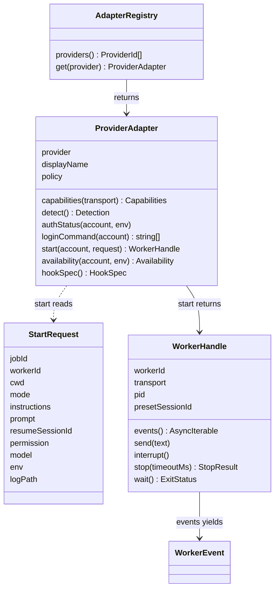
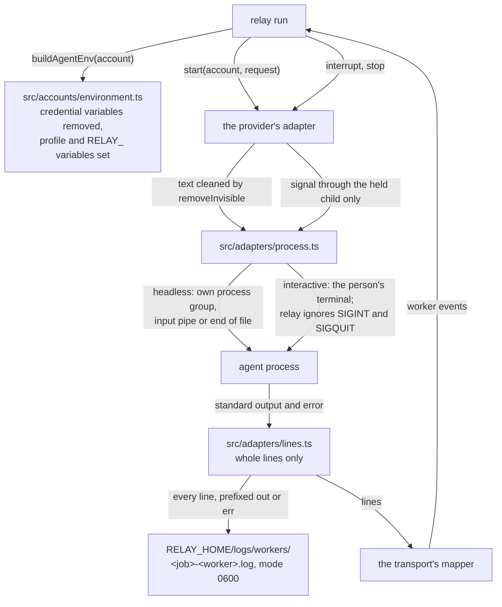

# Provider adapters

An adapter is the part of relay that knows how one coding agent works. relay has one adapter per
provider: Claude Code (`claude`) and Codex (`codex`). Everything else in relay, such as
`relay run`, `relay switch` and the daemon, talks to an agent only through the adapter interface
described here, so it never needs to know which provider it is talking to.

This page describes the interface, how relay starts and supervises an agent process, the events an
adapter reports, the reasons a turn can fail, the availability states of an account, and what each
transport can do. The design is decisions 1 to 8 and 16 of
`openspec/changes/add-provider-adapters/design.md`. `docs/testing-adapters.md` describes the fake
agents that the tests use instead of the real programs.

What exists today: the interface in `src/adapters/types.ts`, the registry in
`src/adapters/registry.ts`, process supervision in `src/adapters/process.ts`, the line splitter in
`src/adapters/lines.ts`, reset-time reading in `src/adapters/reset-time.ts`, TOML string encoding in
`src/adapters/text.ts`, the agent environment in `src/accounts/environment.ts`, the redaction of
facts in `src/secrets/redact.ts`, and the clock in `src/platform/clock.ts`. The Claude Code and
Codex adapters themselves come in later tasks of the same change; until then, asking the registry
for one fails with "The Claude Code adapter is not built yet."

## Words used on this page

| Term | Meaning |
|---|---|
| Transport | The way relay drives a program: `claude-print` (`claude -p` with stream JSON), `claude-interactive`, `codex-app-server`, `codex-exec` (`codex exec --json`) and `codex-interactive`. |
| Worker | One run of one agent program on one account. Its handle lets relay read its events, send messages, interrupt it, stop it and wait for its end. |
| Turn | One request to the agent and everything it does until it answers: messages, commands, file edits. |
| Headless | The agent runs without a person typing; relay supplies the input and reads structured output. |
| Interactive | The agent runs in the person's own terminal and the person types. |
| Reading | One measurement of an account's usage or limit, with the time and the source it came from. |

## The interface

The diagram shows the four parts of the interface. `createAdapterRegistry()` returns the registry,
which gives the adapter of a provider; a test passes overrides, such as the in-process fake adapter,
and the production registry never holds a fake. An adapter detects the installed program and its
version, checks the sign-in, names the provider's own login command, reads an account's
availability and names the hooks it can install. Its `start` takes a `StartRequest` and returns a
`WorkerHandle`. The handle yields worker events until the agent exits.

A `StartRequest` always carries the job's worktree root as `cwd`, relay's own instructions, the
environment built for the account, and the path of the worker log. A headless worker also needs a
prompt. `permission` is `read-only` or `edit-in-workspace`; relay refuses `full-access` before it
calls an adapter, and never passes a permission-bypass flag.

An adapter that cannot do something says so instead of pretending: `send` on a transport without
streaming input throws `UnsupportedOperation` with a message such as "Codex in codex exec mode
cannot receive a message while it runs."

## Transports and their capabilities

Each adapter declares what each of its transports can do, because the providers differ a lot:
only Codex reads usage before a limit, and only Claude Code lets relay choose the session ID in
advance.

| Transport | streamingInput | cleanInterrupt | nativeResume | limitPercentBeforeHit | limitSignalOnHit | observesExternalSessions |
|---|---|---|---|---|---|---|
| `claude-print` | true | true | true | false | structured | hooks |
| `claude-interactive` | false | false | true | true (status line, when installed) | structured (hook) | hooks |
| `codex-app-server` | true | true | true | true | structured | hooks |
| `codex-exec` | false | true | true | false | text | hooks |
| `codex-interactive` | false | false | true | false | none | hooks |

| Capability | Meaning |
|---|---|
| `streamingInput` | relay can send another message to a running worker. |
| `cleanInterrupt` | relay can end a turn through the tool's official interrupt and the worker keeps running. |
| `nativeResume` | relay can resume a provider session by its ID. |
| `limitPercentBeforeHit` | relay can read how much of a usage window is used before the limit is reached. |
| `limitSignalOnHit` | How the tool says it reached a limit: a `structured` field, only `text`, or `none`. |
| `observesExternalSessions` | How relay learns about sessions it did not start: through `hooks`, by `poll`, or `none`. |

## How relay supervises an agent process

The diagram shows one worker from start to end. `relay run` builds the agent's environment and
asks the adapter to start the worker. The adapter removes invisible characters from relay's
instructions and the prompt, then asks `src/adapters/process.ts`, the only module that starts agent
processes, to run the program. A test fails if any other file under `src/adapters/` starts a
process.

A headless agent starts with `detached: true`, which puts it in its own process group, so a Ctrl+C
in the terminal reaches relay only and relay decides what to do. Its standard input is a pipe for
transports that read messages from it (`claude-print`, `codex-app-server`) and end of file at once
for a transport that takes its prompt as an argument (`codex-exec`), so the agent never waits for
input that will not come. An interactive agent inherits the person's terminal; while it runs, relay
ignores SIGINT and SIGQUIT the way a shell does, so only the agent handles Ctrl+C, and relay's own
handlers come back when the agent exits.

relay reads both outputs of a headless agent continuously from start to exit, so the agent is never
blocked on a full pipe. The line splitter passes a line on only once its newline has arrived, and
never cuts a line, however long. Every line goes, unchanged and prefixed with `out ` or `err `, to
the worker log under `RELAY_HOME/logs/workers/`, created with mode 0600 in a folder with mode 0700,
and then to the transport's mapper, which turns the tool's output into worker events. A line that is
not valid JSON is skipped and counted; an empty line is ignored. relay refuses a log folder or log
file that is a symbolic link, belongs to another user or is not a regular file, and makes an
existing log folder private. If a program that the agent started keeps the agent's output open
after the agent exits, relay stops reading 2 seconds after the exit; a last line cut off this way
goes to the log but not to the mapper. `relay run` deletes worker logs, named
`<job>-<worker>.log`, last changed more than 14 days ago when it starts; it deletes nothing when
`logs/` or `logs/workers/` is a symbolic link or belongs to another user.

relay signals only the child process it started and still holds. A headless agent leads its own
process group, so relay sends the signal to that group, which also reaches the programs the agent
started, as Ctrl+C in a terminal would. Once the child has exited, a signal sends nothing, so a
signal can never reach another process that later got the same process ID. relay never signals a
process found by name, by port or by a process ID read from a file. When relay itself exits while
an agent still runs, including after SIGHUP from a closed terminal, it sends that agent SIGTERM.

## Stopping a worker

`stop` ends a worker that relay started and still holds. `relay switch` uses it before it hands a
job to the next agent.

| `how` | When |
|---|---|
| `clean` | A headless worker ended its turn after the tool's official interrupt, relay closed its input, and it exited. |
| `terminated` | An interactive worker exited after SIGTERM. Claude Code exits with code 143. |
| `killed` | The worker was still running when the time limit passed (30 seconds unless the caller gives another), so relay sent SIGKILL. |
| `already_exited` | The worker had already exited; relay sent no signal. |

The result also holds the exit code, the signal and whether the turn had ended.

## Worker events

| Kind | Meaning |
|---|---|
| `session_started` | The provider's session ID is known: chosen in advance (`preset`), read from the output (`stream`) or from a hook (`hook`). It comes before any `message`, `tool`, `turn_completed` or `turn_failed` event of the same worker. |
| `message` | Text the agent wrote. `partial` is true for a piece of a message that is still being written. relay never writes message text to the job's event log. |
| `tool` | The agent started, completed, failed or was refused a tool use, with the command, its exit code or the changed paths when known. |
| `turn_completed` | The turn ended normally, with token usage, an estimated cost and the duration when the tool reports them. |
| `turn_failed` | The turn ended without finishing, with one of the failure reasons below, the reset time when the provider gave one, the provider's message cut to 300 characters, and the source of the reading. |
| `limit_update` | A new usage reading: the windows, an availability state and a reset time when known. |
| `approval_needed` | The agent asks for a permission. relay never answers for the person. |
| `permission_denied` | The tool refused a tool use because it would have needed a permission. |
| `exited` | The process ended, with its exit code or signal. This is always the last event. |

A process that ends while a turn is open first gives `turn_failed`, with `interrupted` when relay
sent the interrupt and `crashed` otherwise, then `exited`.

## Failure reasons

| Reason | Meaning |
|---|---|
| `usage_limit` | The account reached a usage limit of its plan, and the reset time is known. |
| `rate_limit` | The provider refused because of too many requests, without a known reset time. |
| `overloaded` | The provider's service was overloaded. |
| `auth` | The sign-in or the key was refused. |
| `billing` | The account has no credit or a billing problem. |
| `context_full` | The conversation no longer fits in the model's context window. |
| `interrupted` | relay interrupted the turn. |
| `crashed` | The process ended during the turn without an interrupt from relay. |
| `other` | Any other failure. |

## Availability

An adapter reports an account's availability with one of these states, the reset time when known,
the usage windows it measured, the time of the reading and its source. Without any reading the
state is `unknown` with source `none`.

| State | Meaning |
|---|---|
| `available` | The last reading says the account can work. |
| `rate_limited` | The account is waiting for a short rate limit. |
| `quota_exhausted` | The account used up a usage window and waits for its reset. |
| `unavailable` | The account cannot work for another reason, such as a refused sign-in. |
| `unknown` | relay has no reading, or the recorded reset time has passed and relay has not measured since. |

| Source | Where the reading came from |
|---|---|
| `provider_api` | A provider call made for the purpose, such as Codex's `account/rateLimits/read`. |
| `stream_event` | An event in the agent's own output, such as Claude Code's `rate_limit_event`. |
| `hook` | A hook the tool ran, such as Claude Code's `StopFailure`. |
| `status_line` | The usage numbers Claude Code gives its status line. |
| `message_text` | The text of a limit message, the last resort. |
| `user` | The person said so. |
| `none` | No reading. |

Usage windows are named after their length: `five_hour` (300 minutes), `seven_day` (10,080
minutes), or `<n>_minutes` for any other length.

## Reset times

`src/adapters/reset-time.ts` reads reset times. A number below 10^12 is read as Unix seconds and a
larger one as Unix milliseconds, because the unit of Claude Code's `resetsAt` is not documented; a
string is read as an ISO 8601 time. Limit messages give a local time such as `3:45pm`, `3:45 PM`,
`Mon 12:00am` or `Oct 9, 3:45 PM`; relay reads it as the next moment the local clock shows that
time. Codex writes a reset on another day with the year, as in `Oct 9th, 2026 3:45 PM`, which
relay reads as that exact time. relay ignores a final full stop and a time zone name in
parentheses. Every comparison with a reset time, a log's age or a policy's age reads the time through `now()` in
`src/platform/clock.ts`, which tests replace with `setClock()`.

## The agent's environment

`buildAgentEnv(account)` in `src/accounts/environment.ts` builds the environment of every agent
and of the provider's own login and status commands, starting from relay's own:

1. It removes every variable whose name starts with `ANTHROPIC_`, `OPENAI_`, `CLAUDE_CODE_USE_`
   (the switches to Bedrock, Vertex and Foundry) or `CODEX_SANDBOX`, and `CLAUDE_CODE_OAUTH_TOKEN`,
   `AWS_BEARER_TOKEN_BEDROCK`, `CODEX_API_KEY`, `CODEX_ACCESS_TOKEN`, `CURSOR_API_KEY`,
   `CLAUDE_CONFIG_DIR` and `CODEX_HOME`. It also removes `CLAUDECODE`, `CLAUDE_CODE_ENTRYPOINT`
   and `CODEX_THREAD_ID`, which an outer Claude Code or Codex session sets: Claude Code refuses to
   start when `CLAUDECODE` is set, so `relay run` from a terminal inside an agent would fail. It also removes the test variables that start with
   `RELAY_FAKE_` unless `RELAY_KEEP_FAKE_ENV=1` is set, and any `RELAY_JOB`, `RELAY_TARGET` or
   `RELAY_WORKER` inherited from an outer agent.
2. It sets `CLAUDE_CONFIG_DIR` or `CODEX_HOME` to the account's profile folder, except when that
   folder is the provider's own `~/.claude` or `~/.codex`, where the variable stays unset.
3. It copies each variable the account names in `credential_env`. A Claude Code account may name
   only `ANTHROPIC_` variables and `CLAUDE_CODE_OAUTH_TOKEN`, and a Codex account only `OPENAI_` and
   `CODEX_` variables other than `CODEX_HOME`, `CODEX_THREAD_ID` and the `CODEX_SANDBOX` ones, so
   one provider's key never reaches another provider's program. The settings check reports any
   other name when it reads `config.toml`, and relay stops with exit code 78.
4. It sets `RELAY_HOME`, and `RELAY_JOB`, `RELAY_TARGET` (the account, for example `claude:work`) and
   `RELAY_WORKER` when a worker is known, so hooks can name their job, account and worker.

## Text that leaves relay

Each adapter removes the invisible characters of relay's one list (`removeInvisible` in
`src/text/invisible.ts`) from the instructions, the prompt and every message just before they leave
relay. Instructions go only through the tool's system channel, and text written by an agent, such
as `.relay/checkpoint.md`, never goes there. For Codex's `-c developer_instructions=<value>`,
`tomlString()` in `src/adapters/text.ts` encodes the text as a TOML basic string.

Facts that relay writes to the job's event log, such as the commands an agent ran, pass through
`redact()` in `src/secrets/redact.ts` first. It replaces common token formats (Anthropic, OpenAI,
GitHub, Slack and AWS keys, and JSON web tokens), the value after `Bearer `, the value of a
`NAME=value` pair whose name contains `TOKEN`, `SECRET`, `PASSWORD`, `API_KEY` or `APIKEY`, and the
value after `--password`, `--token` and `--api-key`, with `[redacted]`.
