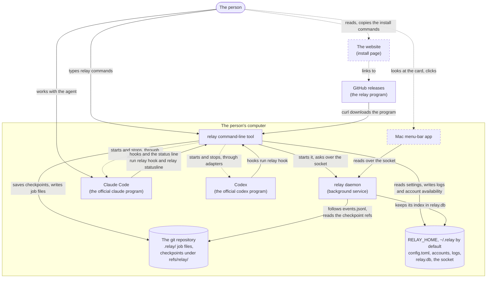
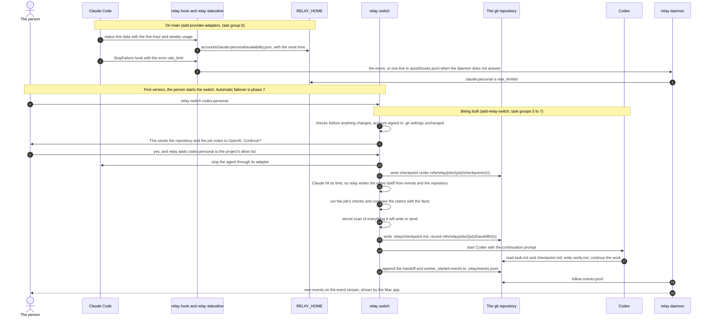
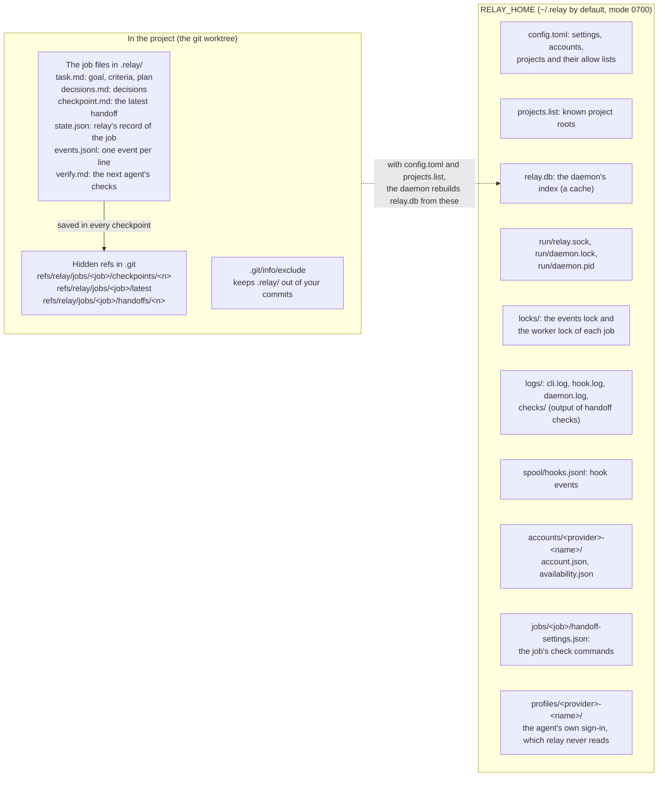
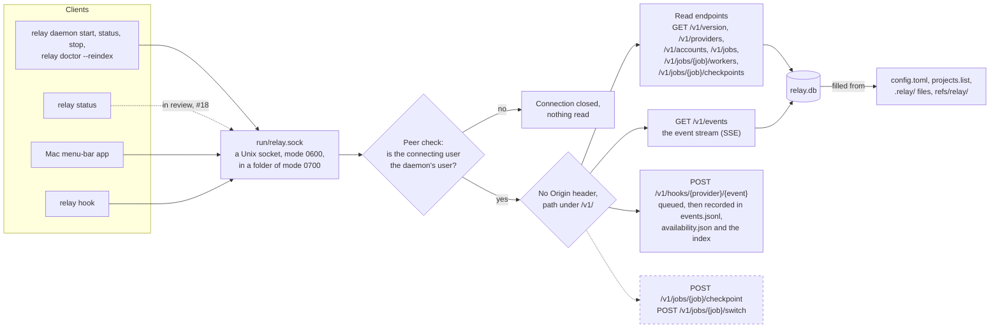
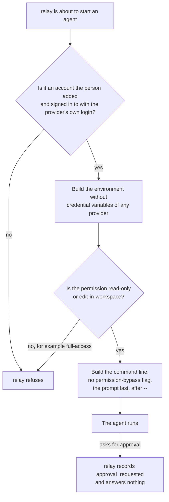

# How relay works

This page explains relay's parts and how they work together, with one diagram per topic. It is
meant for someone who has not read the code. Each section says which parts are already on the
`main` branch and which are still being built, and names the OpenSpec change (the written plan in
`openspec/changes/`) that builds them. `docs/progress.md` shows the state of each change in more
detail.

In the diagrams, a solid line or box is on `main` today. A dashed line, or a box with a dashed
border, is still being built: it is either in an open pull request or not written yet.

## The big picture

The person installs one program, `relay`, and keeps using the coding agents they already pay for.
relay never changes those agents. It starts the official `claude` and `codex` programs, watches
what they report, and keeps the state of the job in two places: inside the project, in a `.relay/`
folder and in hidden git refs under `refs/relay/`, and in relay's own folder, which this page
calls `RELAY_HOME` (`~/.relay` unless the person sets `RELAY_HOME`).

The daemon is a background process that keeps an index of every job and answers questions over a
private socket. The command-line tool and the Mac app are its clients. The website only tells
people how to install relay; it never talks to the program.

What is built on `main`:

- The command-line tool with `relay init`, `relay checkpoint`, `relay checkpoints`,
  `relay rollback`, `relay accept-git-changes`, `relay account`, `relay providers`,
  `relay policy show`, `relay hooks`, `relay hook`, `relay statusline`, `relay daemon` and
  `relay doctor --reindex` (`add-cli-scaffold`, `add-checkpoint-engine`, `add-provider-adapters`
  task groups 1 to 8, `add-daemon-api-and-status` task groups 1 to 6).
- The adapters for Claude Code and Codex, which know how to start, watch and stop each program.
  The command that uses them to start an agent, `relay run`, is in review in pull request #19
  (`add-provider-adapters` task groups 9 and 10).
- The daemon with its read endpoints and its event stream.
- The Mac app's package, its daemon client and its views (`add-mac-menu-bar-app` task groups 1 to
  3). Its actions, such as the switch sheet, are in review in pull request #20.
- The website's page (`add-website` task groups 1 to 6). It is not deployed yet.

## A handoff from Claude Code to Codex

The diagram follows one job from the moment Claude Code runs out of usage to the moment Codex
continues it. Steps 1 to 4 are on `main`: Claude Code runs relay's status-line command and relay's
hooks, which the person installs once with `relay hooks install claude:personal --status-line`.
The status line gives relay the usage of the five-hour and weekly windows with their reset times,
and the `StopFailure` hook with the error `rate_limit` tells relay that the account is out of
usage. The hook gives the event to the relay daemon, which marks the account `rate_limited`; when
the daemon is not running, the hook appends a line to the spool file, which the daemon reads when
it starts and `relay account status` reads in the meantime.

In the first version the person starts the handoff by typing `relay switch codex:personal`, or
later from the Mac app's switch sheet. Starting it automatically when a limit is reported is
phase 7 of `docs/ROADMAP.md`, which begins with the change `add-t3-limit-rules`.

relay asks its questions before it stops anything, so a "no" leaves the job as it was. The first
handoff to an account of another company asks for confirmation, because the code then goes to that
company; the answer is remembered in `config.toml`. Because Claude Code stopped at its usage limit,
relay does not ask it for handoff notes: it writes the notes itself from the event log and the
repository. It then runs the job's checks (for example `bun test`), scans everything for secrets,
writes `.relay/checkpoint.md` and starts Codex with a short prompt. The prompt tells Codex to read
the task and the checkpoint, to check the previous agent's claims in `.relay/verify.md`, and then
to continue.

The parts of the handoff that the switch uses (checks, notes, `checkpoint.md`, the secret scan, the
allow list) are on `main` from `add-relay-switch` task groups 1 to 4. The switch engine that joins
them, the `relay switch` command and the end-to-end tests (task groups 5 to 7) are not built yet.
`docs/handoff.md` describes each step in detail.

## What lives where on disk

relay keeps the job next to the code, so that any agent can read it, and keeps everything private
outside the project. The `.relay/` folder holds the files that describe the job. relay lists it in
`.git/info/exclude`, so these files never enter the person's own commits. Each checkpoint is a git
commit stored under `refs/relay/`, a part of git that branches and `git log` do not show; relay
never moves the person's branch, index or uncommitted work, and it never pushes these refs.

`RELAY_HOME` holds the settings, the logs, the daemon's files and one folder per account. The
index `relay.db` is only a cache: the daemon can rebuild it at any time from `config.toml`,
`projects.list`, the job files and the checkpoint refs (`relay doctor --reindex` does this). A
profile folder belongs to the agent: Claude Code or Codex writes its sign-in there through its own
login command, and relay only points the agent at the folder.

All of this is on `main`, with three exceptions. The `handoffs/<n>` refs and `verify.md` come with
the switch engine of `add-relay-switch`. The worker lock comes with `relay run` (pull request #19).
`add-t3-limit-rules` adds `RELAY_HOME/t3/`, and `add-lifetime-license` would add
`RELAY_HOME/license.key`; neither folder nor file is on `main` yet. `docs/checkpoints.md`,
`docs/daemon.md` and `docs/accounts.md` describe the files one by one.

## The daemon and its clients

The daemon answers on a Unix socket, a special file that only programs on the same computer can
open. It never opens a network port, so a web page cannot reach it. Before it reads a single byte,
the daemon asks the operating system which user opened the connection and closes the connection
when that user is not its own. A request that carries an `Origin` header, which browsers add, is
refused.

The read endpoints answer with JSON from the index. The event stream, `GET /v1/events`, uses
server-sent events (SSE): the connection stays open and the daemon sends each new event as it
happens, so a client does not have to ask again and again. The Mac app reads both the read
endpoints and the event stream. `relay status`, in review in pull request #18, reads the read
endpoints once and prints the job, its latest checkpoint and the availability of each account;
when the daemon is not running, it builds the same view from the files. `relay hook` sends each
hook event to `POST /v1/hooks/{provider}/{event}`; the daemon puts it on a queue, answers at once,
and then records it in the job's event log, the account's `availability.json` and the index
(`docs/hooks.md`).

On `main`: the socket, the peer check, the read endpoints, the event stream and the `relay daemon`
commands (`add-daemon-api-and-status` task groups 1 to 6), and the Mac app's client
(`add-mac-menu-bar-app` task groups 1 to 3). Hook events sent straight to the daemon (task group
8) are in review. Still to come: the checkpoint and switch endpoints (task group 7) and the
end-to-end test (task group 11). `docs/daemon.md` and `docs/api.md` describe the
daemon and every endpoint.

## The safety rules

| Rule | What it means | Where it is enforced | State |
|---|---|---|---|
| The prompt comes after `--` | A prompt such as `--dangerously-bypass-approvals-and-sandbox` stays text and is never read as an option. A one-word prompt gets a trailing space so Claude Code cannot read it as a subcommand. | `src/adapters/claude/interactive.ts`, `src/adapters/codex/interactive.ts`, `src/adapters/codex/exec.ts` | On `main` in the adapters; `relay run`, which passes the person's prompt, is in review (#19) |
| Never a bypass flag | relay never adds a flag that turns off the agent's permission checks. The adapter interface accepts only `read-only` and `edit-in-workspace`, so `full-access` cannot reach an agent, and the adapter tests fail if a bypass flag appears in a command line. | `src/adapters/types.ts`, `src/handoff/permission.ts`, `test/adapters/` | On `main` |
| Never answer an approval request | When an agent asks for permission, the adapter reports `approval_needed` and relay sends no decision. | The adapters' workers, such as `src/adapters/codex/app-server-worker.ts` | On `main`; stopping a headless agent that asks, with its own exit code, comes with #19 |
| Only your own subscriptions | relay starts only the official programs the person installed and signed in to. It does not pool, share or rotate accounts, and it switches between two accounts of the same provider only when the person asks. | `src/accounts/`, `src/policies/switching.ts` | On `main` |
| No reading of credential files | relay never reads, copies, stores or logs a password, token or API key value. It removes credential variables from the agent's environment, unless the person names one for an account, and it never reads the files in a profile folder. | `src/accounts/environment.ts`, `src/accounts/profile.ts` | On `main` |
| Confirmation before another company | The first handoff to another company's agent asks first, because it sends the code to that company. | `src/handoff/allow-list.ts` | The check is on `main`; the switch that asks is being built (`add-relay-switch` 5 to 7) |

The diagram shows the checks between relay and an agent it starts. The table lists the rules that
the project's documents promise, what each one means in practice and where the code enforces it.
There is one exception to "relay never stores tokens": when the person connects relay to T3 Code,
relay keeps the access token T3 Code issues to it, in the operating system's credential store only
(`add-t3-limit-rules`). `VISION.md` and `docs/research/security.md` explain why these rules exist.
