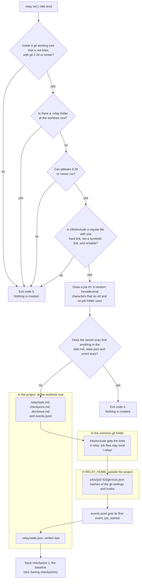
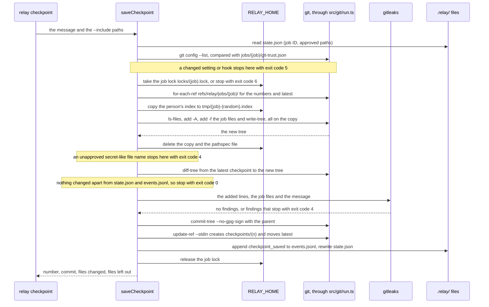
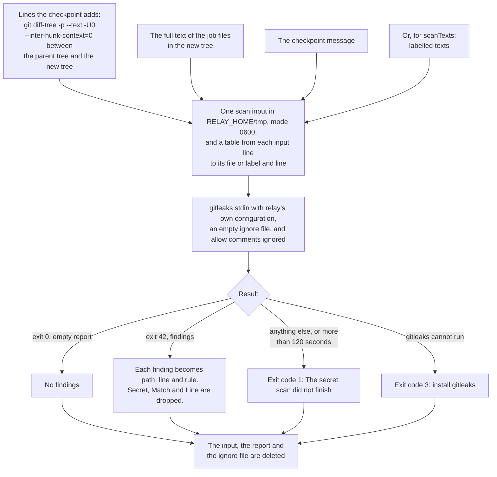

# Jobs and checkpoints

This page describes how relay sets up a job in a git checkout, how it saves checkpoints, and how it
checks for secrets before it saves anything. The behaviour comes from the OpenSpec change
`add-checkpoint-engine` (`openspec/changes/add-checkpoint-engine/`). Today `relay init`,
`relay checkpoint` and the secret scan are built. Listing and rolling back checkpoints come with
the next tasks of that change, and each one adds its own section here.

## Setting up a job

A job is one piece of coding work that relay follows in one git checkout. `relay init` sets one
up in the checkout that holds the current folder. It always works at the top folder of that
checkout (the worktree root), also when it is run from a subfolder.



The diagram shows what `relay init` checks and what it writes. Every check runs before relay
creates anything, so a refusal leaves the project, the git folder and `RELAY_HOME` as they were.
The title and the branch name come from the person or an agent, so relay scans the texts it is
about to write for secrets first. After the checks, relay writes four job files, adds the
exclude line, records the git trust record, appends the first event, and writes `state.json` last.
If one of these steps fails, or Control-C or `SIGTERM` stops relay, relay removes the files it
created in `.relay/` and the job's folder in `RELAY_HOME`, so `relay init` can run again; the
exclude line stays, because it does no harm and the next run finds it. A `.relay` folder without
`state.json` is therefore a set-up that did not finish, for example because the process was
killed; relay then says to delete the folder and run `relay init` again.

Last, `relay init` saves the first checkpoint of the job, called the baseline. It captures the
person's uncommitted work as it was when the job started, so the job can always return to that
point. When the baseline cannot be saved, for example because the secret scan found a token, the
job stays set up: relay prints why, exits with the code of that reason, and the next successful
`relay checkpoint` saves the baseline instead.

Here is a first run in a project in the home folder, followed by a second run in the same
place:

```
$ relay init --title Demo
Set up relay in ~/repo
Job 8e4650af
Wrote .relay/task.md, state.json, checkpoint.md, decisions.md, events.jsonl
Added /.relay/ to .git/info/exclude
Saved checkpoint 1 · 7ad5644 (baseline)
Next: write the goal in .relay/task.md
(exit code 0)

$ relay init
relay is already set up here (job 8e4650af).
(exit code 3)
```

Here the secret scan stopped the baseline, because an untracked file held a GitHub token:

```
$ relay init
relay is set up (job f6520256), but the baseline checkpoint was not saved.
Stopped: possible secret in src/config.ts line 2 (github-pat).
Nothing was saved. Remove the secret, or move it to an ignored file such as .env, then run relay checkpoint again.
(exit code 4)
```

### The job files

| File | What it holds |
|---|---|
| `.relay/task.md` | The goal, the acceptance criteria and the plan. Its first line is `# <title>`, where the title is the `--title` value, or else the branch name, or else the worktree folder name. Newlines become spaces, invisible characters are removed, and the title is cut to 120 characters. |
| `.relay/state.json` | relay's record of the job: its ID, title, repository, starting commit and branch, latest checkpoint, approved paths and last rollback. relay replaces it whole, through a temporary file and a rename, so it is never half written. |
| `.relay/checkpoint.md` | A placeholder. The handoff (`relay switch`, a later change) writes the latest handoff here. |
| `.relay/decisions.md` | A heading for decisions about the job, which people and agents add. |
| `.relay/events.jsonl` | One JSON object per line for each fact relay records. Only `appendEvent` in `src/job/events.ts` writes it, while it holds a short lock in `RELAY_HOME/locks/`, so two relay processes never write at the same time. |

The exact templates and the `state.json` fields are in the `job-files` spec of the change. Events
hold the job's facts only: never environment values, command output or secret values.

### Why .relay stays local

relay adds `/.relay/` to the `info/exclude` file of the repository's common git folder, after the
comment `# relay: job files stay local`. That file works like a `.gitignore` that only this
clone sees, and it applies to every worktree of the repository, so the job files never show up in
`git status` and never enter the person's commits. relay never edits a tracked `.gitignore`. The
line is added once: in a linked worktree of a repository that already has it, relay says so
instead of adding it again. Here `~/wt` is a linked worktree of `~/repo`, which already has a job:

```
$ relay init
Set up relay in ~/wt
Job 1d5d2737
Wrote .relay/task.md, state.json, checkpoint.md, decisions.md, events.jsonl
/.relay/ is already in ~/repo/.git/info/exclude
Saved checkpoint 1 · 372a98b (baseline)
Next: write the goal in .relay/task.md
(exit code 0)
```

Keeping `.relay/` local is the recommendation of the change, pending Josué's decision. The job
files will still travel with the work, because every checkpoint stores them.

### When relay init refuses

| Exit code | When | Message |
|---|---|---|
| 3 | The folder is not inside a git repository | `This folder is not inside a git repository. Run relay init inside your project.` |
| 3 | The repository is bare | `This repository has no working tree. relay needs one.` |
| 3 | `.relay/` already exists at the worktree root | `relay is already set up here (job <id>).` |
| 3 | git is older than 2.34 | `relay needs git 2.34 or newer. You have git <version>.` |
| 3 | gitleaks is missing or older than 8.28 | `relay needs gitleaks 8.28 or newer to check checkpoints for secrets. Install it with: brew install gitleaks` |
| 3 | `.git/info/exclude` or its folder is a symbolic link, the file has a second hard link, or the person cannot write to it | `relay cannot add /.relay/ to <path>: <reason>.` |
| 3 | `.relay` is a file, not a folder | `<path> exists but is not a folder. Move it away, then run relay init again.` |
| 4 | The secret scan found something in the title or the branch name | `Stopped: possible secret in .relay/task.md line 1 (github-pat).` and `Nothing was set up. Remove the secret from the title or the branch name, then run relay init again.` |
| 1 | A later step failed, for example the git trust record could not be written | the reason |
| 6 | Another relay process held the event lock for more than 2 seconds | `Another relay process (process <pid>) is writing to this job's event log. Try again when it finishes.` |
| 1, 3 to 6 | The job is set up, but the baseline was not saved | `relay is set up (job <id>), but the baseline checkpoint was not saved.`, then the reason, as for `relay checkpoint` below |

These samples come from the tests:

```
$ relay init
This folder is not inside a git repository. Run relay init inside your project.
(exit code 3)

$ relay init
This repository has no working tree. relay needs one.
(exit code 3)

$ relay init
relay needs gitleaks 8.28 or newer to check checkpoints for secrets. Install it with: brew install gitleaks
(exit code 3)
```

When `.relay/` exists but its `state.json` cannot be read, relay still refuses, names the
problem, for example `relay is already set up here, but the job file <path> is missing.`, and
adds `If an earlier relay init was stopped before it finished, delete the .relay folder and run
relay init again.`

## Saving checkpoints

A checkpoint is a git commit that holds the whole state of the job's files at one moment: tracked
files with their current content, staged or not, untracked files that git does not ignore, and the
job files in `.relay/`. relay stores it under a private ref, `refs/relay/jobs/<job>/checkpoints/<n>`,
and never on a branch. Your branch, your staging area (the index), your stash and your files stay
exactly as they were. Run it whenever the work reaches a point worth keeping:

```
relay checkpoint [-m <text>] [--include <path>]... [--json]
```

`relay init` (for the baseline) and `relay checkpoint` both call one function,
`saveCheckpoint` in `src/checkpoint/save.ts`. Later changes call the same function for the
checkpoint saved before a rollback and for the checkpoint of a handoff.



The diagram shows one checkpoint, from top to bottom. relay first reads `state.json` to learn the
job, then checks that the git settings and hooks are the ones recorded when the job started; until
that check passes, it runs only `git rev-parse` and `git config`, which start no hooks. It then
takes the job lock, so two relay commands never save for the same job at once. To build the tree,
relay copies the person's index file to a temporary file under `RELAY_HOME/tmp` and points
`GIT_INDEX_FILE` at the copy, so `git add` and `git write-tree` write only the copy. The copy and
the list of excluded paths are deleted as soon as the tree exists, also when a step fails. If the
new tree differs from the latest checkpoint only in `.relay/state.json` and `.relay/events.jsonl`,
relay stops without saving. Otherwise gitleaks scans what the checkpoint adds (see "The secret
scan" below). Only then does relay create the commit, without signing it, and record it with one
`git update-ref` transaction that writes only under `refs/relay/`. The event and `state.json` are
written last, after the refs, so the next checkpoint stores them.

### What a checkpoint holds and leaves out

| Holds | Leaves out |
|---|---|
| Every tracked file, with its content in the working tree, whether or not it is staged | Files git ignores, such as `node_modules/` or `.env` |
| Every untracked file that git does not ignore | Files larger than the size limit (below) |
| In a sparse checkout, files outside the sparse definition, with the version in your index | Untracked folders that are git repositories of their own (listed as `Left out <folder>/ (a separate git repository)`) |
| `.relay/task.md`, `state.json`, `checkpoint.md`, `decisions.md` and `events.jsonl`, and `.relay/verify.md` when it exists | Any other file in `.relay/` |
| An untracked file whose name suggests secrets, once you include it | Such a file that you have not included: the checkpoint stops instead |

Before anything else, relay checks that the job named in `state.json` is the one `relay init` set
up in this checkout: its job ID and worktree root must match the trust record in `RELAY_HOME`.
Otherwise it stops with exit code 3, so a `state.json` changed to another checkout's job ID cannot
make relay write that job's refs.

The first checkpoint of a job has the commit `HEAD` pointed to as its parent, or no parent in a
repository without commits. Each later checkpoint has the previous one as its parent. The commit
message names the checkpoint and carries trailers that describe it:

```
relay checkpoint 5: OAuth callback works

Relay-Job: 3f9a2c1d
Relay-Checkpoint: 5
Relay-Kind: manual
Relay-Head: 86300b0b37343e5c06a5dfeb6be71f64dddfbed3
Relay-Branch: main
Relay-Left-Out: assets/video.mov
Relay-Version: 0.1.0
```

The message given with `-m` becomes one line: newlines and tabs become spaces, other control
characters and invisible characters are removed, and it is cut to 200 characters. `Relay-Kind` is `baseline` for the first checkpoint of a
job and `manual` for `relay checkpoint`; later changes add `pre_rollback`, `handoff` and `auto`.
`Relay-Head` is the commit `HEAD` pointed to (`none` without commits), and `Relay-Branch` is the
branch name, or `(detached)`. The author and committer are your `user.name` and `user.email`, or
`relay` and `relay@localhost` when they are not set. A checkpoint commit is never signed, even
when `commit.gpgSign` is set, so no signing program or password prompt starts.

An untracked folder that holds a git repository of its own is left out, because git would store
it only as a pointer to one of its commits, or fail when it has none yet. Like a large file, it
is listed in the output, the trailers and the event.

relay copies your index, so a file you marked with `git update-index --assume-unchanged` or
`--skip-worktree` keeps its index version in the checkpoint. Changes inside git submodules are not
stored; only the submodule's commit is.

### Files over the size limit

A file larger than `max_file_size_mb` megabytes (setting `[checkpoint] max_file_size_mb` in
`config.toml`, default 20, see `docs/config.md`) is left out. relay lists it in the output, in a
`Relay-Left-Out` trailer of the commit (at most 50 trailers; the last one then says
`and <k> more`) and in the event. A tracked file that is left out keeps the version in your index.
A file you staged earlier and did not change since stays in the checkpoint at any size, because
git already stores its content. When the only new file is one that is left out, nothing is saved,
and relay still lists the file under `Nothing changed since checkpoint <n>.`. Here the limit was
set to 1 MB:

```
$ relay checkpoint
Saved checkpoint 2 · 25c2cc8
1 file changed since checkpoint 1
Left out assets/demo.mov (2 MB, over the 1 MB limit)
(exit code 0)
```

### The secret scan and --include

Before relay records a checkpoint, gitleaks scans the lines it adds compared with its parent, the
full text of the job files and the message. A finding stops the checkpoint: relay creates no ref,
appends a `checkpoint_refused` event that holds only the path, line and rule of each finding, and
never prints or stores the secret. relay prints at most 20 findings, then the number of the
others.

```
$ relay checkpoint
Stopped: possible secret in src/config.ts line 12 (github-pat).
Nothing was saved. Remove the secret, or move it to an ignored file such as .env, then run relay checkpoint again.
(exit code 4)

$ relay checkpoint -m "use token ghp_…"
Stopped: possible secret in (checkpoint message) line 1 (github-pat).
Nothing was saved. Remove the secret, or move it to an ignored file such as .env, then run relay checkpoint again.
(exit code 4)
```

An untracked file that git does not ignore and whose name suggests secrets, such as `.env.local`,
`id_rsa` or `server.pem`, stops the checkpoint until you include it once with `--include`. relay
then adds the path to `approved_paths` in `state.json`, and later checkpoints include it without
the option. Only an `--include` path that named such a file, saved in that checkpoint, is added. An included file is still scanned. Example files such as `.env.example` need no
approval.

```
$ relay checkpoint
Stopped: .env.local is not ignored by git and may hold secrets.
Add it to .gitignore, or include it with: relay checkpoint --include .env.local
(exit code 4)

$ relay checkpoint --include .env.local
Saved checkpoint 2 · ff251b7
2 files changed since checkpoint 1
Included .env.local (you approved it)
(exit code 0)
```

### Where checkpoints live

```
refs/relay/jobs/<job>/checkpoints/<n>    one ref per checkpoint, n = 1, 2, 3, ...
refs/relay/jobs/<job>/latest             the newest checkpoint of any kind
```

The next number is the highest existing number plus one. Both refs are written in one
transaction that fails when the number is already taken, so a checkpoint ref is never
overwritten; relay then reads the numbers again and tries once more. Refs under `refs/relay/` are
not branches: `git branch` does not show them, a plain `git push` does not send them, and every
worktree of the repository shares them. relay never pushes them. To see them, run
`git for-each-ref refs/relay/`.

### Output and exit codes

```
$ relay checkpoint -m "Login form done"
Saved checkpoint 3 · 8348ca5
3 files changed since checkpoint 2
(exit code 0)

$ relay checkpoint
Nothing changed since checkpoint 1.
(exit code 0)

$ relay checkpoint --json
{"saved":false,"latest":1}
(exit code 0)

$ relay checkpoint -m "OAuth callback works" --json
{"saved":true,"number":2,"commit":"477a52eedeec2a01bf4a42a5bfbf8d0f155b0fb1","ref":"refs/relay/jobs/073fe2dd/checkpoints/2","files_changed":1,"left_out":[]}
(exit code 0)
```

The second line counts the files that changed since the previous checkpoint, not counting
`.relay/state.json` and `.relay/events.jsonl`. When `relay checkpoint` saves the first checkpoint
of a job, because the baseline was stopped, it says `<k> files differ from commit <short HEAD>`,
counting only your files, or `<k> files saved` in a repository without commits:

```
$ relay checkpoint
Saved checkpoint 1 · 4e42b5c
2 files saved
(exit code 0)
```

| Exit code | When | Message |
|---|---|---|
| 0 | Saved, or nothing changed | `Saved checkpoint <n> · <short commit>`, or `Nothing changed since checkpoint <n>.` |
| 1 | gitleaks did not finish, or git failed | `The secret scan did not finish: <reason>. Nothing was saved.` |
| 2 | An `--include` path outside the project | `relay: --include needs a path relative to the top folder of the project, not "../x".` |
| 3 | No job here, a damaged `state.json`, a `state.json` that names another checkout's job, or gitleaks missing | `relay is not set up here. Run relay init first.`, `.relay/state.json is damaged: <reason>. relay changed nothing.`, `.relay/state.json names job <id>, which relay init did not set up in this checkout. relay changed nothing.` |
| 4 | A possible secret, or an unapproved secret-like file name | see above |
| 5 | The git settings or hooks changed since `relay init` | `Stopped: .git/config changed since this job started.` and what changed (`docs/git-safety.md`) |
| 130 | Control-C or `SIGTERM` stopped relay while git was working | `relay was stopped before it finished. Nothing was saved.` |
| 6 | Another relay command holds the job lock | `Another relay command is working on this job (relay rollback, process 237063). Try again when it finishes.` |

Each saved checkpoint appends a `checkpoint_saved` event with `number`, `commit`, `kind`,
`message`, `parent`, `head`, `branch`, `files_changed` and `left_out`, and updates
`latest_checkpoint`, `checkpoint_count` and `updated_at` in `state.json`. A checkpoint stopped by
the trust check, a secret-like file name or the secret scan appends a `checkpoint_refused` event
with the reason `git_changed`, `secret_like_file` or `secret_found`.

## The secret scan

Checkpoint commits may be shared later, so relay scans everything it is about to store in one
before it records it, with the open-source scanner gitleaks. `src/secrets/scan.ts` holds two
functions: `scanCheckpoint`, which every checkpoint calls, and `scanTexts`, which the
handoff (a later change) calls for texts that are not files yet. Untracked files whose names
suggest secrets, such as `.env.local` or `server.pem`, are matched by `src/secrets/names.ts` and
stop a checkpoint until the person includes them once.



The diagram shows one scan. relay never lets gitleaks run git, because gitleaks would run it
without relay's safety settings. Instead relay builds the text to scan itself: the lines the
checkpoint adds compared with its parent, the full text of the job files, and the message. A
secret that was already committed on the person's branch is not reported again, because only
added lines are scanned. `--text` makes git show the lines of every file, so a NUL byte, the
`binary` attribute or `-diff` in `.gitattributes` cannot hide a file's lines from the scan. A
table remembers where each line of the input came from, so a finding can name the file and line,
such as `src/config.ts line 12`.

relay writes its own gitleaks configuration (`RELAY_HOME/gitleaks.toml`, which only turns on
gitleaks' default rules), passes an empty ignore file, turns off `gitleaks:allow` comments, and
removes the `GITLEAKS_CONFIG` and `GITLEAKS_CONFIG_TOML` variables. So nothing in the project, and
nothing an agent writes, can hide a finding. A finding holds the place and the rule, never the
secret, and the temporary files are deleted whether the scan succeeds or fails, and also when
Control-C or `SIGTERM` stops relay. Their names hold relay's process ID, so each scan also deletes
the files that a killed process left behind. gitleaks that runs longer than 120 seconds is
stopped, and the scan did not finish.

`relay init` checks that gitleaks 8.28 or newer can run, with `gitleaks version`, before it
creates anything. The environment variable `RELAY_GITLEAKS` names another scanner program; the
unit tests use it to run `test/helpers/fake-gitleaks.ts`. A relative path is resolved against the folder relay started in.
