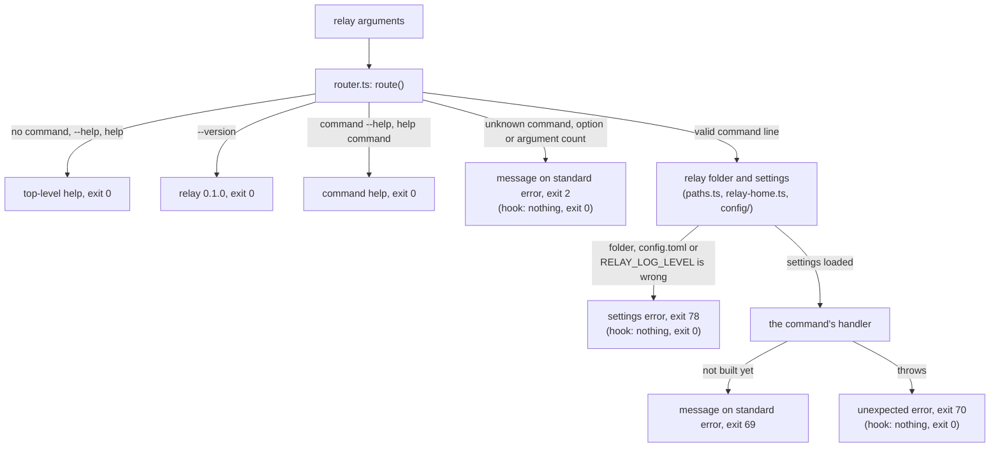
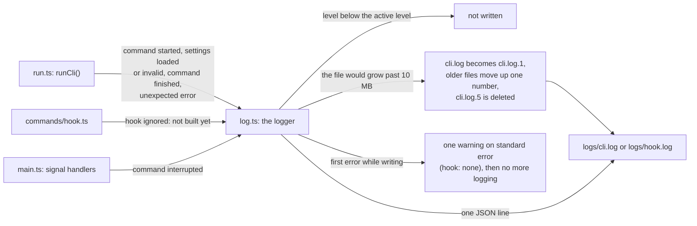

# The relay command line

This page describes the `relay` command: its commands, where its output goes, and its exit codes.
The source is in `src/cli/`. In this version every command shows its help and checks its
arguments. `relay init`, `relay checkpoint`, `relay checkpoints` and `relay rollback` do their
real work, which `docs/checkpoints.md` describes, and so do `relay account`, `relay providers` and
`relay policy show`, which `docs/accounts.md` describes, `relay hooks`, `relay hook` and
`relay statusline`, which `docs/hooks.md` describes, and `relay daemon` and
`relay doctor --reindex`, which `docs/daemon.md` describes; the other commands do not yet. The
change named in the "Built by" column builds each one.

## Commands

| Command | Usage | Arguments | Built by |
|---|---|---|---|
| `init` | `relay init [--title <text>]` | none | `add-checkpoint-engine` |
| `run` | `relay run [<provider[:account]>]` | 0 or 1 | `add-provider-adapters`, extended by `add-relay-switch` |
| `checkpoint` | `relay checkpoint [-m <text>] [--include <path>]... [--json]` | none | `add-checkpoint-engine` |
| `checkpoints` | `relay checkpoints [--json]` | none | `add-checkpoint-engine` |
| `rollback` | `relay rollback [<checkpoint>] [--yes] [--dry-run]` | 0 or 1 | `add-checkpoint-engine` |
| `accept-git-changes` | `relay accept-git-changes` | none | `add-checkpoint-engine` |
| `switch` | `relay switch <provider[:account]>` | 1 | `add-relay-switch` |
| `status` | `relay status` | none | `add-daemon-api-and-status` |
| `account` | `relay account <list\|add\|status\|login\|remove> [<provider> <name> \| <provider:name>]` | 1 to 3 | `add-provider-adapters` |
| `providers` | `relay providers [--json]` | none | `add-provider-adapters` |
| `policy` | `relay policy show <provider>` | 2 | `add-provider-adapters` |
| `hooks` | `relay hooks <install\|remove\|status> <provider:name>` | 2 | `add-provider-adapters` |
| `hook` | `relay hook <provider> <event>` | 2 | `add-provider-adapters`, extended by `add-daemon-api-and-status` |
| `statusline` | `relay statusline <provider>` | 1 | `add-provider-adapters` |
| `daemon` | `relay daemon <start\|stop\|restart\|status\|run>` | 1 | `add-daemon-api-and-status` |
| `doctor` | `relay doctor --reindex` | none | `add-daemon-api-and-status` |

The `\|` in the table stands for `|`. An option followed by `...`, such as `[--include <path>]...`, may be given more than once. Every command also accepts `-h`, `--help` and
`--log-level <level>`, where the level is `debug`, `info`, `warn` or `error`. Options come after
the command name. `relay`, `relay --help`, `relay -h` and `relay help` show the list of commands.
`relay <command> --help` and `relay help <command>` show one command's help, even when the rest
of the command line is wrong. `relay --version` prints `relay <version>`.

A command that is not built yet prints `relay: <command> is not built yet. This version only
reads your settings and shows help.` and exits with code 69. `relay hook` and `relay statusline`
are quiet: Claude Code and Codex run them, so they never print anything of their own and exit with
code 0 (`relay statusline` passes on the output and exit code of your own status line), except
when they are stopped by a signal (130 for SIGINT, 143 for SIGTERM or SIGHUP). `relay hook` reads
at most 1 MiB of its standard input for at most 200 ms; with wrong arguments it reads its input to
the end and discards it.

## How a run works



`src/cli/main.ts` passes the arguments to `runCli` in `src/cli/run.ts`. `runCli` asks the router
what the command line means. Help, the version and usage errors are answered at once, without
reading settings or writing any file. For a valid command line, relay then finds the relay folder,
creates it if it is missing, checks that it is private, and loads and checks `config.toml`.
`docs/config.md` describes these checks with their own diagram. Any problem there prints a
settings error and exits with code 78. When the settings load, the command's handler runs, which
in this version is the "not built yet" handler for every command except `hook`, `init`,
`checkpoint`, `checkpoints`, `rollback`, `accept-git-changes`, `account`, `providers`, `policy`,
`hooks` and `statusline`. When a handler
throws an error that it does not handle, relay prints the error and exits with code 70. Once the
relay folder has passed its checks, relay records each of these steps in a log file, as the next
section describes.

## Log files

relay records what each command did in log files inside the relay folder, which is `~/.relay`
unless `RELAY_HOME` names another folder. `src/core/log.ts` writes them.

| File | Written by |
|---|---|
| `logs/cli.log` | Every command except `relay hook`. |
| `logs/hook.log` | `relay hook`, including its usage errors. |

relay creates `logs/` with mode 0700 and each log file with mode 0600, so only you can read them.
relay writes to `logs/` only when it is a real folder, not a symbolic link, that you own and that
has mode 0700. It writes to a log file only when it is a regular file that you own, and it sets
the file's mode back to 0600 if it has another mode, before it rotates the file. It never follows a symbolic link in place of a
log file, and a named pipe in place of a log file makes the write fail at once instead of stopping
relay. In each of these cases relay warns once, as "When a log cannot be written" describes. Help, `--version` and usage errors write no log. A usage error of `relay hook` is the exception:
it goes to `hook.log`, because an agent called it and nobody sees its output.



The diagram shows where a log line comes from and where it goes. `runCli` in `src/cli/run.ts`
writes the events of a run, the `relay hook` handler writes one event of its own, and the signal
handlers in `src/cli/main.ts` write an event when Control-C, `SIGTERM` or `SIGHUP` stops relay. All of them
go through the same logger. The logger drops an entry whose level is below the active level.
Otherwise it checks whether the entry still fits in the current file, rotates the files when it
does not, and appends the entry as one line. The diagram names `cli.log`, and `hook.log` rotates
in the same way. When a write fails, the logger prints one warning and
stops logging for the rest of the run.

### Line format

Each entry is one JSON object on one line, ended by a newline. This is the first line that
`relay checkpoint -m "secret plan"` writes:

```json
{"ts":"2026-10-08T07:05:03.009Z","level":"info","msg":"command started","pid":4242,"invocation":"0a1b2c3d","version":"0.1.0","command":"checkpoint","options":["message"],"arguments":0}
```

Every entry starts with these six keys, in this order. The event's own fields follow them.

| Key | Value |
|---|---|
| `ts` | The time in UTC, in ISO 8601 with milliseconds. |
| `level` | `debug`, `info`, `warn` or `error`. |
| `msg` | The event name, from the table below. |
| `pid` | The process ID of relay. |
| `invocation` | 8 random hexadecimal characters, the same for every entry of one run, so you can find the entries of one run. |
| `version` | The relay version. |

Field values are only strings, numbers, true or false, null, or lists of strings. The logger writes
characters that do not print, such as terminal control characters, as `\u` escapes, so
`cat` on a log file cannot change what the terminal shows. The logger's
TypeScript type accepts no nested objects, so code cannot pass the environment or a settings table
to the log by mistake.

### Events

| Event | Level | Fields | When |
|---|---|---|---|
| `command started` | `info` | `command`, `options` (the names of the options given, without their values), `arguments` (how many) | A command line passed the checks and the relay folder is usable. |
| `settings loaded` | `info` | `path`, `exists`, `accounts` and `projects` (counts) | `config.toml` was read, or is missing. |
| `settings invalid` | `warn` | `path`, `problems` (how many) | `config.toml` or `RELAY_LOG_LEVEL` is wrong. |
| `command finished` | `info` | `exit_code`, `duration_ms` | Last entry of every logged run. |
| `unexpected error` | `error` | `error_name`, `stack` (the stack frames only) | An error that no command handles, just before relay exits with code 70. The error message is never logged. |
| `command interrupted` | `warn` | `signal` (`SIGINT`, `SIGTERM` or `SIGHUP`) | Control-C, `SIGTERM` or a closed terminal (`SIGHUP`) stopped relay. |
| `hook ignored: not built yet` | `info` | `provider`, `event` | `relay hook` ran. `provider` is `null` unless it is `claude` or `codex`. `event` is `null` unless it is one of that provider's hook events listed below. |
| `hook usage error` | `info` | `arguments` (how many words follow `hook`) | `relay hook` got a wrong command line. |

### Levels

relay writes an entry only when its level is at or above the active level, in the order `debug`,
`info`, `warn`, `error`. The active level comes from the `--log-level` option first, then the
`RELAY_LOG_LEVEL` environment variable, then `log.level` in `config.toml`, then `info`
(`docs/config.md`). relay reads the settings before it writes `command started`, so
`log.level = "warn"` also hides that entry. When the settings cannot be read, relay uses the
option, then `RELAY_LOG_LEVEL`, then `info`. For the `hook usage error` entry, which has no
`--log-level` option to read, relay uses `RELAY_LOG_LEVEL`, then `log.level` from valid settings,
then `info`, and it prints nothing when the settings cannot be read. A `RELAY_LOG_LEVEL` that is not one of the four levels
is a settings error, even when `--log-level` is given, and is logged as `settings invalid`.

### Rotation

Before relay writes an entry that would make a log file larger than 10 MB (10,485,760 bytes), it
renames the file to `<name>.1`, moves each older file up one number, deletes `<name>.5`, and starts
a new file with mode 0600. So each log keeps at most 5 older files. When two relay processes
rotate the same file at the same moment, one of them finds that the other has already moved a
file. It skips that file and writes its entry to the new log as usual, without a warning. A few
lines can be lost this way, which is accepted for a log.

### What is never logged

relay logs only names, counts, paths of its own files, exit codes and times. A log never contains:

- environment variables, their names or their values, including provider credentials such as
  `ANTHROPIC_API_KEY` or `OPENAI_API_KEY`;
- argument or option values, such as the message of `relay checkpoint -m`;
- values from `config.toml`, such as a project path or a key that looks like a credential;
- error messages, because later adapters may throw errors that quote a command line or a
  provider's output; an unexpected error is logged with its name and stack frames only;
- standard input, such as the JSON document, with its session ID, that an agent sends to
  `relay hook`.

`relay hook` logs its two arguments only when they are a supported provider and one of that
provider's hook events, and `null` otherwise, so a word an agent passes by mistake never reaches
the log. For Claude Code the events are `SessionStart`, `SessionEnd`, `UserPromptSubmit`,
`PreToolUse`, `PostToolUse`, `Notification`, `Stop`, `StopFailure`, `SubagentStop` and
`PreCompact`. For Codex they are the events that `add-provider-adapters` installs:
`SessionStart`, `Stop`, `SessionEnd`, `Interrupt` and `PreCompact`.

`test/cli/logging.test.ts` plants values like these, built while the test runs, and checks that no
file under `logs/` contains them.

### When a log cannot be written

When relay cannot create `logs/` or write a log file, it prints this once on standard error and
finishes the command with the exit code it would have had. Characters that do not print in the
file name or the reason are written as `\u` escapes:

```
relay: could not write to the log <file>: <reason>. Continuing without it.
```

The reason is the system's message without the system call and the path, for example
`EACCES: permission denied`, or one of relay's own checks, for example
`the logs folder has mode 0755, not 0700`. `relay hook` prints nothing in this case either. When
the log has stopped, an unexpected error prints only its first line, `relay: unexpected error:
<message>`, without the `Details are in <file>.` line.

## Output

- Results and help go to standard output.
- Errors and the "not built yet" message go to standard error. Every line there starts with
  `relay: `, except hint lines, which start with `Run "relay`, and the messages of
  `add-checkpoint-engine` commands, which relay prints exactly as that change's specs give them.
- relay prints no colour codes.
- Values that relay repeats in a message, such as an unknown command or option, are quoted as JSON
  strings, so a newline or a terminal escape sequence appears as `\n` or `\u001b`.
- When the reader of standard output goes away, for example in `relay --help | head -1`, relay
  drops the rest of the output and exits as usual.

## Exit codes

All relay commands share this table. `src/cli/exit-codes.ts` holds the same numbers, and
`test/cli/exit-codes.test.ts` checks that the two agree.

| Code | Constant | Meaning |
|---|---|---|
| 0 | `Ok` | The command did what was asked. |
| 1 | `Failed` | The command ran and could not finish. |
| 2 | `Usage` | The command line is wrong. |
| 3 | `NotPossibleHere` | Not possible here: not a git repository, a bare repository, relay not set up or already set up, a damaged `state.json`, git older than 2.34, or gitleaks missing. |
| 4 | `SecretFound` | Stopped by the secret scan, or by an untracked file whose name suggests a secret. |
| 5 | `GitChanged` | The git configuration or hooks changed since `relay init`. |
| 6 | `Busy` | Another relay command is working on the job. |
| 7 | `NeedsPerson` | relay needs the person: a question without a terminal and without `--yes`, a "no", or a command that must be run at a terminal. |
| 8 | `UnsavedFiles` | A rollback would overwrite or delete files relay has not saved. |
| 10 | `DaemonNotRunning` | The relay daemon is not running or could not start. |
| 20 | `ProviderMissing` | The provider's program is not installed, or older than the oldest version relay was tested with. |
| 21 | `NoSuchAccount` | The account is not in `config.toml`. |
| 22 | `NotSignedIn` | The account is not signed in, or its sign-in did not finish. |
| 32 | `WouldRaisePermission` | A handoff would give the next agent less supervision or more permission than the job had. |
| 9 to 63 | (reserved) | Specific outcomes added by later changes: 23 to 25 by `add-provider-adapters`, 31 and 33 by `add-relay-switch`. The other numbers are free. |
| 69 | `NotAvailable` | The command exists but this version cannot do it (`EX_UNAVAILABLE`). |
| 70 | `Internal` | A bug in relay (`EX_SOFTWARE`). |
| 78 | `Settings` | The relay folder, `config.toml` or a relay environment variable is wrong (`EX_CONFIG`). |
| 130 | `Interrupted` | Stopped by SIGINT (Control-C). |
| 143 | `Terminated` | Stopped by SIGTERM, or by SIGHUP when its terminal closed. |

The codes 64 to 78 follow the BSD `sysexits.h` convention, and 130 and 143 follow the shell
convention of 128 plus the signal number.

## How to add a command

A change that builds a command, or adds a new one, does these things in one pull request:

1. Write the handler in `src/cli/commands/<name>.ts`. It receives the command's arguments and
   option values and returns an exit code.
2. Update the command's entry in `src/cli/commands/registry.ts`: the handler, `built: true`, its
   options, and its usage line and texts if they change.
3. Update the golden help file `test/cli/golden/<name>.txt` and read it once. For a new command,
   also update `test/cli/golden/top-help.txt`.
4. Update the command's row in the table on this page. A test fails when a usage line from
   `registry.ts` is missing here.
5. Add any new exit code to `src/cli/exit-codes.ts` and to the table on this page, using a free
   number from 3 to 63.
