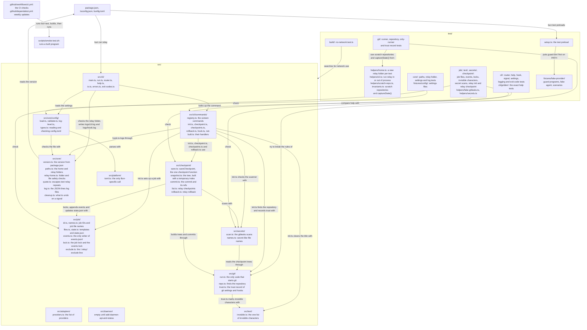
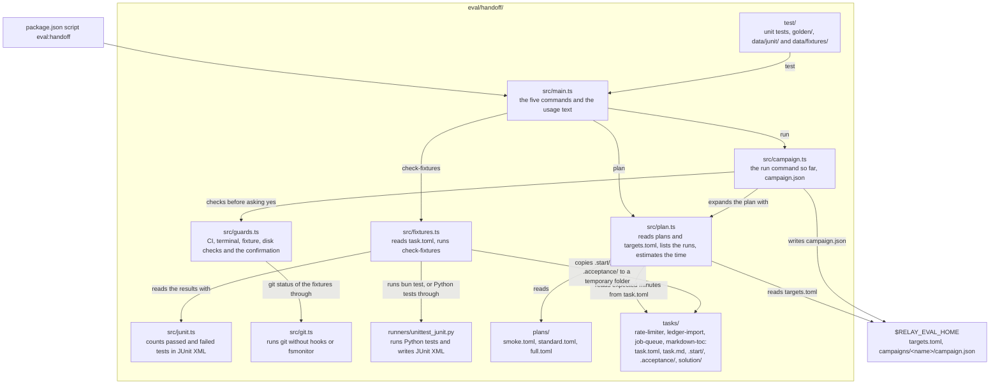

# Codebase map

Last updated 2026-10-08, after task groups 1 to 7 of `add-cli-scaffold`, task groups 1 to 5 of
`add-checkpoint-engine`, task groups 1 to 4 of `add-handoff-evaluation`, and task groups 1 to 7
of `add-website`.

This page shows the folders of relay's source code and tests, and what each one holds today.
`docs/first-version-index.md` lists every file that the six first-version changes will add, and
which change owns it. Each change that adds a folder updates this page.

The diagram shows how the pieces connect. `bun run relay` starts `src/cli/main.ts`, which passes
the command line to `runCli` in `src/cli/run.ts`. `runCli` asks `src/cli/router.ts` what the
command line means, prints help from `src/cli/help.ts` or an error, or calls the command's
handler. `src/cli/commands/registry.ts` lists the sixteen commands with their help texts and
argument counts. In this version every handler is `not-built.ts`, except `hook.ts` for
`relay hook`, `init.ts` for `relay init`, `checkpoint.ts` for `relay checkpoint`, `checkpoints.ts` for `relay checkpoints` and `rollback.ts` for `relay rollback`, which restores an earlier checkpoint's files after saving an undo checkpoint. `--version` prints the version from `src/core/version.ts`, which reads the
`version` field of `package.json`. `docs/cli.md` describes the command line and its exit codes.

Before a command's handler runs, `runCli` finds the relay folder with `src/core/paths.ts`,
creates or checks it with `src/core/relay-home.ts`, and loads `config.toml` with
`src/core/config/load.ts`. `load.ts` checks the file with `relay-home.ts`, parses it with
`src/platform/toml.ts`, and checks every setting with `validate.ts`. `types.ts` holds the shape of
the loaded settings, and `log-level.ts` picks the log level. Every message that repeats a value or path
writes it through `src/core/quote.ts`, which escapes characters that do not print, so a value
cannot change what the terminal shows; the router uses it too. `docs/config.md` describes the
settings and shows this flow in a diagram.

Once the relay folder has passed its checks, `runCli` opens a logger with `openLog` from
`src/core/log.ts`. The logger writes one JSON object per line to `logs/cli.log`, or to
`logs/hook.log` for `relay hook`, and rotates the file at 10 MB. `runCli` gives the logger to the
command's handler, and `src/cli/main.ts` uses it to record a signal that stops relay. The "Log
files" section of `docs/cli.md` describes the events, the fields and what is never logged.

`src/platform/` holds calls that only work on Bun, so that a later move to another runtime
changes one folder. `src/adapters/providers.ts` names the two supported providers, `claude` and
`codex`. `src/daemon/` only holds a README until the change named in the diagram fills it.

`src/git/run.ts` is the only code that starts git. Every call gets settings that turn off hooks
and the file-system monitor, an environment without the parent's `GIT_` variables, and checks that
keep git away from the person's branch, index, stash and files. `src/git/repo.ts` uses it to find
the repository that holds a folder. `src/git/trust.ts` writes `git-trust.json` in the job's folder
under `RELAY_HOME` with hashes of the git settings and hooks, and later reports what changed. `docs/git-safety.md` explains the rules, and the tests in
`test/git/` try to break each of them. `test/git/only-runner.test.ts` fails if any other source
file starts git.

`bun test` loads `test/setup.ts` before any test, because `bunfig.toml` lists it as a preload.
The preload gives each test run its own home folder and relay folder in the system temporary
folder, removes credential variables, and puts the guard programs in
`test/fixtures/fake-provider/guard-bin/` first on `PATH`. The guard programs stop any test that
starts the real `claude` or `codex` by mistake, and `guard-bin/git` stops any git process that
does not come from relay's git runner. The preload also removes git and XDG settings variables, and makes `Bun.spawn`,
`Bun.spawnSync` and `Bun.which` use the test environment when a test passes none. The fake agent in the same folder follows a
scenario file, so tests can run a scripted child process instead of a real agent.
`test/fixtures/fake-provider/README.md` describes both.

The tests in `test/cli/` run relay in the same process with `runRelayInProcess`, or as its own
process with `runRelay` when they need standard input, signals or a full logging check.
`test/cli/logging.test.ts` plants credentials, option values, settings values and hook input built
while the test runs, and checks that no log file contains them. `test/cli/golden/` holds the
exact text of the top-level help and of each command's help, and the tests compare the output
with these files byte for byte.

The tests in `test/core/` call the relay folder, settings and log functions directly. They build
each settings file in a new relay folder from `makeRelayHome`, or read one from
`test/fixtures/config/`. A credential value in a test is built at run time, so none is committed.

`test/build/no-network.test.ts` searches every file under `src/` and fails when relay's code could
open a network connection, other than to relay's own socket (`src/client/`) or to T3 Code on this
computer (`src/t3/client.ts` and `src/t3/oauth.ts`). `scripts/smoke-test.sh` runs a built `relay` program and checks its
version, its help, its exit code and its log file. The workflow in `.github/workflows/ci.yml`
runs the type check and the tests, builds the program for Linux and macOS, runs the smoke test on
each, and scans the dependencies and the git history. `.github/dependabot.yml` asks GitHub to
propose updates to the actions and the Bun dependencies every week. `docs/development.md`
describes these steps and shows the CI jobs in a diagram.

`test/helpers/scratch-repo.ts` creates a scratch repository with commits, a second branch, a tag,
a stash entry, and staged, unstaged, untracked and ignored files, with its own `HOME` and
`RELAY_HOME`. `test/helpers/invariants.ts` provides `captureState()`, which records everything of
the person's that relay must never change, so a test can compare the repository before and after
a command.

`src/cli/commands/init.ts` is `relay init`. It finds the repository with `src/git/repo.ts`,
checks gitleaks with `src/secrets/scan.ts`, draws a job ID with `src/job/id.ts`, writes the job
files with `src/job/files.ts` and `src/job/state.ts`, adds the exclude line with
`src/job/exclude.ts`, records the git trust record with `src/git/trust.ts`, and appends the first
event with `appendEvent` from `src/job/events.ts`. That function is the only code that writes
`events.jsonl`, and `test/job/single-writer.test.ts` fails if another source file does.
`src/job/lock.ts` holds the job lock and the short events lock under `RELAY_HOME/locks/`, and
`src/job/names.ts` names the job files for the modules that need the list. `src/text/invisible.ts`
removes invisible characters from the job title, and `src/git/trust.ts` uses the same list to
mark them in its report. `src/secrets/scan.ts` runs gitleaks on text relay builds itself, and
`src/secrets/names.ts` matches file names that suggest secrets. When a signal stops relay, `src/cli/main.ts` runs the
actions registered in `src/core/cleanup.ts`: the scan removes its temporary files and stops
gitleaks, and `relay init` removes what it had created. `docs/checkpoints.md` describes
both flows in diagrams.

`relay init` then saves the first checkpoint, and `src/cli/commands/checkpoint.ts` saves the next
ones. Both call `saveCheckpoint` in `src/checkpoint/save.ts`, the one function that saves a
checkpoint. It checks the trust record, takes the job lock, builds the tree with
`src/checkpoint/snapshot.ts` (which works on a temporary copy of the person's index), scans it with
`src/secrets/scan.ts`, creates the commit and writes the refs under `refs/relay/` with
`src/checkpoint/commit.ts`, and records the event and `state.json`. The "Saving checkpoints"
section of `docs/checkpoints.md` shows this in a diagram. The setting
`[checkpoint] max_file_size_mb` reaches the commands through the loaded settings, which `runCli`
passes to every handler.

The tests in `test/job/`, `test/text/` and `test/secrets/` call these modules directly; the
secret scan tests use `test/helpers/fake-gitleaks.ts` through `RELAY_GITLEAKS`, and the real
gitleaks with secrets that `test/helpers/secrets.ts` builds at run time. `test/checkpoint/init.test.ts`
runs `relay init` in scratch repositories and compares `captureState()` before and after.
`test/checkpoint/snapshot.test.ts` and `commit.test.ts` call the checkpoint modules directly, and
`test/checkpoint/checkpoint.test.ts` runs `relay checkpoint` and compares `captureState()` before
and after in ordinary, detached, empty and linked-worktree repositories.

## The handoff evaluation harness

`eval/handoff/` holds the opt-in evaluation of `add-handoff-evaluation`. It is a separate Bun
program, run with `bun run eval:handoff <command>`, and is never compiled into the `relay` binary.
Today it has its command line, its git runner, its JUnit reader, the fixture check, the four
fixture tasks, the plan files, the `plan` command and the checks that `run` makes before it starts.

The diagram shows the parts of the harness that exist so far. `bun run eval:handoff` starts
`src/main.ts`. `summarize` and `annotate` still print `Not built yet.`, and an unknown command
prints the usage text and exits with code 2.

`plan <plan>` reads a plan file from `plans/` through `src/plan.ts`, and the founder's
`targets.toml` from `$RELAY_EVAL_HOME` (by default `~/.relay-eval`), which maps each role of the
plan, such as `claude`, to one of his relay accounts. It expands the plan into the ordered list of
runs: all baselines first, then all handoffs, with repetition 1 of every run before any
repetition 2. It prints the number of runs, the accounts and the expected agent time, and starts
nothing. A role that `targets.toml` does not map stops it with exit code 3. The `full` plan has
four optional handoffs to the role `claude_second`, which it leaves out when that role is not
mapped.

`run <plan>` makes every check that must pass before the evaluation spends a subscription. It
refuses when `CI` is set or standard input is not a terminal, reads the plan and the targets, and
stops when an existing campaign's `campaign.json` records a different plan hash, when a fixture
has uncommitted changes, or when less than 1 GB is free. These checks live in `src/guards.ts`.
Then it names the companies and accounts that will receive the fixture code and the expected
time, and asks the founder to type `yes`. After a `yes`, `src/campaign.ts` writes `campaign.json`
for a new campaign. Running the runs comes in a later task group, so for now `run` then prints
`Not built yet.`

`check-fixtures` reads each task's `task.toml` through `src/fixtures.ts`. For each task it copies
the starting repository from `.start/` to a temporary folder, runs the visible tests, then adds the
hidden acceptance tests as `__acceptance__/` and runs them. It does the same again with the
reference solution from `solution/` copied over the start. Every run writes JUnit XML, which
`src/junit.ts` reads with Bun's `HTMLRewriter`. Python tasks write that XML through
`runners/unittest_junit.py`. A task is ready when its visible tests pass, enough acceptance tests
fail at the start, and every test passes with the solution. Three tasks are TypeScript on Bun and
`markdown-toc` is Python with only the standard library, and none needs an installation or the
network.

`src/git.ts` is the one place where the harness runs git. It turns off hooks and
`core.fsmonitor` and sets the author `relay eval`. Today the fixture check of `run` uses it; later
task groups use it for the scratch repositories.

A bare `bun test` at the repository root also runs the harness's own tests, because `bunfig.toml`
sets the whole repository as the test root (see the website section below), and
`bun test ./eval/handoff/test` runs only them. Both load relay's test preload, whose guard program
stops git unless a git runner started it, so `src/git.ts` marks its git processes the way relay's
runner does (`docs/development.md`, "The fake provider"). The fixtures' starting repositories and
acceptance tests sit in folders whose names start with a dot, which Bun's test runner skips, so
neither command runs them.

## The website

`site/` holds the public website, which is separate from the `relay` program. `site/public/` is
the folder that is deployed, with the two pages, the stylesheet and the script. `site/test/` holds
file checks that `bun test` runs together with the tests above, and `site/e2e/` holds browser
checks that Playwright runs. `site/scripts/` holds the font download script, the smoke test
of a running copy of the site, and the deployment script. `bunfig.toml` sets the test root to the whole repository so that
`bun test` finds `site/test/`. `docs/website.md` describes the files with a diagram and says how to
get the fonts and run the checks.
