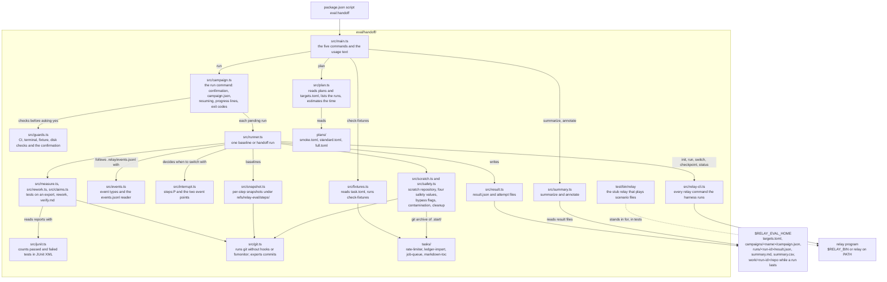
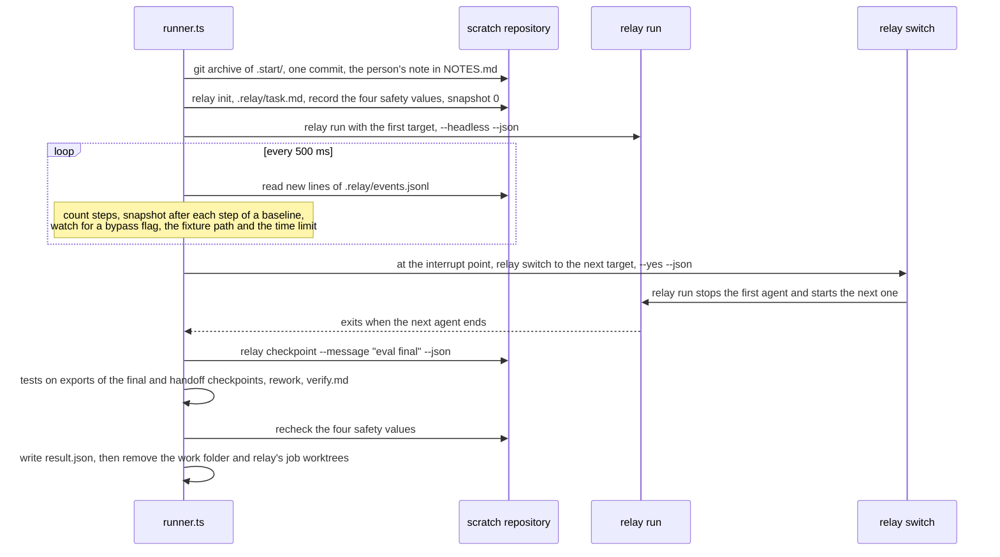
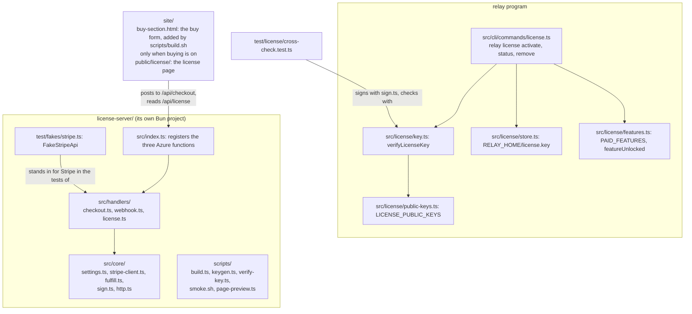
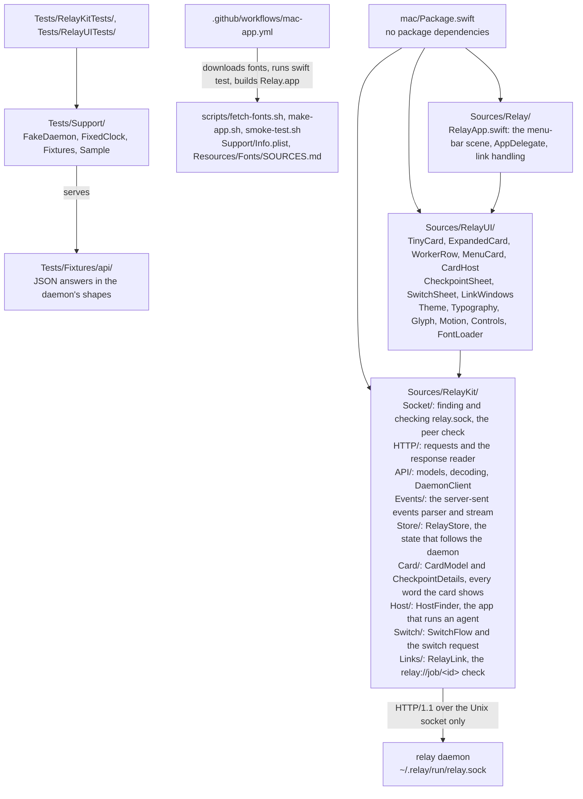

# Codebase map

Last updated 2026-10-08, after task groups 1 to 7 of `add-cli-scaffold`, task groups 1 to 9 of
`add-checkpoint-engine`, task groups 1 to 10 of `add-provider-adapters`, task groups 1 to 4 of
`add-relay-switch` (except tasks 1.5, 2.3 and 3.5), task groups 1 to 7 of
`add-handoff-evaluation`, task groups 1 to 7 of `add-website`, task groups 1 to 6, 9 and 10 of
`add-daemon-api-and-status`, task groups 1 to 4 of `add-mac-menu-bar-app`, and task groups 1 to 7
of `add-lifetime-license`.

This page shows the folders of relay's source code and tests, and what each one holds today.
`docs/first-version-index.md` lists every file that the six first-version changes will add, and
which change owns it. Each change that adds a folder updates this page.

```mermaid
flowchart TD
  pkg["package.json, tsconfig.json, bunfig.toml"]

  subgraph src["src/"]
    cli["src/cli/<br/>main.ts, run.ts, router.ts, help.ts,<br/>io.ts, errors.ts, exit-codes.ts"]
    commands["src/cli/commands/<br/>registry.ts: the seventeen commands<br/>init.ts, checkpoint.ts, checkpoints.ts,<br/>rollback.ts, accept-git-changes.ts, run.ts, hook.ts,<br/>hooks.ts, statusline.ts, daemon.ts, doctor.ts,<br/>status.ts, account.ts, providers.ts, policy.ts,<br/>license.ts, not-built.ts: their handlers"]
    hooks["src/hooks/<br/>hook-command.ts, fields.ts, spool.ts: relay hook<br/>install.ts: relay's entries in settings files<br/>statusline.ts: relay statusline claude<br/>fold.ts: hook events into availability"]
    checkpoint["src/checkpoint/<br/>save.ts: saveCheckpoint, the one checkpoint function<br/>snapshot.ts: the tree, built with a temporary index<br/>commit.ts: the commit and its refs<br/>list.ts: relay checkpoints<br/>rollback.ts: relay rollback"]
    core["src/core/<br/>version.ts: the version from package.json<br/>paths.ts: the home and relay folders<br/>relay-home.ts: folder and file safety checks<br/>quote.ts: escapes text relay repeats<br/>log.ts: the JSON-lines log files<br/>cleanup.ts: what to undo on a signal"]
    config["src/core/config/<br/>load.ts, validate.ts, log-level.ts,<br/>types.ts: reading and checking config.toml<br/>edit.ts: the one writer of config.toml"]
    platform["src/platform/<br/>toml.ts: the TOML parser<br/>clock.ts: now() and, for tests, setClock()<br/>libc.ts: the only bun:ffi import<br/>peer-credentials.ts: who is on a socket<br/>file-lock.ts: flock locks"]
    adapters["src/adapters/<br/>providers.ts: the list of providers<br/>types.ts: the adapter interface and events<br/>registry.ts: the adapter of each provider<br/>process.ts: the only code that starts agents<br/>lines.ts, text.ts, reset-time.ts: output lines,<br/>TOML strings and reset times<br/>program.ts: finding a program and its version<br/>mapper.ts, worker.ts: shared parts of the workers<br/>claude/: adapter, stream mapper, headless and<br/>interactive workers, hook mapper<br/>codex/: adapter, rpc, protocol, app-server and<br/>exec mappers and workers, interactive worker<br/>each: policy.toml, tested-versions.json;<br/>codex/protocol-used.json"]
    policies["src/policies/<br/>schema.ts, load.ts: the policy files<br/>switching.ts: mayAutoSwitch"]
    accounts["src/accounts/<br/>environment.ts: the agent's environment<br/>profile.ts: profile folders and their checks<br/>registry.ts: accounts in the settings<br/>record.ts, availability.ts, files.ts:<br/>account.json and availability.json"]
    daemon["src/daemon/<br/>main.ts: relay daemon run<br/>paths.ts: runtime directory checks<br/>singleton.ts: daemon.lock, daemon.pid<br/>log.ts: logs/daemon.log<br/>follow.ts: follows events.jsonl and projects.list"]
    api["src/api/<br/>server.ts: the socket listener and peer check<br/>http1.ts: the HTTP/1.1 layer<br/>router.ts, errors.ts, snapshot.ts<br/>sse.ts: the event stream<br/>routes/: version, providers, accounts, jobs, events"]
    status["src/status/<br/>model.ts: rows, roles, closing sentence<br/>render-text.ts, render-json.ts, time-format.ts<br/>sources.ts: the saved state without the daemon"]
    hooks["src/hooks/<br/>mapping.ts: what a hook event says about an account"]
    state["src/state/<br/>schema.sql, db.ts: relay.db<br/>index-builder.ts, apply-event.ts: filling it<br/>queries.ts, availability.ts: reading it<br/>projects-list.ts: projects.list"]
    client["src/client/<br/>api-client.ts: the only fetch, over the socket<br/>ensure-daemon.ts: starts the daemon"]
    git["src/git/<br/>run.ts: the only code that starts git<br/>repo.ts: finds the repository<br/>trust.ts: the trust record of git settings and hooks"]
    job["src/job/<br/>id.ts, names.ts: job IDs and job file names<br/>files.ts, state.ts: templates and state.json<br/>events.ts: the only writer of events.jsonl<br/>lock.ts: the job lock, the events lock<br/>and the config lock<br/>exclude.ts: the /.relay/ exclude line"]
    secrets["src/secrets/<br/>scan.ts: the gitleaks scans<br/>names.ts: secret-like file names<br/>redact.ts: secret-looking values in facts"]
    text["src/text/<br/>invisible.ts: the one list<br/>of invisible characters"]
    runfolder["src/run/<br/>run.ts: relay run, from the checks to the exit code<br/>job-context.ts: the job of this checkout<br/>instructions.ts: relay's fixed instructions<br/>worker-record.ts: the worker records<br/>progress.ts: the lines of a headless run"]
    handoff["src/handoff/<br/>the parts of relay switch: account.ts, settings.ts, files.ts,<br/>checks.ts and check-parsers/, notes-request.ts, notes-parse.ts,<br/>notes-build.ts, context.ts, claims.ts, fence.ts,<br/>render-checkpoint.ts, verify-file.ts, scan.ts, ask.ts,<br/>instruction-files.ts, permission.ts, allow-list.ts"]
  end

  subgraph test["test/"]
    setup["setup.ts: the test preload"]
    helpers["helpers/home.ts: a new relay folder per test<br/>helpers/cli.ts: run relay in or out of process<br/>helpers/scratch-repo.ts, invariants.ts: scratch repositories<br/>and captureState()"]
    gittests["git/: runner, repository, only-runner<br/>and trust record tests"]
    jobtests["job/, text/, secrets/, checkpoint/:<br/>job files, events, locks, invisible characters,<br/>secret scans, relay init and relay checkpoint<br/>helpers/fake-gitleaks.ts, helpers/secrets.ts"]
    clitests["cli/: router, help, hook, signal, settings,<br/>logging and exit-code tests<br/>cli/golden/: the exact help texts"]
    coretests["core/: paths, relay folder, settings and log tests<br/>fixtures/config/: settings files"]
    fake["fixtures/fake-provider/<br/>guard programs, fake agent, scenarios"]
    buildtests["build/: no-network.test.ts"]
    daemontests["platform/, daemon/, api/, state/: locks, peer check,<br/>compiled probe, daemon lifecycle, HTTP layer, index,<br/>following, read endpoints, event stream<br/>api/fixtures/: expected answers<br/>helpers/relay-home.ts: short relay folders, test daemons"]
    fakes["fakes/<br/>fake-claude.ts, fake-codex.ts: the fake agents<br/>scenario.ts, record.ts, run-hooks.ts<br/>fake-adapter.ts: the in-process fake adapter<br/>fake-t3.ts: a fake T3 Code server"]
    runtests["run/: relay run with the fake agents,<br/>headless, interactive and end to end"]
    handofftests["handoff/, config/: the handoff parts<br/>handoff/job.ts, asker.ts: a job and a question function<br/>fixtures/scenarios/: fake agents in a handoff<br/>fixtures/checks/, fixtures/checkpoint-md/:<br/>test outputs and checkpoint.md files"]
    adaptertests["adapters/, accounts/, policies/, docs/:<br/>adapter core, accounts, policies and document tests<br/>adapters/contract.ts, fixtures.ts, registry.ts:<br/>the contract suite<br/>fixtures/providers/: the provider fixtures<br/>helpers/child.ts, helpers/fake-programs.ts"]
  end

  scripts["scripts/smoke-test.sh: runs a built program<br/>scripts/check-release-binary.sh:<br/>no fake agent in the program<br/>scripts/check-policies.ts, record-fixture.ts,<br/>check-codex-protocol.ts"]
  ci[".github/workflows/ci.yml: the CI checks<br/>.github/dependabot.yml: weekly updates"]

  pkg -->|"bun run relay"| cli
  cli -->|"looks up the command"| commands
  cli -->|"checks the relay folder,<br/>writes logs/cli.log and logs/hook.log"| core
  cli -->|"loads the settings"| config
  commands -->|"hook.ts logs through"| core
  config -->|"checks the file with"| core
  config -->|"parses with"| platform
  coretests -->|"check"| config
  clitests -->|"compare help with"| commands
  core -->|"reads the version"| pkg
  pkg -->|"bun test preloads"| setup
  setup -->|"puts guard-bin/ first on PATH"| fake
  buildtests -->|"searches for network use"| src
  ci -->|"runs bun test, builds, then runs"| scripts
  gittests -->|"try to break the rules of"| git
  gittests -->|"use scratch repositories and captureState() from"| helpers
  commands -->|"init.ts sets up a job with"| job
  commands -->|"init.ts checks the scanner with"| secrets
  commands -->|"init.ts finds the repository and records trust with,<br/>accept-git-changes.ts rewrites the trust record with"| git
  secrets -->|"reads the checkpoint trees through"| git
  commands -->|"init.ts, checkpoint.ts, checkpoints.ts and rollback.ts use"| checkpoint
  checkpoint -->|"builds trees and commits through"| git
  checkpoint -->|"scans with"| secrets
  checkpoint -->|"locks, appends events and updates state.json with"| job
  commands -->|"init.ts cleans the title with"| text
  git -->|"trust.ts marks invisible characters with"| text
  jobtests -->|"check"| job
  jobtests -->|"check"| secrets
  jobtests -->|"check"| checkpoint
  commands -->|"daemon.ts starts, stops and asks through"| client
  client -->|"starts relay daemon run"| daemon
  client -->|"GET /v1/version over relay.sock"| api
  daemon -->|"serves the API with"| api
  daemon -->|"locks daemon.lock with"| platform
  api -->|"checks each connection's user with"| platform
  daemontests -->|"check"| daemon
  daemontests -->|"check"| api
  adapters -->|"reads the time from"| platform
  accounts -->|"finds the home and relay folders with"| core
  fakes -->|"fake-adapter.ts implements the interface of"| adapters
  adaptertests -->|"start fake-claude through process.ts"| fakes
  adaptertests -->|"check"| adapters
  adaptertests -->|"check"| accounts
  daemontests -->|"check"| state
  commands -->|"status.ts builds its view with"| status
  status -->|"asks the daemon through"| client
  status -->|"without the daemon, indexes in memory with"| state
  status -->|"reads spooled hooks with"| hooks
  daemon -->|"opens, rebuilds and follows the index with"| state
  api -->|"answers from"| state
  state -->|"reads checkpoints with"| checkpoint
  state -->|"reads state.json with"| job
  commands -->|"init.ts adds the project to projects.list with"| state
  checkpoint -->|"save.ts adds the project of every job it finds to projects.list with"| state
  commands -->|"account.ts, providers.ts use"| adapters
  commands -->|"account.ts manages"| accounts
  commands -->|"account.ts writes config.toml through"| config
  commands -->|"policy.ts shows"| policies
  adapters -->|"carry their policy from"| policies
  adaptertests -->|"check"| policies
  commands -->|"hook.ts, hooks.ts, statusline.ts use"| hooks
  hooks -->|"writes availability.json through"| accounts
  adapters -->|"interactive workers read the spool of"| hooks
  commands -->|"run.ts calls"| runfolder
  runtests -->|"check"| runfolder
  runfolder -->|"starts and watches the agent through"| adapters
  runfolder -->|"checks the account and its sign-in with"| accounts
  runfolder -->|"takes the worker lock and appends events with"| job
  handoff -->|"saves, scans and reads through"| checkpoint
  handoff -->|"asks the outgoing agent through"| adapters
  handoff -->|"adds to the allow list through"| config
  handofftests -->|"check, with fakes from"| handoff
```

The diagram shows how the pieces connect. `bun run relay` starts `src/cli/main.ts`, which passes
the command line to `runCli` in `src/cli/run.ts`. `runCli` asks `src/cli/router.ts` what the
command line means, prints help from `src/cli/help.ts` or an error, or calls the command's
handler. `src/cli/commands/registry.ts` lists the sixteen commands with their help texts and
argument counts. In this version every handler is `not-built.ts`, except `hook.ts` for
`relay hook`, `init.ts` for `relay init`, `checkpoint.ts` for `relay checkpoint`,
`checkpoints.ts` for `relay checkpoints`, `rollback.ts` for `relay rollback`, which restores an
earlier checkpoint's files after saving an undo checkpoint, `accept-git-changes.ts` for
`relay accept-git-changes`, `daemon.ts` for `relay daemon`, `account.ts` for `relay account`,
`providers.ts` for `relay providers`, `policy.ts` for `relay policy show` and `run.ts` for
`relay run`. `--version` prints the version from `src/core/version.ts`, which reads the
`version` field of `package.json`. `docs/cli.md` describes the command line and its exit codes.

Before a command's handler runs, `runCli` finds the relay folder with `src/core/paths.ts`,
creates or checks it with `src/core/relay-home.ts`, and loads `config.toml` with
`src/core/config/load.ts`. `load.ts` checks the file with `relay-home.ts`, parses it with
`src/platform/toml.ts`, and checks every setting with `validate.ts`. `types.ts` holds the shape of
the loaded settings, and `log-level.ts` picks the log level. Every message that repeats a value or path
writes it through `src/core/quote.ts`, which escapes characters that do not print, so a value
cannot change what the terminal shows; the router uses it too. `docs/config.md` describes the
settings and shows this flow in a diagram.

Once the relay folder has passed its checks, `runCli` opens a logger with `openLog` from
`src/core/log.ts`. The logger writes one JSON object per line to `logs/cli.log`, or to
`logs/hook.log` for `relay hook`, and rotates the file at 10 MB. `runCli` gives the logger to the
command's handler, and `src/cli/main.ts` uses it to record a signal that stops relay. The "Log
files" section of `docs/cli.md` describes the events, the fields and what is never logged.

`src/platform/` holds calls that only work on Bun, so that a later move to another runtime
changes one folder, and `clock.ts`, the one clock that every comparison with a reset time or a
file's age reads. `src/platform/libc.ts` is the only file that calls into the C library through
`bun:ffi`: `peer-credentials.ts` uses it to ask the kernel which user is on the other end of a
socket, and `file-lock.ts` uses it for `flock` locks, which the kernel releases when their holder
dies. `src/adapters/providers.ts` names the two supported providers, `claude` and `codex`.

`src/cli/commands/daemon.ts` is `relay daemon`. `relay daemon run` loads `src/daemon/main.ts`,
which checks the runtime directory with `src/daemon/paths.ts`, takes the daemon lock and writes
the pid file with `src/daemon/singleton.ts`, logs to `logs/daemon.log` through
`src/daemon/log.ts`, and starts the listener in `src/api/server.ts`. The listener checks each
connecting user, hands the bytes to the small HTTP/1.1 layer in `src/api/http1.ts`, and that layer
passes each request to `src/api/router.ts`, which finds the handler in `src/api/routes/` and
builds error answers with `src/api/errors.ts`. The other `relay daemon` actions, and
`relay doctor --reindex` in `src/cli/commands/doctor.ts`, run in the command's own process:
`src/client/ensure-daemon.ts` starts a detached daemon, and `src/client/api-client.ts` asks a
running one for its version or its jobs, after it has checked that the runtime directory is
private and the socket is the user's own.

Before it listens, `main.ts` opens `relay.db` with `src/state/db.ts`, which creates it from
`src/state/schema.sql` when it is missing, damaged or of an old version; `src/state/index-builder.ts`
then fills it from `config.toml`, `projects.list` (`src/state/projects-list.ts`), each project's
`.relay/` files and the checkpoint refs, which it reads with `src/checkpoint/list.ts`.
`src/state/apply-event.ts` is the one place that turns an event of the earlier phases into rows.
`src/daemon/follow.ts` reads new lines of each `events.jsonl` and new roots in `projects.list`, and
writes each change to the event stream in `src/api/sse.ts`. The routes read the index through
`src/state/queries.ts`, with `src/state/availability.ts` for the stale reset rule, and
`src/api/snapshot.ts` adds the `Relay-Stream-Seq` header. `src/cli/commands/status.ts` is `relay status`: it finds the job, asks the daemon through
`src/client/api-client.ts`, or else builds the saved state with `src/status/sources.ts` (an index
in memory, a read-only `relay.db` and the hook spool read with `src/hooks/mapping.ts`), turns the
data into rows with `src/status/model.ts`, and prints them with `src/status/render-text.ts` or
`render-json.ts`. `src/client/ensure-daemon.ts` also has `ensureDaemon`, which `relay run` and
`relay switch` will call. `docs/daemon.md` describes the daemon,
its files, the index, `relay status` and the checks on the way to an answer in diagrams, and `docs/api.md` describes
every endpoint. The tests in `test/platform/`, `test/daemon/`, `test/api/`, `test/state/`,
`test/client/` and `test/status/` (with its golden files in `test/status/golden/`) use the
short relay folders and test daemons from `test/helpers/relay-home.ts`, because a socket path may
have at most 103 bytes on macOS; `test/api/fixtures/` holds the expected answers of the read
endpoints.

`src/adapters/` holds the adapter interface of `add-provider-adapters` in `types.ts` and the
registry that gives each provider's adapter in `registry.ts`. `process.ts` is the only code that starts an agent process:
headless agents in their own process group with their output drained into a worker log of mode
0600, interactive agents in the person's terminal, and signals only through the child relay holds.
`test/adapters/no-other-spawn.test.ts` fails if another file under `src/adapters/` starts a process.
`lines.ts` splits output into whole lines, `text.ts` encodes TOML strings for Codex, and
`reset-time.ts` reads the reset times of usage limits. `src/accounts/environment.ts` builds every
agent's environment without credential variables, and `src/accounts/profile.ts` recognises the
providers' own folders. `src/secrets/redact.ts` replaces secret-looking values in the facts relay
records. `docs/adapters.md` describes all of these with diagrams.

`src/adapters/claude/adapter.ts` and `src/adapters/codex/adapter.ts` are the two adapters. They
find their program through `src/adapters/program.ts`, read its version and compare it with their
`tested-versions.json`, read the sign-in state and name the login command. Each one has pure
mappers that turn the program's output into worker events (`claude/stream.ts`,
`codex/app-server.ts`, `codex/exec-stream.ts`, with the shared parts in `mapper.ts`), and workers
that start and supervise the program: `claude/headless.ts` and `claude/interactive.ts`;
`codex/app-server-worker.ts` (JSON-RPC through `codex/rpc.ts`), `codex/exec.ts` and
`codex/interactive.ts`. `codex/session.ts` starts a short app server to read rate limits or hook
trust. `src/adapters/worker.ts` holds what the workers share, such as the event queue and the
recording of readings in `availability.json`. Interactive workers learn what happens from the hook
spool, through `claude/hooks.ts` and `codex/hooks.ts`. Each folder also holds the
provider's `policy.toml`, which `src/policies/load.ts` imports and `schema.ts` checks, and
`src/policies/switching.ts` answers whether relay may move a job between two accounts on its own.
`src/cli/commands/account.ts` is `relay account list | add | status | login | remove`: it checks and
creates profile folders with `src/accounts/profile.ts`, writes `config.toml` only through
`src/core/config/edit.ts`, keeps `account.json` with `src/accounts/record.ts` and reads
`availability.json` with `src/accounts/availability.ts`. `providers.ts` is `relay providers` and
`policy.ts` is `relay policy show`. `docs/accounts.md` describes the accounts with diagrams.

`src/hooks/` holds relay's side of the providers' hooks. `hook-command.ts` is `relay hook`: it keeps
the fields that `fields.ts` allows and appends one line to the spool with `spool.ts`.
`install.ts` adds and removes relay's entries in an account's `settings.json` or `hooks.json`,
with a backup, and `src/cli/commands/hooks.ts` is `relay hooks install | remove | status`.
`statusline.ts` is `relay statusline claude`, which records the usage windows of Claude Code's
status line and then runs the person's own. `fold.ts` turns spool lines into availability readings
for `relay account status`. `docs/hooks.md` describes these with a diagram.

`src/run/` is `relay run`, which `src/cli/commands/run.ts` calls. `run.ts` checks the account, its
program, profile folder and sign-in and the project's allow list, takes the worker lock with
`src/job/lock.ts`, starts the agent through its adapter, appends the worker events to the job's
event log with `src/job/events.ts`, and chooses the exit code. `job-context.ts` finds the job of
this checkout, `instructions.ts` holds relay's fixed instructions for every agent,
`worker-record.ts` writes `RELAY_HOME/jobs/<job>/workers/<worker>.json`, and `progress.ts` writes
the lines of a headless run. `test/run/` tests it with the fake agents. The section "Running an
agent" of `docs/adapters.md` describes it with a diagram.

`test/adapters/contract.ts` declares the contract suite that every adapter registered in
`test/adapters/registry.ts` must pass, and `test/adapters/fixtures.ts` loads and replays the
fixtures in `test/fixtures/providers/`. `scripts/record-fixture.ts` records a real fixture when
`RELAY_RECORD=1` is set, `scripts/check-codex-protocol.ts` checks the Codex protocol subset in
`src/adapters/codex/protocol-used.json`, and `scripts/check-policies.ts` fails when a policy is
older than its `max_age_days` or dated in the future; CI runs it in a job of its own, so a stale
date does not stop the release build. `docs/testing-adapters.md`
describes the contract suite and the fixtures.

`test/fakes/` holds the fake agents that every adapter test runs instead of the real programs:
`fake-claude.ts` and `fake-codex.ts` print the output formats of Claude Code and Codex and follow a
scenario file (`scenario.ts`), record what they received (`record.ts`) and run installed hooks
(`run-hooks.ts`). `fake-adapter.ts` implements the adapter interface in memory for tests of code
that uses adapters, and `fake-t3.ts` is the fake T3 Code server of `add-t3-limit-rules`. `scripts/check-release-binary.sh` builds relay and fails if a fake reached the
program; CI runs it after each build. `docs/testing-adapters.md` describes the fakes and the
scenario format.

`src/git/run.ts` is the only code that starts git. Every call gets settings that turn off hooks
and the file-system monitor, an environment without the parent's `GIT_` variables, and checks that
keep git away from the person's branch, index, stash and files. `src/git/repo.ts` uses it to find
the repository that holds a folder. `src/git/trust.ts` writes `git-trust.json` in the job's folder
under `RELAY_HOME` with hashes of the git settings and hooks, and later reports what changed. `docs/git-safety.md` explains the rules, and the tests in
`test/git/` try to break each of them. `test/git/only-runner.test.ts` fails if any other source
file starts git.

`bun test` loads `test/setup.ts` before any test, because `bunfig.toml` lists it as a preload.
The preload gives each test run its own home folder and relay folder in the system temporary
folder, removes credential variables, and puts the guard programs in
`test/fixtures/fake-provider/guard-bin/` first on `PATH`. The guard programs stop any test that
starts the real `claude` or `codex` by mistake, and `guard-bin/git` stops any git process that
does not come from relay's git runner. The preload also removes git and XDG settings variables, and makes `Bun.spawn`,
`Bun.spawnSync` and `Bun.which` use the test environment when a test passes none. The fake agent in the same folder follows a
scenario file, so tests can run a scripted child process instead of a real agent.
`test/fixtures/fake-provider/README.md` describes both.

The tests in `test/cli/` run relay in the same process with `runRelayInProcess`, or as its own
process with `runRelay` when they need standard input, signals or a full logging check.
`test/cli/logging.test.ts` plants credentials, option values, settings values and hook input built
while the test runs, and checks that no log file contains them. `test/cli/golden/` holds the
exact text of the top-level help and of each command's help, and the tests compare the output
with these files byte for byte.

The tests in `test/core/` call the relay folder, settings and log functions directly. They build
each settings file in a new relay folder from `makeRelayHome`, or read one from
`test/fixtures/config/`. A credential value in a test is built at run time, so none is committed.

`test/build/no-network.test.ts` searches every file under `src/` and fails when relay's code could
open a network connection, other than to relay's own socket (`src/client/`, and the listener in
`src/api/server.ts`) or to T3 Code on this computer (`src/t3/client.ts` and `src/t3/oauth.ts`). `scripts/smoke-test.sh` runs a built `relay` program and checks its
version, its help, its exit code and its log file. The workflow in `.github/workflows/ci.yml`
runs the type check and the tests, builds the program for Linux and macOS, runs the smoke test on
each, and scans the dependencies and the git history. `.github/dependabot.yml` asks GitHub to
propose updates to the actions and the Bun dependencies every week. `docs/development.md`
describes these steps and shows the CI jobs in a diagram.

`test/helpers/scratch-repo.ts` creates a scratch repository with commits, a second branch, a tag,
a stash entry, and staged, unstaged, untracked and ignored files, with its own `HOME` and
`RELAY_HOME`. `test/helpers/invariants.ts` provides `captureState()`, which records everything of
the person's that relay must never change, so a test can compare the repository before and after
a command.

`src/cli/commands/init.ts` is `relay init`. It finds the repository with `src/git/repo.ts`,
checks gitleaks with `src/secrets/scan.ts`, draws a job ID with `src/job/id.ts`, writes the job
files with `src/job/files.ts` and `src/job/state.ts`, adds the exclude line with
`src/job/exclude.ts`, records the git trust record with `src/git/trust.ts`, and appends the first
event with `appendEvent` from `src/job/events.ts`. That function is the only code that writes
`events.jsonl`, and `test/job/single-writer.test.ts` fails if another source file does.
`src/job/lock.ts` holds the job lock, the short events lock (an `flock` lock) and the config
lock, which `src/core/config/edit.ts` holds while it changes `config.toml`, under
`RELAY_HOME/locks/`, and
`src/job/names.ts` names the job files for the modules that need the list. `src/text/invisible.ts`
removes invisible characters from the job title, and `src/git/trust.ts` uses the same list to
mark them in its report. `src/secrets/scan.ts` runs gitleaks on text relay builds itself, and
`src/secrets/names.ts` matches file names that suggest secrets. When a signal stops relay, `src/cli/main.ts` runs the
actions registered in `src/core/cleanup.ts`: the scan removes its temporary files and stops
gitleaks, and `relay init` removes what it had created. `docs/checkpoints.md` describes
both flows in diagrams.

`src/handoff/` holds the parts of `relay switch` that `add-relay-switch` builds before its switch
engine. `account.ts` turns the command's argument into an account, and `settings.ts` keeps each
job's mode, permission ceiling and checks in `RELAY_HOME/jobs/<job>/handoff-settings.json`, written
through `files.ts`. `checks.ts` runs the job's checks and `check-parsers/` reads their counts.
`notes-request.ts` asks the outgoing agent for notes through its adapter and `notes-parse.ts` reads
them; `notes-build.ts` and `context.ts` gather the facts relay holds itself from the event log and
git; `claims.ts` compares the notes with those facts. `render-checkpoint.ts` writes
`.relay/checkpoint.md` with the fence from `fence.ts`, and `verify-file.ts` counts the rows of
`.relay/verify.md`. `scan.ts` passes everything a handoff writes or sends to the secret scan.
`instruction-files.ts`, `permission.ts` and `allow-list.ts` hold the questions and refusals that run
before the outgoing agent is stopped, and `ask.ts` is how they ask. `docs/handoff.md` shows the
order of a handoff and its safety checks in a diagram.

`relay init` then saves the first checkpoint, and `src/cli/commands/checkpoint.ts` saves the next
ones. Both call `saveCheckpoint` in `src/checkpoint/save.ts`, the one function that saves a
checkpoint. It checks the trust record, takes the job lock, builds the tree with
`src/checkpoint/snapshot.ts` (which works on a temporary copy of the person's index), scans it with
`src/secrets/scan.ts`, creates the commit and writes the refs under `refs/relay/` with
`src/checkpoint/commit.ts`, and records the event and `state.json`. The "Saving checkpoints"
section of `docs/checkpoints.md` shows this in a diagram. The setting
`[checkpoint] max_file_size_mb` reaches the commands through the loaded settings, which `runCli`
passes to every handler.

The tests in `test/job/`, `test/text/` and `test/secrets/` call these modules directly; the
secret scan tests use `test/helpers/fake-gitleaks.ts` through `RELAY_GITLEAKS`, and the real
gitleaks with secrets that `test/helpers/secrets.ts` builds at run time. `test/checkpoint/init.test.ts`
runs `relay init` in scratch repositories and compares `captureState()` before and after.
`test/checkpoint/snapshot.test.ts` and `commit.test.ts` call the checkpoint modules directly, and
`test/checkpoint/checkpoint.test.ts` runs `relay checkpoint` and compares `captureState()` before
and after in ordinary, detached, empty and linked-worktree repositories.

`src/cli/commands/accept-git-changes.ts` is `relay accept-git-changes`. It refuses to run without
a terminal, compares the git settings and hooks with the trust record through `reviewTrust()` in
`src/git/trust.ts`, and writes a new record only after the person types `yes`.
`test/checkpoint/accept-git-changes.test.ts` simulates the terminal, and
`test/checkpoint/tampering.test.ts` checks that a planted setting or hook stops relay and never
runs. `test/checkpoint/e2e.test.ts` builds the program with the build script of `package.json`
and runs it as a separate process through a whole job, reading the git commands it ran from the
runner's call log. The section "When relay refuses to run git" of `docs/checkpoints.md` shows the
messages.

## The handoff evaluation harness

`eval/handoff/` holds the opt-in evaluation of `add-handoff-evaluation`. It is a separate Bun
program, run with `bun run eval:handoff <command>`, and is never compiled into the `relay` binary.
It has its command line, the four fixture tasks, the plan files, the checks that `run` makes
before it starts, the runner that performs baseline and handoff runs through `relay`, and the
summary with its decision rules. Its own tests use a stub `relay` instead of the real program, so
they start no agent.

The diagram shows how the parts of the harness depend on each other. `bun run eval:handoff`
starts `src/main.ts`, which hands each command to its module. Only `src/relay-cli.ts` starts the
`relay` program, and only `src/git.ts` starts git. In the tests, `$RELAY_BIN` points at the stub
in `test/bin/`, shown with a dotted line.

`plan <plan>` reads a plan file from `plans/` through `src/plan.ts`, and the founder's
`targets.toml` from `$RELAY_EVAL_HOME` (by default `~/.relay-eval`), which maps each role of the
plan, such as `claude`, to one of his relay accounts. It expands the plan into the ordered list of
runs: all baselines first, then all handoffs, with repetition 1 of every run before any
repetition 2. It prints the number of runs, the accounts and the expected agent time, and starts
nothing.

`run <plan>` first makes every check that must pass before the evaluation spends a subscription
(`src/guards.ts`): it refuses when `CI` is set or standard input is not a terminal, and stops when
an existing campaign's `campaign.json` records a different plan hash or accounts, when a fixture
has uncommitted changes, or when less than 1 GB is free. It skips every run that already has a
`result.json`, and runs whose last attempt was a harness error unless `--retry-errors` is given.
Then it names the companies and accounts that will receive the fixture code, asks the founder to
type `yes`, writes `campaign.json` for a new campaign, looks for `relay`, and gives each pending run
to `src/runner.ts`. It stops at once with exit code 5 when a target reaches its limit, 130 after
Ctrl-C, and 1 when relay started an agent with a permission bypass flag.

The sequence shows one handoff run. A baseline run is the same without `relay switch`; instead the
runner snapshots the working tree after every step into `refs/relay-eval/steps/<n>` with a
temporary index, and afterwards measures the snapshots at 25, 50 and 75 percent of its steps as
control points. A handoff run switches after the step chosen by `src/interrupt.ts` from the median
step count of the completed baselines. Every test run happens in a temporary export made with
`git archive`, where the hidden acceptance tests are added as `__acceptance__/`, so they never
reach a folder an agent works in. Snapshot 0 holds the starting tree with the person's note, and
rework is measured from it. The four safety values are the `main` tip, its reflog, the index
entries from `git ls-files -s` and `NOTES.md`; any change is a safety violation in the result. The
index is compared by its entries, so a `git status` that only rewrites the index's stat cache is
not a violation. Runs stopped by a limit, by Ctrl-C
or by a harness error are saved as `attempt-<n>.json` and stay pending.

`summarize <campaign>` reads only the result files through `src/summary.ts`. It writes
`summary.csv` with one row per run and `summary.md` with a header, a verdict and a rule table per
handoff direction, the outcomes per task, run kind, direction and point, and the runs that need a
look. `annotate <campaign> <run-id> <text>` saves a note in that run's `result.json`, and the next
summary lists it.

`check-fixtures` reads each task's `task.toml` through `src/fixtures.ts`. For each task it copies
the starting repository from `.start/` to a temporary folder, runs the visible tests, then adds the
hidden acceptance tests as `__acceptance__/` and runs them. It does the same again with the
reference solution from `solution/` copied over the start. Every run writes JUnit XML, which
`src/junit.ts` reads with Bun's `HTMLRewriter`. Python tasks write that XML through
`runners/unittest_junit.py`. None of the four tasks needs an installation or the network.

`test/bin/relay` is a stub of the `relay` program for the harness's tests. It implements
`--version`, `init`, `run`, `checkpoint`, `checkpoints`, `switch` and `status` with the JSON that
the real commands print, writes `.relay/events.jsonl` and checkpoint commits under `refs/relay/`,
and plays the agents' edits and commands from the scenario file named by `RELAY_STUB_SCENARIO`.
The tests build a committed copy of the harness in a temporary folder, so runs can export fixtures
with `git archive` even where the checkout is not a git repository. `test/data/campaigns/` holds
four sample campaigns, and `test/golden/` the summaries they must produce.

A bare `bun test` at the repository root also runs the harness's own tests, because `bunfig.toml`
sets the whole repository as the test root (see the website section below), and
`bun test ./eval/handoff/test` runs only them. Both load relay's test preload, whose guard program
stops git unless a git runner started it, so `src/git.ts` marks its git processes the way relay's
runner does (`docs/development.md`, "The fake provider"). The fixtures' starting repositories and
acceptance tests sit in folders whose names start with a dot, which Bun's test runner skips, so
neither command runs them.

## The website

`site/` holds the public website, which is separate from the `relay` program. `site/public/` is
the folder that is deployed, with the two pages, the stylesheet and the script. `site/test/` holds
file checks that `bun test` runs together with the tests above, and `site/e2e/` holds browser
checks that Playwright runs. `site/scripts/` holds the font download script, the smoke test
of a running copy of the site, and the deployment script. `bunfig.toml` sets the test root to the whole repository so that
`bun test` finds `site/test/`. `docs/website.md` describes the files with a diagram and says how to
get the fonts and run the checks.

## The license

The OpenSpec change `add-lifetime-license` adds two parts: the offline key check inside `relay`,
and a small server that sells and delivers keys. `docs/licensing.md` explains the whole flow.

The diagram shows the two parts and how they meet. In the `relay` program, the `license` command
checks a key with `verifyLicenseKey`, which uses only the built-in public keys, and saves the key
in `RELAY_HOME/license.key`. The license server is a separate Bun project: `src/index.ts` is the
only file that imports `@azure/functions`, and the handlers take plain requests, so the tests
call them with a fake Stripe client. The website's buy form and license page talk only to the
server's `/api/` routes on the same site. A test in the `relay` project signs keys with the
server's `sign.ts` and checks them with relay's `key.ts`, so the two sides cannot drift apart.
The root `bunfig.toml` keeps `license-server/` out of the root `bun test`, because that project has
its own dependencies; CI tests it in its own job.

## The Mac app

`mac/` holds the menu-bar app of the OpenSpec change `add-mac-menu-bar-app`. It is a Swift package
that is built and tested only by the `.github/workflows/mac-app.yml` workflow on GitHub's macOS
runner, never on a developer's Mac.

The diagram shows the folders of the Mac app and how they depend on each other. `RelayKit` has no
SwiftUI and holds everything that talks to the daemon: it checks that the socket folder is private
and that the daemon runs as the same user before it sends a byte. Its `RelayStore` keeps the
app's copy of the daemon's state, and `CardModel` turns that state into every word of the card,
so the views in `RelayUI` hold no rules. `HostFinder` finds the app that runs the current agent by
walking up its parent processes, `SwitchFlow` sends the one action the app has, a switch, and
`RelayLink` accepts only `relay://job/<id>` links, which open a window and nothing else. `Relay` is
the app itself. The tests run against `FakeDaemon`, a small
Unix-socket server that answers with the JSON files in `Tests/Fixtures/api/`. The workflow
downloads the fonts, runs the tests (which also render the cards to PNG files), builds and signs
`Relay.app` ad hoc, starts it for five seconds, and uploads the zipped app and the screenshots.
