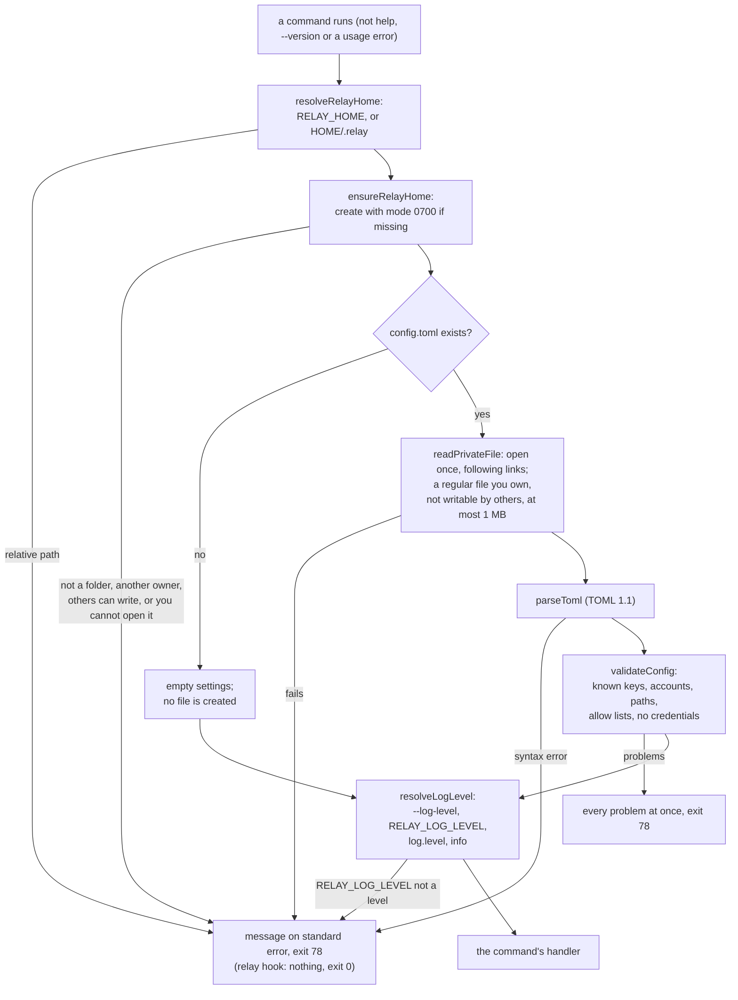

# relay settings

This page describes where relay keeps its own files and the settings file `config.toml`: what
each setting means, how relay checks the file, and the messages it prints when something is
wrong. The code is in `src/core/paths.ts`, `src/core/relay-home.ts` and `src/core/config/`.
`docs/config.example.toml` is a complete example that the tests load.

## The relay folder

relay keeps its files in one folder, the relay folder. It is `~/.relay` unless the environment
variable `RELAY_HOME` names another folder. An empty `RELAY_HOME` counts as unset.

- `RELAY_HOME` must be an absolute path or start with `~/`. Any other value stops relay with
  exit code 78: `relay: RELAY_HOME must be an absolute path, not "relay-home".`
- `RELAY_HOME` cannot be your home folder itself (`~`, `~/` or the same path written out), because
  relay changes the mode of its folder and keeps private files there:
  `relay: RELAY_HOME cannot be your home folder itself ("~"). Use a folder of its own, such as ~/.relay.`
- relay finds the home folder through the `HOME` variable. It asks the operating system only when
  `HOME` is unset, empty or not an absolute path.
- When a command runs, relay creates the relay folder with mode 0700 if it is missing. Help,
  `--version` and a wrong command line never create it.
- An existing relay folder must be a folder that you own, that you can read, write and open, and
  that neither your group nor other users can write. When the path is a symbolic link, you must
  also own the link. Otherwise relay stops with exit code 78 before it reads or writes anything in
  it, for example: `relay: other users can change /Users/josue/.relay. Run "chmod 700 /Users/josue/.relay" and try again.`
  A folder that belongs to another user gives `relay: <folder> belongs to another user. relay only
  uses a folder you own.` A folder you cannot fully use, for example one with mode 0600, gives
  `relay: you cannot read, write and open <folder>. Run "chmod 700 <folder>" and try again.` A path
  that is not a folder gives `relay: <folder> is not a folder.`

In this version the folder holds `config.toml`, your settings, which relay only reads, and
`logs/`, relay's log files (see `docs/cli.md`). Later changes add `profiles/` (the default profile
folder of each account), `accounts/`, `jobs/`, `locks/`, `tmp/`, `spool/`, `run/`,
`projects.list` and `relay.db`, and describe them in their own documents.

The settings live in your relay folder and never inside a project, so a repository cannot add
itself to an allow list.

## How relay reads the settings



The diagram shows the checks relay makes, in order, before a command does its work. relay first
works out the relay folder and makes sure it is private. A missing `config.toml` is not an error;
relay continues with no accounts, no projects and default values, and does not create the file.
An existing file is opened once, and must pass the file checks on that opened file before relay
reads a single byte of it. relay then
parses it and checks every setting, and reports all problems together so that you can fix them in
one pass. Every failure on the way ends with exit code 78. `relay hook` is the exception: agents
call it, so it prints nothing and exits with code 0.

## The settings file

`config.toml` is a TOML 1.1 file. relay accepts only the settings on this page. A misspelt key is
a problem, not something relay quietly skips, because a typo in an allow list would otherwise go
unnoticed.

```toml
version = 1

[defaults]
account = "claude:personal"

[log]
level = "info"

[accounts."claude:personal"]
profile_dir = "~/.claude"
kind = "personal"

[[projects]]
path = "~/projects/relay"
allow = ["claude:personal"]
```

`docs/config.example.toml` has a longer example with comments.

### Top level

| Setting | Type | Default | Meaning |
|---|---|---|---|
| `version` | integer | `1` | The version of the file format. It must be `1`. A larger number means the file was written for a newer relay. The TOML parser reads `1.0` as `1`, so `version = 1.0` is also accepted. |
| `defaults` | table | empty | Default choices, below. |
| `log` | table | empty | Log settings, below. |
| `checkpoint` | table | empty | Checkpoint settings, below. |
| `accounts` | table of tables | no accounts | Your accounts, below. |
| `projects` | list of `[[projects]]` tables | no projects | The accounts each project may use, below. |

### `[defaults]`

| Setting | Type | Default | Meaning |
|---|---|---|---|
| `account` | account name | none | The account `relay run` uses when you do not name one. It must be one of your accounts. Example: `account = "claude:personal"`. |

### `[log]`

| Setting | Type | Default | Meaning |
|---|---|---|---|
| `level` | `"debug"`, `"info"`, `"warn"` or `"error"` | `"info"` | How much relay writes to its log files. |

The log level comes from the `--log-level` option first, then the `RELAY_LOG_LEVEL` environment
variable, then `log.level`, then `info`. A `RELAY_LOG_LEVEL` that is not one of the four levels
stops relay with exit code 78, also when `--log-level` is given:
`relay: RELAY_LOG_LEVEL must be debug, info, warn or error, not "loud".`

### `[checkpoint]`

| Setting | Type | Default | Meaning |
|---|---|---|---|
| `max_file_size_mb` | whole number from 1 to 1024 | `20` | A file larger than this many megabytes is left out of a checkpoint and listed in its output instead. `docs/checkpoints.md` explains what happens to such a file. |

### `[accounts."<provider>:<name>"]`

An account is a provider and a name you choose, written `provider:name`, for example
`claude:personal` or `codex:work`. The provider is `claude` or `codex`. The name uses lowercase
letters, digits and `-`, starts with a letter or digit, and has at most 32 characters. Each
account is a place where relay can run an agent, and has its own profile folder, where the
provider's own program keeps its sign-in.

| Setting | Type | Default | Meaning |
|---|---|---|---|
| `profile_dir` | path | `<relay folder>/profiles/<provider>-<name>` | The account's profile folder. Example: `profile_dir = "~/.codex"`. Two accounts cannot share a folder. |
| `credential_env` | list of variable names | `[]` | The names of credential variables this account may receive from your shell, for example `["ANTHROPIC_API_KEY"]`. Names use capital letters, digits and `_`. relay removes every other credential variable when it starts an agent. |
| `kind` | `"personal"` or `"work"` | none | Whether this is a personal or a work account. |

An account with no settings, `[accounts."claude:personal"]` alone, is valid.

### `[[projects]]`

Each `[[projects]]` table lists the accounts allowed to work on one project. Handing work to an
account sends the project's code to that account's company, so relay only uses the accounts
listed here.

| Setting | Type | Default | Meaning |
|---|---|---|---|
| `path` | path | required | The project folder. Two entries cannot name the same folder. |
| `allow` | list of account names | required | The accounts this project may use, each once. Each must be one of your accounts. `allow = []` allows none. |

### Paths

`profile_dir` and a project's `path` accept an absolute path, `~`, or a path starting with `~/`.
relay replaces `~` with your home folder, removes a trailing `/`, and resolves `.` and `..`, so
`"~/.codex/"` becomes `/Users/josue/.codex`. relay does not check that the folder exists; the
command that uses it does.

## Credentials are refused

relay never stores passwords, tokens, API keys or cookies, and `config.toml` must not hold any.
You sign in to each account with the provider's own login command, and the provider keeps the
sign-in in the account's profile folder. An account can only name the credential variables it may
receive, with `credential_env`; the values stay in your shell.

A key whose name contains `token`, `apikey`, `api_key`, `password`, `secret`, `cookie` or
`credential` (in any letter case, in any table) is refused with this problem:

```
accounts."claude:personal".api_key: relay never stores credentials. Remove this key and sign in with the provider's own login command.
```

relay never prints the value of such a key, and never writes it to a log. More generally, a
problem names the key and not its value. The one exception is an account name in `allow` or
`defaults.account`, which relay repeats only when it has the `provider:name` form.

## The file itself

relay opens `config.toml` once, following a symbolic link (so a link to a file in a dotfiles folder
works), and reads it only when the opened file passes these checks. Because the checks and the
read use the same opened file, the file cannot be swapped between them.

- It is a regular file, not a folder, a named pipe or a device: `relay: <file> is not a regular file.`
- You own it. Otherwise: `relay: <file> belongs to another user. relay only uses a file you own.`
- Neither your group nor other users can write it. Otherwise:
  `relay: other users can change <file>. Run "chmod 600 <file>" and try again.`
- It is at most 1 MB. Otherwise: `relay: <file> is larger than 1 MB, the most relay reads.`

A file that is not valid TOML gives `relay: cannot read <file>: <message from the TOML parser>`.
The parser repeats part of the file in some messages, and that part could be a credential. relay
replaces every quoted piece longer than three characters with `"..."`, so `api_key = sk-ant-...`
without quotes gives `Strings must be quoted: "..."`. Short pieces such as `'='` stay, so the
message still says what is wrong.

When the system refuses to open or read a path, relay says why in plain words instead of
repeating the system's message, for example
`relay: cannot use /Users/josue/.relay/config.toml: you do not have permission.` The reasons are
`it, or the file it links to, does not exist`, `you do not have permission`,
`part of the path is not a folder`, `it leads through too many symbolic links`, and
`the system reported <code>` for any other error code. A symbolic link named `config.toml` that
leads nowhere is such an error, not a missing file.

relay only reads `config.toml` in this version. Later versions change it only to add or remove
accounts and allow-list entries, through one module, and never write a credential to it.

## Problem messages

When the file has problems, relay lists all of them, in the order of the keys in the file, and
exits with code 78. (One exception comes from the TOML parser relay uses: keys that look like
whole numbers, such as `"1"`, are listed before the other keys of their table.)

```
relay: /Users/josue/.relay/config.toml has 2 problems:
  colour: unknown setting.
  log.level: must be debug, info, warn or error.
The settings are described in docs/config.md.
```

A key that contains characters other than letters, digits, `_` and `-` is shown in quotes, as in
`accounts."claude:personal"`. Control characters and other characters that do not print are
written as `\u` escapes in every key, value and path relay repeats, so the file cannot change
what your terminal shows. `[[projects]]` entries are counted from 1, as in `projects[1].path`.

| Problem | Message |
|---|---|
| A key relay does not know | `unknown setting.` |
| A key named like a credential | `relay never stores credentials. Remove this key and sign in with the provider's own login command.` |
| `version` is larger than 1 | `this file is for a newer relay (version 2). Update relay.` |
| `version` is anything else | `must be 1.` |
| An account name not in `provider:name` form | `account names look like provider:name in lowercase, for example "claude:personal".` |
| An account for another provider | `relay does not support "cursor" yet. Supported providers: claude, codex.` |
| A path that is relative | `must be an absolute path or start with ~/.` |
| Two accounts with one profile folder | `the same folder as accounts."claude:personal". Each account needs its own profile folder.` |
| An account name that is not defined | `"codex:work" is not one of your accounts.` |
| A name listed twice in `allow` | `"codex:personal" is listed twice.` |
| Two projects with one path | `the same path as projects[1].` |
| A required setting is missing | `is required.` |
| `checkpoint.max_file_size_mb` is not a whole number from 1 to 1024 | `must be a whole number from 1 to 1024.` |
| A wrong type | `must be a string.`, `must be a table.`, `must be a list of [[projects]] tables.`, `must be a list of account names.`, `must be a list of variable names in capitals, for example "ANTHROPIC_API_KEY".`, `must be "personal" or "work".`, `must be debug, info, warn or error.` |

## Adding a setting

A change that adds a setting updates, in the same pull request, `src/core/config/validate.ts`,
`src/core/config/types.ts`, this page and `docs/config.example.toml`.
