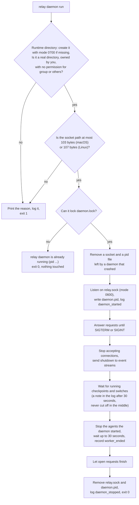
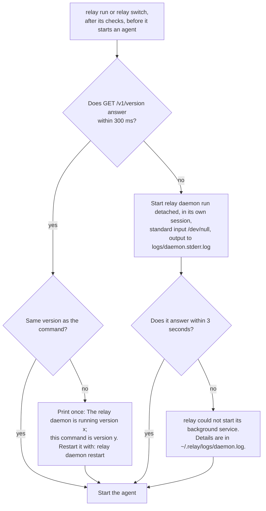
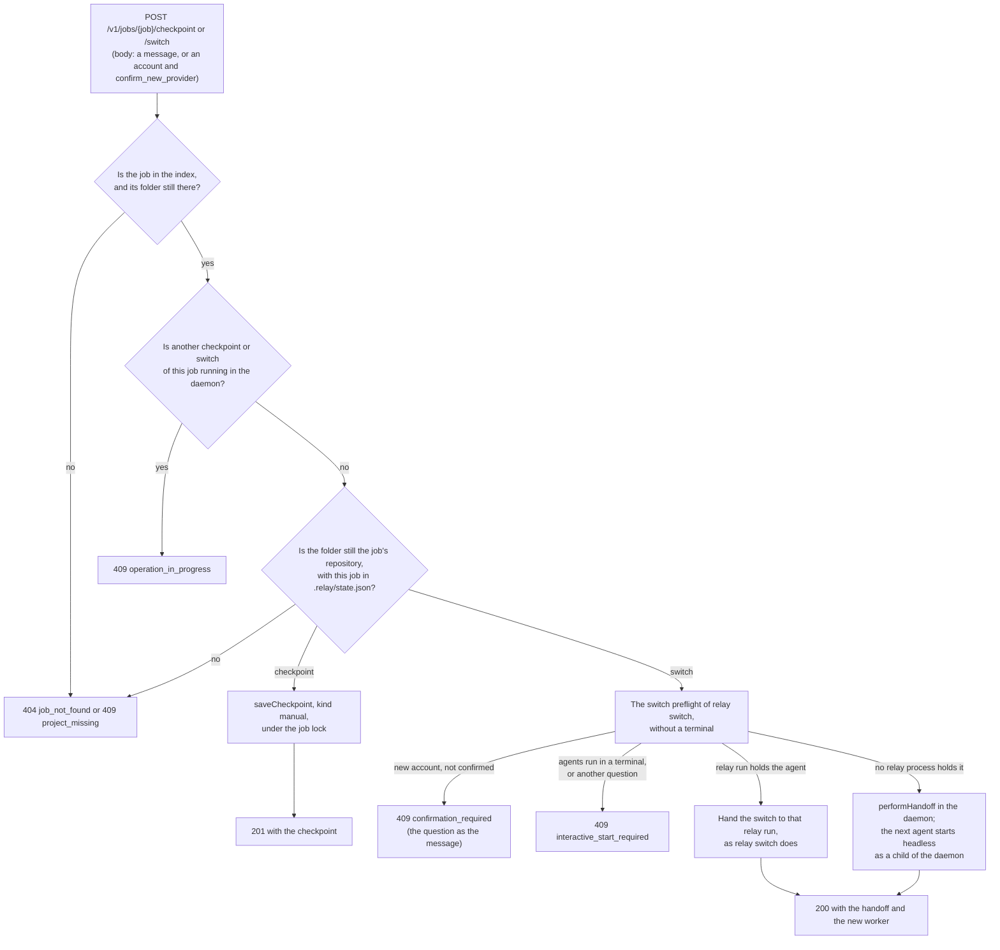
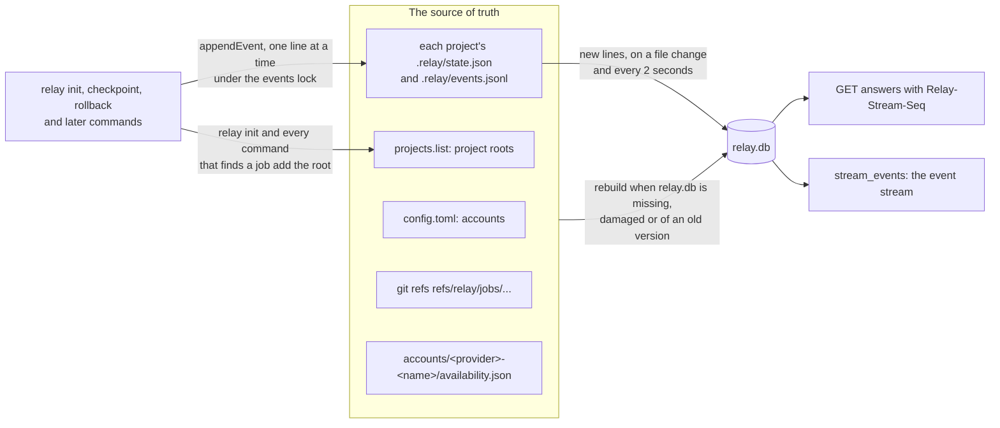
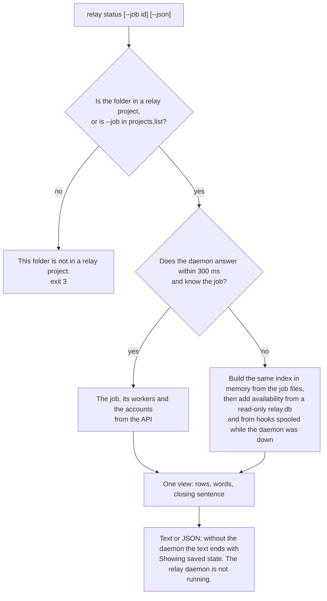

# The relay daemon

The daemon is relay's background service. It is one process per user and relay folder. It
answers relay's own commands, and later the Mac app, through a small HTTP API on a private Unix
socket (a special file that only programs on the same computer can connect to). It never opens a
network port. The behaviour comes from the OpenSpec change `add-daemon-api-and-status`
(`openspec/changes/add-daemon-api-and-status/`).

The daemon starts, stops, keeps to one copy per relay folder, checks every connection, keeps an
index of jobs, workers, checkpoints and accounts in SQLite, follows the job files as commands
change them, answers the read endpoints and the live event stream that `docs/api.md` describes,
and receives the agents' hook events (`docs/hooks.md`, "How hook events reach the daemon"). It also
saves checkpoints and switches jobs when a client asks, with the same engines as `relay
checkpoint` and `relay switch`, and runs the agents that such a switch starts. `relay run` and
`relay switch` start it when it is not running.

## Where its files are

```
~/.relay/                        the relay folder (RELAY_HOME), mode 0700
  run/                           the runtime directory, mode 0700
    relay.sock                   the API socket, mode 0600
    daemon.lock                  locked by the running daemon for its whole life
    daemon.pid                   {"pid","started_at","version","socket"} of the running daemon
  relay.db, relay.db-wal, relay.db-shm   the index (a cache), mode 0600
  projects.list                  the known project roots, one per line
  locks/<job>.events.lock        held for the moment one event is appended to a job's log
  spool/hooks.jsonl              hook events written while the daemon did not answer, mode 0600
  spool/hooks.<pid>.draining     the spool while a starting daemon reads it
  logs/daemon.log                the daemon's log, JSON lines, 10 MB x 5 files
  logs/daemon.stderr.log         what the detached daemon prints, such as a crash trace
  logs/workers/<job>-<worker>.log   the output of an agent the daemon started
```

On Linux, when `RELAY_HOME` is not set and `XDG_RUNTIME_DIR` is, the runtime directory is
`$XDG_RUNTIME_DIR/relay/` instead of `~/.relay/run/`, because that folder belongs to the user's
login session. Setting `RELAY_HOME` always keeps every file inside it. The daemon creates its
files with the umask `077`, so no other user can read them.

## The commands

`relay daemon start` starts the daemon in the background and waits up to 3 seconds for it to
answer:

```
$ relay daemon start
relay daemon started (pid 4121)
$ relay daemon start
relay daemon is already running (pid 4121)
```

The daemon runs in its own session with standard input from `/dev/null`, so closing the terminal
does not stop it. If it does not answer within 3 seconds, the command prints `relay could not
start its background service. Details are in ~/.relay/logs/daemon.log.` (with the real path) and
exits with code 10. When the new daemon exits because another process holds the daemon lock, and
that process does not answer either, the command prints the same `relay daemon (pid 4121) is not
responding. Stop it with: kill 4121` as `relay daemon stop` and exits 1. When the running daemon
is another version than the command, the command says so once and suggests `relay daemon
restart`.

`relay daemon status` shows the running daemon and exits 0, or prints `relay daemon is not
running` and exits 10:

```
$ relay daemon status
Running   pid 4121 · version 0.1.0 · started 14:02
Socket    ~/.relay/run/relay.sock
Log       ~/.relay/logs/daemon.log
```

`relay daemon stop` asks the daemon to stop with `SIGTERM` and waits until it has finished, for
up to 40 seconds:

```
$ relay daemon stop
relay daemon stopped
```

When the daemon runs agents that it started itself, through a switch that a client asked for,
stopping it stops them too, so the command refuses and names them:

```
$ relay daemon stop
relay daemon is running 1 agent (codex:personal on job 3f9a2c1d). Stopping the daemon stops it too. Run relay daemon stop --force to continue.
$ relay daemon stop --force
relay daemon stopped
```

With `--force`, the daemon stops each such agent the way `relay run` does on `SIGTERM`, waits up
to 30 seconds for it to end, and records a `worker_ended` event with `end_reason`
`relay_stopped` in the job's `.relay/events.jsonl`. Agents that run under `relay run` in a
terminal belong to that command, so they never make `relay daemon stop` refuse.

It prints `relay daemon is not running` and exits 0 when there is nothing to stop. It sends the
signal only to a process that both `daemon.pid` and the daemon's own answer name, so it never
stops an unrelated process that reuses an old process ID. On Linux it also checks, just before the
signal, that this process holds the daemon lock; otherwise it prints `relay found that pid <pid>
holds the daemon lock, not the daemon that answered (pid <pid>). relay sent no signal.` and
exits 1. On macOS relay cannot name the process that holds a lock, so it only checks that the lock
is still held. A small race remains there: if the daemon exits and a new process gets its process ID
in the few microseconds between that check and the signal, the new process receives `SIGTERM`.
When the pid file names another process, it prints `relay found a pid file that does not match the running daemon. Run relay
daemon status.` and exits 1. When a process holds the daemon lock but does not answer within one
second, it sends nothing and prints `relay daemon (pid 4121) is not responding. Stop it with:
kill 4121`, so you can decide.

`relay daemon restart` runs `stop`, then `start`, and passes `--force` on to `stop`.

`relay daemon run` runs the daemon in the foreground of the terminal, which helps when you want
to watch it. Control-C stops it cleanly. It prints nothing while it runs; its log is in
`logs/daemon.log`.

## One daemon per relay folder



The diagram shows how the daemon starts and stops. The lock on `daemon.lock` decides which
daemon runs: the operating system gives it to one process only and takes it back when that
process ends, even after a crash or `kill -9`. Two daemons started at the same moment therefore
end with exactly one running, and the other exits with code 0. Because only the lock holder
touches the socket and the pid file, a new daemon can safely remove the ones a crashed daemon
left behind. When it stops, the daemon first refuses new connections, so a client that connects
then gets "connection refused", and lets a checkpoint or switch that is running finish and answer:
a git command is never cut off. `relay daemon status` and `relay daemon stop` use the same lock to tell whether a
daemon is alive, so they never trust a pid file alone. They never take the lock on Linux: they
read `/proc/locks`, which lists each lock with the process that holds it, and check that this
process has `daemon.lock` open. macOS has no such list, so there they take the lock for an instant
and release it. A daemon that starts at that instant waits up to 200 ms for the lock before it
decides that another daemon runs.

## How a request reaches the daemon

```mermaid
flowchart LR
  client["relay command<br/>(src/client/)"] --> check{"Before connecting: is the runtime<br/>directory private, and relay.sock a socket<br/>owned by you, not a symbolic link?"}
  check -- no --> untrusted["relay will not use ...<br/>exit 1, no connection"]
  check -- yes -->|"connect to relay.sock"| dir["Runtime directory, mode 0700:<br/>other users cannot even reach the socket"]
  dir --> peer{"Kernel peer check:<br/>is the connecting user the daemon's user?"}
  peer -- "no, or unknown" --> drop["Close the connection without<br/>reading or answering, log peer_rejected"]
  peer -- yes --> http{"HTTP/1.1 limits:<br/>GET or POST, head up to 16 KiB,<br/>body up to 64 KiB with Content-Length,<br/>everything within 10 seconds"}
  http -- "no" --> refusal["400, 405, 411, 413 or 431,<br/>or closed when too slow"]
  http -- yes --> router{"Router: no Origin header,<br/>path under /v1/"}
  router -- "Origin header" --> web["403 origin_not_allowed"]
  router -- "/v2/ or later" --> version["404 unsupported_version"]
  router -- yes --> answer["The endpoint's JSON answer,<br/>then the connection closes"]
```

The diagram shows the checks between a client and an answer. The first is made by the client:
every request from relay goes through one function in `src/client/api-client.ts`, which refuses
to connect when another user could have placed the socket. The next two come from the operating
system. The runtime directory has mode 0700, so another user cannot open the socket at
all. For every connection that does get through, the daemon asks the kernel which user is on the
other end (`getpeereid` on macOS, `SO_PEERCRED` on Linux) and closes the connection at once when
that is not its own user, or when the kernel gives no answer. The next checks keep the HTTP layer
small: one request per connection, fixed size and time limits, and only the two methods relay
uses. A request that carries an `Origin` header comes from a web page and is refused, although
browsers cannot open Unix sockets today. Every answer carries `Connection: close`, and error
answers have the body `{"error": {"code": "...", "message": "..."}}`. Extra fields go inside the
error object, next to `code` and `message`: a request for `/v2/` gets `{"error": {"code":
"unsupported_version", "message": "This relay daemon speaks v1.", "supported": ["v1"]}}`.

The daemon has no TCP or UDP listener of any kind. A test (`test/build/no-network.test.ts`)
fails when any file under `src/` could open a network connection, except `src/client/`, which
may only connect to relay's socket, `src/api/server.ts`, which may only listen on it, and the two
T3 Code files that talk to T3 Code on this computer (`docs/codebase-map.md` names them).

`relay daemon start`, `status` and `stop` check the runtime directory too before they trust the
lock, the pid file or the socket in it. When the directory is not private, they print `relay will
not use <dir>: it must be private (mode 0700, owned by you). Fix it with: chmod 700 <dir>` and
exit 1, because another user could have placed those files there. When `relay.sock` is not a
socket owned by you, for example a symbolic link, they print `relay will not use <socket>: it is
not a socket owned by you.` and exit 1.

You can talk to the daemon yourself with `curl`:

```
$ curl -s --unix-socket ~/.relay/run/relay.sock http://relay/v1/version
{"api":"v1","daemon_version":"0.1.0","pid":4121,"started_at":"2026-10-08T12:02:11.402Z","schema_version":1,"stream_epoch":"9c41d0e2a7b35f18","capabilities":["accounts","jobs","events.sse","jobs.checkpoint","jobs.switch","hooks"],"agents_running":[]}
```

`capabilities` lists the groups of endpoints the daemon offers. Clients check it, not the version
number, before they use an endpoint. `docs/api.md` describes every endpoint.

## Starting on demand



The diagram shows how the commands that start agents make sure the daemon runs, so the agent's
hooks have a receiver. The daemon they start is not their child in any way that matters: it leads
its own session, so it keeps running after the command and the terminal end. When it cannot start,
for example because the runtime directory is not private, the command says so and goes on: `relay
run` and `relay switch` work without the daemon, and the hooks then write to the spool, which the
daemon reads when it next starts. `relay status` never starts the daemon. Under the test preload
(`RELAY_TEST=1`), the commands start a daemon only when a test asks for one with
`RELAY_TEST_START_DAEMON=1`, so the many tests of `relay run` and `relay switch` leave no daemon
behind.

## Checkpoints and switches through the daemon



The diagram shows what happens to a checkpoint or switch request. Both use the engines of the
command-line tool, through `src/daemon/engines.ts`, so the daemon has no second implementation of
either. A request names only the job, a message, an account and `confirm_new_provider`; the project
folder always comes from the index, and the daemon checks that the folder is still the job's
repository before an engine runs. The daemon runs one operation per job at a time, and the engines
take the job lock as in a terminal, so a `relay checkpoint` or `relay switch` running at the same
moment makes the request fail with `409 operation_in_progress` too.

A switch through the daemon is `relay switch` without a terminal. Every question the switch would
ask in a terminal is refused before anything is stopped, except one: the first handoff to an
account that is not on the project's allow list, which the client answers with
`confirm_new_provider: true` after it showed the person the question. relay records that answer
with `"how": "api"`. Jobs whose agents run in the person's terminal get
`409 interactive_start_required`, because the daemon has no terminal to start the next agent in.
When a `relay run` in a terminal holds the job's agent, the daemon hands the switch to it, and the
next agent runs under that command. Otherwise the daemon runs the switch, and the next agent runs
headless under the daemon: it is listed in `agents_running`, its output goes to
`logs/workers/<job>-<worker>.log`, `relay switch` from a terminal hands later switches to the
daemon the same way, and `relay daemon stop` refuses without `--force` while it runs.

## The index and how it stays current



The diagram shows where the index comes from. `relay.db` is only a cache: everything in it can be
rebuilt from `config.toml`, `projects.list`, each project's `.relay/` files and the checkpoint refs
in git. When the daemon starts and the file is missing, it builds a new one. When the file is
damaged, the daemon renames it to `relay.db.broken-<time>` first; when it has an older schema
version, the daemon deletes it. The log then says `Rebuilt the index from <n> projects.`

While it runs, the daemon watches each job's `events.jsonl` and also checks it every 2 seconds.
It reads only the complete lines added since its last read, so a line still being written waits
for the next check, and a line that is not valid JSON is skipped and logged as
`invalid_event_line`. When the file shrank or was replaced by another file, the daemon rebuilds
that job from scratch (`job_rebuilt` in the log). When the file is gone, because the project
folder was deleted or moved, the daemon marks the project missing (`project_missing` in the log):
the job stays in the index with `project_missing` set to `true` until its files are back. The
same check picks up roots added to
`projects.list`, and finds workers whose process ended without a recorded end, which the event
stream then reports once as `stopped`. Every change to the index is written, in the same
transaction, as a row of the event stream, so the `Relay-Stream-Seq` header of a `GET` answer and
the event `id`s describe the same history. A line of `events.jsonl` whose `type` is not 1 to 64
lowercase letters and underscores is treated as a line that is not an event, because the type is
written into the event stream's `event:` line.

Several relay processes may append to a job's `events.jsonl` at the same moment: the command in
the terminal and, later, the daemon. Each append holds an `flock` lock on
`locks/<job>.events.lock` while it reads the last event `id` and writes the next line, so `id`s
stay in order and lines never mix. The kernel releases the lock when its holder dies.

`relay doctor --reindex` forces a rebuild. It stops the daemon (as `relay daemon stop` does),
deletes `relay.db` and its write-ahead log files, starts the daemon again, and prints:

```
$ relay doctor --reindex
Rebuilt the index from .relay/ files in 2 projects.
```

Nothing about a job is lost, because nothing lives only in the index. If the daemon cannot start
again, the command prints the same message as `relay daemon start` and exits with code 10.

## relay status

`relay status` is the everyday view of a job. Run it anywhere in a project, or pass
`--job <id>` from any folder. It prints the job, one lane per account and a closing sentence:

```
$ relay status
Build authentication   job 3f9a2c1d · checkpoint 912ec1 · 2 min ago

claude:work      ────────────┐      limit reached · reset unknown
                             │
codex:personal   ━━━━━━━━━━━━┷━━━   running · usage unknown
claude:home      ────────────────   available · 9% used (5-hour window, checked 14:30)

Continuing on Codex.
```

The first row is the account the job left, the step line joins it to the account the job moved
to, and every other configured account follows in alphabetical order. Each row says what the
account can do in one word (`running`, `stopped`, `available`, `limit reached`, `out of quota`,
`unavailable` or `unknown`), then the reset time or the usage relay measured, window by window.
relay never adds up usage across accounts, and it says `not measured` or `reset unknown` when it
does not know. On a terminal the current row is bold and limited rows are dim; piped output has no
escape codes. `relay status --json` prints the same view as one JSON object
(`"schema": "relay.status/v1"`).



The diagram shows where `relay status` gets its data. It never starts the daemon. When the daemon
answers, the view comes from the API. When it does not, relay reads the same files the daemon
would, with the same code, so the answer is the same apart from the `daemon` field and the time it
was made, and the text adds the line `Showing saved state. The relay daemon is not running.` When
the daemon answers but has not read a newly set-up project yet (it checks `projects.list` every 2
seconds), the line is `Showing saved state. The relay daemon has not read this project yet.` In
JSON, `saved_state` is `true` in both cases.
Outside a project, without `--job`, the command prints `This folder is not in a relay project. Run
relay init here, or pass --job <id>.` and exits with code 3.

## Reading the log

Each line of `logs/daemon.log` is one JSON object with `ts`, `level`, `msg`, `pid`,
`invocation`, `version` and the fields of the event. The level is chosen as for the other logs
(`docs/cli.md`, "Levels"): `--log-level`, then `RELAY_LOG_LEVEL`, then `log.level` in
`config.toml`, then `info`. At `debug`, every request is logged with its method, path, status and
duration. Before a write would take the file past 10 MB, relay renames it to `daemon.log.1`,
shifts the older files up to `daemon.log.5` and deletes the oldest.

```
$ tail -n 3 ~/.relay/logs/daemon.log
$ jq -c 'select(.level == "warn" or .level == "error")' ~/.relay/logs/daemon.log
```

The main messages are `daemon_started` (with `socket` and `schema_version`), `daemon_stopping`
(with the `signal`), `daemon_stopped`, `daemon_refused` (with the `reason` printed on standard
error), `peer_rejected` (a warning with the connecting `uid`), `Rebuilt the index from <n>
projects.`, `job_rebuilt`, `project_indexed`, `invalid_event_line`, `config_reloaded` (after a
`SIGHUP`, which makes the daemon read the accounts in `config.toml` again),
`operation_still_running` (a checkpoint or switch still runs 30 seconds after a stop signal) and
`worker_still_running` (an agent did not end within 30 seconds of the stop). The log never holds environment
variables, request bodies or headers, or hook fields outside the hook allow list.

## The security limit

The socket keeps out web pages and other users, but not programs that run as you. Any program
running under your user account can connect to the socket and use the API, just as it can read
your files. Such a program can also ask for a checkpoint or a switch, and can answer the question
about a new account with `confirm_new_provider`, just as it could run `relay switch --yes`; relay
records that answer as given through the API. No local API can protect against such a program, so do not run software you do not
trust under your account (`docs/research/security.md`, section 1).
