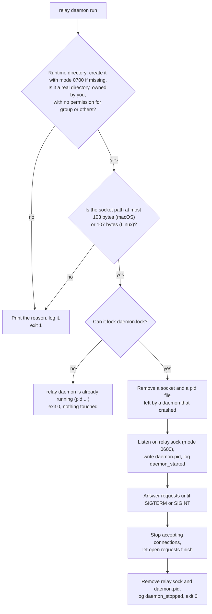
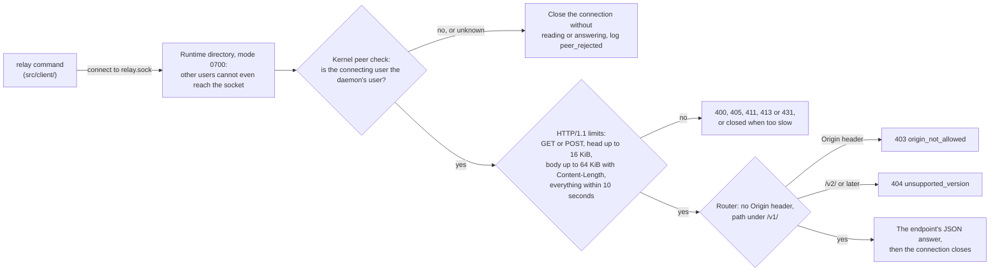

# The relay daemon

The daemon is relay's background service. It is one process per user and relay folder. It
answers relay's own commands, and later the Mac app, through a small HTTP API on a private Unix
socket (a special file that only programs on the same computer can connect to). It never opens a
network port. The behaviour comes from the OpenSpec change `add-daemon-api-and-status`
(`openspec/changes/add-daemon-api-and-status/`).

Today the daemon starts, stops, keeps to one copy per relay folder, checks every connection, and
answers `GET /v1/version`. The later task groups of the change add the index of jobs and
accounts, the other endpoints, the event stream and the hook events, and each one extends this
page. `docs/api.md` will describe every endpoint.

## Where its files are

```
~/.relay/                        the relay folder (RELAY_HOME), mode 0700
  run/                           the runtime directory, mode 0700
    relay.sock                   the API socket, mode 0600
    daemon.lock                  locked by the running daemon for its whole life
    daemon.pid                   {"pid","started_at","version","socket"} of the running daemon
  logs/daemon.log                the daemon's log, JSON lines, 10 MB x 5 files
  logs/daemon.stderr.log         what the detached daemon prints, such as a crash trace
```

On Linux, when `RELAY_HOME` is not set and `XDG_RUNTIME_DIR` is, the runtime directory is
`$XDG_RUNTIME_DIR/relay/` instead of `~/.relay/run/`, because that folder belongs to the user's
login session. Setting `RELAY_HOME` always keeps every file inside it. The daemon creates its
files with the umask `077`, so no other user can read them.

## The commands

`relay daemon start` starts the daemon in the background and waits up to 3 seconds for it to
answer:

```
$ relay daemon start
relay daemon started (pid 4121)
$ relay daemon start
relay daemon is already running (pid 4121)
```

The daemon runs in its own session with standard input from `/dev/null`, so closing the terminal
does not stop it. If it does not answer within 3 seconds, the command prints `relay could not
start its background service. Details are in ~/.relay/logs/daemon.log.` (with the real path) and
exits with code 10. When the running daemon is another version than the command, the command says
so once and suggests `relay daemon restart`.

`relay daemon status` shows the running daemon and exits 0, or prints `relay daemon is not
running` and exits 10:

```
$ relay daemon status
Running   pid 4121 · version 0.1.0 · started 14:02
Socket    ~/.relay/run/relay.sock
Log       ~/.relay/logs/daemon.log
```

`relay daemon stop` asks the daemon to stop with `SIGTERM` and waits until it has finished, for
up to 40 seconds:

```
$ relay daemon stop
relay daemon stopped
```

It prints `relay daemon is not running` and exits 0 when there is nothing to stop. It sends the
signal only to a process that both `daemon.pid` and the daemon's own answer name, so it never
stops an unrelated process that reuses an old process ID. When the pid file names another
process, it prints `relay found a pid file that does not match the running daemon. Run relay
daemon status.` and exits 1. When a process holds the daemon lock but does not answer within one
second, it sends nothing and prints `relay daemon (pid 4121) is not responding. Stop it with:
kill 4121`, so you can decide.

`relay daemon restart` runs `stop`, then `start`.

`relay daemon run` runs the daemon in the foreground of the terminal, which helps when you want
to watch it. Control-C stops it cleanly. It prints nothing while it runs; its log is in
`logs/daemon.log`.

## One daemon per relay folder



The diagram shows how the daemon starts and stops. The lock on `daemon.lock` decides which
daemon runs: the operating system gives it to one process only and takes it back when that
process ends, even after a crash or `kill -9`. Two daemons started at the same moment therefore
end with exactly one running, and the other exits with code 0. Because only the lock holder
touches the socket and the pid file, a new daemon can safely remove the ones a crashed daemon
left behind. `relay daemon status` and `relay daemon stop` use the same lock to tell whether a
daemon is alive, so they never trust a pid file alone.

## How a request reaches the daemon



The diagram shows the checks between a client and an answer. The first two come from the
operating system. The runtime directory has mode 0700, so another user cannot open the socket at
all. For every connection that does get through, the daemon asks the kernel which user is on the
other end (`getpeereid` on macOS, `SO_PEERCRED` on Linux) and closes the connection at once when
that is not its own user, or when the kernel gives no answer. The next checks keep the HTTP layer
small: one request per connection, fixed size and time limits, and only the two methods relay
uses. A request that carries an `Origin` header comes from a web page and is refused, although
browsers cannot open Unix sockets today. Every answer carries `Connection: close`, and error
answers have the body `{"error": {"code": "...", "message": "..."}}`.

The daemon has no TCP or UDP listener of any kind. A test (`test/build/no-network.test.ts`)
fails when any file under `src/` could open a network connection, except `src/client/`, which
may only connect to relay's socket, `src/api/server.ts`, which may only listen on it, and the two
T3 Code files that talk to T3 Code on this computer (`docs/codebase-map.md` names them).

`relay daemon status` and `relay daemon stop` check the runtime directory too before they trust
the lock, the pid file or the socket in it. When the directory is not private, they print `relay
will not use <dir>: it must be private (mode 0700, owned by you). Fix it with: chmod 700 <dir>`
and exit 1, because another user could have placed those files there.

You can talk to the daemon yourself with `curl`:

```
$ curl -s --unix-socket ~/.relay/run/relay.sock http://relay/v1/version
{"api":"v1","daemon_version":"0.1.0","pid":4121,"started_at":"2026-10-08T12:02:11.402Z","schema_version":1,"capabilities":[],"agents_running":[]}
```

`capabilities` lists the groups of endpoints the daemon offers. Clients check it, not the version
number, before they use an endpoint. It is empty until the later task groups add endpoints.

## Reading the log

Each line of `logs/daemon.log` is one JSON object with `ts`, `level`, `msg`, `pid`,
`invocation`, `version` and the fields of the event. The level is chosen as for the other logs
(`docs/cli.md`, "Levels"): `--log-level`, then `RELAY_LOG_LEVEL`, then `log.level` in
`config.toml`, then `info`. At `debug`, every request is logged with its method, path, status and
duration. Before a write would take the file past 10 MB, relay renames it to `daemon.log.1`,
shifts the older files up to `daemon.log.5` and deletes the oldest.

```
$ tail -n 3 ~/.relay/logs/daemon.log
$ jq -c 'select(.level == "warn" or .level == "error")' ~/.relay/logs/daemon.log
```

The main messages are `daemon_started` (with `socket` and `schema_version`), `daemon_stopping`
(with the `signal`), `daemon_stopped`, `daemon_refused` (with the `reason` printed on standard
error) and `peer_rejected` (a warning with the connecting `uid`). The log never holds environment
variables, request bodies or headers, or hook fields outside the hook allow list.

## The security limit

The socket keeps out web pages and other users, but not programs that run as you. Any program
running under your user account can connect to the socket and use the API, just as it can read
your files. No local API can protect against such a program, so do not run software you do not
trust under your account (`docs/research/security.md`, section 1).
