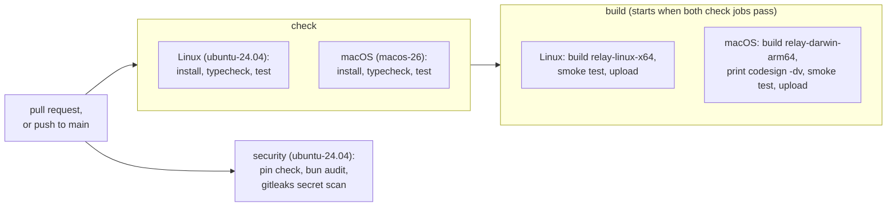

# Developing relay

This page explains how to install relay's tools, run its checks, build the `relay` program and
test the build. It also describes the fake provider that the tests use, and the checks that
GitHub runs on every pull request.

## Where to build

Edit the code wherever you like, but install, test and build on a Linux x64 machine (for this
project, the Omarchy machine). The Mac used for this project has almost no free disk: the
dependencies take room, and the built programs are large. With Bun 1.4.2, `relay-linux-x64` is
78 MB (81,376,736 bytes), and `relay-darwin-arm64` is 60 MB (62,276,466 bytes) when it is built on
the Omarchy machine with `bun run build:darwin-arm64`. The macOS program that people run is built
by continuous integration (CI) on a GitHub macOS runner instead, as described below.

## Build and test on Linux

Run these commands in order. They need git and Bun 1.4.2.

1. Check the Bun version. It must print `1.4.2`.

   ```sh
   bun --version
   ```

   If it prints anything else, install Bun 1.4.2 with its official installer:
   `curl -fsSL https://bun.com/install | bash -s "bun-v1.4.2"`.

2. Get the code and install the dependencies exactly as `bun.lock` lists them.

   ```sh
   git clone https://github.com/FrejusGdm/relay.git
   cd relay
   bun install --frozen-lockfile
   ```

3. Check the types and run the tests.

   ```sh
   bun run typecheck
   bun test
   ```

4. Build the Linux program and test it.

   ```sh
   bun run build:linux-x64
   sh scripts/smoke-test.sh dist/relay-linux-x64 0.1.0
   ```

   The build writes `dist/relay-linux-x64`, a program that runs without Bun installed, and its
   source map. The smoke test prints `Smoke test passed: dist/relay-linux-x64` when the program
   prints the right version and its help, ignores a `.env` file in the folder where it runs, exits
   with code 69 from `relay status` (a command that is not built yet), and writes its log file.
   The smoke test uses a new temporary relay folder, so it never touches `~/.relay`.

5. Delete the build to free the disk. Git ignores `dist/`.

   ```sh
   rm -rf dist
   ```

To run relay from the source instead of a build, use `bun run relay`, for example
`bun run relay --help`.

## The fake provider

Tests never start the real Claude Code or Codex. `bun test` first loads `test/setup.ts`, which
gives every test run its own temporary home folder and relay folder, removes credential variables
such as `ANTHROPIC_API_KEY` from the environment, and puts the guard programs in
`test/fixtures/fake-provider/guard-bin/` first on `PATH`. A test that starts `claude` or `codex` by
mistake reaches a guard program, which fails it with exit code 97. Tests that need an agent run
`test/fixtures/fake-provider/fake-agent.ts`, which follows a scenario file.
`test/fixtures/fake-provider/README.md` describes the scenario format.

The guard program `guard-bin/git` also stops every git process that is not started by a git
runner. A runner marks its git processes with `RELAY_GIT_RUNNER=1`, and the guard lets only those
through. relay's runner is `src/git/run.ts`, and the test helpers that build scratch repositories
set the variable themselves. `bunfig.toml` sets the whole repository as the test root, so a plain
`bun test` also runs the website's file tests in `site/test/` and the evaluation harness's tests in
`eval/handoff/test/`, all under the same preload. The harness is a separate program with its own
git runner, `eval/handoff/src/git.ts`, which sets the variable in the same way. The harness's tests
start git only through that runner. `test/git/only-runner.test.ts` reads `src/`, `test/` and
`eval/` and fails if any other file names the variable, so the exception is limited to that one
file. The check that only `src/git/run.ts` starts git inside `src/` is unchanged.

`test/build/no-network.test.ts` fails when code under `src/` could open a network connection,
because relay opens none. It parses each file with the TypeScript compiler, so comments and the
text inside strings never count. It looks for the name `fetch`, imports of the modules `net`,
`http`, `https`, `http2`, `dgram` and `tls` (with or without the `node:` prefix), `Bun.connect`,
`Bun.listen`, `Bun.serve`, `Bun.udpSocket`, `XMLHttpRequest`, `EventSource` and `WebSocket`. The
future `src/client/` folder, which reaches relay's own Unix socket, may only call `fetch` and
`Bun.connect` with an object argument that has a `unix` property.

`test/checkpoint/e2e.test.ts` builds the program with the `build:<system>-<processor>` script
of `package.json` for the machine it runs on, writes it to a temporary folder, and runs it as a
separate process on a scratch repository: `relay init`, a checkpoint, the list, a refused change
to `core.fsmonitor`, a rollback and its undo. With `RELAY_TEST_GIT_LOG=1`, the program writes
every git command it runs to `$RELAY_HOME/logs/git-calls.jsonl`; the test checks that each one
starts with relay's settings, is a command the runner allows, and never contacts a remote. It
needs git and gitleaks on `PATH`, like the other checkpoint tests.

## Continuous integration

GitHub runs `.github/workflows/ci.yml` on every pull request and every push to `main`. A new
push to a pull request cancels the run that is still going for the same pull request. A run for
`main` is never cancelled, so every merge is checked.



The diagram shows the five jobs. The two `check` jobs install the dependencies from `bun.lock`,
check the types and run the tests, one on Linux and one on macOS. When both pass, the two `build`
jobs build the program for their own system, run the smoke test on it, and keep it as a download
for 7 days. The macOS build job also prints `codesign -dv` as a record of the signature that the
build gave the program. The `security` job runs at the same time as the others. It checks that
every action in the workflows is pinned to a full commit SHA, runs `bun audit` on the
dependencies, and scans the whole git history for secrets with gitleaks 8.30.1, which it
downloads and checks against its published SHA-256 checksum. Any failing step fails the run.

The repository has no `.gitleaksignore` today: the history holds no finding to ignore. If gitleaks
ever reports something that is not a secret, add a `.gitleaksignore` line for it (its commit,
file, rule and line), and only for a finding you have checked by hand. A real secret must be
revoked instead, because the history cannot be changed.

In a private repository, GitHub counts each minute on a macOS runner as ten minutes on a Linux
runner, so the macOS jobs only install, test, build and run the smoke test. Slower checks belong
in the Linux jobs.

Every `uses:` line in a workflow names a full 40-character commit SHA followed by a `# vX.Y.Z`
comment. Run the same check as CI before you push; it prints nothing when every action is pinned:

```sh
grep -rnE '^\s*(-\s*)?uses:' .github/workflows | grep -vE 'uses: [^@ ]+@[0-9a-f]{40} # v[0-9]'
```

To find the commit of an action's tag, run `gh api repos/<owner>/<repo>/git/ref/tags/<tag>`. When
the result has `"type": "tag"`, the tag is annotated: run
`gh api repos/<owner>/<repo>/git/tags/<sha>` with that SHA to get the commit. Dependabot
(`.github/dependabot.yml`) checks the actions and the Bun dependencies every week and opens pull
requests that update the SHA and the version comment together.

### Known limits of the security checks

These checks catch mistakes, but someone who wants to get past them can. A reviewer has to read
every change to `.github/` and `.gitleaksignore` by hand.

- The pin check reads only `uses:` lines written in the usual block style. A step written in the
  flow style, such as `- { uses: actions/checkout@v7 }`, is not checked.
- The pin check only checks that a SHA has 40 hexadecimal characters. GitHub also accepts the SHA of
  a commit that exists only in a fork of the action's repository, so a pinned SHA can still point
  to code that the action's owners never published. Look up every new SHA with `gh api`, as
  described above, before you accept it.
- A pull request can add lines to `.gitleaksignore`. The secret scan then skips the findings that
  those lines name, including a real secret that the same pull request adds.

## Try the macOS program

The macOS program is 60 MB. To run it once on a Mac with Apple silicon, download it from a CI
run and delete it afterwards:

```sh
gh run download <run id> -n relay-darwin-arm64 -D /tmp/relay
chmod +x /tmp/relay/relay-darwin-arm64
/tmp/relay/relay-darwin-arm64 --version
rm -rf /tmp/relay
```
