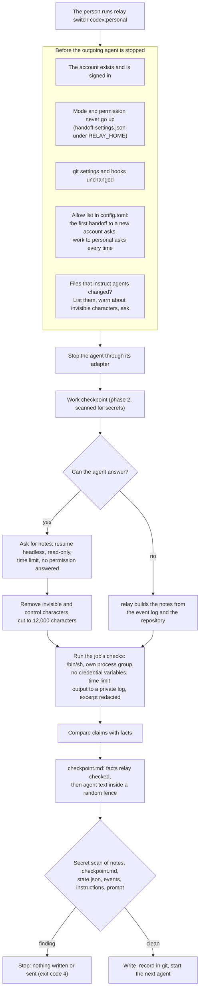

# The handoff

A handoff moves a job from the agent working on it to another agent or another account, with
`relay switch <provider[:account]>`. relay stops the current agent, saves a checkpoint of its work,
gets handoff notes, runs the job's checks, writes `.relay/checkpoint.md`, scans everything it is
about to write or send for secrets, records the handoff in git, and starts the next agent with a
short prompt that tells it to check the previous agent's claims before it continues. The change
`add-relay-switch` (phase 4 of `docs/ROADMAP.md`) specifies it; this page describes the parts that
are built so far.

## What is built so far

Task groups 1 to 4 of `add-relay-switch` are built: the account argument, the job's handoff
settings, the `[handoff]` settings, the checks and their count parsers, the notes request and the
reading of the notes, the facts relay builds itself, the comparison of claims with facts,
`checkpoint.md`, `.relay/verify.md`, the secret scan, the files that instruct agents, the mode and
permission rules, and the allow list. The switch engine that joins them (group 5), the commands
(group 6) and the end-to-end tests (group 7) come next.

Three tasks wait for `relay run` and `src/run/instructions.ts` from task group 9 of
`add-provider-adapters`: 1.5 (checking the adapter features this change relies on), 2.3 (`--check` on
`relay run`) and 3.5 (the start and continuation prompts).

## Differences from the earlier changes

Task 1.1 compared the names this change uses with the code that phases 1 to 3 built. No name had to
change in the design or the specs. These are the differences:

- The real Claude Code and Codex adapters cannot start workers yet (task groups 7 and 8 of
  `add-provider-adapters`), and `relay run`, the worker records and `src/run/instructions.ts` do not
  exist yet (task group 9). The tests of this change use phase 3's in-process fake adapter and the
  fake programs. The test that scans the argument lists of the real adapters for permission-bypass
  flags (task 4.3) waits for those groups.
- In phase 3's in-process fake adapter, and in Claude Code's headless mode, a permission request
  shows up as a `permission_denied` event rather than `approval_needed`. The notes request treats
  both as the agent asking for permission.
- Phase 2's `scanTexts` ends the message of a scan that cannot finish with "Nothing was saved.".
  The handoff scan says "Nothing was written or sent." instead, as design decision 14 requires.
- Phase 2's list of invisible characters in `src/text/invisible.ts` also holds U+061C, U+2028 and
  U+2029, which design decision 17 does not name. The handoff uses the list as it is. After the
  review of this change, the list also holds the variation selectors U+FE00 to U+FE0F, in the code
  and in the designs.
- Design decision 7 builds the notes from the event log. Agents can write to `.relay/events.jsonl`,
  so after the review relay takes how the worker started and ended, and the reason of its last
  failed turn, from its own record of the worker under `RELAY_HOME` and from what the adapter
  reported, never from the event log. A forged `turn_failed` line therefore cannot make relay skip
  the notes request. The event log is still quoted under "Recent events", inside the fence, with
  every value flattened to one cleaned line, and `readEvents` skips lines whose time, type or data
  is not well formed.
- Phase 3's policy files had no `company` field. This change adds `company` and
  `own_accounts_note`, the sentence printed before the first handoff to another account of the same
  provider.
- Phase 2's errors carry their lines without the `relay: ` prefix, and the command prints them. The
  handoff modules follow the same rule. `relay switch` will add the prefix to every line except the
  hint line: a line that starts with `Run "relay`, and the last line of a secret-scan message
  (`Fix the output of the check, ...`, `Remove the secret from ...` or `Rename the file ...`), which
  the specs show without it.
- The tests that need the real gitleaks follow phase 2's rule: they always run and fail with a clear
  message when gitleaks is missing. Tasks 4.1 and 7.8 say so too.
- When the secret scan finds something in the new `checkpoint.md`, the message also names the part
  of the file (for example `in the commit messages`) and gives a hint for that part, because the
  file was never written and its line number alone helps little.
- Exit code 32 is added to `src/cli/exit-codes.ts` now, because the permission rules use it. Codes
  31 and 33 come with the switch engine.

## What a handoff carries, and the checks on the way

The diagram shows the order of a handoff and where each safety check sits. Every check that can
refuse the switch runs before the outgoing agent is stopped, so a refusal or a "no" leaves the job as
it was. The outgoing agent's notes are text written by an agent: relay cleans them, keeps them only
inside the fence in `checkpoint.md`, and never puts them in the prompt, the instructions or a
command-line argument. Nothing is written into `.relay/` or sent to the next agent until the secret
scan has passed; a finding stops the handoff and names the part and the line, never the secret. The
last box is the switch engine of task group 5.

## What the next agent receives

The handoff gives context tiers 0 and 1 only: the repository and the diff since the job started,
`.relay/task.md` with the goal, acceptance criteria and plan, `.relay/decisions.md`, the notes, the
check results with their exact commands, the claims to verify, and the newest 20 relevant events.
relay never reads a provider transcript or any file in an account's profile folder.

`.relay/checkpoint.md` has two parts. "Facts relay checked" is written in relay's own words: the
checks relay ran, the differences it found between the notes and the repository, the changes since
the job started, and, when the agent did not write notes, a section relay built from the event log
and the repository. "Recorded activity and agent-written text" holds everything agents wrote or
their code printed, between two fence lines such as `<<<relay-untrusted-notes-5b9e04c1` and
`relay-untrusted-notes-5b9e04c1>>>`. The marker is 8 random hexadecimal characters that the text
does not contain, so the text cannot close the fence. Every notes line that starts with `#` (after
up to three spaces) gets one more `#`, and a line of only `=` or `-` gets a backslash in front, so an
agent's heading never looks like one of relay's.

The files that instruct agents are matched in any case (`claude.md` counts as `CLAUDE.md`), because
a Mac's file system ignores case. When one of them is a symbolic link, relay also compares the file
it points to, and checks that file's text for invisible characters.

## The notes

relay asks the outgoing agent for notes only when notes are not turned off, its session ID is known,
its adapter can resume a session, and neither its last failure nor its account shows a usage limit,
rate limit, sign-in or billing problem. Otherwise it records the first reason and builds the notes
itself. The request resumes the agent's session headless at `read-only`, on its own account, and
waits at most `handoff.summary_timeout_seconds`. If the agent asks for a permission, relay does not
answer it, stops the agent and builds the notes itself. Asking costs a little usage on the outgoing
account; `--no-summary` or `handoff.ask_for_summary = false` turns it off.

The notes use seven sections: Done, In progress, Next steps, Decisions, Files touched, Claims to
verify and Problems. relay compares them with facts by three rules: a claim that one of the job's
checks passes or fails, against relay's own result; a path under Files touched that did not change
while the agent worked; and a path in Done or Claims to verify that does not exist in the work
checkpoint. Each difference is a sentence relay writes, such as
``The notes say `bun test` passes. relay ran it: 231 passed, 1 failed (exit code 1).``

## Checks

The person records a job's check commands with `--check`, only from a terminal; they live in
`RELAY_HOME/jobs/<job>/handoff-settings.json`, outside the project, because relay runs them outside
any sandbox. At every handoff relay runs each check once, in the worktree root, as
`/bin/sh -c "<command>"`, with standard input at end of file, in a process group of its own, without
provider credential variables or relay's own `RELAY_` variables, and with `RELAY_CHECK=1`, `CI=1`
and `NO_COLOR=1`. A check still
running after `handoff.check_timeout_seconds` gets `SIGTERM`, and `SIGKILL` 5 seconds later, for the
whole group. Its whole output goes to `RELAY_HOME/logs/checks/<job>-h<n>-<i>.log` with mode 0600;
only the last 30 lines of a failed check reach `checkpoint.md`, without escape sequences, control or
invisible characters, and with the values of variables whose names end in `_KEY`, `_TOKEN`,
`_SECRET` or `PASSWORD` replaced by `[redacted: <NAME>]`. relay recognizes the counts that
`bun test`, Vitest, Jest, pytest and `cargo test` print, but the exit code alone decides whether a
check passed. Files the checks change are listed in `checkpoint.md`, never reverted.

## Who may receive a job

A job moves only to accounts on the `allow` list of the project's `[[projects]]` entry in
`config.toml`; a linked worktree uses the entry of its main worktree. The first handoff to another
account asks `This sends the repository and the job notes to OpenAI through the account
codex:personal. Continue? [y/N]`, and a yes adds the account to the list through relay's one writer
of `config.toml`, which keeps every other line. A second account of the same provider first shows
the provider's note on moving work between one's own accounts. A move from an account marked
`kind = "work"` to one marked `personal` asks every time. Without a terminal, relay waits for no
answer and needs `--yes`, which answers only relay's own questions and is recorded as given by the
flag.

## What relay cannot protect against

- A check that starts a program in a new session (for example with `setsid`) leaves relay's process
  group, so relay cannot stop that program when the check ends or times out.
- A file that instructs agents and is a symbolic link to a file outside the project cannot be
  compared with its earlier version, so relay lists it and asks at every handoff.

- A program that runs as the same user can edit `config.toml`, `handoff-settings.json` and every
  other file relay keeps, and so can add an account to the allow list or change the checks.
- `--yes` used by a script, or by an agent with a shell, approves a new account without the person.
  relay records such answers with `"how": "flag"`.
- Checks run code that agents wrote, outside any sandbox, as the person. That is what the person
  would otherwise do by hand; relay only limits their time and their environment.
- The claim rules are simple and miss most false claims; the next agent checks the rest and writes
  the results to `.relay/verify.md`.
