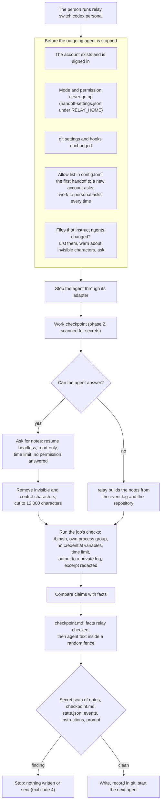
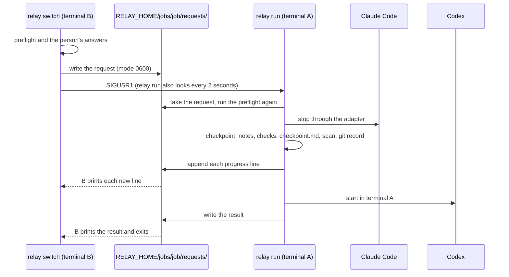

# The handoff

A handoff moves a job from the agent working on it to another agent or another account, with
`relay switch <provider[:account]>`. relay stops the current agent, saves a checkpoint of its work,
gets handoff notes, runs the job's checks, writes `.relay/checkpoint.md`, scans everything it is
about to write or send for secrets, records the handoff in git, and starts the next agent with a
short prompt that tells it to check the previous agent's claims before it continues. The change
`add-relay-switch` (phase 4 of `docs/ROADMAP.md`) specifies it.

## A switch, step by step

`relay switch codex:personal` runs these steps in this order. The first ones change nothing, so a
refusal or a "no" leaves the agent working and every file as it was. From the stop on, a failure
keeps the work checkpoint, puts back the job files relay wrote, appends `handoff_failed`, and says
where the work is saved and what to run next. relay never restarts the agent it stopped.

| Step | What relay does | Line it prints | When it fails |
|---|---|---|---|
| 0 | Cleans up a switch that relay did not finish, for example after a crash | `The last switch to Codex · personal did not finish. relay cleaned it up. ...` | Another switch still runs: exit 6 |
| 1 | Checks the account, the next agent's program and sign-in, the mode and permission, git's settings and hooks, the allow list and the files that instruct agents, and asks its questions | the questions | exit 2, 3, 5, 6, 7, 20 to 25 or 32; nothing changed |
| 2 | Stops the current agent through the `relay run` that holds it | `Stopping Claude Code · work` | exit 33; nothing else changed |
| 3 | Saves the work checkpoint, or uses the latest one when nothing changed | `Saved checkpoint 912ec1` or `Using checkpoint 912ec1 (no changes since it was saved)` | exit 4 for a secret, 5 or 1 |
| 4 | Compares the files that instruct agents again, against the checkpoint | the question again | exit 7; the checkpoint is kept |
| 5 | Asks the outgoing agent for notes, or builds them | `Asking Claude Code for handoff notes`, or why relay built them | never fatal |
| 6 | Counts the rows of `.relay/verify.md` | nothing | never fatal |
| 7 | Runs the job's checks | `Ran bun test · 231 passed, 1 failed` | never fatal |
| 8 | Compares the claims with facts, and builds `checkpoint.md`, the prompt and the events in memory | `Found 1 difference between the notes and the repository` | exit 70 |
| 9 | Scans everything it is about to write or send for secrets | nothing | exit 4, or 1 when the scan cannot finish |
| 10 | Writes `.relay/checkpoint.md` and `.relay/state.json` and removes `.relay/verify.md` | `Wrote .relay/checkpoint.md` | exit 1; the old files come back |
| 11 | Records the handoff in git, under `refs/relay/jobs/<job>/handoffs/<n>` | nothing | exit 1; the ref is deleted and the files come back |
| 12 | Starts the next agent | `Starting Codex · personal`, `Continuing on Codex.` | exit 31; the handoff stays ready |

With `--no-start`, step 12 prepares the handoff instead, and the last lines are `Ready for Codex ·
personal.` and `Run "relay run codex:personal" to start it.` `relay run codex:personal` then starts
the prepared handoff without building a new one, as long as no file changed since.

`relay switch` reaches the agent through the `relay run` that started it, in the other terminal:
it writes a request file under `RELAY_HOME/jobs/<job>/requests/`, sends that process `SIGUSR1`, and
prints the lines that process writes back. The switch runs in the terminal of `relay run`, where
the next agent starts. When no `relay run` holds an agent, `relay switch` runs the switch itself and
stays to supervise the next agent, as `relay run` would; it ends when that agent ends. `relay run`
on a job that had earlier work does the same switch without the stop, and `relay run` saves a
checkpoint of kind `auto` when its agent exits.

### Examples

These outputs come from `RELAY_DOC_SAMPLES=1 bun test test/cli/switch.test.ts`, and
`test/docs/handoff-doc.test.ts` checks that they still match.

```
$ relay switch codex:personal --no-start --check true
relay will run these checks at every handoff: true
Saved checkpoint 912ec1
Asking Claude Code for handoff notes
Ran true · passed
Wrote .relay/checkpoint.md
Ready for Codex · personal.
Run "relay run codex:personal" to start it.
(exit code 0)
```

```
$ relay switch codex --no-start --no-summary
Using checkpoint 912ec1 (no changes since it was saved)
Wrote .relay/checkpoint.md
Ready for Codex · personal.
Run "relay run codex:personal" to start it.
(exit code 0)
```

```
$ relay switch codex
relay: You have two Codex accounts: codex:personal, codex:work. Name one, for example relay switch codex:personal.
(exit code 2)
```

```
$ relay switch codex:personal
relay: No agent has worked on this job yet. Start one with relay run codex:personal.
(exit code 3)
```

```
$ relay switch codex:personal
relay: This switch needs a terminal. Run relay switch codex:personal in the project.
(exit code 7)
```

### What to do after a failure

| Exit code | Meaning | What to do |
|---|---|---|
| 2 | The account is unknown, ambiguous or already working | Name an account from `relay account list` |
| 3 | relay is not set up, or no agent worked on the job | `relay init`, or `relay run <account>` |
| 4 | A possible secret | Remove it, or hand off without the notes with `--no-summary` when the notes held it |
| 5 | git's settings or hooks changed | Look at the report, then `relay accept-git-changes` |
| 6 | Another relay command or switch holds the job | Try again when it finishes |
| 7 | relay needs your answer, or you said no | Run the command in your terminal, or add `--yes` |
| 31 | The next agent did not start | `relay run <next account>` to try again, or `relay run <previous account>` to go back |
| 32 | The switch would raise the mode or the permission | Use the job's mode, or a lower `--permission` |
| 33 | The agent did not stop, or its `relay run` did not answer | Stop the agent yourself, then switch again |
| 130 | You pressed Control-C | The work checkpoint is kept; switch again |

An interactive next agent has started when it is still running after `handoff.start_check_seconds`.
A headless next agent has started as soon as it reports its session, writes a message, uses a tool
or finishes a turn. relay stops a headless agent only when none of these happens within 60 seconds,
and then exits with code 31 and the reason, for example `Codex · personal did not start: Codex did
not report a session within 60 seconds.` An agent that has started is never stopped by this check,
however long its first command runs.

## Differences from the earlier changes

Task 1.1 compared the names this change uses with the code that phases 1 to 3 built. No name had to
change in the design or the specs. These are the differences:

- Design decisions 5 and 19 name the modules `src/handoff/stop.ts` and `src/handoff/start.ts`.
  Stopping and starting agents are done by the relay process that holds them, so this code lives in
  `JobSupervisor` in `src/run/run.ts`, which `relay run` and `relay switch` share; `performHandoff`
  in `src/handoff/switch.ts` calls it.
- With an interactive start, `relay switch` stays running as the supervisor of the next agent, as
  design decision 1 says, so it exits when that agent exits, with that agent's exit code, after the
  lines `relay run` prints at the end. The spec's "exits with code 0 once the next agent has
  started" holds for `--no-start`, for a switch that `relay run` in another terminal performs, and
  for the lines up to `Continuing on Codex.`
- Phase 3's `relay run` refused an account that the allow list does not name (exit 25); it now asks.
  `relay run` with `--resume` resumes the session without a handoff. A `relay run` in a job with
  earlier work, and a new job's first agent, now get relay's prompts, and every `relay run` ends with
  the agent's stop line and a checkpoint of kind `auto`, so several phase 3 tests check these lines
  too.
- A continuation prompt after an agent that exited by itself says "relay saved checkpoint 912ec1"
  instead of "relay stopped it and saved checkpoint 912ec1".
- The tests force a step to fail with `RELAY_TEST_FAIL_STEP=<step>`, read only when `RELAY_TEST=1`,
  next to the `RELAY_TEST_CRASH_AFTER` of design decision 26.
- In phase 3's in-process fake adapter, and in Claude Code's headless mode, a permission request
  shows up as a `permission_denied` event rather than `approval_needed`. The notes request treats
  both as the agent asking for permission.
- Phase 2's `scanTexts` ends the message of a scan that cannot finish with "Nothing was saved.".
  The handoff scan says "Nothing was written or sent." instead, as design decision 14 requires.
- Phase 2's list of invisible characters in `src/text/invisible.ts` also holds U+061C, U+2028 and
  U+2029, which design decision 17 does not name. The handoff uses the list as it is. After the
  review of this change, the list also holds the variation selectors U+FE00 to U+FE0F, in the code
  and in the designs.
- Design decision 7 builds the notes from the event log. Agents can write to `.relay/events.jsonl`,
  so after the review relay takes how the worker started and ended, and the reason of its last
  failed turn, from its own record of the worker under `RELAY_HOME` and from what the adapter
  reported, never from the event log. A forged `turn_failed` line therefore cannot make relay skip
  the notes request. The event log is still quoted under "Recent events", inside the fence, with
  every value flattened to one cleaned line, and `readEvents` skips lines whose time, type or data
  is not well formed.
- Phase 3's policy files had no `company` field. This change adds `company` and
  `own_accounts_note`, the sentence printed before the first handoff to another account of the same
  provider.
- Phase 2's errors carry their lines without the `relay: ` prefix, and the command prints them. The
  handoff modules follow the same rule. `relay switch` will add the prefix to every line except the
  hint line: a line that starts with `Run "relay`, and the last line of a secret-scan message
  (`Fix the output of the check, ...`, `Remove the secret from ...` or `Rename the file ...`), which
  the specs show without it.
- The tests that need the real gitleaks follow phase 2's rule: they always run and fail with a clear
  message when gitleaks is missing. Tasks 4.1 and 7.8 say so too.
- When the secret scan finds something in the new `checkpoint.md`, the message also names the part
  of the file (for example `in the commit messages`) and gives a hint for that part, because the
  file was never written and its line number alone helps little.
- Exit code 32 is added to `src/cli/exit-codes.ts` now, because the permission rules use it. Codes
  31 and 33 come with the switch engine.

## What a handoff carries, and the checks on the way



The diagram shows the order of a handoff and where each safety check sits. Every check that can
refuse the switch runs before the outgoing agent is stopped, so a refusal or a "no" leaves the job as
it was. The outgoing agent's notes are text written by an agent: relay cleans them, keeps them only
inside the fence in `checkpoint.md`, and never puts them in the prompt, the instructions or a
command-line argument. Nothing is written into `.relay/` or sent to the next agent until the secret
scan has passed; a finding stops the handoff and names the part and the line, never the secret.

## Two terminals



The diagram shows how a `relay switch` in one terminal reaches the agent that a `relay run` in
another terminal supervises. The record of that `relay run` is the job's worker lock file, which
names its process, the start time of that process, the worker and the account; relay switch signals
the process only when its start time still matches, so a process ID that the system gave to another
program is never signalled. The switch itself runs in terminal A, which holds the agent, and the
next agent starts there. A request that `relay run` does not take within 5 seconds is removed and
`relay switch` exits with code 33.

The questions are asked in terminal B, and only `relay switch` writes the answers to config.toml,
for example a new account on the project's allow list. `relay run` receives the answers with the
request and only reads them: it neither asks again nor writes config.toml, and its own copy of the
settings, read when it started, does not decide whether an account is new. Whichever relay command
adds an account reads config.toml again while it holds the config lock and leaves the file as it is
when the account is already there, so an account is never listed twice.

## What the next agent receives

The handoff gives context tiers 0 and 1 only: the repository and the diff since the job started,
`.relay/task.md` with the goal, acceptance criteria and plan, `.relay/decisions.md`, the notes, the
check results with their exact commands, the claims to verify, and the newest 20 relevant events.
relay never reads a provider transcript or any file in an account's profile folder.

`.relay/checkpoint.md` has two parts. "Facts relay checked" is written in relay's own words: the
checks relay ran, the differences it found between the notes and the repository, the changes since
the job started, and, when the agent did not write notes, a section relay built from the event log
and the repository. "Recorded activity and agent-written text" holds everything agents wrote or
their code printed, between two fence lines such as `<<<relay-untrusted-notes-5b9e04c1` and
`relay-untrusted-notes-5b9e04c1>>>`. The marker is 8 random hexadecimal characters that the text
does not contain, so the text cannot close the fence. Every notes line that starts with `#` (after
up to three spaces) gets one more `#`, and a line of only `=` or `-` gets a backslash in front, so an
agent's heading never looks like one of relay's.

The files that instruct agents are matched in any case (`claude.md` counts as `CLAUDE.md`), because
a Mac's file system ignores case. When one of them is a symbolic link, relay also compares the file
it points to, and checks that file's text for invisible characters.

## The notes

relay asks the outgoing agent for notes only when notes are not turned off, its session ID is known,
its adapter can resume a session, and neither its last failure nor its account shows a usage limit,
rate limit, sign-in or billing problem. Otherwise it records the first reason and builds the notes
itself. The request resumes the agent's session headless at `read-only`, on its own account, and
waits at most `handoff.summary_timeout_seconds`. If the agent asks for a permission, relay does not
answer it, stops the agent and builds the notes itself. Asking costs a little usage on the outgoing
account; `--no-summary` or `handoff.ask_for_summary = false` turns it off.

The notes use seven sections: Done, In progress, Next steps, Decisions, Files touched, Claims to
verify and Problems. relay compares them with facts by three rules: a claim that one of the job's
checks passes or fails, against relay's own result; a path under Files touched that did not change
while the agent worked; and a path in Done or Claims to verify that does not exist in the work
checkpoint. Each difference is a sentence relay writes, such as
``The notes say `bun test` passes. relay ran it: 231 passed, 1 failed (exit code 1).``

## Checks

The person records a job's check commands with `--check`, only from a terminal; they live in
`RELAY_HOME/jobs/<job>/handoff-settings.json`, outside the project, because relay runs them outside
any sandbox. At every handoff relay runs each check once, in the worktree root, as
`/bin/sh -c "<command>"`, with standard input at end of file, in a process group of its own, without
provider credential variables or relay's own `RELAY_` variables, and with `RELAY_CHECK=1`, `CI=1`
and `NO_COLOR=1`. A check still
running after `handoff.check_timeout_seconds` gets `SIGTERM`, and `SIGKILL` 5 seconds later, for the
whole group. Its whole output goes to `RELAY_HOME/logs/checks/<job>-h<n>-<i>.log` with mode 0600;
only the last 30 lines of a failed check reach `checkpoint.md`, without escape sequences, control or
invisible characters, and with the values of variables whose names end in `_KEY`, `_TOKEN`,
`_SECRET` or `PASSWORD` replaced by `[redacted: <NAME>]`. relay recognizes the counts that
`bun test`, Vitest, Jest, pytest and `cargo test` print, but the exit code alone decides whether a
check passed. Files the checks change are listed in `checkpoint.md`, never reverted.

## Who may receive a job

A job moves only to accounts on the `allow` list of the project's `[[projects]]` entry in
`config.toml`; a linked worktree uses the entry of its main worktree. The first handoff to another
account asks `This sends the repository and the job notes to OpenAI through the account
codex:personal. Continue? [y/N]`, and a yes adds the account to the list through relay's one writer
of `config.toml`, which keeps every other line. A second account of the same provider first shows
the provider's note on moving work between one's own accounts. A move from an account marked
`kind = "work"` to one marked `personal` asks every time. Without a terminal, relay waits for no
answer and needs `--yes`, which answers only relay's own questions and is recorded as given by the
flag. A switch through the daemon's API (`docs/api.md`) answers only the first of these questions,
with `confirm_new_provider`, recorded as `"how": "api"`; every other question makes it answer
`409 interactive_start_required`.

## What relay cannot protect against

- An interactive agent receives its first prompt as a command-line argument, which other users of
  the computer can see with `ps`. The prompt holds only relay's text, check commands and numbers, and
  has passed the secret scan.
- Asking the outgoing agent for notes costs a little usage on its account. `--no-summary` or
  `handoff.ask_for_summary = false` turns it off.
- A check that starts a program in a new session (for example with `setsid`) leaves relay's process
  group, so relay cannot stop that program when the check ends or times out.
- A file that instructs agents and is a symbolic link to a file outside the project cannot be
  compared with its earlier version, so relay lists it and asks at every handoff.
- A program that runs as the same user can edit `config.toml`, `handoff-settings.json` and every
  other file relay keeps, and so can add an account to the allow list or change the checks.
- `--yes` used by a script, or by an agent with a shell, approves a new account without the person.
  relay records such answers with `"how": "flag"`. A program that sends `confirm_new_provider` to
  the daemon's socket can do the same; relay records it with `"how": "api"`.
- Checks run code that agents wrote, outside any sandbox, as the person. That is what the person
  would otherwise do by hand; relay only limits their time and their environment.
- The claim rules are simple and miss most false claims; the next agent checks the rest and writes
  the results to `.relay/verify.md`.
