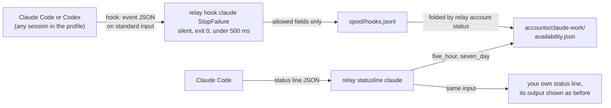

# Hooks and the status line

Claude Code and Codex can run a command of your choice when something happens in a session: when
it starts, when a turn ends, when a turn fails because of a usage limit. These commands are called
hooks. relay can add its own hooks to an account's profile, so it also learns what happens in
sessions you start yourself, outside relay. For Claude Code, relay can also wrap the status line,
the command Claude Code runs to draw the line at the bottom of its screen, because that command
receives the account's usage numbers.

relay changes these files only when you ask, keeps a copy of the old file, and touches only its
own entries. The design is decisions 13 and 14 of
`openspec/changes/add-provider-adapters/design.md`, and the rules are in its `provider-hook-setup`
spec. The daemon of `add-daemon-api-and-status` later receives the same events directly.

## What each hook records

| Provider | File in the profile folder | Events |
|---|---|---|
| Claude Code | `settings.json` | `SessionStart`, `Stop`, `StopFailure`, `Notification`, `SessionEnd`, `PreCompact` |
| Codex | `hooks.json` | `SessionStart`, `Stop`, `SessionEnd`, `Interrupt`, `PreCompact` |

Each hook runs `'<relay path>' hook <provider> <Event>`. `relay hook` reads at most 1 MiB of the
event's JSON for at most 200 ms, prints nothing, always exits with code 0, and appends one line to
`spool/hooks.jsonl` in the relay folder (mode 0600). It keeps only these fields of the event:
`session_id`, `cwd`, `hook_event_name`, `error`, `notification_type`, `reason`, `source`, `model`
and `turn_id`. Everything else, such as the commands the agent ran (`tool_input`), the provider's
error details and the agent's last message, is dropped before anything is written. The line also
records `RELAY_JOB`, `RELAY_TARGET` and `RELAY_WORKER` when relay started the agent (otherwise
null), and the profile folder (`CLAUDE_CONFIG_DIR` or `CODEX_HOME`, or `default`):

```
{"v":1,"received_at":"2026-10-07T13:02:11.120Z","provider":"claude","event":"StopFailure","relay_job":"3f9a2c1d","relay_target":"claude:work","relay_worker":"5d2e8f01","profile":"/home/user/.relay/profiles/claude-work","fields":{"session_id":"7c1e9a52-…","cwd":"/home/user/app","hook_event_name":"StopFailure","error":"rate_limit"}}
```

relay stops adding lines when the spool is larger than 10 MB, and `relay account status` trims it
to the last 7 days when it is larger than 5 MB. A failure of `relay hook` itself goes to
`logs/hook.log`, without the event's content.



The diagram shows where the events go. A hook appends to the spool; `relay account status` reads
the lines it has not seen yet for that account and turns them into availability readings with
the source `hook`. The status line records the usage windows directly and then runs your own
status line.

These hook events change an account's availability, and no others:

| Event | Availability |
|---|---|
| Claude `StopFailure` with `error` `rate_limit` | `rate_limited`, with the reset time of a full window from the latest status-line reading when there is one |
| Claude `StopFailure` with `authentication_failed`, `oauth_org_not_allowed`, `billing_error` or `account_on_hold` | `unavailable` |
| Claude `Notification` with `notification_type` `quota_auto_resume_fired` | `available`, "Claude Code continued after its reset." |
| Claude or Codex `Stop` | `available`, "The last turn finished normally" |

relay finds the account from `RELAY_TARGET`, otherwise from the profile folder: an event from
`~/.claude` or `~/.codex` belongs to the account that uses that folder.

## Installing hooks

```sh
relay hooks install claude:work
relay hooks install claude:work --status-line
relay hooks install codex:personal
```

relay prints the file and each entry it will add, then asks "Install these hooks? [y/N]"
(`--yes` skips the question). Each entry has a time limit of 5 seconds, except Codex's
`SessionEnd` and `Interrupt`, which Codex allows at most 3 seconds. relay appends its entries after
yours, never adds one that is already there, and never changes your other hooks or settings. It
never edits Codex's `config.toml` or its `notify` setting.

Before writing, relay copies the old file to `accounts/<provider>-<name>/backups/<file>.<UTC time>`
in the relay folder (mode 0600) and prints "Saved a copy of the old file in <path>.". It writes the
new file through a temporary file and a rename that keeps the old file's mode (0600 for a new
file). JSON is written with two-space indentation, so the spacing of your file may change; the
backup keeps the original bytes. When the file is not valid JSON, or its `hooks` value is not an
object, relay changes nothing and exits with code 1. relay does not replace a settings file that
is a symbolic link.

The command in each entry names relay's own program. An installed relay uses its own path. When
you run relay from source, set `RELAY_BIN` to the program the hooks should run.

`relay account add` offers to install the hooks only for a profile folder relay created. For
`~/.claude`, `~/.codex` and any folder given with `--profile-dir`, it prints "To let relay see
sessions you start yourself, run relay hooks install <account>." and you decide.

### Codex asks you to trust new hooks

Codex runs a new hook only after you trust it once. After installing, relay prints "Codex asks
you to trust new hooks once. Open Codex with this account (CODEX_HOME=<profile> codex), type
/hooks, and trust the relay hooks.". relay never uses Codex's option to skip this check.
`relay hooks status` asks Codex's app server for the state of relay's hooks: trusted, waiting for
your trust, or changed since you trusted them.

## The status line

With `--status-line`, relay sets the profile's `statusLine` to
`{"type":"command","command":"'<relay path>' statusline claude"}` and saves your previous status
line in `accounts/<provider>-<name>/statusline-original.json`. On each refresh,
`relay statusline claude` reads the input, records `rate_limits.five_hour` and
`rate_limits.seven_day` (`used_percentage` and `resets_at`) for the account when they changed, and
then runs your saved status line with the same input, passing its output and exit code through.
It prints nothing of its own and records before it runs yours, so a slow status line of yours
never delays the reading. A window at 100 percent makes the account `quota_exhausted` until that
window's reset time; otherwise the account is `available`. Claude Code sends these numbers only to
Pro and Max subscribers, after the first answer in a session.

relay finds the account from `RELAY_TARGET`, otherwise from `CLAUDE_CONFIG_DIR`, otherwise the
account whose profile folder is `~/.claude`.

## Checking and removing everything

```sh
relay hooks status claude:work
relay hooks remove claude:work
```

`relay hooks status` lists each of relay's events as present or missing, and whether relay's
status line is installed. `relay hooks remove` removes only relay's entries, drops a matcher group,
an event or the `hooks` key only when relay's entry was the last thing in it, puts your previous
status line back (or removes the key when there was none), and keeps a backup as when installing.
To undo relay's hooks for every account, run `relay hooks remove` for each one; the backups stay
in `accounts/*/backups/`.
