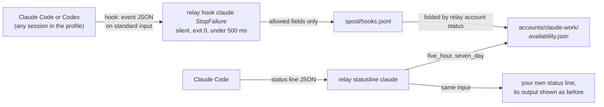
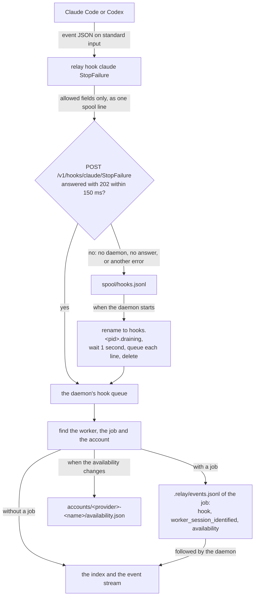

# Hooks and the status line

Claude Code and Codex can run a command of your choice when something happens in a session: when
it starts, when a turn ends, when a turn fails because of a usage limit. These commands are called
hooks. relay can add its own hooks to an account's profile, so it also learns what happens in
sessions you start yourself, outside relay. For Claude Code, relay can also wrap the status line,
the command Claude Code runs to draw the line at the bottom of its screen, because that command
receives the account's usage numbers.

relay changes these files only when you ask, keeps a copy of the old file, and touches only its
own entries. The design is decisions 13 and 14 of
`openspec/changes/add-provider-adapters/design.md`, and the rules are in its `provider-hook-setup`
spec. When the relay daemon runs, it receives the same events directly ("How hook events reach the
daemon" below, from decision 18 of `openspec/changes/add-daemon-api-and-status/design.md`).

## What each hook records

| Provider | File in the profile folder | Events |
|---|---|---|
| Claude Code | `settings.json` | `SessionStart`, `Stop`, `StopFailure`, `Notification`, `SessionEnd`, `PreCompact` |
| Codex | `hooks.json` | `SessionStart`, `Stop`, `SessionEnd`, `Interrupt`, `PreCompact` |

Each hook runs `'<relay path>' hook <provider> <Event>`. `relay hook` reads at most 1 MiB of the
event's JSON for at most 200 ms, prints nothing, always exits with code 0, and sends one line to
the relay daemon, or appends it to `spool/hooks.jsonl` in the relay folder (mode 0600) when no
daemon accepts it. It keeps only these fields of the event:
`session_id`, `cwd`, `hook_event_name`, `error`, `notification_type`, `reason`, `source`, `model`
and `turn_id`. Everything else, such as the commands the agent ran (`tool_input`), the provider's
error details and the agent's last message, is dropped before anything is written. The line also
records `RELAY_JOB`, `RELAY_TARGET` and `RELAY_WORKER` when relay started the agent (otherwise
null), and the profile folder (`CLAUDE_CONFIG_DIR` or `CODEX_HOME` as an absolute path, or
`default`):

```
{"v":1,"received_at":"2026-10-07T13:02:11.120Z","provider":"claude","event":"StopFailure","relay_job":"3f9a2c1d","relay_target":"claude:work","relay_worker":"5d2e8f01","profile":"/home/user/.relay/profiles/claude-work","fields":{"session_id":"7c1e9a52-…","cwd":"/home/user/app","hook_event_name":"StopFailure","error":"rate_limit"}}
```

relay stops adding lines when the spool is larger than 10 MB, and `relay account status` trims it
to the last 7 days when it is larger than 5 MB. A failure of `relay hook` itself goes to
`logs/hook.log`, without the event's content.



The diagram shows where the events go. A hook appends to the spool; `relay account status` reads
the lines it has not seen yet for that account and turns them into availability readings with
the source `hook`. The status line records the usage windows directly and then runs your own
status line.

These hook events change an account's availability, and no others:

| Event | Availability |
|---|---|
| Claude `StopFailure` with `error` `rate_limit` | `rate_limited`, with the reset time of a full window from the latest status-line reading when there is one |
| Claude `StopFailure` with `authentication_failed`, `oauth_org_not_allowed`, `billing_error` or `account_on_hold` | `unavailable` |
| Claude `Notification` with `notification_type` `quota_auto_resume_fired` | `available`, "Claude Code continued after its reset." |
| Claude or Codex `Stop` | `available`, "The last turn finished normally" |

relay finds the account from `RELAY_TARGET`, otherwise from the profile folder: an event from
`~/.claude` or `~/.codex` belongs to the account that uses that folder. relay resolves the folder
the same way for hook lines and for the status line, so `~/.relay/profiles/claude-work/` and
`~/.relay/profiles/claude-work` name the same account.

## How hook events reach the daemon

When the relay daemon runs, `relay hook` gives it each event directly, so `relay status` and the
Mac app see a limit as soon as the agent reports it. The spool is now the fallback for the times
the daemon is not running.



The diagram shows the two ways an event can take. `relay hook` builds the same line it would write
to the spool and sends it to the daemon over its private socket. When the daemon answers `202`
within 150 ms, the hook is done; the daemon has put the event on an in-memory queue and records it
afterwards, so the hook never waits for a file lock. When nothing answers in time, the hook appends
the line to the spool instead. Either way, the hook process ends no later than 500 ms after it
started, prints nothing and exits with code 0. The command-line tool loads each command's code
only when that command runs, so `relay hook` never loads the database or git code.

The daemon checks every line again before it uses it, because any program running as the same
user can write to the socket or the spool: the provider must be `claude` or `codex`, the event a
name of letters, digits and underscores, the job, account and worker names must have their usual
formats, the profile must be `default` or an absolute path, the time must not be more than a
minute ahead, and the fields go through the allow list once more. A line that fails a check is
refused with `400` or, in the spool, skipped. The daemon also refuses connections from other users
before it reads them.

The daemon then finds where the event belongs:

- **The worker:** the one named by `RELAY_WORKER`; otherwise the newest worker of `RELAY_JOB` on
  `RELAY_TARGET`; otherwise the newest worker whose provider session ID is the event's
  `session_id`.
- **The job:** the worker's job; otherwise `RELAY_JOB`; otherwise the job of the known project
  whose folder contains the event's `cwd`.
- **The account:** `RELAY_TARGET`; otherwise the worker's account; otherwise the account whose
  profile folder the event names (`default` means `~/.claude` or `~/.codex`). Only accounts in
  `config.toml` count.

With a job, the daemon appends a `hook` event to the job's `.relay/events.jsonl` with the provider,
the event name and the allowed fields, and the index picks it up from there. Without a job, the
event goes only to the event stream. On `SessionStart`, when the worker has no provider session ID
yet and `session_id` is a UUID, the daemon also appends a `worker_session_identified` event, so
the worker's session can be resumed later.

### Draining the spool

One second after it starts, the daemon renames `spool/hooks.jsonl` to `spool/hooks.<pid>.draining`
(with its own process ID), waits one more second so that a hook that opened the old file has
finished writing, puts each line on the hook queue in order and deletes the file once the queue
has processed every line. A `.draining` file left by a daemon that stopped while draining is
processed first. When the daemon stops before it has queued every line of a file, it keeps the
file, and the next start processes it again from the beginning: the job's event log may then hold
a `hook` event twice, but the availability does not change, because a reading never replaces a
newer one. A hook that runs while the daemon is busy or starting is not lost: it either reaches
the daemon or writes to a new `spool/hooks.jsonl`, which the next start of the daemon drains.

### What each event changes in availability

The daemon changes an account's availability only when it found the account, and only for these
events. Every reading has the source `hook`, the time the hook received the event as
`measured_at`, and no reset time (`retry_at` is null), because no hook event carries one.

| Provider | Event | Condition | New availability | Reason |
|---|---|---|---|---|
| Claude Code | `StopFailure` | `error` is `rate_limit` | `rate_limited` | Claude Code reported a rate limit |
| Claude Code | `StopFailure` | `error` is `billing_error` | `unavailable` | Claude Code reported a billing problem |
| Claude Code | `StopFailure` | `error` is `authentication_failed` | `unavailable` | Claude Code is signed out of this account |
| Claude Code | `StopFailure` | `error` is `oauth_org_not_allowed` | `unavailable` | This organization does not allow this login |
| Claude Code | `StopFailure` | `error` is `account_on_hold` | `unavailable` | Claude Code reported that the account is on hold |
| Claude Code | `Notification` | `notification_type` is `quota_auto_resume_fired` | `available` | Claude Code continued after its reset. |
| Claude Code or Codex | `Stop` | none | `available` | The last turn finished normally |

`StopFailure` with `overloaded` or `server_error` is an outage of the service, not of the account,
so it is recorded in the job's event log and leaves the availability as it was; so does every
other event. With a job, the reading is appended to `events.jsonl` as an `availability` event;
without one, it goes to the index and the event stream directly. In both cases the daemon also
updates the account's `availability.json`, so the reading survives a rebuild of the index.

`relay account status`, which folds the spool when no daemon has emptied it, uses the older table
in "What each hook records" above. Its reasons are worded differently, and it takes a reset time
for a rate limit from the latest status-line reading.

## Installing hooks

```sh
relay hooks install claude:work
relay hooks install claude:work --status-line
relay hooks install codex:personal
```

relay prints the file and each entry it will add, then asks "Install these hooks? [y/N]"
(`--yes` skips the question). Each entry has a time limit of 5 seconds, except Codex's
`SessionEnd` and `Interrupt`, which Codex allows at most 3 seconds. relay appends its entries after
yours, never adds one that is already there, and never changes your other hooks or settings. It
never edits Codex's `config.toml` or its `notify` setting.

Before writing, relay copies the old file to `accounts/<provider>-<name>/backups/<file>.<UTC time>`
in the relay folder (mode 0600) and prints "Saved a copy of the old file in <path>.". It writes the
new file through a temporary file and a rename that keeps the old file's mode (0600 for a new
file). JSON is written with two-space indentation, so the spacing of your file may change; the
backup keeps the original bytes. When the file is not valid JSON, or its `hooks` value is not an
object, relay changes nothing and exits with code 1. relay does not replace a settings file that
is a symbolic link.

The command in each entry names relay's own program. An installed relay uses its own path. When
you run relay from source, set `RELAY_BIN` to the program the hooks should run. relay recognises an
entry as its own when the command is exactly the one it writes for that program, whatever the
program's file name (for example `relay-darwin-arm64`), or when the command runs a program named
`relay`. So installing twice adds nothing, and `relay hooks remove` finds the entries.

`relay account add` offers to install the hooks only for a profile folder relay created. For
`~/.claude`, `~/.codex` and any folder given with `--profile-dir`, it prints "To let relay see
sessions you start yourself, run relay hooks install <account>." and you decide.

### Codex asks you to trust new hooks

Codex runs a new hook only after you trust it once. After installing, relay prints "Codex asks
you to trust new hooks once. Open Codex with this account (CODEX_HOME=<profile> codex), type
/hooks, and trust the relay hooks.". relay never uses Codex's option to skip this check.
`relay hooks status` asks Codex's app server for the state of relay's hooks: trusted, waiting for
your trust, or changed since you trusted them.

## The status line

With `--status-line`, relay sets the profile's `statusLine` to
`{"type":"command","command":"'<relay path>' statusline claude"}` and saves your previous status
line in `accounts/<provider>-<name>/statusline-original.json`. On each refresh,
`relay statusline claude` reads the input, records `rate_limits.five_hour` and
`rate_limits.seven_day` (`used_percentage` and `resets_at`) for the account when they changed, and
then runs your saved status line with the same input, passing its output and exit code through.
It prints nothing of its own and records before it runs yours, so a slow status line of yours
never delays the reading. Your status line runs in its own process group. When it has not
finished after 2 seconds, relay stops it and every program it started, and shows what it printed
until then (exit code 0). relay shows at most 1 MiB of its output. A window at 100 percent makes the account `quota_exhausted` until that
window's reset time; otherwise the account is `available`. Claude Code sends these numbers only to
Pro and Max subscribers, after the first answer in a session.

relay finds the account from `RELAY_TARGET`, otherwise from `CLAUDE_CONFIG_DIR`, otherwise the
account whose profile folder is `~/.claude`. When `config.toml` is invalid, or the account is no
longer in it, relay records nothing but still shows your status line: it finds the saved copy from
`RELAY_TARGET`, or from the profile folder that `statusline-original.json` records next to it.

## Checking and removing everything

```sh
relay hooks status claude:work
relay hooks remove claude:work
```

`relay hooks status` lists each of relay's events as present or missing, and whether relay's
status line is installed. `relay hooks remove` removes only relay's entries, drops a matcher group,
an event or the `hooks` key only when relay's entry was the last thing in it, puts your previous
status line back (or removes the key when there was none), and keeps a backup as when installing.
To undo relay's hooks for every account, run `relay hooks remove` for each one; the backups stay
in `accounts/*/backups/`.
