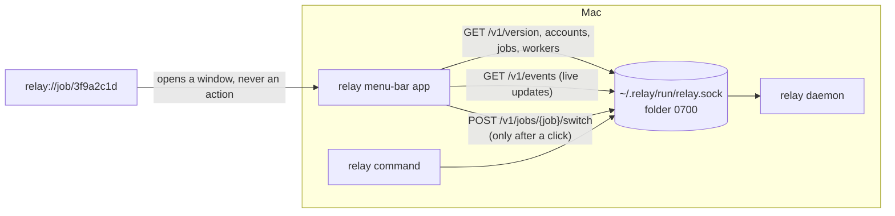

# The Mac menu-bar app

The relay app is a small card in the macOS menu bar. It shows the job an agent is working on,
which agent and account work on it now, where the job came from after a handoff, the last
checkpoint, and when a limited account resets. It shows only what the relay daemon reported, in
words and with times. It was planned in the OpenSpec change `add-mac-menu-bar-app`
(`openspec/changes/add-mac-menu-bar-app/`).

The app needs macOS 14 or later on Apple silicon, and the relay daemon (`relay daemon start`,
see [daemon.md](daemon.md)).

## What it shows, and what it does not do

The card opens small. A click expands it to the full card: the job, one status line such as
"Moved to Codex · Claude Code reached its limit", the previous and the current worker, the last
checkpoint, and one button that opens a view. That button brings forward the app that runs the
agent (for example "Open Codex in Terminal"), or shows the project folder in Finder when the
agent runs without a window.

The app has one action that changes anything: "Switch worker…". It sends the same switch request
as `relay switch`, through the daemon, and only after you choose an account and press the button.
When the daemon asks a question, the app shows the daemon's own words. A question that the app
cannot answer ends with the `relay switch` command to run in a terminal.

The app never checkpoints, rolls back, starts or approves anything. Links of the form
`relay://job/3f9a2c1d` only open a window with that job's card; any other link is ignored.

## Install

The app is attached to each GitHub Release as `Relay-macOS.zip`. With the GitHub command line
(`gh`):

```sh
gh release download --repo FrejusGdm/relay --pattern Relay-macOS.zip --dir ~/Downloads
ditto -x -k ~/Downloads/Relay-macOS.zip /Applications
open /Applications/Relay.app
```

`ditto` is Apple's tool for zip files of apps; it keeps the app's signature intact. To remove
the app, choose "Quit" on the expanded card and delete `/Applications/Relay.app`. It writes no
files anywhere else.

## Opening it the first time

The app is not notarized by Apple, because relay has no Apple Developer account yet. It carries
an ad-hoc signature, which Apple silicon needs to run any code.

macOS asks before it opens an app that is marked as downloaded from the internet. A file
downloaded with `gh release download` is not marked: on 2026-10-08, after the commands above with
a test release, `xattr -p com.apple.quarantine Relay.app` printed "No such xattr", and the zip
carried only the `com.apple.provenance` attribute. So macOS should open the app without asking.

If you downloaded the zip in a web browser instead, macOS marks it, and you open it once by hand:

- **macOS 14:** right-click `Relay.app` in Finder and choose Open, then Open again.
- **macOS 15 and later:** open the app once and close the message. Then open System Settings,
  Privacy & Security, and click "Open Anyway" next to the message about relay.

## Another relay folder

The app looks for the daemon in `~/.relay`. An app started from Finder does not see the
variables of your shell, so to use another folder, start it from a terminal:

```sh
RELAY_HOME=/path/to/relay-home open -n /Applications/Relay.app
```

## How it talks to the daemon



The diagram shows that the app and the `relay` command reach the daemon through the same private
socket. The app reads the state and follows live events, and it sends one kind of request, a
switch, only when you click. A `relay://` link only opens a window.

The app opens no network connection. Before every connection it checks that the folder
`~/.relay/run` is a real folder owned by you that no other user can open, and that `relay.sock`
is a socket owned by you. After connecting, it asks the system which user runs the daemon, and
it closes the connection without sending a byte when that is another user. When a check fails,
the card says why and what to run, for example `chmod 700 ~/.relay/run`.

## Security limits

Any program that runs under your user account can use the socket, as it can read `~/.claude`
and `~/.codex`. The app does not change that; it only makes sure that it talks to a daemon run by
you. The app never reads, stores or shows provider credentials, and it runs no git command.

## Building and testing

The app is built and tested only on GitHub's macOS runner, by `.github/workflows/mac-app.yml`,
never on a developer's Mac. A pull request that changes `mac/` starts one run. The run tests
the package against a fake daemon, draws the cards to PNG files in light and dark, builds and
signs `Relay.app`, and starts it for five seconds. Read the results with `gh`:

```sh
run=$(gh run list --repo FrejusGdm/relay --workflow mac-app.yml --branch <branch> --limit 1 --json databaseId --jq '.[0].databaseId')
gh run watch "$run" --repo FrejusGdm/relay --exit-status
gh run view "$run" --repo FrejusGdm/relay --log | grep -E 'Test run with|Smoke test passed|Built mac/build'
gh run download "$run" --repo FrejusGdm/relay --name mac-app-screenshots --dir "$TMPDIR/mac-shots-$run"
```

The fonts are not in the repository. `mac/scripts/fetch-fonts.sh` downloads Public Sans and IBM
Plex Mono in the workflow and checks each file against `mac/Resources/Fonts/SOURCES.md`.

## Attaching the app to a release

Releases are published by hand with `gh release create`, and there is no release workflow. A
release tag starts the Mac app workflow on that tag, which builds the app with the tag's version.
When that run has passed, attach its zip:

```sh
gh release create v0.8.0 --title "relay 0.8.0" --notes-file notes.md   # pushes the tag
gh run list --repo FrejusGdm/relay --workflow mac-app.yml --branch v0.8.0  # wait for success
sh mac/scripts/attach-to-release.sh v0.8.0
```

The script finds the passing run for the tag, downloads its `Relay-macOS.zip`, refuses to upload
it when the app's version is not the tag's number, and uploads it with `gh release upload`. The
workflow keeps the zip for 7 days; after that, start the run again with
`gh workflow run mac-app.yml --repo FrejusGdm/relay --ref v0.8.0 -f version=0.8.0`.
