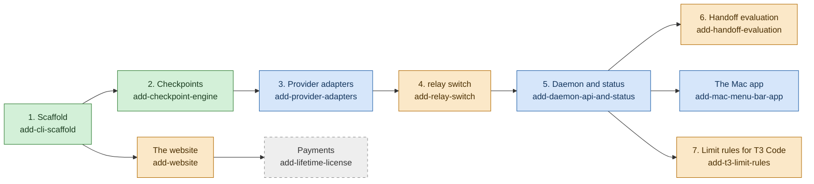

# Build progress

Last updated 2026-10-08 08:55 UTC.

This page shows how far the build of relay has come. The plan is split into OpenSpec changes, the
written plans in `openspec/changes/`. Each change has a `tasks.md` file with numbered task groups,
and each task has a check box that the person who builds it ticks. The counts below come from those
check boxes on the `main` branch at commit `0f4ac01`, and the pull requests come from GitHub at the
same time. `docs/architecture.md` explains what each part does.

## The phases

The colours show the state of each change:

- **Green, done:** every task group that an agent can do is on `main`.
- **Blue, in review:** some task groups are on `main`, and the next ones are in an open pull
  request.
- **Orange, being built:** some task groups are on `main`, and the rest are not in a pull request
  yet, or wait for something outside the code.
- **Grey with a dashed border, not started:** no task is ticked.

The arrows show which change needs which. Phases 1 to 6 are the first version of
`docs/ROADMAP.md`. Phase 7, automatic failover, starts with `add-t3-limit-rules`. That change also
needs phases 1, 3 and 4; the diagram shows only its link to phase 5 to stay readable. Payments come
after the website because the license page is part of the website.

## Task groups per change

A count is the number of tasks in the group whose box is ticked, and the number still open. In a
few places the boxes lag behind the code; the notes under each table say where.

### add-cli-scaffold (phase 1): done

| Task group | Ticked | Open |
|---|---|---|
| 1. Project setup | 3 | 0 |
| 2. Test runner and fake provider | 3 | 0 |
| 3. Command router, help, version and exit codes | 5 | 0 |
| 4. Relay folder and settings | 6 | 0 |
| 5. Logging | 3 | 0 |
| 6. Release builds | 3 | 0 |
| 7. Continuous integration | 0 | 2 |
| 8. Integration check | 1 | 1 |

Task group 7 is unticked, but `.github/workflows/ci.yml` and `.github/dependabot.yml` are on `main`,
CI runs on every pull request, and `docs/codebase-map.md` counts groups 1 to 7 as built. Task 8.2
asks for every CI job to pass on the pull request that completes the change. The release v0.1.0,
with the macOS and Linux programs, was published on 2026-10-08.

### add-checkpoint-engine (phase 2): done

| Task group | Ticked | Open |
|---|---|---|
| 1. Test helpers and the safe git runner | 4 | 0 |
| 2. Trust record for git configuration and hooks | 2 | 0 |
| 3. Job files and relay init without the baseline | 3 | 0 |
| 4. Secret scanning | 4 | 0 |
| 5. relay checkpoint | 5 | 0 |
| 6. Listing checkpoints | 1 | 0 |
| 7. relay rollback | 3 | 0 |
| 8. Accepting git changes and the tampering test | 3 | 0 |
| 9. End-to-end check and CI | 2 | 0 |

### add-provider-adapters (phase 3): in review

| Task group | Ticked | Open |
|---|---|---|
| 1. Adapter core | 8 | 0 |
| 2. Fake agents | 8 | 0 |
| 3. Contract suite and fixtures | 6 | 0 |
| 4. Provider policies | 4 | 0 |
| 5. Accounts | 8 | 0 |
| 6. Hooks and the status line | 6 | 0 |
| 7. Claude Code adapter | 6 | 0 |
| 8. Codex adapter | 9 | 0 |
| 9. relay run | 0 | 9 |
| 10. Integration checks | 0 | 3 |

Pull request #19 builds task group 9 and task 10.1. Tasks 10.2 and 10.3 need a person with the real
tools (see "What needs Josué" below).

### add-relay-switch (phase 4): being built

| Task group | Ticked | Open |
|---|---|---|
| 1. Foundations | 5 | 1 |
| 2. Checks | 2 | 1 |
| 3. Handoff content | 5 | 1 |
| 4. Safety | 4 | 0 |
| 5. The switch engine | 0 | 5 |
| 6. Commands | 0 | 4 |
| 7. End-to-end checks | 0 | 8 |

Tasks 1.5, 2.3 and 3.5 wait for `relay run` (pull request #19). Task groups 5 to 7, which make
`relay switch` work, are not in a pull request yet.

### add-daemon-api-and-status (phase 5): in review

| Task group | Ticked | Open |
|---|---|---|
| 1. Platform primitives | 3 | 0 |
| 2. The daemon process | 4 | 0 |
| 3. HTTP over the socket | 2 | 0 |
| 4. Live state in SQLite | 5 | 0 |
| 5. Read endpoints | 2 | 0 |
| 6. The event stream | 1 | 0 |
| 7. Checkpoint and switch through the API | 2 | 0 |
| 8. Provider hooks | 3 | 0 |
| 9. Starting the daemon from the command-line tool | 2 | 0 |
| 10. relay status | 3 | 0 |
| 11. Integration check | 1 | 0 |

Update: task groups 8 and 10 are on `main`. The pull request "feat: checkpoint and switch through
the daemon, and the integration check" builds task groups 7, 9 and 11, the last ones of the change:
`POST /v1/jobs/{job}/checkpoint` and `POST /v1/jobs/{job}/switch` through the engines of `relay
checkpoint` and `relay switch`, the daemon started by `relay run` and `relay switch`, and the
end-to-end test of the whole path.

### add-handoff-evaluation (phase 6): being built

| Task group | Ticked | Open |
|---|---|---|
| 1. Reconcile the relay interfaces | 2 | 0 |
| 2. Harness skeleton, JUnit results and the first fixture | 5 | 0 |
| 3. The other three fixtures | 4 | 0 |
| 4. Plans, targets, campaigns and guards | 3 | 0 |
| 5. Talking to relay and reading events | 4 | 0 |
| 6. Running one run and measuring it | 8 | 0 |
| 7. Summary and verdicts | 2 | 0 |
| 8. Real relay, documentation and CI | 0 | 3 |

Task group 8 runs the evaluation against the real `relay` program, so it waits for `relay run` and
`relay switch`.

### add-mac-menu-bar-app (the Mac app): in review

| Task group | Ticked | Open |
|---|---|---|
| 1. The package, the bundle and the workflow | 2 | 0 |
| 2. The daemon client | 4 | 1 |
| 3. State, text and views | 4 | 0 |
| 4. Actions that open views, the switch, and links | 0 | 3 |
| 5. Release and documentation | 0 | 2 |

Pull request #20 builds task group 4. Task 2.5 compares the app's test data with a real test daemon
in the handoff situation, so it needs the switch to exist.

### add-website (the website): being built

| Task group | Ticked | Open |
|---|---|---|
| 1. Fonts and the ported page | 3 | 0 |
| 2. Browser checks and spacing | 2 | 0 |
| 3. Content | 3 | 0 |
| 4. Install panel | 2 | 0 |
| 5. Smoke test | 1 | 0 |
| 6. Azure resources | 1 | 0 |
| 7. Deployment | 2 | 2 |
| 8. Integration check | 0 | 2 |

The page is built but not deployed. Tasks 7.2 and 7.3 say they are blocked because the repository
had no release. The release v0.1.0 now exists with both programs, so that block may be gone; I did
not try the deployment.

### add-t3-limit-rules (phase 7, first part): being built by another agent

| Task group | Ticked | Open |
|---|---|---|
| 1. Checks before building | 1 | 2 |
| 2. Settings and the rules engine | 0 | 3 |
| 3. Usage readings | 0 | 3 |
| 4. Connecting to T3 Code | 3 | 2 |
| 5. Acting on threads | 0 | 5 |
| 6. The whole night, and documents | 0 | 3 |

Pull requests #3, #6 and #7 are merged: the limit rule settings, the rules engine and its
crossings, the T3 Code client with a fake T3 server, and the sign-in to T3 Code. The code is on
`main` in `src/limits/` and `src/t3/`, but group 2's boxes are still open in `tasks.md`, so the
boxes lag behind the code here. I did not check which task each pull request completes.

### add-lifetime-license (payments): not started

| Task group | Ticked | Open |
|---|---|---|
| 1. License server project and signing | 0 | 2 |
| 2. The offline check in relay | 0 | 2 |
| 3. The relay license command | 0 | 3 |
| 4. Fulfillment | 0 | 3 |
| 5. The HTTP functions and the bundle | 0 | 3 |
| 6. Continuous integration | 0 | 1 |
| 7. Website integration (after `add-website` is merged) | 0 | 3 |
| 8. Test-mode run (waits for a Stripe sandbox) | 0 | 3 |
| 9. Documentation | 0 | 1 |

I found no record in `docs/ROADMAP.md` that this proposal was approved, so it may still be waiting
for approval.

## Pull requests

These three pull requests are open. Each one targets `main`.

| Pull request | Change and task groups | What it adds |
|---|---|---|
| #18 | `add-daemon-api-and-status` 9 and 10 | `relay status [--job <id>] [--json]`: the job, its latest checkpoint and one row per account with its availability. It never starts the daemon; without one, it builds the same view from the saved files. It also adds `ensureDaemon`, which `relay run` and `relay switch` will call, and fixes a test that failed now and then in `relay daemon stop`. |
| #19 | `add-provider-adapters` 9 and 10.1 | `relay run <provider[:account]>`, which starts Claude Code or Codex on one of the person's accounts, in the terminal or headless. A worker lock stops a second `relay run` on the same job. New exit codes 23, 24 and 25; a headless agent that asks for approval is stopped with exit code 24. |
| #20 | `add-mac-menu-bar-app` 4 | The Mac app's actions: "Open Codex in Terminal" or "Show project in Finder", the checkpoint view, the switch sheet that sends one switch request to the daemon, and `relay://job/<id>` links. |

Pull requests #1 to #17, except #5, were merged on 2026-10-08. Pull request #5 was a test that a
wrong gitleaks checksum makes CI fail, and was closed on purpose. The last finished CI run on `main`
(commit `462e10d`) failed, and the run for the current `main` (`0f4ac01`) was still running when
this page was written; I did not look into the failure.

## What needs Josué

These items need a person with the real tools, an account or a decision. An agent cannot do them.

- **Check the real tools by hand** (`add-provider-adapters` task 10.2, after pull request #19 is
  merged): once, in a scratch repository on the Mac, run `relay providers`, add a Claude Code
  account and a Codex account with `relay account add`, install the hooks, start each agent with
  `relay run`, check the account status, and confirm that `relay hooks remove` puts the agents'
  settings files back as they were.
- **Record real fixtures** (`add-provider-adapters` task 10.3): run
  `scripts/record-fixture.ts` with `RELAY_RECORD=1` once for Claude Code and once for Codex, read
  the recorded events, commit them, and add the program versions to `tested-versions.json`, so the
  tests compare the fake agents with what the real programs print.
- **Check T3 Code by hand** (`add-t3-limit-rules` task 1.1): install the latest T3 Code nightly,
  sign relay in with a pairing code, and write down the instance IDs before and after a restart.
- **Review and merge** pull requests #18, #19 and #20.
- **Payments** (`add-lifetime-license`): approve the proposal, create a Stripe sandbox for the
  test-mode run (task group 8), and answer the proposal's open questions: which features are paid;
  the price and currency; what "lifetime" covers (all future updates, or one year of updates);
  sales tax and VAT; refunds; whether the key is also sent by email; and the product's name. Live
  mode stays a step that Josué does himself.
- **The open decisions in `docs/ROADMAP.md`:** whether to ask Anthropic and OpenAI directly before a
  public release, whether relay gets a view inside T3 Code, and whether the name "relay" is clear
  enough for search, a domain and a Homebrew name.
