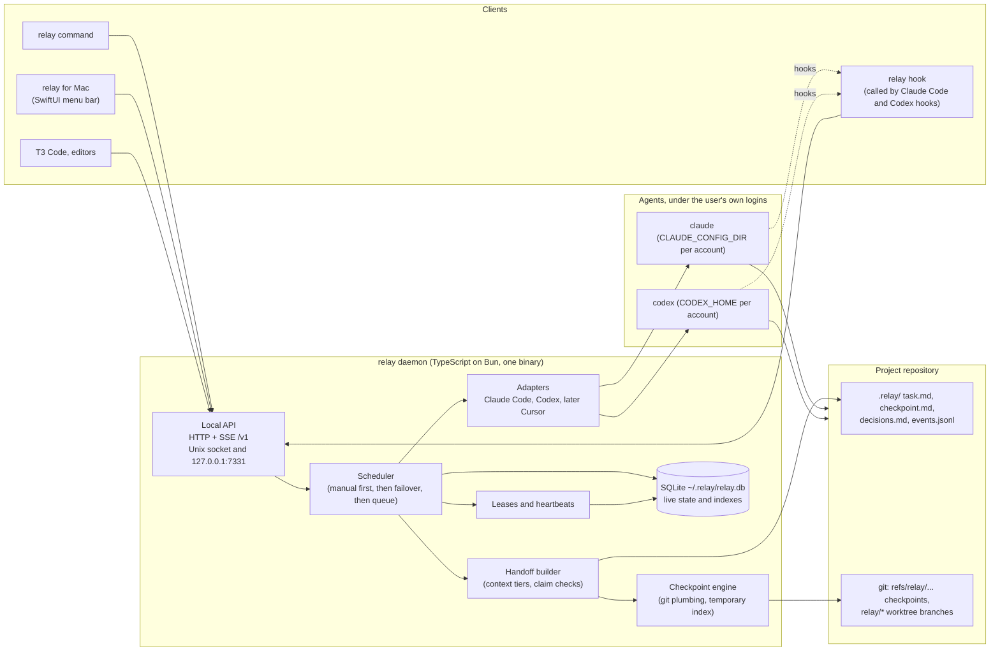

# relay: architecture and scheduler

Researched on 2026-10-07. Sources: `VISION.md`, the official
documentation linked inline, the Codex source code on GitHub, and the package registry (`npm view`)
on the same day. Where I could not verify something, I say so.

## Summary of the recommendations

- Write relay core (the daemon and the command-line tool) in **TypeScript, run on Bun, and ship it
  as one compiled binary** built with `bun build --compile`. Keep the code portable to Node so that
  switching runtimes later is cheap.
- Expose the local API as **HTTP with JSON**, versioned under `/v1`, with **server-sent events** for
  live status. Listen on a **Unix domain socket** for the command-line tool and hooks, and on
  **127.0.0.1:7331 with a bearer token** for the Mac app and other clients.
- Keep **one SQLite database** in `~/.relay/` for live, machine-local state (workers, leases,
  accounts, schedule). Keep the **job's content in `.relay/` files and in git**, which are the source
  of truth that any agent can read.
- Store checkpoints as **commits under hidden refs** (`refs/relay/...`), built with a temporary git
  index so the user's branch, index and working tree are never touched.
- Start with **no automatic scheduler at all** (manual `relay switch`), then add single-job failover,
  then leases and a priority queue.
- Build the Mac app in **SwiftUI** (`MenuBarExtra`), distribute it as a notarized download with
  **Sparkle** for updates, and add a Homebrew cask in your own tap.
- Test everything against **fake agents** that imitate the real output formats and simulate limits,
  crashes and resets. Real providers are used only in a separate, opt-in evaluation.

One finding matters more than the rest. Anthropic's policy on third-party tools that use a Claude
subscription changed several times in 2026 and is currently in a paused state. relay should never
handle Claude or OpenAI credentials itself; it should launch the tools the user already installed,
under the user's own login. See "Decisions only the founder can make" at the end.

---

## 1. Language and runtime for the daemon and the command-line tool

### What relay actually needs from a runtime

relay does not run a model. It starts other programs (`claude`, `codex`), reads their structured
output, writes files, runs git, keeps a small database and serves a local API. So the runtime must be
good at five things: starting and supervising child processes, sometimes inside a pseudo-terminal
(a "PTY", the fake terminal device that makes a program believe a human is typing); talking to the
providers' official interfaces; shipping as one file; starting fast; and being easy to test.

### What the providers offer today (verified 2026-10-07)

- **Codex** has an official TypeScript SDK, `@openai/codex-sdk` (version 0.160.1 on npm today). It
  "spawns the CLI and exchanges JSONL events over stdin/stdout", supports `startThread()`,
  `resumeThread(threadId)` and `runStreamed()`, and accepts an `env` option, which is how relay would
  set `CODEX_HOME` per account ([SDK README](https://github.com/openai/codex/tree/main/sdk/typescript),
  [Codex SDK docs](https://learn.chatgpt.com/docs/codex-sdk)). Codex also has an **app-server**, a
  JSON-RPC 2.0 protocol over stdio, WebSocket or a Unix socket, with `thread/start`,
  `thread/resume`, `turn/start` and `turn/interrupt`, and it can generate TypeScript types for its
  own protocol with `codex app-server generate-ts`
  ([app-server docs](https://learn.chatgpt.com/docs/app-server)). The Python library `openai-codex`
  also drives the app-server.
- **Claude Code** has the **Agent SDK** in TypeScript (`@anthropic-ai/claude-agent-sdk`, version
  0.3.292 today) and Python. It is "a library that runs the Claude Code binary"
  ([Agent SDK overview](https://code.claude.com/docs/en/agent-sdk/overview)). For other languages,
  Anthropic says to run `claude -p` as a subprocess with `--output-format json` or `stream-json`
  ([headless docs](https://code.claude.com/docs/en/headless)).
- Both SDKs are thin wrappers around the CLIs. Both packages published new versions within the last
  24 hours, so whatever language relay uses, its adapters must pin versions and be covered by
  contract tests (section 9).

### The options

| | TypeScript on Bun | TypeScript on Node | Rust | Go |
|---|---|---|---|---|
| Official provider SDKs | Yes (Codex and Claude, TypeScript) | Yes | None official; drive the CLIs | None official; drive the CLIs |
| Pseudo-terminal | Built in: `Bun.spawn({ terminal })` since Bun 1.3.5, macOS and Linux only ([Bun 1.3.5](https://bun.com/blog/bun-v1.3.5)) | `node-pty` 1.1.0, a native addon that must be compiled or prebuilt per platform ([releases](https://github.com/microsoft/node-pty/releases)) | `portable-pty` crate | `creack/pty` |
| SQLite | Built in: `bun:sqlite`, works in compiled binaries ([Bun executables](https://bun.com/docs/bundler/executables)) | `node:sqlite` is a "release candidate" since Node 24.15 ([Node docs](https://nodejs.org/api/sqlite.html)), or `better-sqlite3` (native addon) | `rusqlite` | `modernc.org/sqlite` or cgo |
| Single binary | `bun build --compile`, cross-compiles to macOS and Linux on x64 and arm64 ([Bun executables](https://bun.com/docs/bundler/executables)) | Possible with Node's single-executable feature, but more manual | Excellent, smallest | Excellent |
| Binary size | Large; Bun's own docs say the binary is "still way too big" | Large | Small | Small |
| Testability | `bun test`, same language as the fakes | Vitest or `node:test` | Good, slower to write | Good |
| Speed of building for one person | Fast | Fast | Slowest | Medium |

Startup time is not a deciding factor. On your Mac today, an empty script starts in about 20 ms on
both Node 22.22 and Bun 1.3.6 (I measured `node -e 0` and `bun -e 0` three times each). relay spends
its time waiting for agents, not starting up.

### Recommendation: TypeScript on Bun, compiled to a single binary

- The provider SDKs, the Codex app-server's generated TypeScript types and the Agent SDK's message
  types are all TypeScript. Using them directly removes a whole class of parsing bugs in the adapters,
  which are the part of relay most likely to break.
- Bun includes the three things relay needs that are native addons on Node (a PTY, SQLite and a
  single-binary compiler). Native addons are the usual source of installation failures for Node CLIs.
- You already have Bun and Node installed, and T3 Code, which relay wants to integrate with, is a
  TypeScript project.

Risks and how to contain them:

- **Bun compatibility.** Some Node packages behave differently on Bun. Keep Bun-only APIs (`Bun.spawn`
  with `terminal`, `bun:sqlite`) behind a small platform module so the rest of the code runs on
  Node too. Then moving to Node is a contained change, not a rewrite.
- **Code signing on macOS.** A compiled Bun binary needs to be signed with JIT entitlements
  (`com.apple.security.cs.allow-jit`), and Bun's documentation shows how
  ([Bun executables](https://bun.com/docs/bundler/executables)).
- **Size.** The binary will be tens of megabytes. On your Mac with almost no free disk this matters a
  little, but only once.

Go is the runner-up. Choose Go instead only if a small binary and a very low memory footprint for an
always-on daemon become more important than reusing the TypeScript SDKs.

You may not need a PTY at all in the first version. For interactive use, relay can start `claude` or
`codex` in the user's own terminal with the terminal passed through directly (the child inherits the
terminal), and observe it through hooks and process exit. For unattended work, relay uses the
structured headless modes (`claude -p --output-format stream-json`, the Codex SDK or app-server). A
PTY is only needed if relay must type into an interactive session it does not own, which the vision
already calls a last resort.

---

## 2. The local API

### Transport: a Unix socket for local tools, plus localhost TCP with a token

A **Unix domain socket** is a file-like endpoint (for example `~/.relay/relay.sock`) that only local
processes can connect to. Its access is controlled by file permissions (`0600` means only your user).
Docker's daemon works this way. Browsers cannot reach a Unix socket, which removes the main attack on
local web servers: **DNS rebinding**, where a malicious web page tricks the browser into sending
requests to `127.0.0.1` ([GitHub's explanation](https://github.blog/security/application-security/dns-rebinding-attacks-explained-the-lookup-is-coming-from-inside-the-house/)).
Note that macOS limits socket paths to about 104 bytes, so the path must stay short.

**HTTP on `127.0.0.1:7331`** is easier for clients. Swift's `URLSession` cannot talk to a Unix
socket; Apple's lower-level Network framework can (`NWEndpoint.unix(path:)`), but then the Mac app
must parse HTTP itself. Claude Code's HTTP hooks, editors and T3 Code also expect a URL.

Recommendation: the daemon listens on both.

- The Unix socket is the default for the `relay` command and for hooks.
- The TCP port listens only on `127.0.0.1`, requires a bearer token read from `~/.relay/token`
  (permissions `0600`), rejects requests whose `Host` header is not `127.0.0.1:7331` or
  `localhost:7331`, and rejects any request that carries a browser `Origin` header. These are the
  standard defenses against DNS rebinding and cross-site requests.
- Be honest in the documentation about the security boundary: any program running as your user can
  read the token file, just as it can read `~/.claude` and `~/.codex`. The protections stop web pages
  and other users, not malware running as you.

### Protocol: plain HTTP and JSON, with server-sent events for live status

- **Commands and queries** are ordinary HTTP endpoints that return JSON: `GET /v1/jobs`,
  `GET /v1/jobs/:id`, `POST /v1/jobs/:id/checkpoint`, `POST /v1/jobs/:id/switch`,
  `GET /v1/targets` (accounts and their capacity), `POST /v1/hooks/:provider` (hook events).
- **Live status** uses **server-sent events (SSE)**, a one-way stream of events over a normal HTTP
  response (`GET /v1/events?since=<event id>`). The menu-bar card only needs to receive updates, so
  WebSocket's two-way channel adds nothing. SSE resumes after a disconnect with the last event ID,
  which maps directly onto relay's numbered event log.
- **JSON-RPC** (what the Codex app-server and MCP use) is a reasonable alternative, but REST is easier
  to call from `curl`, from a shell hook and from Swift, and the vision already sketches REST
  endpoints.
- **Versioning**: put the major version in the path (`/v1/...`), publish an OpenAPI description from
  the code, and add `GET /v1/version` that returns the daemon version and a list of capabilities.
  Clients check capabilities, not version numbers. Claude Code does the same in its `system/init`
  event with a `capabilities` array ([headless docs](https://code.claude.com/docs/en/headless)).
  Only add fields within `/v1`; never remove or rename them.

---

## 3. State: SQLite and the `.relay/` folder

### Which store is the source of truth for what

| Information | Source of truth | Why |
|---|---|---|
| Goal, acceptance criteria, plan, decisions, latest handoff text | `.relay/task.md`, `decisions.md`, `checkpoint.md` in the project | Every agent can read files; the job must survive without relay running |
| The factual history of the job | `.relay/events.jsonl` | Append-only and portable; travels with checkpoints |
| Repository state at each checkpoint | git commits under `refs/relay/...` | git already solves snapshots, diffs and restore |
| Live state: running workers, process IDs, leases, account availability, reset times, the queue | SQLite `~/.relay/relay.db` | Machine-local, changes every few seconds, needs transactions |
| Indexes for fast `relay status` and the menu-bar card | SQLite | A cache of the files; can be rebuilt |

Rules that keep the two consistent:

1. Only the daemon writes to `events.jsonl` (agents add notes through `relay note "..."`, which goes
   through the API). Each event gets an increasing ID in SQLite first, then is appended to the file.
2. `state.json` is generated from SQLite at every checkpoint, so it is a readable export, not a second
   database.
3. A `relay doctor --reindex` command rebuilds the SQLite index from the `.relay/` files and the git
   refs. If the database is lost, nothing about the job is lost; only live leases are, and those
   expire anyway.

By default relay should add `.relay/` to `.git/info/exclude` (a local ignore file that is never
committed), so it does not appear in the user's commits. The checkpoint commits still include
`.relay/` because relay builds them with its own index (section 4). Whether teams should commit
`.relay/` to their main branch is a founder decision.

### Schema sketch (SQLite, WAL mode, the daemon is the only writer)

```sql
projects    (id, root_path UNIQUE, created_at)
jobs        (id, project_id, title, status, priority, created_at, updated_at)
tasks       (id, job_id, parent_task_id, title, status,          -- queued|running|blocked|done|failed
             worktree_path, branch, base_commit, last_checkpoint_id, priority, created_at)
task_deps   (task_id, depends_on_task_id)                         -- the task graph, later
targets     (id,                                                  -- 'claude:personal'
             provider, account, profile_dir,                      -- CLAUDE_CONFIG_DIR or CODEX_HOME
             status,                                              -- available|rate_limited|quota_exhausted|unavailable|unknown
             reason, available_at, used_percent, windows_json,    -- last usage sample
             policy_json, updated_at)
workers     (id, task_id, target_id, provider_session_id, pid,
             mode,                                                -- headless|interactive|external
             started_at, ended_at, exit_code, end_reason)
leases      (task_id PRIMARY KEY, worker_id, epoch, granted_at, renewed_at, expires_at)
checkpoints (id, task_id, worker_id, commit_sha, ref_name, parent_checkpoint_id,
             kind,                                                -- manual|auto|handoff|baseline|pre_rollback
             summary, tests_passed, tests_failed, claims_verified, created_at)
handoffs    (id, task_id, from_worker_id, to_target_id, checkpoint_id,
             context_tiers, prompt_path, created_at, outcome)
events      (id INTEGER PRIMARY KEY, job_id, task_id, worker_id, type, payload_json, ts)
```

`leases.epoch` is a **fencing token**: a number that increases every time the lease is granted to a
new worker. A checkpoint request must carry the current epoch, so a worker that lost its lease (for
example a laptop that slept) cannot write a checkpoint after another worker took over.

---

## 4. Checkpoints with git

### Hidden refs, not branches, for checkpoints

A **ref** is a named pointer to a commit. Branches are refs under `refs/heads/`. Refs under any other
prefix, such as `refs/relay/`, are ignored by `git branch`, are not pushed by a plain `git push`, and
are not fetched by default clones, but they keep their commits safe from garbage collection. All
refs under `refs/` are shared between worktrees of the same repository
([git-worktree](https://git-scm.com/docs/git-worktree)), so every worktree sees every checkpoint.

Recommended layout:

```
refs/relay/jobs/<job>/checkpoints/<n>    one ref per checkpoint
refs/relay/jobs/<job>/latest             the newest checkpoint
```

A side benefit: you can back up or move a job to the Omarchy machine with
`git push origin 'refs/relay/*:refs/relay/*'`. I did not verify how GitHub displays or limits custom
refs; test this before relying on it.

### How a checkpoint commit is built without touching the user's work

`git stash create` shows the idea: it makes "a regular commit object" without storing it in any ref
and without changing the working tree ([git-stash](https://git-scm.com/docs/git-stash)). relay does
the same with standard plumbing commands:

1. Point git at a temporary index file (`GIT_INDEX_FILE=~/.relay/tmp/<id>.index`), so the user's
   staging area is untouched.
2. `git add -A` into that temporary index (tracked and untracked files, respecting `.gitignore`),
   then force-add `.relay/`.
3. `git write-tree` to get a tree, then `git commit-tree <tree> -p <previous checkpoint or base commit>`
   with a message like `relay checkpoint 7: OAuth callback implemented` and trailers
   (`Relay-Job`, `Relay-Task`, `Relay-Worker`, `Relay-Target`, `Relay-Tests: 231 passed, 1 failed`).
4. `git update-ref refs/relay/jobs/<job>/checkpoints/7 <sha>` and move `latest`.

The commit contains the full working tree as it was, the `.relay/` folder (task, checkpoint text,
decisions, events up to that point, `state.json`), and the metadata in the message. It never contains
ignored files such as `node_modules` or `.env`. Add a size guard: refuse to snapshot files over a
limit (for example 20 MB) and list them in the checkpoint instead.

### Worktrees

- **Interactive work in the user's own checkout** (the first version): relay works in place. Before
  the first agent starts, relay takes a **baseline checkpoint** that captures the user's uncommitted
  changes, so nothing the user had is ever lost.
- **Tasks that relay runs unattended or in parallel**: one worktree per task, on a branch
  `relay/<job>/<task>` created from the latest checkpoint (which includes the user's uncommitted
  work). A branch cannot be checked out in two worktrees at once
  ([git-worktree](https://git-scm.com/docs/git-worktree)), which gives "parallel agents never share a
  working tree" for free. Inside its own worktree an agent may commit normally; the user merges the
  result like any branch.
- **Disk on your Mac.** Each worktree shares the object database but checks out every file and needs
  its own dependencies. On the Mac, prefer one worktree per job and run parallel tasks on the
  Omarchy machine.

### Rollback

`relay rollback [checkpoint]`:

1. Takes a `pre_rollback` checkpoint of the current state first, so a rollback can itself be undone.
2. Restores the files from the target checkpoint's tree into the working tree
   (`git restore --source=<sha> --worktree -- .`), and removes files that did not exist in the
   checkpoint (they are safe in the `pre_rollback` commit). Ignored files are never deleted.
3. Never moves the user's branch, never runs `git reset` on a user branch, never rebases or
   force-pushes. In a relay-owned worktree it adds a new commit that restores the old tree rather
   than rewriting the branch.

The invariant to test: after any relay command, the user's branch tips, their reflog and their index
are unchanged, unless the user explicitly asked relay to merge.

---

## 5. The handoff

### What goes into the continuation prompt

Keep the prompt short and point to files. Long context belongs in files the agent can open.

| Context tier (from the vision) | What relay includes | Default |
|---|---|---|
| 0: repository and task | Paths to `AGENTS.md`, `.relay/task.md`; branch or worktree; base commit; `git diff --stat` since the base; acceptance criteria | Always |
| 1: plan and state | `.relay/checkpoint.md` (done, in progress, next steps), `decisions.md`, last test and lint results with the exact commands, the list of claims to verify, the last 20 relevant events | Always |
| 2: selected excerpts | The outgoing agent's final message, the last error output, the failing test log | Only when the outgoing agent stopped mid-step or the last checkpoint is old |
| 3: raw transcript | A file path only (for example the Claude `transcript_path` from hooks); never inlined | Off |

The prompt itself follows a fixed order: read these files, run the verification steps, write your
findings to `.relay/verify.md`, then continue from "next steps".

### Making the next agent check the previous agent's claims

Summaries written by models can be wrong. Three layers, from cheapest to most expensive:

1. **Structured claims.** `checkpoint.md` ends with a list of checkable claims, each with a command and
   the expected result, for example "`bun test auth` → 14 passed" or "file `src/auth/callback.ts`
   exports `handleCallback`".
2. **relay checks what it can before the next agent starts.** relay re-runs the test and lint commands
   itself, compares the diff with the files the checkpoint says were touched, and puts any mismatch at
   the top of the prompt ("The checkpoint says tests pass; relay ran them and 1 fails"). This costs no
   model tokens.
3. **The next agent verifies the rest** and writes `.relay/verify.md` (claim, holds or not, evidence).
   relay records the result as an event, so lineage shows which agent made a false claim.

### Measuring handoff quality

A small evaluation, run by hand or by a script, separate from the test suite because it uses real
providers:

- **Tasks.** 10 to 20 tasks of 20 to 60 minutes each on small repositories, each with hidden
  acceptance tests the agents cannot see.
- **Baseline.** Each task run start to finish by one agent with no handoff.
- **Handoffs.** The same task interrupted at roughly 25%, 50% and 75% of the baseline's checkpoints,
  then continued by another target (Claude to Codex, Codex to Claude, Claude account to Claude
  account), with context tiers 0, 0+1 and 0+1+2.
- **Metrics.** Acceptance tests passed; extra time and tokens compared with the baseline (the
  "handoff overhead"); work redone or reverted (files edited again for the same purpose); regressions
  introduced; and the **false-claim catch rate**, measured by deliberately planting one false claim
  in some checkpoints and checking whether the next agent catches it.
- **Repetition.** At least three runs per cell, because agents do not behave the same way twice.

The result tells you which tier to use by default and whether relay's own verification step is
worth its time.

---

## 6. Detecting that a worker stopped, leases, and the scheduler

### Signals, by how the worker was started

| Worker started by | Strongest signals | Notes |
|---|---|---|
| relay, unattended (headless) | Process exit and exit code; the structured stream. Claude emits `system/api_retry` events with `error: "rate_limit"` and a final `result` message; SIGTERM gives exit code 143 ([headless docs](https://code.claude.com/docs/en/headless)). The Codex SDK streams events such as `turn.completed`. | relay is the parent process, so it learns of exit immediately. |
| relay, interactive in the user's terminal | Process exit (relay is still the parent) plus hooks. | Hooks tell relay why the agent stopped. |
| The user, in a desktop app or a terminal relay did not start | Hooks only, plus usage polling. | The weakest case; use leases. |

Hooks verified today:

- **Claude Code** hooks receive JSON on stdin with `session_id`, `transcript_path` and `cwd`. The
  `StopFailure` event fires "when the turn ends due to an API error" with `error_type` values that
  include `rate_limit`, `billing_error` and `authentication_failed`. `SessionEnd` fires when a session
  ends, and `Stop` when Claude finishes responding. Claude Code also supports HTTP hooks that POST the
  JSON to a URL ([hooks reference](https://code.claude.com/docs/en/hooks)).
- **Codex** hooks include `SessionStart`, `SessionEnd`, `Stop`, `Interrupt`, `PreToolUse` and
  `PostToolUse`, are enabled by default, and support command and MCP tool handlers, but no HTTP type
  ([Codex hooks](https://learn.chatgpt.com/docs/hooks)). I found no Codex equivalent of
  `StopFailure`.

Recommendation: install hooks as a **command** (`relay hook claude` or `relay hook codex`) for both
tools, which reads the JSON on stdin and forwards it over the Unix socket. One mechanism covers both
providers and works when the daemon is down (the command appends to a spool file instead).

Usage and reset times:

- **Codex**: the app-server method `account/rateLimits/read` returns primary and secondary windows
  with `usedPercent`, `windowDurationMins` and `resetsAt` (Unix seconds), and the server sends
  `account/rateLimits/updated` notifications. I verified this in the protocol source
  ([`RateLimitWindow.ts`](https://github.com/openai/codex/tree/main/codex-rs/app-server-protocol/schema/typescript/v2));
  it is not described on the public app-server page.
- **Claude Code**: the status-line JSON includes `rate_limits.five_hour` and `rate_limits.seven_day`
  with `used_percentage` and `resets_at`, only for Pro and Max subscribers and only after the first
  response ([status line docs](https://code.claude.com/docs/en/statusline)). relay can read it by
  installing a status-line command that forwards the JSON to relay and then runs the user's existing
  status line. I found no documented command that reads Claude usage outside a session.

### The lease model

A **lease** is a time-limited claim by one worker on one task. The worker (or relay on its behalf)
renews it; if renewals stop, the lease expires and the task can be scheduled again from its last
checkpoint.

- For workers relay started, relay renews the lease itself while the process is alive, every 30
  seconds, with a 90-second expiry. Process exit ends the lease at once.
- For external workers, every hook event counts as a heartbeat. Agents can think for minutes without
  calling a tool, so the expiry must be generous (for example 10 minutes), and in the first versions
  an expired external lease should **notify you** ("Claude has been silent for 10 minutes on job
  184"), not reassign the task automatically.
- Every checkpoint and every lease renewal carries the lease epoch (the fencing token from section 3).

### How simple the first scheduler should be, and how it grows

1. **First version: no scheduler.** `relay switch codex:personal` does the whole handoff on request.
   `relay status` shows availability and reset times from the signals above, but nothing acts on them.
2. **Second: failover for one job.** Each job has an ordered list of targets in its configuration.
   When the current worker stops with a limit, relay checkpoints, marks that target unavailable until
   its reset time, and starts the next available target. A reset time becomes a timer that emits a
   "target available" event. relay does not move the job back when the first target returns, because
   moving work costs time and context.
3. **Third: leases and a queue.** Several tasks, each with a priority. When a target becomes
   available, relay gives it the highest-priority queued task. The score for a (task, target) pair
   combines fit (your preference for that provider on that kind of task), remaining capacity, and the
   cost of moving (an agent that is close to done is left alone). Running tasks are not pre-empted
   unless their lease is lost.

Each adapter carries a provider policy, for example "automatic switching between accounts of this
provider: off", so automation only does what each provider's terms allow (see the founder decisions).

---

## 7. The Mac menu-bar app

| | SwiftUI | Tauri 2 | Electron |
|---|---|---|---|
| Menu-bar support | `MenuBarExtra` with `.menuBarExtraStyle(.window)`, macOS 13 and later ([WWDC22](https://developer.apple.com/videos/play/wwdc2022-10061)) | First-class tray icon; positioning and hiding the dock icon need extra work ([guide](https://dev.to/hiyoyok/building-a-menubar-app-with-tauri-v2-what-nobody-tells-you-9a2)) | Possible with third-party helpers |
| Size | A few megabytes | 2 to 10 MB | 80 to 200 MB ([comparison](https://www.pkgpulse.com/guides/electron-vs-tauri-2026)) |
| Feel | Native, matches "a utility Apple might make" | Web view inside a native shell | Web app |
| Language | Swift | Rust plus web code | TypeScript |

**Recommendation: SwiftUI.** The card is small, always on, and should feel like a system utility.
Swift is the only option that is small, native and low-memory without extra work. It also gives
direct access to notifications, login items and `relay://` deep links. The cost is a second language,
but the app only displays daemon data, so it stays small. Choose Tauri only if you want the card to
share web components with the landing page.

How it talks to the daemon: `URLSession` to `127.0.0.1:7331` with the token, and an SSE stream for
live updates.

Starting the daemon: `SMAppService` (macOS 13 and later) can register a launch agent shipped inside
the app bundle, and it shows up in System Settings under Login Items
([notes on SMAppService](https://theevilbit.github.io/posts/smappservice/)). People who use only the
command-line tool run `relay daemon install`, which writes a launch agent on macOS or a systemd user
service on Linux. The command-line tool also starts the daemon on demand if it is not running.

Distribution and updates:

- **Signing and notarization** require an Apple Developer Program membership (Developer ID
  certificate) and Apple's `notarytool`. This is needed in practice: Homebrew disables casks that fail
  Gatekeeper checks in its main repository from September 2026
  ([Homebrew 5.0.0](https://brew.sh/2025/11/12/homebrew-5.0.0/),
  [Homebrew 6.0.0](https://brew.sh/2026/06/11/homebrew-6.0.0/)).
- **Direct download** of a notarized DMG from the website, with **Sparkle 2** for automatic updates
  (version 2.10.0, released 2026-09-13; it signs updates and, since 2.9, can sign the update feed)
  ([Sparkle releases](https://github.com/sparkle-project/sparkle/releases)).
- **Homebrew cask** in your own tap first (`brew install --cask <you>/tap/relay-app`). Homebrew 6
  asks users to trust a third-party tap before installing from it. The main `homebrew/cask`
  repository can come later; I did not verify its current popularity requirements.

---

## 8. Distributing the command-line tool, configuration and logs

- **Homebrew formula in your own tap**, installing the compiled binary from GitHub Releases, for macOS
  and Linux. This is the main channel for developers on Macs.
- **A curl install script** (`curl -fsSL https://.../install.sh | sh`) that downloads the right binary
  for the platform and checks its SHA-256 checksum. This is the easiest path on the Omarchy machine.
- **npm** later, using one small package per platform as optional dependencies, which is how
  `@openai/codex` ships its native binary. It suits T3 Code users who already live in npm.
- **Sign the macOS binary** with the same Developer ID even for the command-line tool.

Configuration and files:

```
~/.relay/
  config.toml        user settings: targets, preference order, policies, port
  token              API token, permissions 0600
  relay.sock         Unix socket
  relay.db           SQLite (live state and indexes)
  logs/daemon.log    JSON lines, rotated by size (for example 5 files of 10 MB)
  logs/workers/      raw output of each worker, one file per worker, deleted after 14 days
  profiles/          optional: CLAUDE_CONFIG_DIR and CODEX_HOME folders per account
```

A `RELAY_HOME` environment variable overrides `~/.relay`, in the same way that `CLAUDE_CONFIG_DIR`
and `CODEX_HOME` do for the providers. This also makes tests hermetic.

Accounts as targets map to the providers' own isolation mechanisms. `CLAUDE_CONFIG_DIR` is
documented and is read only at startup
([environment variables](https://code.claude.com/docs/en/env-vars)). `CODEX_HOME` defaults to
`~/.codex` and holds `auth.json`; I verified this through community sources and the Codex SDK's `env`
option rather than an official page. The user logs in to each profile once with the provider's own
login command; relay never sees the credentials.

Example `config.toml`:

```toml
[targets."claude:personal"]
provider = "claude"
profile_dir = "~/.claude"

[targets."codex:personal"]
provider = "codex"
profile_dir = "~/.codex"

[defaults]
failover_order = ["claude:personal", "codex:personal"]
auto_switch = false          # manual switching in the first version
```

---

## 9. A test strategy that never calls real providers

1. **Fake agent programs.** Write `fake-claude` and `fake-codex`, small scripts that print the same
   output format as the real tools (Claude's `stream-json` lines, Codex's JSONL events) and follow a
   scenario file: edit these files, run this command, make a commit, then hit a rate limit with a
   reset time, crash with a signal, hang without output, or finish. relay's real adapters run
   against them, so the parsing code is tested, not bypassed.
2. **Recorded fixtures.** Record a few real sessions once (with your permission and with secrets
   removed) and keep them as golden files. When a provider changes its output format, a contract
   test fails in CI instead of in the middle of your work. Both SDKs ship new versions almost daily,
   so pin versions and rerun these tests before upgrading.
3. **An injectable clock.** Reset times and lease expiry use a clock the tests control, so "the limit
   resets in five hours" takes milliseconds.
4. **End-to-end handoff test on a scratch repository.** Create a temporary git repository with one
   commit and some uncommitted changes. Run `relay init`, then `relay run` with `fake-claude` set to
   edit two files and hit a limit, then `relay switch codex` with `fake-codex`. Check that the
   continuation prompt contains the expected files and claims, that the checkpoint refs exist and
   contain `.relay/`, that the user's branch tip, reflog and index are unchanged, that the user's
   uncommitted change is still present, and that `relay rollback` restores the earlier checkpoint and
   can itself be undone.
5. **Failure tests.** Kill the daemon in the middle of a checkpoint, fill the disk, delete the
   database, let the laptop "sleep" (freeze the fake worker past its lease), and check that relay
   recovers from files and git, and that a worker with an old lease epoch cannot write a checkpoint.
6. **Where tests run.** Locally and on GitHub Actions on macOS and Linux runners. Following your
   AGENTS.md, heavy runs happen on the Omarchy machine. Real providers appear only in the opt-in
   handoff evaluation from section 5.

---

## Recommended architecture



Every client, including the hooks inside the agents, talks to one daemon through one versioned API.
The daemon starts the user's installed `claude` and `codex` through adapters, each with the account's
own profile folder, and the agents work directly in the project. The daemon records what happens as
events, builds checkpoints with git plumbing under hidden refs, and writes the handoff into `.relay/`
files that any agent can read. SQLite holds only what is live and local; the files and git hold the
job, so the job survives if relay or its database disappears.

## First build steps, in order

1. **Scaffold** one Bun TypeScript project with the `relay` binary, `RELAY_HOME`, `config.toml`
   loading, logging, and a `bun build --compile` release for macOS arm64 and Linux x64.
2. **Checkpoint engine without a daemon**: `relay init` (create `.relay/`, add it to
   `.git/info/exclude`), `relay checkpoint`, `relay rollback`, with the scratch-repository tests from
   section 9 proving the user's branch, index and uncommitted work are never touched.
3. **Fake agents and the adapter interface** (start, resume, interrupt, availability, parse stream),
   then the Claude Code adapter (`claude -p --output-format stream-json`, and interactive launch in
   the user's terminal) and the Codex adapter (SDK, plus app-server for rate limits).
4. **`relay switch`** with the handoff builder: context tiers 0 and 1, relay's own test re-run, and
   claim checks.
5. **The daemon and API**: Unix socket, SQLite, events, `relay hook`, `relay status`, auto-start from
   the command-line tool.
6. **Run your own handoff evaluation** (section 5) on two or three real tasks before adding automation.
7. **Single-job failover** with reset times as timer events and per-provider policy switches.
8. **The SwiftUI menu-bar card** over the TCP endpoint and SSE, then notarization, Sparkle and the
   Homebrew tap.
9. **Leases and the task queue** for parallel work, on the Omarchy machine first.

## Decisions only the founder can make

1. **Provider terms for automation and multiple accounts.** Anthropic's Agent SDK page says that,
   unless approved, third-party developers may not offer claude.ai login or rate limits in their
   products ([Agent SDK overview](https://code.claude.com/docs/en/agent-sdk/overview)). A June 2026
   plan to move `claude -p` and Agent SDK usage onto a separate credit is paused, and for now that
   usage still draws from the subscription
   ([Anthropic support](https://support.claude.com/en/articles/15036540-use-the-claude-agent-sdk-with-your-claude-plan)).
   You need to decide whether relay launches only the user's own installed tools (my recommendation),
   whether automatic switching between two accounts of the same provider is on or off by default, and
   whether to ask Anthropic and OpenAI directly before a public release.
2. **Runtime.** Bun (recommended) or Node, and whether you accept a binary of tens of megabytes.
3. **Whether `.relay/` is committed** to the project's main branch (useful for teams and other
   machines) or kept local and stored only in checkpoint refs (cleaner history; my default).
4. **Whether checkpoints are pushed** to the remote (`refs/relay/*`) to sync with the Omarchy machine
   and other machines.
5. **Whether a second language (Swift) is acceptable** for the Mac app, or whether you prefer Tauri
   to share web code with the website.
6. **The Apple Developer Program membership** for signing and notarization, needed for the Homebrew
   cask and a smooth first launch.
7. **How much automation the first public release has**: manual switching only, or single-job
   failover.
8. **Where parallel work runs**: on the Mac (limited disk) or only on the Omarchy machine.
9. **The open-source license** (MIT or Apache 2.0) and whether the Mac app is part of the open-source
   core or the paid tier.

## What I could not verify

- How GitHub stores and displays custom refs such as `refs/relay/*` when they are pushed.
- An official OpenAI page documenting `CODEX_HOME` and `auth.json` per account (I relied on community
  guides and the SDK's `env` option).
- An official Codex hook that reports rate-limit failures, like Claude's `StopFailure`.
- Whether the Claude desktop app and the Codex desktop app run the same hooks as their command-line
  tools; this decides how well relay can see work it did not start.
- The current requirements for entering the main `homebrew/cask` repository.
