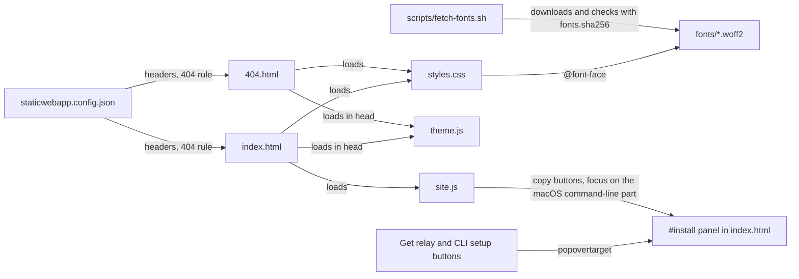
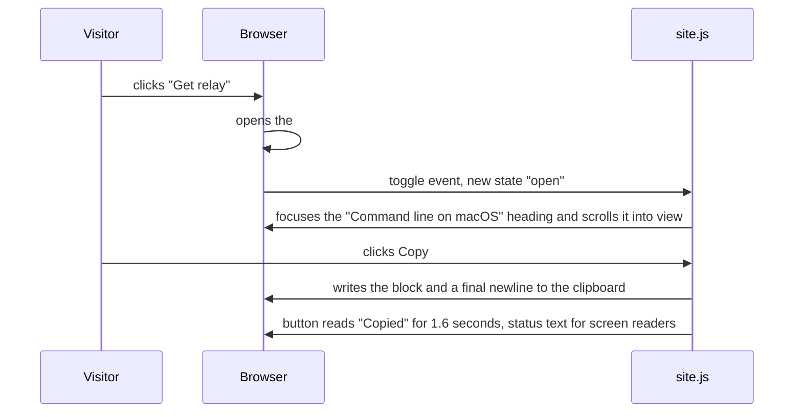
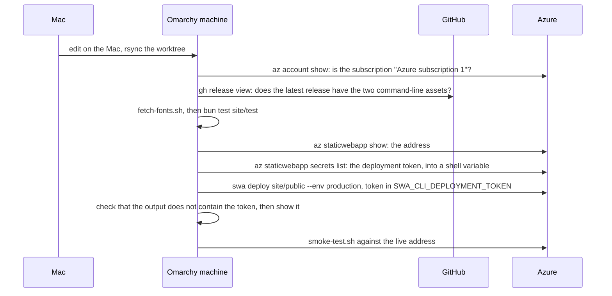

# The website

relay's website is one static page and a not-found page, built from the design preview
(`docs/design/preview.html`) with plain HTML, CSS and JavaScript. There is no build step and no
framework: the folder `site/public/` is deployed exactly as it is in the repository. The change
`openspec/changes/add-website/` describes every decision; this page explains how to work with the
site.

The site is hosted on Azure Static Web Apps, Free plan, as the app `relay-site` in the resource
group `relay-rg` of "Azure subscription 1". Its address is
https://gentle-grass-0343ce80f.6.azurestaticapps.net. Nothing is deployed there yet: the
deployment script refuses to deploy until the repository has a release with the two command-line
assets, `relay-darwin-arm64` and `relay-linux-x64` (see "Deploying").

## Files

| Path | What it is |
|---|---|
| `site/public/index.html` | The home page |
| `site/public/404.html` | The page shown for an address that does not exist |
| `site/public/styles.css` | All the CSS, including the `@font-face` rules |
| `site/public/site.js` | The home page's JavaScript: the hero card's story, the closing panel's track map, the task graph and the copy buttons |
| `site/public/theme.js` | The theme button; it applies the saved theme before the first paint |
| `site/public/favicon.svg`, `site/public/robots.txt` | The tab icon, and the file that asks search engines to stay away |
| `site/public/staticwebapp.config.json` | The headers, the 404 rule and the routes for Azure Static Web Apps |
| `site/public/fonts/` | The fonts, downloaded by `site/scripts/fetch-fonts.sh` and never committed |
| `site/fonts.sha256` | The SHA-256 of each font file |
| `site/scripts/deploy.sh` | Deploys `site/public` to the Static Web App, then runs the smoke test against the live address |
| `site/scripts/smoke-test.sh` | Checks a running copy of the site: the page, the install commands, the headers and the 404 page |
| `site/test/` | File checks that `bun test` runs, without a browser |
| `site/e2e/site.pw.ts`, `site/playwright.config.ts` | Browser checks that Playwright runs |



The diagram shows what each file uses. Both pages load the same stylesheet, and the stylesheet
loads the fonts from the site's own `/fonts/` folder. Both pages load `theme.js` in `<head>`, so the
saved theme is applied before the page is drawn; only the home page loads `site.js`. The
headers in `staticwebapp.config.json` apply to every response, and its 404 rule serves `404.html`
for any address that does not exist. The font script fills `site/public/fonts/`. Every install
button on the home page opens the same panel, and `site.js` only adds the copy buttons and moves
focus to the macOS command-line part when the visitor clicked "Get relay" in the hero or the
closing panel.

The pages load nothing from other servers and contain no inline script or style, because the
Content-Security-Policy in `staticwebapp.config.json` allows only the site's own files; the one
request to another server is the star count from GitHub's API, described below. The
navigation has one theme button: it shows a moon on the light page and a sun on the dark page,
and a click switches to the other theme. The page is light until the visitor chooses dark.
`theme.js` remembers the choice in one `localStorage` entry, `relay-theme`; the only other entry
is the star count, `relay-github-stars`. Josué asked on 2026-10-08 for this button in place of the
first Light, Dark and System switch, after seeing the live site.

## Fonts

The page uses Satoshi for headlines, Public Sans for text and IBM Plex Mono for commands. Run this
on the Omarchy machine to download them into `site/public/fonts/`:

```sh
bun run site:fonts
```

The script downloads Public Sans and IBM Plex Mono from their GitHub releases with `gh`, and
Satoshi from Fontshare with `curl`. It checks each file against `site/fonts.sha256` and copies
nothing if one file differs. When an upstream file changes, a person reviews the new file before
changing its hash.

The font files are never committed. Satoshi's license (ITF Free Font License) allows using it on
your own website but not sharing it through a repository, and the other two fonts follow the same
path so that there is one way to get fonts. `.gitignore` lists `site/public/fonts/`.

## The page's content

The home page has, in order: the hero with the illustrated handoff card, the providers row, and
the sections "Switching agents by hand", "Everything the next agent needs", "One agent or a
hundred", the pricing section and the closing panel, then the footer. Josué asked on 2026-10-08
for the hero's track lines and the "Switch from the terminal" section to be removed, for the
navigation's "Get relay" to use the olive of the hero's main button, and for no tool logos.
Every link goes to a part of the page, to the home page, to the Apache 2.0 license text or to the
public repository, https://github.com/FrejusGdm/relay.

relay is free: nothing is paid and nothing is locked (Josué's decision of 2026-10-09). The
pricing section, "What relay costs.", makes a small joke of it. It shows the price `$19.99`, then
the underlined line "I’m joking.", then "relay is free and open source." and "You already paid for
the agents." The site has no buy button, no checkout, no license page and no API.

The navigation links to the GitHub repository with GitHub's mark (Octicons `mark-github-16`, MIT
License) and the star count, like the header of shadcn/ui. `site/public/github.js` asks
`https://api.github.com/repos/FrejusGdm/relay` for `stargazers_count`, without cookies or
referrer, and keeps the answer for an hour in the `localStorage` entry `relay-github-stars`. It
writes counts above 999 as thousands (`1.2k`). When the request fails, or the repository is
private and GitHub answers 404, the link shows no number. The count's width is kept free from the
start, so the navigation does not move, and phones show the mark only. The Content-Security-Policy
allows `connect-src https://api.github.com` for this request and nothing else.

## The install panel

The "Get relay" and "CLI setup" buttons open one panel, the element with the id `install`. It is
a `popover` element, so the browser opens it, closes it with Escape or a click outside, and returns
focus to the button, all without JavaScript. The panel says that relay is free and open source, and shows two
blocks of commands that download the release assets `relay-darwin-arm64` and `relay-linux-x64`
from the latest release with `curl`, with no GitHub account. Josué made relay open source on
2026-10-08, so the install commands download the release directly. The download address is
longer than a phone is wide, so a long line in a block wraps instead of scrolling sideways;
copying still gives the original lines.

The Mac menu-bar app is not in any release yet, so the panel's "Mac app" block has no command and
no Copy button. It says only "The Mac menu-bar app is not released yet. The command line tool
above works on its own." The Mac app block shows this note until a release contains
`Relay-macOS.zip`. When the app ships, the block gets the commands of block C in the design of the
`add-website` change and the first-launch steps, and the deploy script and smoke test check for
`Relay-macOS.zip` again.



The diagram shows what happens when a visitor opens the panel and copies a block. The browser
opens the panel by itself. `site.js` listens for the panel's `toggle` event and, only for the
"Get relay" buttons in the hero and the closing panel, moves focus to the macOS command-line part. A copy button writes the block's text with a
final newline, so the last command runs when it is pasted into a terminal.

The commands are fixed by the design of the change, and `site/test/install.test.ts` compares each
block with the expected text, character for character. To change a command, change the design,
the page and the test together. When `.github/workflows/release.yml` exists, the same test checks
that the workflow names the two command-line assets.

## Tests

Run every command on the Omarchy machine, in the repository root, after `bun install`.

The file checks need no browser, no network and no font files, so `bun test` runs them with the
rest of the project's tests. To run only them:

```sh
bun run site:test
```

They check that the pages have no inline script or style and load only their own files, that the
stylesheet names no other server, that `site.js` uses no browser storage and makes no network
request, that `theme.js` uses only its one `localStorage` entry, inside `try`, and no network,
that `github.js` asks only GitHub's API for the repository, without cookies or referrer, and uses
only its one `localStorage` entry, inside `try`,
that the font list is exact, and that `staticwebapp.config.json` holds exactly the headers
of the design. They also check the content: the links, the section order, the headline and title,
the theme button and the olive "Get relay" in the navigation, the absence of the hero's track
lines, of the terminal section and of tool logos, the pricing note's three lines with `$19.99` as
the only price, the absence of any buy form, checkout or license link, `robots.txt`, and the
exact install commands.

The browser checks need the fonts and Playwright's Chromium:

```sh
bun run site:fonts
bunx playwright install chromium
SITE_PORT=4280 bun run site:e2e
```

Playwright starts Microsoft's Static Web Apps emulator on `site/public`, at the port in `SITE_PORT`
(4280 when it is not set), so the page gets the same headers and 404 rule as on Azure. The tests
load the page at 1440, 1024 and 390 pixels wide, check that nothing sticks out of the window or out
of a box that clips it, check the spacing, the fonts, the theme button (light by default, the dark
theme kept after a reload without a wrong first paint, the keyboard and focus outline, its size,
and a browser that blocks storage), the olive "Get relay" buttons in both themes, the card's
dialogs and the 404 page, and fail on any console error or Content-Security-Policy violation. They also open the
install panel at each width, check that it and its command blocks fit, copy the macOS block and
compare the clipboard, and close the panel with Escape. They check that "Get relay" shows the
macOS command-line part, and that the Mac app block has no command and says the app is not
released yet. They save full-page screenshots to `site/e2e/out/local-<width>.png` and screenshots
of the open panel to `site/e2e/out/local-install-<width>.png`, and screenshots of the top of the
page in each theme to `site/e2e/out/local-theme-light-<width>.png` and
`site/e2e/out/local-theme-dark-<width>.png`. At 1440 and 390 pixels they check the pricing note in
both themes, check that the page has no buy form or license link, and save the section to
`site/e2e/out/local-pricing-light-<width>.png` and `site/e2e/out/local-pricing-dark-<width>.png`.
Every browser test answers for GitHub's API itself, so no test reaches GitHub. The GitHub link
tests check the count, its accessible name, the focus outline and the mark-only phone layout in
both themes, and save the navigation to `site/e2e/out/local-nav-github-light-<width>.png` and
`local-nav-github-dark-<width>.png` at 1440 and 390 pixels. Others check that a 404 or a failed
request shows no number and saves nothing, that the count is kept for an hour, and that the
navigation does not move when the count arrives.

The emulator's server process can outlive Playwright. After a run, check that nothing still
listens on the port, and stop a leftover process by the PID that `ss` shows:

```sh
ss -ltnp | grep ':4280 '
kill <pid>
```

The Playwright files end in `.pw.ts`, not `.test.ts`, so that `bun test` does not run them. They
have their own TypeScript settings in `site/e2e/tsconfig.json`, because the code they run inside
the page needs the browser's types, which clash with Bun's. `bun run typecheck` checks both.

## Smoke test

`site/scripts/smoke-test.sh` checks a running copy of the site at a base address: the home page
answers 200 with the right title and the install commands, the Content-Security-Policy and the
other security headers are exact, no cookie is set, the Satoshi font is served as `font/woff2`,
`/.auth/login/github` and `/no-such-page` answer 404, and the 404 page has its text. It prints
`Smoke test passed: <address>` or stops at the first failure with `Smoke test failed: <reason>`
and exit code 1.

To try it against the local emulator, start the emulator in the background, run the test, then
stop the emulator by its PID:

```sh
(cd site && npx --yes @azure/static-web-apps-cli@2.0.10 start public --host 127.0.0.1 --port 4280 </dev/null >"$TMPDIR/swa.log" 2>&1 & echo $! >"$TMPDIR/swa.pid")
sh site/scripts/smoke-test.sh http://127.0.0.1:4280
kill "$(cat "$TMPDIR/swa.pid")"
ss -ltnp | grep ':4280 '
```

Wait until `curl -s -o /dev/null -w '%{http_code}' http://127.0.0.1:4280/` prints `200` before
running the test. If `ss` still shows a `node` process on the port, stop it with `kill <pid>`.
The deployment script runs the same test against the live address after each deployment.

## Azure resources

The resource group and the app were created once, on 2026-10-08, with the commands of design
decision 9 of the change. Every command names the subscription, so the Azure CLI's default
subscription is never changed, and the app has no GitHub connection: Azure created no workflow
file and no repository secret.

| Resource | Value |
|---|---|
| Resource group | `relay-rg`, region `eastus2`, tag `project=relay` |
| Static Web App | `relay-site`, Free plan, region `eastus2`, tag `project=relay` |
| Address | https://gentle-grass-0343ce80f.6.azurestaticapps.net |

To check them on the Omarchy machine:

```sh
az staticwebapp show --subscription "Azure subscription 1" --name relay-site --resource-group relay-rg \
  --query "[defaultHostname, sku.name, tags.project]" --output tsv
```

## Deploying

Deploy from the Omarchy machine, in the repository root, after `bun install`:

```sh
bash site/scripts/deploy.sh
```



The diagram shows one deployment. The script stops at the first check that fails: a different
Azure subscription, a latest release without `relay-darwin-arm64` or `relay-linux-x64`
(the script does not require `Relay-macOS.zip`, because the Mac app block shows a "not released
yet" note until a release contains it), a font with a different SHA-256, or a failing file test. Only then does it read
the deployment token and deploy. It ends with `Smoke test passed: https://<address>` and
`Deployed: https://<address>`.

The deployment token lets anyone who holds it replace the site, so the script never shows it. It
reads the token with `az staticwebapp secrets list` into a shell variable and passes it to
`swa deploy` through the `SWA_CLI_DEPLOYMENT_TOKEN` environment variable for that one command. It
never writes the token to a file, never runs with tracing (`set +x`), and never passes
`--print-token` or `--verbose=silly`. It keeps the deployment output in a variable and refuses to
show it if it contains the token. The token is not stored in GitHub.

After a deployment, run the browser tests against the live site. They save screenshots to
`site/e2e/out/live-<width>.png`:

```sh
SITE_URL=https://gentle-grass-0343ce80f.6.azurestaticapps.net bun run site:e2e
```

## Resetting the deployment token

If the token may have leaked, for example because the script stopped with "the deployment output
contained the deployment token", replace it at once. The old token stops working:

```sh
az staticwebapp secrets reset-api-key --subscription "Azure subscription 1" --name relay-site --resource-group relay-rg --output none
```

`--output none` keeps the new token off the screen. The deployment script reads the current token
each time, so nothing else needs to change.

## Changing a header

The headers are in `globalHeaders` of `site/public/staticwebapp.config.json`. To change one,
change it there, in the expected object of `site/test/config.test.ts`, and, for the
Content-Security-Policy, `X-Content-Type-Options`, `X-Frame-Options` and `X-Robots-Tag`, in
`site/scripts/smoke-test.sh`. Then run the tests and deploy again.
