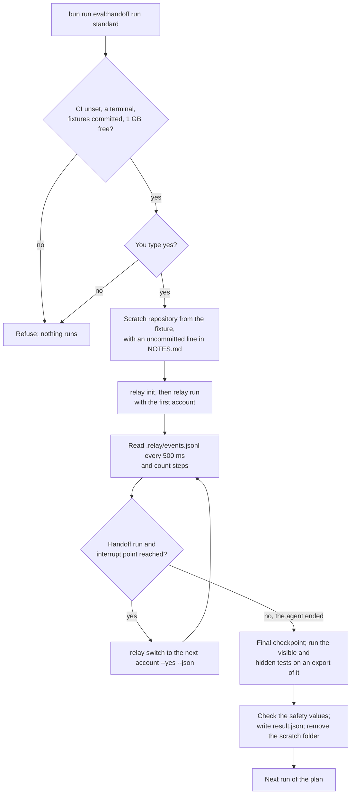

# The handoff evaluation

This folder holds a separate program that measures how well a `relay switch` handoff keeps an
agent's work. It runs real coding agents on four small tasks, interrupts some of them part way,
hands the job to another agent with `relay switch`, and checks the result with tests the agents
never see. It is the evaluation that the change `add-handoff-evaluation` describes
(`openspec/changes/add-handoff-evaluation/`), and it is never part of the `relay` program.

## What it measures, and why

relay's plan has a later phase, single-job failover, in which relay hands a job to another agent
when the first one reaches its limit, with nobody watching. That phase is only worth building if a
handoff keeps the work done before it. Research warns that the notes an agent writes about its own
work can be wrong (`docs/research/architecture.md`, section 5), so this evaluation measures the
handoff on real tasks before anyone builds the automatic version.

Each task runs in two ways. A baseline run gives the task to one agent, which works alone until it
finishes. A handoff run gives the task to a first agent, stops it at 25, 50 or 75 percent of the
steps the baselines needed (or at a chosen event), and hands the job to a second agent with
`relay switch`. A step is one command the agent finished or one file it changed, as relay records
them in `.relay/events.jsonl`.

For every run the evaluation records:

- how many hidden acceptance tests pass at the end, and whether all of them pass (the task is then
  solved);
- how long each agent worked, and the tokens each one used when the provider reports them;
- how many of the first agent's added lines the second agent removed or rewrote (the rework);
- tests that passed at the handoff and fail at the end (regressions);
- whether the second agent wrote `.relay/verify.md`, its check of the first agent's claims, and how
  many claims it found false;
- whether relay left the person's branch, index and uncommitted file alone (the safety check).

The summary compares the handoff runs with the baselines and gives one verdict per direction, for
example from Claude to Codex: build failover, improve the handoff first, or fix relay first.

## Cost warning

The evaluation uses your real subscriptions. Every run starts Claude Code or Codex on one of your
accounts, and the agents spend the same usage limits you use for your own work.

| Plan | Runs | Expected agent time |
|---|---|---|
| `smoke` | 2 | about 35 minutes |
| `standard` | 60 | about 25 hours |
| `full` | 144, or 156 with a second Claude account | about 63 hours, or 68 |

It also sends the fixture repositories to Anthropic and to OpenAI through those accounts. The
fixtures are synthetic code written for this test and hold nothing private.

Because of this cost, `run` refuses to start when the `CI` variable is set or when it has no
terminal. It shows the expected time and the companies that will receive the code, and it starts
only after you type `yes`. When an account reaches its limit, it stops with exit code 5 and prints
the reset time; it never switches to another account to keep going. The plan and summary commands, the fixture check and
the harness's own tests start no agent and cost nothing.

## How a run works



The diagram shows one run from start to end. Every check that can refuse the campaign happens
before you are asked to type `yes`, so a refusal costs nothing. The harness talks to relay only
through its commands and the files relay writes, so it measures what you would use yourself. It
reads relay's event log to count steps, and in a handoff run it calls `relay switch` once the step
count reaches the interrupt point. The tests run on an export of relay's final checkpoint, outside
the folder the agents work in, so the agents never see the hidden tests.

## Before you start

1. Build relay, and put it on your `PATH` or name it in `RELAY_BIN`. The harness also needs `bun`,
   `python3` and `git`, and at least 1 GB free on the disk that holds `~/.relay-eval`.
2. Add the accounts the evaluation will use in relay, and sign in to each:

   ```text
   relay account add claude personal
   relay account add codex personal
   ```

3. Create `~/.relay-eval/targets.toml`, which maps the roles that the plans name to your accounts.
   The `full` plan also uses `claude_second` when you map it; the other plans ignore it.

   ```toml
   claude = "claude:personal"
   codex = "codex:personal"
   claude_second = "claude:startup"
   ```

4. Check that the fixtures are ready:

   ```sh
   bun run eval:handoff check-fixtures
   ```

The harness uses your normal relay folder (`RELAY_HOME`, by default `~/.relay`), because your
account profiles live there. Each run leaves a job record under `RELAY_HOME/jobs/` and an entry for
its scratch project in the allow list of `config.toml`, because relay records which accounts may
work on a project. You can remove those entries after a campaign.

## Commands

Run every command from the root of the relay repository. The program reads two environment
variables: `RELAY_EVAL_HOME`, the folder for `targets.toml` and the campaigns (default
`~/.relay-eval`), and `RELAY_BIN`, the relay program (default `relay` on `PATH`).

`plan <plan>` prints how many runs a plan has, on which accounts, and the expected agent time. It
starts nothing. `<plan>` is `smoke`, `standard`, `full` or the path of a plan file.

```sh
bun run eval:handoff plan smoke
bun run eval:handoff plan standard
```

```text
Plan smoke: 2 runs on claude:personal and codex:personal.
1 baseline and 1 handoff, 1 repetition each.
Expected agent time: about 35 minutes, split between both accounts.
This uses your real subscription limits. Nothing has run.
```

`run <plan>` runs a plan as a campaign, the runs that have no result yet, one after another. A
campaign is stored in `$RELAY_EVAL_HOME/campaigns/<campaign>/`. Running the same command again with
the same campaign name continues it, so you can stop with Ctrl-C at any time and run the command
later. The run that was stopped starts again from the beginning.

```text
bun run eval:handoff run smoke
bun run eval:handoff run standard --campaign 2026-10-12-standard
bun run eval:handoff run standard --campaign 2026-10-12-standard --max-runs 4
bun run eval:handoff run standard --campaign 2026-10-12-standard --only ledger-import__baseline__claude__r1
```

| Option | What it does |
|---|---|
| `--campaign <name>` | The campaign to start or continue. The default is today's date and the plan name, for example `2026-10-12-standard`. |
| `--only <run-id>` | Runs only this run of the plan. |
| `--max-runs <n>` | Stops after `n` runs, for example to fit a subscription window. |
| `--retry-errors` | Also runs again the runs whose last attempt ended in a harness error. |
| `--keep-work` | Keeps each run's scratch folder under `$RELAY_EVAL_HOME/work/` to look at it. |
| `--allow-dirty-fixtures` | Runs fixtures with uncommitted changes, and records their version as `dirty`. |

A run ID names the task, the kind of run, the accounts' roles, the interrupt point and the
repetition, for example `ledger-import__baseline__claude__r1` or
`ledger-import__handoff__claude-to-codex__steps-50__r2`. Baselines run first, because the
interrupt point of a handoff depends on how many steps the baselines of its task needed.

`summarize <campaign>` reads the campaign's result files, writes `summary.md` and `summary.csv`
in the campaign folder, and prints one verdict line per direction. It starts nothing, so you can run
it at any time during a campaign.

```sh
bun run eval:handoff summarize 2026-10-12-standard
```

`annotate <campaign> <run-id> <text>` saves a note in a run's `result.json`. The next summary shows
it. Use it to record what a program cannot judge, for example whether the second agent rewrote a
file for the same purpose as the first.

```sh
bun run eval:handoff annotate 2026-10-12-standard ledger-import__handoff__claude-to-codex__steps-50__r2 "Reworked src/csv.ts for the same purpose."
```

`check-fixtures [<task-id> ...]` checks that every fixture, or the ones named, is ready: the
visible tests pass at the start, enough hidden tests fail at the start, and every test passes with
the reference solution. It starts no agent, and CI runs it.

```sh
bun run eval:handoff check-fixtures rate-limiter
```

| Exit code | Meaning |
|---|---|
| 0 | All requested work is done. |
| 1 | A run ended in a harness error, a fixture check failed, or relay started an agent with a permission bypass flag. |
| 2 | Wrong arguments, or a plan or `targets.toml` that is not valid. |
| 3 | Something needed is missing: relay, an account for a role, the baselines of a handoff, a committed fixture, free disk, or the same plan as when the campaign started. |
| 4 | Refused: `CI` is set, there is no terminal, or you did not type `yes`. |
| 5 | Paused because an account reached its limit. Run the same command again after the reset time it prints. |
| 130 | Stopped with Ctrl-C. |

## Reading result.json

Each run writes `$RELAY_EVAL_HOME/campaigns/<campaign>/runs/<run-id>/result.json`, which you can
read without the harness. Next to it are copies of relay's event log, the logs of the relay
commands, the handoff prompt, `checkpoint.md`, `verify.md` and the JUnit reports of the tests. The
harness never copies an agent's transcript or anything from an account's profile folder.

| Field | Meaning |
|---|---|
| `status` | How the run ended (see the next table). |
| `kind`, `from_target`, `to_target`, `interrupt_point` | The kind of run and the accounts. A baseline has no `to_target` and no `interrupt_point`. |
| `baseline_median_steps`, `interrupt_step_target`, `steps_at_switch` | The median steps of the baselines, the step after which the harness switched, and the steps the first agent had made when relay stopped it. |
| `segments` | One entry per agent: account, model, start and end, steps, why it ended, and usage when the provider reports it. |
| `handoff` | relay's exit code and error, the handoff checkpoint, how long the switch took, how long the next agent needed for its first step, the claims relay and the next agent checked, and the acceptance tests at the handoff. |
| `outcome` | The visible and hidden test counts at the end, `solved`, the regressions, and the rework: `lines_added_before`, `lines_reverted`, `rework_ratio` and `files_reworked`. |
| `control_points` | Baselines only: the same measures at 25, 50 and 75 percent of the steps, taken from snapshots the harness made after each step. |
| `safety` | `ok` is false when the branch tip, its reflog, the index entries or `NOTES.md` changed, or when relay started an agent with a permission bypass flag. |
| `contamination` | True when an event mentions the fixture sources, which would mean an agent looked outside its folder. |
| `notes` | Your note from `annotate`, or the reason of a harness error. |

| Status | Meaning | Used by the rules |
|---|---|---|
| `completed` | The run ended normally. | Yes |
| `finished_before_interrupt` | The first agent finished before the interrupt point. | No, listed separately |
| `handoff_failed` | `relay switch` exited with an error. | Yes, as a failed and unsolved handoff |
| `agent_failed` | An agent failed for a reason other than a limit, or used a bypass flag. | Yes, unsolved |
| `timed_out` | An agent worked longer than the plan's `max_minutes_per_segment`. | Yes, unsolved |
| `contaminated` | An event mentioned the fixture sources. | No, listed |

A run stopped by a limit, by Ctrl-C or by a harness error writes `attempt-<n>.json` instead of
`result.json` and stays pending.

## Reading summary.md

`summary.md` has four parts:

1. A header with the plan, the campaign, the number of completed runs and the tool versions. It
   warns when a model or a tool version changed between runs on the same account.
2. The verdicts, one line per direction, followed by a table of the six rules with the measured
   value, the threshold and whether the rule passes. A direction with fewer than 9 counted handoff
   runs gets `not enough runs yet`.
3. The outcomes, one row per task, kind of run, direction and point. Every rate shows its counts,
   for example `8 of 9`.
4. The runs that need a look: every run with a status other than `completed`, a safety violation, a
   regression, contamination or a claim found false, with a link to its folder.

`summary.csv` has one row per run, for your own analysis.

## The decision rules

The rules use the handoff runs at the step points (25, 50 and 75 percent) of one direction. Runs at
event points and between two accounts of the same provider are shown but not counted. The
thresholds are the recommendation in the change's proposal, pending Josué's decision.

| Rule | Passes when |
|---|---|
| Safety | No counted run of the direction, and no baseline of its two accounts, has a safety violation or a bypass flag. |
| Reliability | At least 94 percent of the handoffs have a `relay switch` exit code of 0 (17 of 18). |
| Quality | The share of solved handoffs is at most 0.10 below the lower share of solved baselines of the two accounts, on the same tasks, and at most 12 percent of the handoffs have a regression (2 of 18). |
| Reuse | After handoffs at 50 and 75 percent, the second agent's median time is at most 0.75 times its median baseline time on the same tasks. |
| Rework | The median handoff `rework_ratio` is at most 0.15 above the median of the baselines' control points. |
| Verification | The second agent wrote `verify.md` in at least 88 percent of the handoffs (16 of 18). |

The verdict is `build failover` when all six rules pass, `fix relay first` when the safety or the
reliability rule fails, and otherwise `improve the handoff first`, with each failing rule, its
value and its threshold. Time counts only in the reuse rule: without failover you wait hours for a
limit to reset, so a few extra minutes for the handoff do not matter, while losing the work done
before it does.

## Adding a fixture

A fixture is a folder `tasks/<task-id>/`, where the task ID uses lower-case letters, digits and
hyphens:

- `task.toml` gives the title, the language, the expected agent minutes, the test commands, the
  text that marks a test run in a command, the number of hidden tests and how many must fail at
  the start. Copy it from an existing fixture of the same language.
- `task.md` is what the agent reads: the goal and every acceptance criterion the hidden tests
  check, with exact names and messages, so the tests check nothing the agent was not told.
- `.start/` is the starting repository. It holds `AGENTS.md`, a `CLAUDE.md` with the line
  `@AGENTS.md`, `.claude/settings.json` like the other fixtures, `NOTES.md`, the code and its
  visible tests. The fixture needs no package installation and no network.
- `.acceptance/` holds the hidden tests. Folders whose names start with a dot are skipped by a bare
  `bun test`, so relay's own test run never runs them.
- `solution/` holds the reference solution: files that replace or add to `.start/`.

Commit the folder, run `check-fixtures` with the new task ID, and add the task to a plan file in
`plans/`.

## Testing the harness

The harness's own tests start no agent. Most of them use a stub `relay` in `test/bin/` that plays
scenario files. The end-to-end test `test/e2e-fake-agents.test.ts` runs the smoke plan against a
real relay program with relay's fake agents from `test/fakes/`; it runs only when `RELAY_BIN` names
a relay program built from this repository, for example with
`bun build ./src/cli/main.ts --compile --outfile=dist/relay`.

```text
bun test ./eval/handoff/test
RELAY_BIN=dist/relay bun test ./eval/handoff/test/e2e-fake-agents.test.ts
```

`test/readme.test.ts` runs every `bun run eval:handoff` command in the `sh` blocks of this file,
against a copy of the sample campaign in `test/data/campaigns/`.
