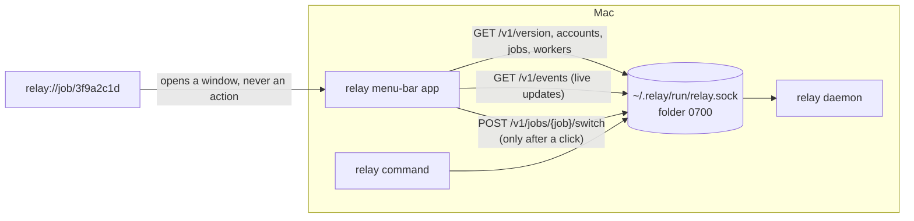

# Design: the Mac menu-bar app

## Context

See proposal.md for the motivation. This change is built after `add-daemon-api-and-status`
(phase 5) is merged, and it uses that change's names and shapes exactly. The parts it relies on:

- **The socket.** `$RELAY_HOME/run/relay.sock` on macOS (`RELAY_HOME` defaults to `~/.relay`), in a
  `0700` folder; the socket file is `0600` (phase 5, `local-api` spec, "Unix socket only"; design
  decisions 1 and 2).
- **HTTP.** HTTP/1.1, `GET` and `POST` only, one request per connection, every response with
  `Connection: close`, request bodies only with `Content-Length` and at most 64 KiB, requests with an
  `Origin` header refused with `403` (phase 5 design decisions 3 and 13). Responses have either a
  `Content-Length` body or, for the event stream, chunks written as they come until the connection
  closes. The daemon never sends `Transfer-Encoding: chunked`.
- **Endpoints and shapes** (phase 5 design decision 14): `GET /v1/version`, `GET /v1/accounts`,
  `GET /v1/jobs`, `GET /v1/jobs/{job}`, `GET /v1/jobs/{job}/workers`, `GET /v1/events`,
  `POST /v1/jobs/{job}/switch`, and the `Account`, `Usage item`, `Job`, `Worker` and `Checkpoint`
  objects, where every field is always present and unknown values are `null`.
- **Errors** (phase 5 design decision 13): `{"error": {"code": "...", "message": "..."}}`, with the
  codes `confirmation_required`, `interactive_start_required`, `operation_in_progress`,
  `job_not_found`, `project_missing` and the others in that table.
- **The event stream** (phase 5 design decision 15): `GET /v1/events`, resumable with
  `Last-Event-ID` or `?since=`, `retry: 1000`, a `: ping` comment every 15 seconds, and the event
  types `job`, `worker`, `checkpoint`, `availability`, `hook`, `reset` and `shutdown`.
- **Availability words and the stale reset rule** (phase 5 design decision 19), and the
  "previous worker" rule of `relay status` (phase 5 design decision 20).
- **The switch engine's questions** (`add-relay-switch` design decisions 16 and 17): the first
  handoff to a new provider, a work account handing to a personal account, and files that instruct
  agents having changed. Only the first one can be answered through the API
  (`"confirm_new_provider": true`).

Facts checked while writing this design (2026-10-07):

- **GitHub's runner images** ([runner-images README](https://github.com/actions/runner-images)):
  `macos-latest` points to macOS 26 on arm64, the same image as the `macos-26` label. The
  [macOS 26 arm64 image](https://github.com/actions/runner-images/blob/main/images/macos/macos-26-arm64-Readme.md)
  runs macOS 26.6.2 and has Xcode 26.0.1 to 26.6, with 26.6 the default. `macos-14` is deprecated.
- **Xcode 26** ([Apple, Xcode support](https://developer.apple.com/support/xcode/)) ships the Swift
  6.2 compiler and supports macOS deployment targets 11 to 26.
- **Gatekeeper.** macOS 15 removed the right-click, Open shortcut for apps that are not notarized;
  the person must allow the app in System Settings, Privacy & Security
  ([Cult of Mac](https://www.cultofmac.com/864843/macos-sequoia-removes-handy-shortcut-bypass-gatekeeper-security/),
  [The Hacker News](https://thehackernews.com/2024/08/apples-new-macos-sequoia-tightens.html)).
  Code on Apple silicon must carry at least an ad-hoc signature to run.
- **`URLSession` cannot open a Unix socket** (`docs/research/architecture.md` section 2), so the app
  needs its own small HTTP client on a socket.

## Goals / Non-Goals

**Goals:**

- A menu-bar card that tells the truth about the job: only what the daemon reported, in words, with
  times, and "unknown" when relay does not know.
- A client that cannot be pointed at a daemon run by another user and cannot reach the network.
- One action (switch) that asks exactly what `relay switch` asks, through the same engine.
- Everything built, tested and photographed on GitHub's macOS runner in one short job.

**Non-Goals:**

- Signing, notarization, updates, starting the daemon, notifications, several jobs at once, Intel
  Macs, the Mac App Store (proposal, "Out of scope").
- Changing the API. Where the API lacks something (test results, which question the engine asked),
  the app shows less, and Open Questions says so.

## Decisions

### 1. A plain Swift package with three app targets

```
mac/
  Package.swift
  Sources/RelayKit/        no SwiftUI: socket, HTTP, event stream, API models, RelayStore, card text
  Sources/RelayUI/         SwiftUI views, tokens, fonts, the menu-bar glyph
  Sources/Relay/           @main App, AppDelegate, MenuBarExtra scene, link windows
  Tests/RelayKitTests/     client, stream, store and card text tests against a fake daemon
  Tests/RelayUITests/      view tests and the screenshots
  Tests/Support/           RelayTestSupport: FakeDaemon, fixture loading, the fixed clock
  Tests/Fixtures/api/      JSON responses in the phase 5 shapes
  Resources/Fonts/         font files, their licenses, SOURCES.md
  Support/Info.plist       the bundle's Info.plist with @VERSION@ and @BUILD@ placeholders
  scripts/make-app.sh      builds Relay.app and Relay-macOS.zip
  scripts/smoke-test.sh    checks the bundle and launches it for five seconds
```

`mac/Package.swift`:

```swift
// swift-tools-version: 6.0
import PackageDescription

let package = Package(
    name: "RelayMac",
    platforms: [.macOS(.v14)],
    products: [.executable(name: "Relay", targets: ["Relay"])],
    targets: [
        .target(name: "RelayKit"),
        .target(name: "RelayUI", dependencies: ["RelayKit"]),
        .executableTarget(name: "Relay", dependencies: ["RelayKit", "RelayUI"]),
        .target(name: "RelayTestSupport", dependencies: ["RelayKit"], path: "Tests/Support"),
        .testTarget(name: "RelayKitTests", dependencies: ["RelayKit", "RelayTestSupport"], path: "Tests/RelayKitTests"),
        .testTarget(name: "RelayUITests", dependencies: ["RelayKit", "RelayUI", "RelayTestSupport"], path: "Tests/RelayUITests"),
    ]
)
```

Swift 6 language mode (strict concurrency checking) is on through tools version 6.0. Tests use
Swift Testing (`import Testing`), which ships with the Xcode 26 toolchain and runs under
`swift test`. There are no package dependencies.

`swift package init --type executable` would write a similar file, but it needs a Swift toolchain,
and the project rules forbid builds on the Mac and Omarchy has no Swift for macOS. The file above
is what the generator writes plus the targets; task 1.1 checks it with `swift package
describe` on the runner.

Test fixtures and font files are read from paths built from `#filePath`, not through SwiftPM
resources, because the bundle script copies files itself and `Bundle.module` does not find resource
bundles inside a hand-made `.app`.

### 2. Minimum macOS 14

`LSMinimumSystemVersion` 14.0 and `.macOS(.v14)`:

- `MenuBarExtra` and `.menuBarExtraStyle(.window)` need macOS 13
  (`docs/research/architecture.md` section 7). `ImageRenderer`, used for the screenshots, also
  needs 13.
- The Observation framework (`@Observable`), which keeps the app's state small and testable, needs
  macOS 14. `NSRunningApplication.activate()` without options is also new in 14.
- Apple usually ships security updates for the current macOS and the two before it; in October 2026
  that is 26, 15 and 14.
- Xcode 26.6, the default on `macos-26`, targets macOS 11 to 26, so 14 builds with the runner's
  default toolchain. The compiler checks every API against the deployment target.

Josué's Mac runs macOS 26. The app is tested only on macOS 26 (the runner); macOS 14 and 15 are
built for but not run in CI (Risks).

### 3. A Swift package and a bundle script instead of an Xcode project

Alternatives considered:

- **An Xcode project (`.xcodeproj`) built with `xcodebuild`.** It makes the bundle, the
  `Info.plist` and asset catalogs for you, but `project.pbxproj` is a large generated file that
  reviewers cannot read and agents edit badly, and the app needs no asset catalog, entitlement,
  extension or Interface Builder file. Rejected.
- **XcodeGen or Tuist to generate the project.** Another tool to install and pin on the runner.
  Rejected for the same reason.
- **A Swift package plus a script.** The app bundle of a menu-bar app is a folder with three
  things: the executable, `Info.plist` and resources. `swift build` makes the executable; the
  script copies the rest. Chosen.

`mac/scripts/make-app.sh <version> [<build number>]`:

```sh
#!/bin/sh
# Builds mac/build/Relay.app and mac/build/Relay-macOS.zip. Runs on macOS only.
set -eu
version="$1"
build="${2:-1}"
case "$version" in
  *[!0-9.]* | "" | .* | *. | *..*) echo "Version must look like 0.8.0, got: $version"; exit 2 ;;
esac
cd "$(dirname "$0")/.."
swift build -c release --product Relay
bin="$(swift build -c release --show-bin-path)/Relay"
app=build/Relay.app
rm -rf build
mkdir -p "$app/Contents/MacOS" "$app/Contents/Resources/Fonts"
cp "$bin" "$app/Contents/MacOS/Relay"
sed -e "s/@VERSION@/$version/" -e "s/@BUILD@/$build/" Support/Info.plist > "$app/Contents/Info.plist"
for font in PublicSans-Regular.otf PublicSans-Medium.otf PublicSans-SemiBold.otf PublicSans-Bold.otf \
  PublicSans-LICENSE.txt IBMPlexMono-Regular.otf IBMPlexMono-Medium.otf IBMPlexMono-LICENSE.txt; do
  cp "Resources/Fonts/$font" "$app/Contents/Resources/Fonts/"
done
plutil -lint "$app/Contents/Info.plist"
codesign --force --sign - --timestamp=none "$app"
codesign --verify --strict --verbose=2 "$app"
(cd build && ditto -c -k --keepParent Relay.app Relay-macOS.zip)
echo "Built mac/build/Relay-macOS.zip"
```

The fonts are copied by name, so a missing font fails the build instead of shipping the system
font silently. `--sign -` is an ad-hoc signature: no identity, no Apple account. It covers `Info.plist` and the
resources, which the linker's automatic signature of the executable does not. `ditto -c -k
--keepParent` is Apple's tool for zipping bundles and keeps their metadata.

`mac/Support/Info.plist`:

```xml
<?xml version="1.0" encoding="UTF-8"?>
<!DOCTYPE plist PUBLIC "-//Apple//DTD PLIST 1.0//EN" "http://www.apple.com/DTDs/PropertyList-1.0.dtd">
<plist version="1.0">
<dict>
  <key>CFBundleDevelopmentRegion</key><string>en</string>
  <key>CFBundleDisplayName</key><string>relay</string>
  <key>CFBundleExecutable</key><string>Relay</string>
  <key>CFBundleIdentifier</key><string>io.github.frejusgdm.relay</string>
  <key>CFBundleInfoDictionaryVersion</key><string>6.0</string>
  <key>CFBundleName</key><string>relay</string>
  <key>CFBundlePackageType</key><string>APPL</string>
  <key>CFBundleShortVersionString</key><string>@VERSION@</string>
  <key>CFBundleVersion</key><string>@BUILD@</string>
  <key>CFBundleURLTypes</key>
  <array>
    <dict>
      <key>CFBundleURLName</key><string>io.github.frejusgdm.relay.job-link</string>
      <key>CFBundleURLSchemes</key><array><string>relay</string></array>
    </dict>
  </array>
  <key>LSMinimumSystemVersion</key><string>14.0</string>
  <key>LSUIElement</key><true/>
  <key>NSHighResolutionCapable</key><true/>
</dict>
</plist>
```

The bundle identifier uses the GitHub account because the project has no domain yet and the name
is an open decision (`docs/ROADMAP.md`, "Decisions still open"); Open Questions lists it.

The app is built for arm64 only (the runner is arm64, and the CLI ships for macOS arm64 only).

### 4. The socket client

Module `RelayKit/Socket/`. The app uses the C socket calls from the `Darwin` module (`socket`,
`connect`, `getpeereid`, `read`, `write`, `close`), not Apple's Network framework, because only a
raw file descriptor allows the peer check below. Network framework's `NWConnection` to
`NWEndpoint.unix(path:)` was the approach phase 5 assumed; it cannot report the peer's user ID.
Rejected for that reason. `AsyncHTTPClient` (SwiftNIO) supports Unix sockets but adds a large
dependency tree and several minutes of macOS build time; rejected (`docs/research/security.md`
section 8, recommendation 6: keep dependencies few).

Finding the socket (`SocketLocation.resolve(environment:home:)`):

1. `RELAY_HOME` from the app's environment when set and absolute, else `~/.relay`. An app started
   from Finder does not see shell variables; `docs/mac-app.md` says to start it with
   `RELAY_HOME=/path open -n /Applications/Relay.app` when a different folder is needed.
2. The folder is `<home>/run`, the socket `<home>/run/relay.sock`.
3. The socket path must be at most 103 bytes in UTF-8, the same limit as the daemon.

Checks before every connection (`SocketLocation.check()`), mirroring the daemon's own checks
(phase 5 design decision 2):

- `lstat(<home>/run)`: missing means the daemon is not running. A symbolic link, something other
  than a folder, an owner other than `getuid()`, or any group or other permission bit
  (`mode & 0o077 != 0`) is refused with the messages in decision 9.
- `lstat(relay.sock)`: missing means not running; anything other than a socket is refused.

Connecting (`UnixSocket.connect(path:timeout:)`): `socket(AF_UNIX, SOCK_STREAM, 0)`, `SO_NOSIGPIPE`,
`SO_RCVTIMEO` and `SO_SNDTIMEO` from the timeout, `connect`. `ENOENT` and `ECONNREFUSED` mean the
daemon is not running. Then `getpeereid(fd, &uid, &gid)`; if the call fails or `uid != expectedUID`
(`getuid()` by default; tests inject another value), the socket is closed before any byte is
written and the error is `peerIsAnotherUser`.

Blocking calls run on a private serial `DispatchQueue` per connection and are exposed as `async`
functions with `withCheckedThrowingContinuation`; the event stream reads on its own `Thread`.

### 5. The HTTP subset

Module `RelayKit/HTTP/`. Requests are written as:

```
GET /v1/jobs HTTP/1.1\r\n
Host: relay\r\n
Accept: application/json\r\n
User-Agent: relay-mac/<CFBundleShortVersionString>\r\n
\r\n
```

`POST` adds `Content-Type: application/json` and `Content-Length`. The event stream request uses
`Accept: text/event-stream` and, when the app has seen an event, `Last-Event-ID: <id>`. The client
never sends `Origin`, `Cookie`, `Authorization` or `Transfer-Encoding`, and never follows a redirect.

Responses (`HTTPResponseReader`), as a state machine fed with bytes:

- The head must end with `\r\n\r\n` within 16 KiB, start with `HTTP/1.1 <3 digits> `, and have
  header lines with a colon. Anything else is `malformedResponse`.
- A `Transfer-Encoding` header is `malformedResponse` (the daemon never sends one).
- The body is read in one of two modes, chosen by the request:
  - **Whole body** (every endpoint except `/v1/events`): with `Content-Length`, read exactly that
    many bytes; without it, read until the daemon closes the connection. A body above 4 MiB is
    `responseTooLarge`.
  - **Streaming body** (`/v1/events` only): after the head, every chunk of bytes is handed to the
    `SSEParser` as it arrives, so events reach the store one by one while the connection stays
    open. There is no limit on the length of the stream; the limit is on one event (decision 7).
    The stream ends when the daemon closes the connection.
- JSON endpoints must answer `Content-Type: application/json...`; the event stream must answer
  `text/event-stream...`.
- Status 2xx decodes the expected type; any other status decodes the error body
  `{"error":{"code","message"}}` into `APIError(status:code:message:)`, or `malformedResponse` if it
  does not decode.

Timeouts: 2 seconds for a whole `GET` with a whole body (connect, write, read); for the event
stream, 2 seconds until the response head has arrived, then no overall limit, only an inactivity
limit of 45 seconds between two reads that return bytes (the daemon sends `: ping` every 15
seconds), set with `SO_RCVTIMEO` on that socket; 15 minutes for the switch `POST`, because the
engine may ask the outgoing agent for notes (up to 120 seconds) and run the job's checks. A `POST`
is never retried by the client. Every time limit is measured with a monotonic clock (`ContinuousClock`), so a
change of the system time cannot end or stretch one; tests inject a clock they move by hand.

### 6. API models and decoding

Module `RelayKit/API/`. `Codable` structs named after phase 5's shapes: `VersionInfo`, `Account`,
`Availability`, `UsageItem`, `Job`, `Worker`, `Checkpoint`, `APIErrorBody`, and the request
`SwitchRequest {target, confirm_new_provider}` and response `SwitchResponse {worker}` (the
`handoff` object is decoded as optional and not used). The decoder uses
`.convertFromSnakeCase` and a date strategy that accepts ISO 8601 with and without fractional
seconds. Unknown fields are ignored. Enumerations with string values (`Availability.status`,
`Worker.state`, `Worker.mode`, `Worker.endReason`, `Checkpoint.kind`) decode unknown strings to an
`.other(String)` case, because phase 5 may add values within v1 (phase 5 decision 16); the card
shows "Unknown" for them.

`DaemonClient` methods: `version()`, `accounts()`, `jobs()`, `job(id)`, `workers(jobID)`,
`switchJob(id, target:, confirmNewProvider:)`, `events(lastEventID:) -> AsyncThrowingStream<ServerEvent, Error>`.
Each `GET` method returns its data together with the snapshot number from the `Relay-Stream-Seq`
header (decision 7), or `nil` when the header is absent or not a whole number.
Job IDs are checked against `^[0-9a-f]{8}$` and targets against
`^[a-z][a-z0-9-]*:[a-z0-9][a-z0-9_-]*$` before a request is built (phase 5 decision 14), so no
other text reaches a request line.

The version check: `api` must be `"v1"` and `capabilities` must contain `accounts`, `jobs` and
`events.sse`; otherwise the app shows the "too old" state (decision 9). The switch button appears
only when `capabilities` contains `jobs.switch`.

### 7. The event stream

Module `RelayKit/Events/`. `SSEParser` turns bytes into events by the server-sent events rules:
lines end with `\n` (a `\r\n` is accepted); `id:`, `event:`, `data:` (several `data:` lines are
joined with `\n`), `retry:`; lines starting with `:` are comments; a blank line ends an event. The parser keeps only
the unfinished line and the lines of the event being read; when they pass 1 MiB, the stream fails
with `malformedResponse` and the app reconnects. Bytes already turned into events are not kept.

`ServerEvent` cases, decoded from `event:` and `data:`:

| `event:` | `data:` decoded as | Store change |
|---|---|---|
| `job` | `Job` | upsert the job |
| `worker` | `Worker` | upsert the worker when it belongs to a loaded job |
| `checkpoint` | `{job_id, checkpoint}` | set the job's `last_checkpoint` when the number is higher |
| `availability` | `{target, availability, usage?}` | upsert the account's availability and usage |
| `hook` | ignored | none |
| `reset` | `{}` | drop the cursor and object numbers, reload everything with the `GET` endpoints |
| `shutdown` | `{}` | connection state "not running", then reconnect (below) |
| anything else | ignored | none |

Phase 5 decision 15 says the data of `availability` is an `Account` and its example shows
`{"target", "availability"}`; decoding `target`, `availability` and an optional `usage` works with
both. The contract test (task 2.5) shows which one the daemon sends.

**Ordering of snapshots and events.** A `GET` answer and a replayed event can describe the same
object at different moments, so "the later message wins" is wrong: a worker that disappeared
without a recorded end reads as `stopped` (with `ended_at` `null`) in `GET /v1/jobs/{job}/workers`,
while a replayed `worker` event from before that reads as `running`, also with `ended_at` `null`.
The app places every piece of data on the daemon's event sequence (the `stream_events.seq` that
phase 5 sends as the event `id`):

- A `GET` snapshot replaces an object when the snapshot's number is greater than or equal to the
  object's number, because it was read at that point or later.
- Each object the store holds (a job, a worker, an account's availability, a job's last
  checkpoint) carries the sequence number of the data it came from: the event's `id` for event
  data, and the snapshot number for `GET` data.
- The snapshot number is the value of the response header `Relay-Stream-Seq`, which phase 5 is
  asked to add (requirement A in decision 17): the highest
  `stream_events.seq` whose change is already in the response.
- An event changes an object only when its `id` is greater than the object's number. Within one
  stream, events arrive in increasing `id`, so newer events always apply.
- Until phase 5 sends the header, a snapshot's number is unknown, and the app falls back to rules
  that never move backwards: a job only with a strictly newer `updated_at`; an availability only
  with a strictly newer `measured_at` (`null` is oldest); a checkpoint only with a higher `number`.
  A tie keeps what the store has.
- One rule holds in both cases, because it is a fact about workers: a worker's state only moves
  forward, `starting`, then `running`, then `stopped`, then `ended`, and a worker with `ended_at`
  never loses it. A new run always gets a new worker ID. The same rule applies to the
  `current_worker` inside a `Job`, and a snapshot may always move a worker forward, even when the
  job's `updated_at` is unchanged (phase 5 computes `stopped` when it answers, without changing
  `updated_at`).

**The event cursor and the daemon instance.** The last applied event `id` (the cursor) is only
meaningful for the stream it came from. Phase 5 rebuilds `relay.db`, including `stream_events`, only
when the daemon starts (phase 5 decision 11: a missing, damaged or old database is rebuilt on
opening, and `relay doctor --reindex` stops and restarts the daemon), and a rebuilt table starts its
numbers again from 1. The daemon only sends `reset` for a cursor older than its history, so an old
cursor that is ahead of the new numbers would skip every update without any error. The app
therefore stores the cursor together with the daemon instance it came from, the pair (`pid`,
`started_at`) of `GET /v1/version`. When `version()` reports another instance, the app drops the
cursor and every object number before it reconnects, and opens the stream without
`Last-Event-ID`. A restart without a rebuild also drops the cursor; the cost is one full reload,
which the cycle below does anyway. When phase 5 adds `stream_epoch` (requirement C), the app
compares that instead, and keeps the cursor across restarts that did not rebuild the table.

A `reset` event also drops the object numbers and the cursor, then reloads.

Connection cycle (`RelayStore.run()`):

1. `version()`. If the instance differs from the cursor's instance, drop the cursor and the object
   numbers.
2. Open `events(lastEventID:)` with the cursor, if any. Events that arrive before step 3 finishes
   are held in order.
3. `accounts()`, `jobs()`, and `workers()` for the shown job; store their data with their
   snapshot numbers. Then apply the held events by the ordering rules above, then every new event as
   it arrives. The `id` of every event received, applied or skipped, becomes the cursor.
4. When the stream ends or fails, or no byte (not even `: ping`) arrives for 45 seconds, close it
   and wait: the stream's `retry` value (1,000 ms, and never more than 60 seconds) the first time, then 2, 4, 8, 16 and at most 30
   seconds. After any reconnect, go back to step 1, so a daemon that restarted or rebuilt its index
   is read again in full. The count of failed cycles goes back to zero only when a cycle is healthy:
   `version()` succeeded, every `GET` of step 3 succeeded, and the event stream answered `200` with
   `text/event-stream` and delivered at least one byte after its head. A working `GET /v1/version`
   alone never resets the wait, so a stream refused with `503` (phase 5 allows 32 clients) is
   retried after 2, 4, 8, 16 and 30 seconds, not every second.
5. When the person opens the menu-bar window and the state is "not running", the wait is cut short
   and step 1 runs at once.

**Refreshing liveness.** Phase 5 computes a worker's `running` or `stopped` state from its process
when it answers a `GET`, and the event stream carries only recorded events. A worker whose process
and supervising `relay run` both disappear without writing `worker_ended` would stay "Working" on
the card forever, while the stream keeps sending healthy `: ping` lines. So while the stream is
connected, the app also repeats step 3 (`accounts()`, `jobs()` and `workers()` for the shown job, all
read-only) every 30 seconds while the menu-bar window or a link window is open, and every 5 minutes
while none is open, and once as soon as a window opens. These snapshots go through the same
ordering rules. Phase 5 requirement D (decision 17) would let a later version drop the refresh to
the closed-window rate.

States change only on daemon answers and events, never on a timer of the app's own (`DESIGN.md`,
"Motion"); the refresh above only asks the daemon again. One more timer exists: once a minute the
card text is recomputed from the same data, so ages ("2 min ago") and the stale reset rule
(decision 8) stay correct.

### 8. Which job the card shows, and its text

Module `RelayKit/Card/CardModel.swift`, a pure function `CardModel.make(store snapshot, now:,
calendar:, locale:)` that returns every string and flag the views need. The views contain no
rules; tests check the model.

Which job: in the menu-bar window, among jobs whose `current_worker.state` is `running` or
`starting`, the one with the newest `updated_at`; if none, the job with the newest `updated_at`. A
`relay://` window shows the job its link names.

Names:

- Provider name: the account's `provider_name` from `GET /v1/accounts`; otherwise `claude` "Claude
  Code", `codex` "Codex", else the provider ID.
- Account line in a worker row: the account part with a capital first letter and " account", for
  example `codex:personal` gives "Personal account".
- Repository line: the last folder name of `project_root`, then " · " and the job ID in monospace,
  for example "auth · 3f9a2c1d". When `project_missing` is true: "Project folder not found" in the
  warning color, with those words.
- Times: `Date.FormatStyle` with the system's 12- or 24-hour setting; within the same day only the
  time ("18:00"), within six days the weekday and time ("Thu 09:00"), otherwise "Oct 12, 09:00".
  Ages: "just now", "<n> min ago", "<n> h ago", then the date. Tests fix the locale to `en_GB` and
  the time zone to UTC.

Account availability words (phase 5 decision 19). First the stale rule: `rate_limited` or
`quota_exhausted` with a `retry_at` in the past counts as `unknown`, marked stale.

| Status | Word | With a reset time | Without |
|---|---|---|---|
| `available` | Available | | |
| `rate_limited` | Limit reached | "Limit · resets 18:00" | "Limit · reset unknown" |
| `quota_exhausted` | Out of quota | "Out of quota · resets Oct 12, 09:00" | "Out of quota · reset unknown" |
| `unavailable` | Unavailable | | |
| `unknown` | Unknown | | "Unknown · reset time passed" when stale |
| other value | Unknown | | |

Worker state words: `running` "Working", `starting` "Starting", `stopped` "Stopped", `ended` with
`end_reason` `stopped_by_switch` "Handed off", `exited` "Finished", any other "Ended".

Previous worker: the newest worker in `GET /v1/jobs/{job}/workers` that has `ended_at`, when its
target differs from the current worker's target (the same rule as `relay status`). Without a
current worker, the newest worker is shown alone as "Last worker".

The status line (one line, the first part in the accent color and semibold):

| Case, checked in this order | Text |
|---|---|
| Current worker running, `from_handoff`, previous account limited (not stale) | **Moved to Codex** · Claude Code reached its limit |
| Current worker running, `from_handoff` | **Moved to Codex** · from Claude Code (or **Moved to Codex** without a previous worker) |
| Current worker running | **Codex is working** |
| Current worker starting | **Starting Codex** |
| Current worker stopped | **Codex stopped** · relay did not record why |
| No current worker, last worker's account limited | **Limit reached** · Claude Code resets 18:00 (or "reset unknown") |
| No current worker | **No agent is working on this job** |

The tiny card (280 points wide, `docs/design/preview.html` `.rc-tiny`):

- the job title (Public Sans 600, 13 pt), then the repository line (11 pt, muted);
- the status line (10.5 pt, accent) with the arrow glyph, cut with "…" at the end when too long;
- a rule, then on the left "Same checkpoint & plan" when the current worker came from a handoff,
  otherwise "Checkpoint 912ec1" or "No checkpoint yet" (10 pt, muted), and on the right the primary
  action label with "↗" (11 pt, accent, semibold).

Clicking anywhere on the tiny card except the primary action expands it.

The expanded card (376 points wide, `.rc-card`), in the order `DESIGN.md` fixes:

1. Head: "relay" with the glyph on the left; "Show less" and "Quit" text buttons on the right (the
   preview's "Pin" is out of scope).
2. The job title (Public Sans 700, 23 pt, tracking −0.028 em; decision 13) and the repository line.
3. The status line (13 pt, weight 500).
4. The flow: the previous worker row (role "Previous worker"), the connector, the current worker
   row (role "Current worker", accent border and accent-soft background). Each row: provider name
   (14 pt, 600), role (11 pt, muted), account line, state words (accent for "Working", warning color
   for limits), and the usage bar only when the account's `usage` is not empty: a 3-point bar of the
   narrowest window's `used_percent` with the text "9% used · 5-hour window · checked 14:30". The
   connector caption is "Handed off · 14:19" and "Same repository & plan" when the current worker
   has `from_handoff` (the time is its `started_at`), otherwise "Started · 14:19". With only one
   worker there is one row and no connector.
5. Facts (a two-column list, 12 pt): "Checkpoint" with the first 6 characters of the commit in
   IBM Plex Mono and "· saved 14:19", or "None yet"; "Carried over" with "Repository, checkpoint &
   plan" only after a handoff.
6. The primary action (decision 10), full width; then "View checkpoint" (when a checkpoint exists)
   and "Switch worker…" (when the API has `jobs.switch` and the project is not missing) as text
   buttons.

Tokens come from `DESIGN.md` ("Color") in `RelayUI/Theme.swift`, light and dark, following the
system appearance; `--on-accent` is `#FBFAF7` in light and `#0D0D0C` in dark, as in the preview.
The card fills the menu-bar window, whose corners and shadow macOS draws; inner worker boxes use a
9-point radius as in the preview.

Motion (`DESIGN.md`, "Motion"): expanding and collapsing use
`.timingCurve(0.22, 1, 0.36, 1, duration: 0.18)` on opacity and offset only; status text changes
fade over 0.12 seconds; buttons move down 1 point while pressed for 0.1 seconds. With "Reduce
motion" on (`accessibilityReduceMotion`), every change is instant.

Accessibility: every status has words; the menu-bar icon's accessibility label is "relay: " plus the
status line as plain text; the primary action is the default button (Return).

### 9. States without a job to show

| State | Title | Text | Primary action |
|---|---|---|---|
| Connecting (before the first answer, at most 2 seconds) | relay | Connecting to relay… | none |
| Not running (no folder, no socket, `ECONNREFUSED`, timeout, `shutdown`) | relay is not running | Start it in a terminal: `relay daemon start` | Copy command |
| Folder not private | relay will not connect | `<dir>` must be private (mode 0700, owned by you). Fix it with: `chmod 700 <dir>` | Copy command |
| Folder is a symbolic link | relay will not connect | `<dir>` is a symbolic link. relay only uses a real folder. | none |
| Socket is not a socket | relay will not connect | `<path>` exists and is not a socket. | none |
| Peer is another user | relay will not connect | The relay socket belongs to another user. | none |
| Socket path too long | relay will not connect | The socket path `<path>` is too long. Set RELAY_HOME to a shorter path. | none |
| Version check failed | This relay is too old for this app | Update relay, then run: `relay daemon restart` | Copy command |
| No jobs | No jobs yet | Run `relay init` in a project to start one. | none |

The tiny card shows the title and text; the expanded card adds the action. The menu-bar icon is the
same in every state (a template image), and its accessibility label carries the title.

### 10. The primary action and the checkpoint sheet

The primary action opens a view; it never starts, stops or sends anything.

- **When the current worker is `running` or `starting` and has a `pid`:** find the app that runs it.
  Starting at `pid`, read the parent process ID with `proc_pidinfo(pid, PROC_PIDTBSDINFO, …)`
  (`pbi_ppid`), at most 32 steps, stopping at process 1. The first process for which
  `NSRunningApplication(processIdentifier:)` exists with `activationPolicy == .regular` is the host
  (for example Terminal, iTerm2, Ghostty or Visual Studio Code). The label is "Open Codex in
  Terminal" (provider name and the host's `localizedName`); the action is `host.activate()`.
- **Otherwise** (a headless worker, which is a child of the daemon; an agent inside `tmux`, whose
  server is not an app; no worker; a host that quit): "Show project in Finder", which calls
  `NSWorkspace.shared.activateFileViewerSelecting([project_root URL])`. When the project is missing,
  there is no primary action.

The host is looked up each time the window opens, when the current worker's process ID changes
(after a switch, or when a link's job arrives after its window opened), and each time a link window
is shown again, never in the background. A host is used only for the process ID it was found for. Process lookups go
through a `ProcessTable` protocol so tests can give a fake process tree.

The checkpoint and switch sheets are shown in place of the card, inside the same window, until they
close: a menu-bar window has no stable parent for a system sheet. The primary action's button
carries the host's process ID, so pressing it activates that process and nothing else.

"View checkpoint" opens a sheet: title "Checkpoint 7"; rows "Commit" (all 40 characters, IBM Plex
Mono, selectable), "Saved" (time and age), "Kind" (`baseline` "First checkpoint", `manual` "Saved
by you", `pre_rollback` "Saved before a rollback", `handoff` "Saved at a handoff", `auto` "Saved
automatically", other "Checkpoint"), "Message" (only when not empty), "Ref" (monospace); buttons
"Copy commit" and "Close".

### 11. Switch worker

Module `RelayKit/Switch/SwitchFlow.swift` (a state machine the sheet observes) and
`RelayUI/SwitchSheet.swift`.

The sheet:

- Title "Switch worker". Text: "relay saves a checkpoint, stops Claude Code and starts the next agent
  with the same repository and plan." (without a running worker: "relay saves a checkpoint and starts
  the next agent with the same repository and plan.")
- A list of accounts with `configured: true`, except the current worker's account, sorted by
  target: the target in monospace, the provider name, and the availability words of decision 8.
  The person selects one.
- Buttons "Cancel" and "Switch to codex:personal" (disabled until an account is selected).

The request body is written as `{"target":"<target>","confirm_new_provider":<true or false>}`
in that key order; the target has already matched the target pattern, so it needs no escaping.

The flow (every message shown is the API's `message`, word for word):

1. Send `POST /v1/jobs/{job}/switch` with `{"target":"codex:personal","confirm_new_provider":false}`.
   The button reads "Switching…" and the text "This can take a few minutes while relay saves the
   work and runs the job's checks. You can close this window; the switch continues." appears.
2. `200`: the sheet closes. The card updates from the response's `worker` and from the events.
3. `409 confirmation_required`, first time: show the message, with "Cancel" and "Send and switch".
   "Send and switch" repeats step 1 with `"confirm_new_provider": true`. This matches the engine's
   order, which asks the allow-list question before any other (`add-relay-switch` decision 3,
   steps 10 and 11).
4. `409 confirmation_required` after step 3, or `409 interactive_start_required`: show the message,
   then "Run this in a terminal:" and the command `cd '<project_root>' && relay switch <target>`
   (single quotes, with each `'` written as `'\''`), with "Copy command" and "Close". The API cannot
   answer these questions, and the app does not try.
5. Any other error status: show the message and "Close". `operation_in_progress` needs no special
   case.
6. No answer within 15 minutes, or a closed connection: "relay did not answer. The switch may still
   be running; this card updates when relay reports it." and "Close". No retry.

Decided while building task 4.2 (2026-10-08, after review):

- Return presses "Switch to …" only. "Send and switch" has no key, so pressing Return twice cannot
  answer the provider question before the person has read it; Escape presses "Cancel" or "Close".
- While the request runs, the left button reads "Close". It only hides the sheet: the request
  continues, and a later question from the daemon appears when the person opens "Switch worker…"
  again. "Cancel" ends the flow for good, and nothing more is sent after it.
- "The switch may still be running" appears only when the connection closed before the answer or
  the 15 minutes passed. When the app could not connect at all, the sheet says "The switch was not
  sent, because relay is not running." with the command of decision 9; an answer the app cannot
  read says that the switch may have run.
- The `'\''` quoting of step 4 is right for sh, bash and zsh, but fish also reads a backslash
  inside single quotes. When the project path contains a backslash or a control character, the
  sheet shows the daemon's message without a command to copy.

Before step 1 there is no extra "Are you sure?" dialog: `relay switch` has none, and choosing an
account and pressing a button named after it is the deliberate act.

### 12. `relay://` links

Module `RelayKit/Links/RelayLink.swift`, `RelayLink.parse(_ url: URL) -> JobID?`. A link is
accepted only when the scheme is `relay` (any case), the host is `job`, the path is `/` followed by
exactly 8 characters `0-9a-f`, and there is no user, password, port, query or fragment. Every other
link returns `nil` and is ignored without a message.

`Info.plist` registers the scheme (decision 3). `AppDelegate.application(_:open:)` receives the
URLs. For each accepted job ID it shows one window (`NSWindow` with an `NSHostingView` of the
expanded card for that job, title "relay", 376 points wide), reusing the window already open for
the same job, and calls `NSApp.activate()`. An unknown job shows the API's `job_not_found` message
in that window; any other failure to load the job shows the API's message, or that relay is not
running or did not answer, instead of "Connecting to relay…". The link is compared as text, so
`relay://job:/…`, `relay://@job/…` and `relay://JOB/…` are ignored too. The window's actions are the same as the menu-bar card's: opening a link never
sends a `POST`.

An `NSWindow` made by the app delegate is used instead of a SwiftUI `WindowGroup` with
`handlesExternalEvents`, because a menu-bar app has no SwiftUI scene that is always alive to call
`openWindow`, and the AppKit path behaves the same on every macOS version from 14.

### 13. Fonts

`DESIGN.md` names Satoshi (headlines), Public Sans (text) and IBM Plex Mono (identifiers). The app
ships Public Sans Regular, Medium, SemiBold and Bold, and IBM Plex Mono Regular and Medium, each
with its license file. Both use the SIL Open Font License, which allows bundling. No font file is
committed: `mac/scripts/fetch-fonts.sh` downloads them from their official releases in the
workflow and checks each file against the SHA-256 recorded in `mac/Resources/Fonts/SOURCES.md`.

Satoshi is not shipped, and the expanded title uses Public Sans 700 instead (decided 2026-10-08,
during task 1.2). Satoshi comes from Fontshare under the ITF Free Font License 2.0, which allows
embedding the font in a desktop app but forbids making the font files available through a
repository or a download service. The workflow uploads `Relay-macOS.zip`, with the font files
inside, as an artifact of a public repository on every change, which is such a download. Josué
may change this choice, for example with a license from the Indian Type Foundry.

`FontLoader.register(directory:)` calls `CTFontManagerRegisterFontsForURL` with `.process` scope
for every font file. The app passes `Bundle.main.resourceURL/Fonts`; tests pass `mac/Resources/Fonts`
built from `#filePath`. If a font fails to load, SwiftUI falls back to the system font and the
failure is written to the unified log with `Logger(subsystem: "io.github.frejusgdm.relay")`.

### 14. Tests and the fake daemon

`Tests/Support/FakeDaemon.swift` (in the `RelayTestSupport` library target, which only the test targets depend on): a Unix-socket server built with the same C calls, listening in a
fresh `mkdtemp("/tmp/relay-mac-XXXXXX")` folder with `run/` at mode `0700` (short paths stay under
103 bytes). An accept loop on a `Thread` reads each request, records it (method, path, headers, raw
head bytes, body), and answers with a scripted response: a fixture file with a status, an event
feed the test pushes events into and can close, a response cut in the middle, or no answer.

`Tests/Fixtures/api/` holds responses in phase 5's shapes, one file per endpoint and case, named
like `GET_v1_jobs.handoff.json`, plus `events/<type>.json` for event data. The Bun test
`test/mac/fixtures-match-daemon.test.ts` (task 2.5) runs the real phase 5 daemon on Linux with the
fake agents, reaches the same situations (a handoff from `claude:work` after a `rate_limit` hook to
`codex:personal`), and checks that every fixture has exactly the keys, at every depth, that the
real response has. Values may differ. This keeps the fixtures true to the API without macOS
minutes.

Screenshots (`Tests/RelayUITests/ScreenshotTests.swift`): when `RELAY_SCREENSHOT_DIR` is set, each
case renders a view with `ImageRenderer` at scale 2, in light and dark (`.environment(\.colorScheme,
…)`), and writes `<case>-light.png` and `<case>-dark.png`. Cases: `tiny-handoff`,
`expanded-handoff`, `expanded-limit-no-worker`, `expanded-usage`, `tiny-not-running`,
`expanded-no-jobs`, `switch-confirmation`. Each test also checks that the image is twice the view's
width and is not a single color. Views in the cards use plain button styles and no `List` or
`ScrollView`, because `ImageRenderer` does not draw some AppKit-backed controls.

All tests use an injected clock, the `en_GB` locale and the UTC time zone.

### 15. The workflow

`.github/workflows/mac-app.yml`, with the action pins of `add-cli-scaffold` design decision 11:

```yaml
name: Mac app
on:
  pull_request:
    paths: ["mac/**", ".github/workflows/mac-app.yml"]
  push:
    branches: [main]
    # A release tag builds the app with the tag's version; GitHub does not apply the paths
    # filter to tags.
    tags: ["v*"]
    paths: ["mac/**", ".github/workflows/mac-app.yml"]
  workflow_dispatch:
    inputs:
      version:
        description: The version to build, without the leading v, for example 0.8.0
        type: string
        required: false
permissions:
  contents: read
concurrency:
  group: mac-app-${{ github.workflow }}-${{ github.ref }}
  cancel-in-progress: true
jobs:
  mac-app:
    runs-on: macos-26
    timeout-minutes: 20
    env:
      DEVELOPER_DIR: /Applications/Xcode_26.6.app/Contents/Developer
    steps:
      - uses: actions/checkout@3d3c42e5aac5ba805825da76410c181273ba90b1 # v7.0.1
        with:
          persist-credentials: false
      - name: Tool versions
        run: sw_vers && xcodebuild -version && swift --version
      - name: Package has no dependencies
        working-directory: mac
        run: |
          swift package describe --type json > "$RUNNER_TEMP/package.json"
          jq -e '(.dependencies | length) == 0 and ([.platforms[] | select(.name == "macos") | .version] == ["14.0"])' "$RUNNER_TEMP/package.json"
      - name: Fonts
        working-directory: mac
        run: sh scripts/fetch-fonts.sh
      - name: Unit tests and screenshots
        working-directory: mac
        env:
          RELAY_SCREENSHOT_DIR: ${{ runner.temp }}/screenshots
        run: swift test
      - name: Build Relay.app
        working-directory: mac
        env:
          VERSION: ${{ inputs.version || (github.ref_type == 'tag' && github.ref_name) || '0.0.0' }}
        run: sh scripts/make-app.sh "${VERSION#v}" "$GITHUB_RUN_NUMBER"
      - name: Launch smoke test
        working-directory: mac
        run: sh scripts/smoke-test.sh build/Relay.app
      - if: ${{ !cancelled() }}
        uses: actions/upload-artifact@cf430e030ddbb5b0abf93d22962f4752f3646cd9 # v7.0.2
        with:
          name: mac-app-screenshots
          path: ${{ runner.temp }}/screenshots
          retention-days: 7
          if-no-files-found: error
      - uses: actions/upload-artifact@cf430e030ddbb5b0abf93d22962f4752f3646cd9 # v7.0.2
        with:
          name: Relay-macOS
          path: mac/build/Relay-macOS.zip
          retention-days: 7
          if-no-files-found: error
```

The "Fonts" step runs `mac/scripts/fetch-fonts.sh` (decision 13), and the "Package has no
dependencies" step checks `swift package describe` as the `mac-app-build` spec requires. The
release version reaches the bundle script through an environment variable, never written into the
script itself.

Why `macos-26` and not the `macos-latest` label: today they are the same image, but `-latest`
moves to a new macOS over one to two months without notice, and `add-cli-scaffold` already pins
`macos-26`. Pinning `DEVELOPER_DIR` keeps the Swift version fixed until someone changes it on
purpose. One job does everything, so a run pays for one macOS machine; a run is expected to take
about 5 minutes (no dependencies to fetch). The `paths` filter means pull requests that do not touch
`mac/` or this file start no macOS job.

`mac/scripts/smoke-test.sh <app>`:

```sh
#!/bin/sh
# Checks the bundle, then starts the app with an empty RELAY_HOME and checks it is still running after 5 seconds.
set -eu
app="$1"
plutil -lint "$app/Contents/Info.plist"
[ "$(/usr/libexec/PlistBuddy -c 'Print :LSUIElement' "$app/Contents/Info.plist")" = "true" ]
[ "$(lipo -archs "$app/Contents/MacOS/Relay")" = "arm64" ]
codesign --verify --strict --verbose=2 "$app"
tmp=$(mktemp -d /tmp/relay-smoke-XXXXXX)
RELAY_HOME="$tmp/home" "$app/Contents/MacOS/Relay" &
pid=$!
sleep 5
if kill -0 "$pid" 2>/dev/null; then
  kill "$pid"; wait "$pid" 2>/dev/null || true; rm -rf "$tmp"
  echo "Smoke test passed: $app"
else
  echo "relay exited within 5 seconds"; exit 1
fi
```

Releases are made by hand (decided 2026-10-08, when task 5.1 was built): Josué publishes each
release with `gh release create`, as he did for v0.1.0, and the repository has no release
workflow. So `mac-app.yml` builds the app for a release itself, and a script attaches it:

- Pushing a tag `v*` starts `mac-app.yml` on that tag. GitHub does not apply the `paths` filter to
  tags, and the build step takes the version from the tag name without its `v`. A run started by
  hand (`gh workflow run mac-app.yml --ref <tag> -f version=<number>`) does the same.
- `mac/scripts/attach-to-release.sh <tag>` finds the successful `mac-app.yml` run for the tag's
  commit and tag (`gh run list --workflow mac-app.yml --commit <sha> --status success`), downloads
  its `Relay-macOS` artifact with `gh run download`, refuses to upload when the bundle's
  `CFBundleShortVersionString` is not the tag's number, and uploads the zip with
  `gh release upload`. It runs with the person's own `gh` sign-in, so `mac-app.yml` keeps
  `contents: read` and no workflow holds write permission.
- The artifact is kept for 7 days, so the zip is attached within a week of pushing the tag; after
  that, the run is started again by hand.

A release therefore goes: `gh release create v0.8.0 …` (which pushes the tag), wait for the Mac app
run on `v0.8.0`, then `sh mac/scripts/attach-to-release.sh v0.8.0`.

Reading results without a Mac (every task's verification uses these):

```sh
run=$(gh run list --workflow mac-app.yml --branch <branch> --limit 1 --json databaseId --jq '.[0].databaseId')
gh run watch "$run" --exit-status
gh run view "$run" --log | grep -E 'Test run with|Suite .* (passed|failed)|Smoke test passed|Built mac/build'
gh run download "$run" --name mac-app-screenshots --dir "$TMPDIR/mac-shots-$run"
gh run download "$run" --name Relay-macOS --dir "$TMPDIR/mac-zip-$run"
```

Swift Testing ends a run with a line "Test run with N tests in M suites passed after X seconds." or
"… failed …"; `gh run watch --exit-status` exits non-zero when the job failed.

### 16. Documentation

`docs/mac-app.md`:

- What the app shows and what it does not do (no actions except switch; links only open views).
- Install: `gh release download --repo FrejusGdm/relay --pattern Relay-macOS.zip --dir ~/Downloads`,
  `ditto -x -k ~/Downloads/Relay-macOS.zip /Applications`, `open /Applications/Relay.app`.
- First launch, because the app is not notarized: on macOS 14, right-click `Relay.app` in Finder
  and choose Open; on macOS 15 and later, open it once, then go to System Settings, Privacy &
  Security, and click "Open Anyway" next to the message about relay. Whether a file downloaded with
  `gh` is marked as downloaded (`xattr -p com.apple.quarantine /Applications/Relay.app`) decides
  whether macOS asks at all.
- `RELAY_HOME`: the app uses `~/.relay` unless started with
  `RELAY_HOME=/path open -n /Applications/Relay.app`.
- How it talks to the daemon, with this diagram:



  The text under it says: the app and the `relay` command reach the daemon through the same private
  socket; the app reads state and follows live events, and sends one kind of request, a switch,
  only when the person clicks; a `relay://` link only opens a window.
- Security limits: any program running as the person can use the socket, as with `~/.claude` and
  `~/.codex`; the app checks the folder and the daemon's user, and never handles credentials.
- How to build and test: only through the workflow, with the `gh run` commands of decision 15.

`README.md` gains one line pointing to `docs/mac-app.md`. When `docs/codebase-map.md` exists, it
gains the `mac/` folder.

### 17. Requirements on phase 5

This change does not edit `add-daemon-api-and-status`. The app works with phase 5 as written, using
the fallbacks in decision 7, and becomes exact when phase 5 adds these four things within `/v1`
(fields may be added within v1, phase 5 decision 16):

- **A. `Relay-Stream-Seq` on every `GET` answer except `/v1/events`:** the highest
  `stream_events.seq` whose change is already in the response, read in the same SQLite read
  transaction as the data. It lets the app order snapshots against events exactly.
- **B. `reset` for a cursor ahead of history:** when `since` or `Last-Event-ID` is greater than the
  newest `seq`, send `reset` first, as for a cursor older than the oldest retained row. Without it,
  a client whose cursor came from a rebuilt database misses updates silently.
- **C. `stream_epoch` in `GET /v1/version` and as a field of the `reset` data:** a random ID
  created whenever `stream_events` is created, so a client can tell a rebuilt stream from a daemon
  restart that kept its history.
- **D. A `worker` event when a worker is found gone:** when the daemon notices that a worker's
  process no longer exists and no `worker_ended` was recorded, write the change to `stream_events`
  as a `worker` event with state `stopped`. With it, the app's 30-second refresh while a window is
  open could become the 5-minute rate.

## Risks / Trade-offs

- [The app is tested only on macOS 26.] → The compiler checks API availability against macOS 14.
  Running the same job on `macos-15` would double the cost of every run; it can be added for a
  release if a bug appears on an older macOS.
- [Josué cannot run the app before a release, and screenshots from `ImageRenderer` are not the real
  menu-bar window.] → The smoke test proves the bundle starts; the screenshots prove the layout and
  both themes; the first real use is the downloaded release on Josué's Mac. The screenshots do not
  show the system window's corners and shadow.
- [`ImageRenderer` does not draw some AppKit-backed controls.] → The cards use plain SwiftUI shapes
  and text and plain button styles (decision 14).
- [A hand-written HTTP client is a classic source of bugs.] → It accepts only the subset phase 5
  sends, with size limits, only from a daemon running as the same user, and its parser is tested with
  input split at every byte.
- [Without phase 5 requirement A, the ordering of a snapshot and an event with the same timestamp
  is a guess.] → A tie keeps the snapshot, and worker states only move forward; the next real event
  corrects anything else.
- [The fixtures could drift from the API.] → The contract test against the real daemon (task 2.5).
- [Finding the host app by walking parent processes fails for `tmux`, `screen` and remote shells.] →
  The fallback is "Show project in Finder"; the label always names what will happen.
- [Unsigned apps are hard to open on macOS 15 and later.] → `docs/mac-app.md` gives the exact steps;
  signing waits for the Apple Developer Program.
- [Every pull request touching `mac/` costs a macOS run.] → One job, a `paths` filter, a 20-minute
  limit, and `cancel-in-progress` for superseded runs.
- [The app reads `RELAY_HOME` only from its own environment.] → Documented; the default matches the
  CLI's default.

## Migration Plan

New feature; nothing to migrate. To remove it: quit the app from its card and delete
`/Applications/Relay.app`. It writes no files outside its own bundle.

## Open Questions

- **The API does not say which question the engine asked.** `confirmation_required` carries only the
  engine's text. The app assumes the first one is the new-provider question, which matches the
  engine's order; if another question comes first, the person presses "Send and switch", gets the
  next answer, and ends at the terminal command, so nothing happens without an answer. A distinct
  error code per question in a later API version would remove the assumption.
- **The bundle identifier `io.github.frejusgdm.relay`** depends on the project's name, which is an
  open decision. Changing it later resets nothing that matters (the app stores no settings).
- **Phase 5 requirements A to D (decision 17)** are not in `add-daemon-api-and-status` yet; until they
  are, the app uses the instance check, the forward-only rules and the snapshot refresh of decision 7.
- **Several jobs at once.** The card shows one job (decision 8). How to show more is for Josué to
  decide after using it.
- **Whether `gh release download` marks the file as downloaded.** It changes only the first-launch
  section of `docs/mac-app.md`; task 5.2 records what Josué sees.
