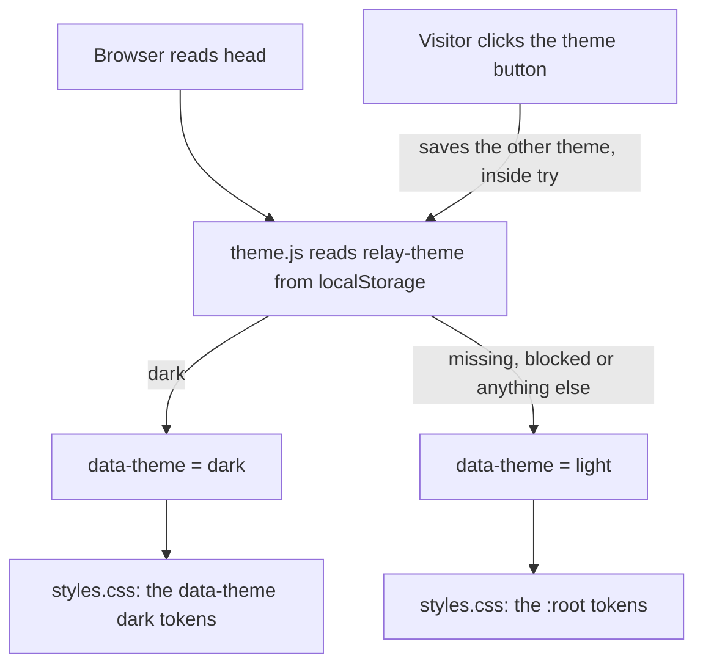

# Design

## Context

See proposal.md ("Why") for the motivation. The constraints that shape this design:

- The page already exists as `docs/design/preview.html`: one 96 KB file with inline CSS and JavaScript, fonts from Google Fonts and Fontshare, and preview controls. `DESIGN.md` says not to deviate from it without Josué's approval, so this design ports it and lists every change.
- The website has no server code and no build step. It is the folder `site/public/`, served by Azure Static Web Apps.
- Installing, building, testing and deploying happen on the Omarchy machine (`AGENTS.md`, `jstack-remote-build` skill). The Azure CLI and the GitHub CLI are signed in there.
- `add-cli-scaffold` must be merged first: it creates `package.json`, `bun test` and CI. `bun test` in CI runs every `*.test.ts` file in the repository, so the website's file tests run in CI too, and they must not need a browser, the network or the font files.

Facts checked on 2026-10-07:

- On the preview, measured with Playwright 1.63.0 in Chromium on the Omarchy machine: the page does not scroll sideways at 1440, 1024 or 390 pixels, but only because `body` has `overflow-x: hidden`, which hides overflow instead of preventing it. At 390 pixels the hero's background lines cross the headline and the lede, the closing panel's lines cross its headline and buttons, the menu bar illustration shows the cut-off edge of a terminal window behind its dropdown, and the checkpoint document in "Plain files in your project" is cut off at the bottom. At 1440 pixels the "Switching by hand" timeline is about 700 pixels tall because it uses 9 pixels per minute. Sections are 120 pixels apart, and 88 pixels at 860 pixels and below, which is under the 96 to 144 pixels in `DESIGN.md`.
- `az staticwebapp create` takes `--name`, `--resource-group`, `--location`, `--sku {Dedicated, Free, Standard}` and `--tags`. `--source` is optional; without it, Azure creates "a static web app without any content and without a github integration" (Azure CLI reference, https://learn.microsoft.com/en-us/cli/azure/staticwebapp). Azure CLI 2.91.0 is installed on the Omarchy machine, signed in to "Azure subscription 1". `Microsoft.Web` is registered there. The only resource group is `echo-resource-group`, which this change does not touch.
- The Static Web Apps CLI is `@azure/static-web-apps-cli`, latest version 2.0.10 (20 July 2026), and needs Node 18 or later (Node 26.8.1 is on the Omarchy machine). `swa deploy <folder> --env production` deploys a folder. It takes the deployment token from `--deployment-token` or the `SWA_CLI_DEPLOYMENT_TOKEN` environment variable; with neither, it signs in through a chain of Azure credentials and looks the app up itself (Microsoft Learn, https://learn.microsoft.com/en-us/azure/static-web-apps/static-web-apps-cli-deploy; source, `src/cli/commands/deploy/deploy.ts` and `src/core/account.ts` at v2.0.10). It prints the token only with `--print-token` or at `silly` log level. It checks the SHA-256 of the deployment program it downloads (`src/core/download-binary-helper.ts`).
- `swa start public --host 127.0.0.1 --port <port>`, run with `npx --yes @azure/static-web-apps-cli@2.0.10` on the Omarchy machine with no `swa-cli.config.json`, serves the folder without asking questions. It applies `globalHeaders`, route `headers`, route `statusCode`, `responseOverrides` and `mimeTypes` from `staticwebapp.config.json`, and it does not serve `staticwebapp.config.json` itself (tried on the Omarchy machine). Its server process can outlive the `npx` process that started it.
- `staticwebapp.config.json` lives in the folder that is deployed, may be at most 20 KB, and supports `globalHeaders`, `routes` (with `headers` and `statusCode`), `responseOverrides` and `mimeTypes`. A route with `"statusCode": 404` turns off a built-in sign-in route (Microsoft Learn, https://learn.microsoft.com/en-us/azure/static-web-apps/configuration).
- `gh release download` without a tag downloads from the latest release and then needs `--pattern`; `--output <file>` writes a single asset to a file and `--clobber` overwrites it (`gh release download --help`, GitHub CLI 2.100.0 on the Omarchy machine).
- Fonts and licenses:
  - Public Sans 2.001 is the latest release of `uswds/public-sans` (asset `public-sans-v2.001.zip`, with `fonts/webfonts/*.woff2` and `OFL.txt`).
  - IBM Plex Mono 2.5.0 is release `@ibm/plex-mono@2.5.0` of `IBM/plex` (asset `ibm-plex-mono.zip`). Its `fonts/complete/woff2` files contain the box-drawing and arrow characters the page uses; the `Latin1` subsets do not.
  - Both are under the SIL Open Font License 1.1.
  - Satoshi comes from `https://api.fontshare.com/v2/fonts/download/satoshi`, a zip with `Fonts/WEB/fonts/Satoshi-Variable.woff2` and `License/FFL.txt`. The ITF Free Font License allows commercial use and self-hosting "on your own servers or infrastructure for use on your own websites" (section 01). It forbids making the font available "through another font website, font library, marketplace, repository" or "publicly accessible servers" beyond those uses (section 02). The repository will become public under Apache 2.0, so Satoshi must never be committed.
  - The zip is generated on each download, so its own hash changes. The SHA-256 of the font files inside it does not change.
- Playwright 1.63.0 is the latest `@playwright/test` release. Its Chromium build is already in `~/.cache/ms-playwright` on the Omarchy machine.
- Since macOS 15, right-click Open no longer opens an app that Gatekeeper blocks; the steps are System Settings, Privacy & Security, Open Anyway (Apple Support, mh40616). Command-line downloads such as `gh` do not add the quarantine mark that makes Gatekeeper check an app.

## Goals / Non-Goals

**Goals:**

- The website reads and looks like the preview, with the spacing fixed, and works without JavaScript except for the animations and the copy buttons.
- A visitor with access to the private repository can install relay by copying one block of commands.
- The page cannot load or send anything outside its own address, and the deployment never exposes its token.
- Every rule in this design has a test that fails when the rule is broken.

**Non-Goals:**

- A build step, a framework, a bundler, a CSS preprocessor or minified files.
- Supporting browsers without the Popover API (Safari before 17, Firefox before 125). On them the panel's buttons do nothing; the rest of the page works.
- Deploying automatically.

## Decisions

### 1. Files and folders

```
site/
  public/                      the folder that is deployed, exactly as it is
    index.html
    404.html
    styles.css                 all CSS, from the preview's <style> block
    site.js                    all JavaScript, from the preview's <script> block
    theme.js                   applies the saved theme before the first paint and runs the theme button
    favicon.svg
    robots.txt
    staticwebapp.config.json
    fonts/                     downloaded by scripts/fetch-fonts.sh, not committed
  fonts.sha256                 the SHA-256 of each font file
  scripts/
    fetch-fonts.sh
    smoke-test.sh
    deploy.sh
  test/                        bun test: file checks, no browser
    static.test.ts
    config.test.ts
    content.test.ts
    install.test.ts
  e2e/                         Playwright: browser checks
    site.pw.ts
    out/                       screenshots, not committed
  playwright.config.ts
```

Playwright files end in `.pw.ts` because `bun test` runs every file named `*.test.*` or `*.spec.*`, and Playwright tests must not run under `bun test`.

Alternatives considered: Astro or another static site generator (rejected: a build step and many dependencies for one page); keeping CSS and JavaScript inline (rejected: a strict Content-Security-Policy forbids inline code, and hashes would have to be updated on every edit).

### 2. Porting the preview

Start from `docs/design/preview.html` at the commit this change is built on. Copy the CSS into `styles.css` and the script into `site.js` (inside the same `(function () { ... })();` wrapper, with `"use strict";` as its first line). Then make exactly these changes.

Remove:

- the inline `<script>` in `<head>` that reads `localStorage`, and the `data-theme` and `data-accent` attributes on `<html>`;
- the two Google Fonts `<link>` elements, the Google Fonts `preconnect` links and the Fontshare `<link>`;
- the `<header class="topbar">` with the headline, font, accent and theme controls, and its CSS (`.topbar`, `.ctl`, `.pick`, `.seg`); the navigation gets its own theme button instead (see "The theme button" below);
- the `<section class="tokens">` and its CSS (`.tokens`, `.swatches`, `.sw`, `.type-row`, `.motion-row`, `.demo-text`, `.expand-box`);
- in the script: the `store` helper, the swatches and `showHex`, `applyTheme` and `applyAccent`, the `fonts` table and `applyFont`, the `heads` table and `setHead`, the handlers of `#demo-story-btn`, `#demo-text-btn` and `#demo-expand-btn`;
- `body { overflow-x: hidden; }`.
- the hero's track map (`#hero-map`, `layoutHero`, the `.story` animation classes and the `.m-*` CSS) and the "Switch from the terminal" section (`#terminal`, its copy button and the `.term` and `.force-dark` CSS). Josué asked on 2026-10-08 for the hero's connecting lines to be removed and for the terminal section to be hidden, after seeing the live site.

Change the tokens: the base `:root` block holds the light values with the olive accent (`--accent: #52613A; --on-accent: #FBFAF7; --focus: #52613A;`). The dark values stay in `:root[data-theme="dark"]`, with the olive dark accent (`--accent: #BDCDA0; --on-accent: #0D0D0C; --focus: #BDCDA0;`). `.force-dark` gets `--accent: #BDCDA0;` directly. The display tokens are fixed to the preview's Satoshi values: `--font-display: "Satoshi", system-ui, sans-serif; --display-weight: 500; --display-track: -0.035em; --display-scale: 0.86;`.

Remove every `style` attribute (the Content-Security-Policy in decision 7 blocks them):

- the hidden SVG sprite gets `class="sprite"` with `.sprite { position: absolute; width: 0; height: 0; }`;
- `<span style="color:var(--muted)">` in the card becomes `<span class="muted">`;
- `<figure style="margin:0">` becomes `<figure class="cost-fig">` with `.cost-fig { margin: 0; }`;
- each timeline row's `style="--d:N"` becomes `data-min="N"`, with one rule per value in `styles.css`: `.ev[data-min="0"] { --d: 0; }` and the same for 3, 4, 12, 13, 14 and 40.2;
- the positions in the lineage illustration become rules under `.st-lineage` in `styles.css`, one class per positioned element, with the same values;
- `style="opacity:0"` on the task-graph phase and clock spans becomes `class="is-off"` with `.is-off { opacity: 0; }`.

The script may still set `element.style` properties and custom properties, because the Content-Security-Policy does not apply to those. No string the script assigns to `innerHTML` may contain `style=` or an `on...=` attribute.

Change the script:

- `layoutPanel` returns at once when the closing panel's `.map` element has `display: none` (decision 6 hides it at narrow widths). `drawTrack` keeps only what the closing panel uses.
- The copy code becomes one function, `copyText(text, button, label, onDone)`, used by the install panel (decision 4). It keeps the preview's fallback through a hidden `textarea` and `document.execCommand("copy")`.

The new `<head>`:

```html
<!doctype html>
<html lang="en">
<head>
<meta charset="utf-8">
<meta name="viewport" content="width=device-width, initial-scale=1">
<meta name="color-scheme" content="light">
<title>relay: never run out of limits again</title>
<meta name="description" content="When one coding agent hits its limit, relay moves the work to another you already pay for, with the same code, plan and decisions.">
<link rel="icon" href="/favicon.svg" type="image/svg+xml">
<link rel="preload" href="/fonts/Satoshi-Variable.woff2" as="font" type="font/woff2" crossorigin>
<link rel="preload" href="/fonts/PublicSans-Regular.woff2" as="font" type="font/woff2" crossorigin>
<script src="/theme.js"></script>
<link rel="stylesheet" href="/styles.css">
<script src="/site.js" defer></script>
</head>
```

Every path is absolute (`/styles.css`), so `404.html` works at any address.

The theme button: Josué asked on 2026-10-08 for one small icon button in place of the Light, Dark and System switch, after seeing the live site. The navigation holds `<button type="button" class="theme-toggle" id="theme-toggle" aria-label="Switch to dark theme">` with two inline SVG icons, `.icon-moon` and `.icon-sun`, both `aria-hidden="true"`. There are two themes, light and dark, and the page is light unless the visitor chose dark before.

`theme.js` is loaded in `<head>` without `defer`, before the stylesheet, so it runs before the first paint; the Content-Security-Policy allows it because it is a file on the site, not an inline script. It reads `localStorage` under the key `relay-theme` (`dark` gives the dark theme; a missing key or any other value gives light), and sets `data-theme` on `<html>` and the `color-scheme` meta element to that theme. It sets the button's `aria-label` and `title` to `Switch to dark theme` on the light page and `Switch to light theme` on the dark page. After `DOMContentLoaded`, a click on the button switches to the other theme, saves it and applies it. Every `localStorage` read and write is inside `try`, so the button still works for the open page when the browser blocks storage; the choice is then forgotten on reload. `404.html` loads `theme.js` too, so it shows the saved theme, but it has no button.



The diagram shows how the theme is chosen. `theme.js` runs before the stylesheet is applied, so the first paint already has the right theme. The base `:root` tokens are light; the `:root[data-theme="dark"]` block replaces them with the dark tokens. A click on the button saves the other theme and runs the same steps again.

`.theme-toggle` is a 34 by 34 pixel button with no border, radius 6px, muted icon color and an 18 pixel icon; on hover the icon takes the text color and the button gets a light tint. CSS shows `.icon-moon` on the light page and `.icon-sun` on the dark page (`:root[data-theme="dark"]`), so the icon is right before any script runs. Focus uses the site's `:focus-visible` outline. The navigation's `gap` is 12px at 640 pixels and below, where the links are hidden, so the wordmark, the theme button and `Get relay` fit at 390 pixels.

`favicon.svg` is the relay glyph in olive, which reads on light and dark browser tabs:

```svg
<svg xmlns="http://www.w3.org/2000/svg" viewBox="0 0 16 16"><path d="M0 5.2H8.2V10.8H16" fill="none" stroke="#52613A" stroke-width="1.6"/></svg>
```

### 3. Fonts

`site/scripts/fetch-fonts.sh`:

```sh
#!/bin/sh
# Downloads the website's fonts into site/public/fonts and checks their SHA-256.
# Run it on the Omarchy machine. It needs gh (signed in), curl, unzip and sha256sum.
set -eu
root=$(cd "$(dirname "$0")/../.." && pwd)
work=$(mktemp -d)
trap 'rm -rf "$work"' EXIT

gh release download v2.001 --repo uswds/public-sans --pattern public-sans-v2.001.zip --dir "$work"
gh release download "@ibm/plex-mono@2.5.0" --repo IBM/plex --pattern ibm-plex-mono.zip --dir "$work"
curl -fsSL -o "$work/satoshi.zip" https://api.fontshare.com/v2/fonts/download/satoshi

mkdir "$work/fonts"
unzip -q -j "$work/public-sans-v2.001.zip" -d "$work/fonts" \
  fonts/webfonts/PublicSans-Regular.woff2 \
  fonts/webfonts/PublicSans-Medium.woff2 \
  fonts/webfonts/PublicSans-SemiBold.woff2
unzip -q -j "$work/ibm-plex-mono.zip" -d "$work/fonts" \
  ibm-plex-mono/fonts/complete/woff2/IBMPlexMono-Regular.woff2 \
  ibm-plex-mono/fonts/complete/woff2/IBMPlexMono-Medium.woff2
unzip -q -j "$work/satoshi.zip" -d "$work/fonts" \
  Satoshi_Complete/Fonts/WEB/fonts/Satoshi-Variable.woff2

(cd "$work/fonts" && sha256sum --check --strict "$root/site/fonts.sha256")
mkdir -p "$root/site/public/fonts"
cp "$work"/fonts/*.woff2 "$root/site/public/fonts/"
```

`site/fonts.sha256` (the format `sha256sum --check` reads):

```
f3931c3c3ec5301043634ac8f39bcfa7b30d29181864f2fd0c3e6796feacc471  PublicSans-Regular.woff2
26cedea8665bacddb7c2d9e22327cdfcfc00c517d1b9aef4c3e4dc54d792a1e4  PublicSans-Medium.woff2
f99ffc265cc790e0f058a9f430a465c88996008327abb0f8561cb713add40d73  PublicSans-SemiBold.woff2
ba204497f16b6d334cee9d1e963a831b73e3a56e1d6300a8489d18df7214b350  IBMPlexMono-Regular.woff2
33faf307fa6031fb4062276d7320a6d632de890cbb347576fd80cfa01077bc25  IBMPlexMono-Medium.woff2
e739aff9b4d02c264341d6d4872edcda28e79373aeda936f659566a1cd3eb47f  Satoshi-Variable.woff2
```

These hashes were computed on 2026-10-07 from the three downloads. If a check fails, nothing is copied and the script stops; a person reviews the new upstream file before changing a hash.

The top of `styles.css`:

```css
/* Fonts, self-hosted from site/public/fonts (downloaded by site/scripts/fetch-fonts.sh).
   Satoshi: Indian Type Foundry, ITF Free Font License, from fontshare.com. Never commit it.
   Public Sans 2.001 (USWDS) and IBM Plex Mono 2.5.0 (IBM): SIL Open Font License 1.1,
   https://openfontlicense.org */
@font-face { font-family: "Satoshi"; src: url("/fonts/Satoshi-Variable.woff2") format("woff2"); font-weight: 300 900; font-display: swap; }
@font-face { font-family: "Public Sans"; src: url("/fonts/PublicSans-Regular.woff2") format("woff2"); font-weight: 400; font-display: swap; }
@font-face { font-family: "Public Sans"; src: url("/fonts/PublicSans-Medium.woff2") format("woff2"); font-weight: 500; font-display: swap; }
@font-face { font-family: "Public Sans"; src: url("/fonts/PublicSans-SemiBold.woff2") format("woff2"); font-weight: 600; font-display: swap; }
@font-face { font-family: "IBM Plex Mono"; src: url("/fonts/IBMPlexMono-Regular.woff2") format("woff2"); font-weight: 400; font-display: swap; }
@font-face { font-family: "IBM Plex Mono"; src: url("/fonts/IBMPlexMono-Medium.woff2") format("woff2"); font-weight: 500; font-display: swap; }
```

The preview also loaded IBM Plex Mono 600; the browser uses Medium for the one place that asks for 600 (`.ftree .on`). The six files total about 240 KB.

Alternatives considered: committing the font files (rejected for Satoshi by its license; the OFL fonts follow the same path so there is one way to get fonts); the Fontsource npm packages (rejected: a third party repackages the files, and they still lack Satoshi); system fonts only (rejected: Satoshi is Josué's headline choice in `DESIGN.md`).

### 4. The install panel

One panel, a `popover` element, opened by every install button through `popovertarget`. The Popover API opens and closes it without JavaScript, closes it with Escape or a click outside, and moves focus to the element marked `autofocus`.

The buttons that open it:

| Where | Text | Element |
|---|---|---|
| Navigation | `CLI setup` | `<button type="button" class="nav-link" popovertarget="install">` |
| Navigation, right | `Get relay` | `<button type="button" class="btn btn-primary btn-sm" popovertarget="install">` (Josué asked on 2026-10-08 for this button to use the same olive as the hero's main button) |
| Hero | `Get relay` | `<button type="button" class="btn btn-primary" popovertarget="install" data-install-focus="install-macos">` |
| Hero | `CLI setup` | `<button type="button" class="text-link" popovertarget="install">` |
| Closing panel | `Get relay` | same as in the hero |
| Closing panel | `CLI setup` | `<button type="button" class="btn btn-secondary" popovertarget="install">` |
| Footer | `CLI setup` | `<button type="button" class="foot-link" popovertarget="install">` |

`.nav-link`, `.text-link` and `.foot-link` on a `<button>` reset the button look (`background: none; border: 0; padding: 0; font: inherit; color: inherit; cursor: pointer;`) and keep the link look of the preview.

The panel, placed just before `</main>`. Each command block's text starts right after `<pre ...>` and its last line ends right before `</pre>`, so the text has no leading or trailing blank line:

```html
<div id="install" class="install" popover role="dialog" aria-labelledby="install-title">
  <div class="install-head">
    <h2 id="install-title">Install relay</h2>
    <button type="button" class="btn btn-secondary btn-sm" popovertarget="install" popovertargetaction="hide" autofocus>Close</button>
  </div>
  <p>relay is installed from the releases of its GitHub repository, which is private for now. You need the GitHub CLI, <span class="mono">gh</span>, signed in with an account that can read <span class="mono">FrejusGdm/relay</span>. Run <span class="mono">gh auth status</span> to check, or <span class="mono">gh auth login</span> to sign in.</p>

  <div class="install-block">
    <div class="install-block-head">
      <h3 id="install-macos" tabindex="-1">Command line on macOS (Apple silicon)</h3>
      <button type="button" class="btn btn-secondary btn-sm" data-copy="install-macos-cmd" aria-label="Copy the macOS commands">Copy</button>
    </div>
    <pre id="install-macos-cmd" class="install-cmd" tabindex="0">(block A)</pre>
  </div>

  <div class="install-block">
    <div class="install-block-head">
      <h3 id="install-linux">Command line on Linux (x64)</h3>
      <button type="button" class="btn btn-secondary btn-sm" data-copy="install-linux-cmd" aria-label="Copy the Linux commands">Copy</button>
    </div>
    <pre id="install-linux-cmd" class="install-cmd" tabindex="0">(block B)</pre>
  </div>

  <p class="install-note">To run <span class="mono">relay</span> by name, add <span class="mono">~/.local/bin</span> to your PATH, for example with <span class="mono">export PATH="$HOME/.local/bin:$PATH"</span> in <span class="mono">~/.zshrc</span> on macOS or <span class="mono">~/.bashrc</span> on Linux.</p>

  <div class="install-block">
    <div class="install-block-head">
      <h3 id="install-mac" tabindex="-1">Mac app</h3>
      <button type="button" class="btn btn-secondary btn-sm" data-copy="install-mac-cmd" aria-label="Copy the Mac app commands">Copy</button>
    </div>
    <pre id="install-mac-cmd" class="install-cmd" tabindex="0">(block C)</pre>
  </div>

  <p class="install-note">The Mac app shows the jobs of the relay command line tool, so install that first. The app is not signed yet. Downloaded with <span class="mono">gh</span>, it opens normally. If you downloaded the zip in a browser and macOS says it cannot verify the app, open System Settings, then Privacy &amp; Security, and click Open Anyway.</p>
  <p class="sr-only" role="status" id="copy-status"></p>
</div>
```

Until a release contains `Relay-macOS.zip`, the Mac app block holds only its heading and the note "The Mac menu-bar app is not released yet. The command line tool above works on its own.", with no block C, no Copy button and no first-launch note.

Block A, exactly:

```
mkdir -p "$HOME/.local/bin"
gh release download \
  --repo FrejusGdm/relay \
  --pattern relay-darwin-arm64 \
  --output "$HOME/.local/bin/relay" \
  --clobber
chmod +x "$HOME/.local/bin/relay"
"$HOME/.local/bin/relay" --version
```

Block B is block A with `relay-darwin-arm64` replaced by `relay-linux-x64`.

Block C, exactly:

```
cd "$HOME/Downloads"
gh release download \
  --repo FrejusGdm/relay \
  --pattern Relay-macOS.zip \
  --clobber
ditto -x -k Relay-macOS.zip /Applications
open /Applications/Relay.app
```

Why these commands: `--output` writes the asset straight to its final name, so no rename is needed; `--clobber` lets the same block reinstall; `mkdir -p` is needed because `gh` does not create the folder; the last line runs the binary by its full path, so it works before `~/.local/bin` is on PATH. `ditto -x -k` is Apple's tool for unpacking a zipped app bundle with its symbolic links and attributes. Writing to `/Applications` needs no `sudo` for an administrator account, the default on a personal Mac. No line is longer than 42 characters, so a block fits a 390 pixel screen at 12 pixels without scrolling sideways.

Copying: each `data-copy` button calls `copyText(pre.textContent + "\n", button, ...)`, where `pre` is the element whose `id` is the button's `data-copy` value. The final newline makes the last line run when pasted. The button text changes to `Copied` (or `Copy failed`) for 1.6 seconds, and `#copy-status` gets the text `Commands copied.` (or `Copying failed. Select the commands and copy them by hand.`) so screen readers announce it.

Focus: a button with `data-install-focus` also, on click, waits for the panel's `toggle` event with `newState === "open"`, then calls `focus()` on the element with that `id` and `scrollIntoView({ block: "start" })`, so "Get relay" shows the macOS command-line part.

CSS (added to `styles.css`):

```css
.install { margin: auto; width: min(680px, calc(100vw - 32px)); max-height: calc(100dvh - 32px); overflow-y: auto; padding: 32px; border: 1px solid var(--rule); border-radius: 12px; background: var(--raised); color: var(--text); box-shadow: var(--shadow); }
.install::backdrop { background: rgba(20, 20, 19, 0.32); }
.install-head { display: flex; align-items: center; justify-content: space-between; gap: 16px; }
.install-head h2 { margin: 0; font: 600 20px var(--font-text); }
.install p { margin: 12px 0 0; color: var(--muted); font-size: 15px; }
.install-block { margin-top: 28px; }
.install-block-head { display: flex; align-items: center; justify-content: space-between; gap: 16px; }
.install-block-head h3 { margin: 0; font: 600 15px var(--font-text); }
.install-cmd { margin: 10px 0 0; padding: 14px 16px; font: 13px/1.6 var(--font-mono); background: var(--bg); border: 1px solid var(--rule); border-radius: 8px; white-space: pre; overflow-x: auto; }
.install-note { font-size: 14px; }
@media (max-width: 480px) {
  .install { width: 100vw; max-width: 100vw; max-height: 100dvh; border-radius: 0; border-left: 0; border-right: 0; padding: 20px 16px; }
  .install-cmd { padding: 12px; font-size: 12px; }
}
```

Alternatives considered: a `<dialog>` opened with `showModal()` (rejected: it needs JavaScript to open; the Popover API does not); a separate `/install` page (rejected: Josué asked for a panel or a page, and the panel keeps the visitor on the page); `curl ... | sh` (rejected: the repository is private and the project never pipes a download into a shell).

### 5. Content changes

Navigation: the wordmark (link to `#top`), then `How it works` (`#how`), `Pricing` (`#pricing`) and the `CLI setup` button; on the right the theme button (decision 2) and the `Get relay` button. The theme button stays visible at every width. The preview's `Docs` and `GitHub` links are removed. No tool logos are added; Josué decided against them on 2026-10-08.

The hero keeps the headline `Never run out of limits again.` and the lede `When one coding agent hits its limit, relay moves the work to another you already pay for, with the same code, plan and decisions.` as static text (the `id="hl"` and `id="lede"` stay, the `hl-swap` class goes). Its two links become the buttons in decision 4.

In the card's worker dialog, `This preview does not launch a coding agent.` becomes `This illustration does not launch a coding agent.` The word "preview" appears nowhere on the page.

A new pricing section goes between `#graph` and `#closing`:

```html
<section id="pricing">
  <div class="wrap">
    <div class="sec-head">
      <h2 class="display">relay is free. You already paid for the agents.</h2>
      <p>Paid features will come later, as a one-time payment for a lifetime license: no subscription, and no share of what you spend on agents.</p>
    </div>
    <div class="price">
      <div class="price-col">
        <h3>The core</h3>
        <p class="price-big">Free</p>
        <p>The relay command line tool: checkpoints, handoffs between agents and accounts, and rollback.</p>
      </div>
      <div class="price-col">
        <h3>Paid features</h3>
        <p class="price-big">One payment</p>
        <p>A lifetime license, paid once. Not on sale yet. This page will say what it includes and what it costs before it goes on sale.</p>
      </div>
    </div>
  </div>
</section>
```

`.price` copies the look of `.cost` (two columns, one border, radius 14px, `--surface` background, a rule between the columns, one column below 700 pixels). `.price-big` uses the display font at the size of `.cost-total b`. The page names no price and no plan name, because what "lifetime" covers and the price are not decided (`docs/research/prior-art-and-pricing.md`, "Decisions only the founder can make", item 3).

The closing panel's buttons become `Get relay` and `CLI setup` (decision 4); `View source` is removed.

The footer keeps the wordmark and its sentence, and one column headed `Product` with `How it works` (`#how`), `Pricing` (`#pricing`) and the `CLI setup` button. The `Project` and `Contact` columns go. The bottom line reads `© 2026 relay`, `Apache 2.0 license` (a link to `https://www.apache.org/licenses/LICENSE-2.0`) and `The accounts, times and checkpoints on this page are illustrated.` The footer grid becomes `grid-template-columns: 2fr 1fr;`, and one column at 760 pixels and below.

`404.html`: the same `<head>` without the two `preload` links and without `site.js` (the home page's script expects the hero card and would throw), but with `theme.js`, with the title `Page not found · relay`, the navigation wordmark, an `<h1 class="display">Page not found</h1>` and `<p>This page does not exist. <a href="/">Go to the relay home page</a>.</p>`, inside `<main class="wrap">` with `padding: 128px 0`.

`robots.txt`:

```
User-agent: *
Disallow: /
```

### 6. Spacing changes

These are the only layout changes from the preview. Each fixes a problem measured on the preview (see "Facts checked").

| Rule in `styles.css` | Preview | Website |
|---|---|---|
| `section { padding }` | 120px; 88px at 860px and below | 128px; 112px at 1100px and below; 96px at 860px and below |
| `.sec-head { margin-bottom }` | 56px | 56px; 40px at 860px and below |
| `.hero { padding }` | `72px 0 120px`; `48px 0 88px` at 860px and below | `64px 0 128px`; `40px 0 96px` at 860px and below |
| `.hero .map` | shown, crosses the text | removed at every width (see decision 2) |
| `.closing .map` at 700px and below | shown, crosses the text | `display: none` |
| `.closing` at 700px and below | `padding: 88px 0` | `padding: 96px 0` |
| `.cost { --m }` (pixels per minute) | 9px | 6px; 5px at 700px and below |
| `.ghost-win` at 640px and below | shown behind the dropdown, cut off | `display: none` |
| `.st-tree` at 520px and below | 270px tall, document cut off | `height: auto;` and `.doc { border-right: 1px solid var(--rule); border-radius: 10px; }` so the whole document shows |

Content width stays `max-width: 1248px` with 24px side padding (1200px of content), and 16px side padding at 640px and below, as in `DESIGN.md`.

### 7. `staticwebapp.config.json`

Exactly:

```json
{
  "routes": [
    { "route": "/.auth/login/github", "statusCode": 404 },
    { "route": "/.auth/login/aad", "statusCode": 404 },
    { "route": "/.auth/*", "statusCode": 404 },
    { "route": "/fonts/*", "headers": { "Cache-Control": "public, max-age=604800" } }
  ],
  "responseOverrides": {
    "404": { "rewrite": "/404.html", "statusCode": 404 }
  },
  "mimeTypes": {
    ".woff2": "font/woff2"
  },
  "globalHeaders": {
    "Content-Security-Policy": "default-src 'none'; script-src 'self'; style-src 'self'; img-src 'self'; font-src 'self'; base-uri 'none'; form-action 'none'; frame-ancestors 'none'",
    "Strict-Transport-Security": "max-age=63072000; includeSubDomains",
    "X-Content-Type-Options": "nosniff",
    "X-Frame-Options": "DENY",
    "Referrer-Policy": "no-referrer",
    "Permissions-Policy": "camera=(), microphone=(), geolocation=(), payment=(), usb=()",
    "Cross-Origin-Opener-Policy": "same-origin",
    "Cross-Origin-Resource-Policy": "same-origin",
    "X-Robots-Tag": "noindex, nofollow",
    "Cache-Control": "no-cache"
  }
}
```

What each part does: `default-src 'none'` blocks everything not listed, including `connect-src` (no `fetch`), `object-src`, `media-src`, `frame-src` and `worker-src`. Scripts, styles, images and fonts load only from the site itself, and inline scripts, inline styles and `style` attributes are blocked. `form-action 'none'` blocks form submission (the card's `<form method="dialog">` only closes a dialog and is not a submission). `frame-ancestors 'none'` and `X-Frame-Options: DENY` stop other sites from framing the page. `no-cache` makes browsers check for a new version of the HTML, CSS and JavaScript on each visit; fonts are cached for a week. The `/.auth/*` route turns off the built-in sign-in pages in the local emulator; on Azure the wildcard does not apply to the sign-in routes, so the two built-in providers are also blocked by name (`/.auth/login/github` and `/.auth/login/aad`), as Microsoft's documentation shows for disabling a provider. `X-Robots-Tag` follows proposal decision 1. The Permissions-Policy lists only features Chromium knows, so it logs no console warning.

### 8. Tests

`site/test/*.test.ts` run with `bun test` (in CI and on the Omarchy machine). They read files with `Bun.file` relative to `import.meta.dir` and use plain regular expressions; they need no font files and no network.

- `static.test.ts` (the security rules; it checks every `.html` file that exists in `site/public`, so it passes before `404.html` exists):
  - No `style` attribute (`/\sstyle\s*=/i`), no `<style` element, no `<script` without `src`, and no `on...=` attribute (`/\son[a-z]+\s*=/i`).
  - Each page loads `<script src="/theme.js"></script>` in `<head>`, before the stylesheet, and has `<meta name="color-scheme" content="light">`.
  - Every `src` and every `<link href>` starts with `/` and not `//`.
  - In `styles.css`, after removing comments (`/\/\*[\s\S]*?\*\//g`): no `@import`, no `http`, and every `url(...)` is `url("/fonts/<name>.woff2")` with `<name>.woff2` listed in `site/fonts.sha256`. The font comment of decision 3 keeps its license address.
  - No rule in `styles.css` whose selector is `html` or `body` sets `overflow` or `overflow-x` to `hidden`.
  - `theme.js`, outside comments, contains none of `sessionStorage`, `indexedDB`, `document.cookie`, `fetch(`, `XMLHttpRequest`, `sendBeacon`, `WebSocket`, `EventSource`, `eval(`, `new Function`, `style` and `http`. Its only storage calls are one `localStorage.getItem(` and one `localStorage.setItem(`, each directly inside a `try` block, and its key is `relay-theme`.
  - `site.js` contains none of `localStorage`, `sessionStorage`, `indexedDB`, `document.cookie`, `fetch(`, `XMLHttpRequest`, `sendBeacon`, `WebSocket`, `EventSource`, `eval(`, `new Function`, `style=` and `https://`, and its only `http://` text is `http://www.w3.org/2000/svg`.
  - `site/fonts.sha256` has exactly the six lines of decision 3, and `.gitignore` contains `site/public/fonts/`.
- `config.test.ts`: `staticwebapp.config.json` parses, deep-equals the object in decision 7 (written out in the test), and is under 20 KB.
- `content.test.ts` (added in task 3.1, after the content changes):
  - Every `<a href>` in every `.html` file is one of `#top`, `#how`, `#pricing`, `/` and `https://www.apache.org/licenses/LICENSE-2.0`.
  - The word `preview` (any case) does not appear in `index.html`.
  - The section ids appear in the order `cost`, `how`, `graph`, `pricing`, `closing`.
  - The `<h1>` text is `Never run out of limits again.` and the `<title>` is as in decision 2.
  - The pricing section contains `one-time payment` and `lifetime license`.
  - The page contains no `$` followed by a digit and no `checkout`, `stripe` or `buy now` (any case).
  - Every `<form` has `method="dialog"`.
  - The navigation has one button `id="theme-toggle"` with `aria-label="Switch to dark theme"` and the `.icon-moon` and `.icon-sun` SVG icons, and no `data-theme-choice` group. The navigation's `Get relay` has the classes `btn btn-primary btn-sm`.
  - The hero has no `.map`, no SVG `line` and no `hero-svg`; the page has no `#terminal` and no `relay switch codex:personal`; `styles.css` has no `.term`, `.m-*`, `.story` or `.seg` rule and no `--trail` token; `site.js` has no `copy-btn`, `hero-svg`, `hero-map` or `layoutHero`.
  - `robots.txt` is exactly as in decision 5, and `404.html` contains `Page not found`.
- `install.test.ts`:
  - The two `<pre>` blocks, read by `id` and with `&quot;` and `&amp;` decoded, equal blocks A and B (written out in the test).
  - No line in them is longer than 42 characters.
  - The panel has `id="install"` and the `popover` attribute, and every `popovertarget` value is `install`.
  - The page contains `private` and `gh auth status`.
  - The Mac app block has no `<pre>` and no Copy button and contains the "not released yet" note, the page does not contain `Relay-macOS.zip`, and both `data-install-focus` values are `install-macos`.
  - When `.github/workflows/release.yml` exists, it contains `relay-darwin-arm64` and `relay-linux-x64`. Otherwise this one test is skipped with `test.skipIf`, and its name says why.

`site/playwright.config.ts`, exactly:

```ts
import { defineConfig } from "@playwright/test";

const port = Number(process.env.SITE_PORT ?? 4280);
const live = process.env.SITE_URL;

export default defineConfig({
  testDir: "./e2e",
  testMatch: "**/*.pw.ts",
  outputDir: "./e2e/results",
  workers: 1,
  reporter: [["list"]],
  use: {
    browserName: "chromium",
    baseURL: live ?? `http://127.0.0.1:${port}`,
  },
  webServer: live
    ? undefined
    : {
        command: `npx --yes @azure/static-web-apps-cli@2.0.10 start public --host 127.0.0.1 --port ${port}`,
        url: `http://127.0.0.1:${port}/`,
        reuseExistingServer: false,
        timeout: 120_000,
      },
});
```

Without `SITE_URL`, Playwright starts Microsoft's Static Web Apps emulator on `site/public` (the web server runs in the folder of the config file), so local runs get the same headers and 404 rules as Azure. With `SITE_URL`, the same tests run against the live site.

`site/e2e/site.pw.ts` holds these tests. `target` is `live` when `SITE_URL` is set and `local` otherwise.

- A shared setup for every test adds an init script that turns each `securitypolicyviolation` event into a `console.error` message, and collects every console message of type `error` and every `pageerror`. Each test ends by expecting that list to be empty. The one exception is the not-found test: Chromium logs a console error for a page that answers 404, so that test removes exactly one message that reports the failed load of the page it opened (status 404, the same address) and still expects the rest of the list to be empty, so script errors, policy violations and other failed loads still fail it.
- `fits at <width> pixels`, for 1440, 1024 and 390 (height 900, `reducedMotion: "reduce"`, light theme):
  - Load `/` and wait for `document.fonts.ready`. `document.fonts.check('500 40px Satoshi')` is true.
  - Run the overflow check below. It returns an empty list.
  - The hero has no `.map` and no SVG `line`, and the page has no `#terminal`. At 390 pixels the computed `padding-top` of `#cost` is `96px` and the `padding-left` of its `.wrap` is `16px`; at 1440 pixels they are `128px` and `24px`.
  - The hero card's note reads `Illustrated manual handoff · reduced motion`, `[data-rc="codex-role"]` reads `Current worker` and `[data-rc="codex-state"]` reads `Working`, which is the preview's still final state.
  - Save a full-page screenshot to `path.join(import.meta.dirname, "out", `${target}-${width}.png`)` (Playwright resolves screenshot paths from the working folder, not from the config file, so the path is built from the test file's folder).
- `does not scroll sideways while the story plays at <width> pixels`, for the same widths, without reduced motion: every 500 ms for 8 seconds, `document.documentElement.scrollWidth <= document.documentElement.clientWidth`.
- `install panel at <width> pixels`, for the same widths:
  - Click the hero's `CLI setup`. The panel is open (`:popover-open`), its box is inside the viewport horizontally, and each `.install-cmd` has `scrollWidth <= clientWidth`.
  - Grant `clipboard-read` and `clipboard-write`, click the macOS `Copy`. The clipboard equals block A plus `"\n"`, and the button reads `Copied`.
  - Press Escape. The panel is closed.
- `Get relay shows the macOS command-line commands`: at 1024 by 700 pixels, click the hero's `Get relay`. `#install-macos` is focused and inside the panel's visible area.
- `the Mac app block has no command and says it is not released yet`: at 1024 by 700 pixels, open the panel. The block holding `#install-mac` contains the "not released yet" note and no `<pre>` or Copy button.
- The theme button, with `colorScheme: "dark"` (each background check uses `toHaveCSS`, which retries until the style is applied). These replaced the Light, Dark and System tests on 2026-10-08:
  - `the page is light by default and the button offers the dark theme`: the `background-color` of `body` is `rgb(244, 242, 236)`, the button's label is `Switch to dark theme`, and the moon icon shows.
  - `the button switches the theme, and the choice survives a reload without a wrong first paint`: an init script records `data-theme` on `<html>` at the moment `<body>` is created. Click the button: the background is `rgb(13, 13, 12)`, the label is `Switch to light theme` and the sun icon shows. Reload: the recorded theme is `dark` and the page is still dark. `/no-such-page` is dark too. Click the button again on `/`: the page is light, and after a reload the recorded theme is `light`.
  - `the button works from the keyboard, shows focus and is 32 to 36 pixels square`: focus the navigation's `CLI setup`, press Tab: the theme button is focused, matches `:focus-visible` and has a solid outline, and its width and height are between 32 and 36 pixels. Press Enter: the page is dark.
  - `the button works when the browser blocks storage`: an init script makes `window.localStorage` throw. The page loads light, the button still switches it to dark, and after a reload it is light again, with no console error.
- `header and hero in both themes at <width> pixels`, for 1440, 1024 and 390: the theme button is visible and inside the viewport; the navigation's `Get relay` and the hero's `Get relay` both have the background `rgb(82, 97, 58)`; the overflow check returns an empty list, and a screenshot is saved to `out/<target>-theme-light-<width>.png`. After a click on the button, the background is dark, both `Get relay` buttons have the background `rgb(189, 205, 160)`, the overflow check is still empty, and a screenshot is saved to `out/<target>-theme-dark-<width>.png`.
- `card dialogs open and close`: click `View checkpoint` in the hero card, the dialog is open, click its `Close`, the dialog is closed (this also proves `form-action 'none'` does not block `method="dialog"`).
- `unknown address shows the 404 page`: `/no-such-page` answers 404 and its `<h1>` reads `Page not found`.

The overflow check, run with `page.evaluate`:

```ts
() => {
  const vw = document.documentElement.clientWidth;
  const problems: string[] = [];
  if (document.documentElement.scrollWidth > vw) problems.push(`page is ${document.documentElement.scrollWidth}px wide`);
  const name = (el: Element) => `${el.tagName.toLowerCase()}.${(el as HTMLElement).className}`;
  for (const el of Array.from(document.querySelectorAll<HTMLElement>("body *"))) {
    if (el.closest(".map, .sr-only, template, dialog:not([open]), [popover]:not(:popover-open)")) continue;
    if (el.closest(".doc") && vw > 520) continue; // the checkpoint document bleeds out of its cell on purpose
    const r = el.getBoundingClientRect();
    if (r.width === 0 || r.height === 0) continue;
    // Horizontal: the window, or the nearest ancestor that clips sideways.
    let clip = el.parentElement;
    while (clip && clip !== document.body && getComputedStyle(clip).overflowX === "visible") clip = clip.parentElement;
    const xScrolls = clip && clip !== document.body && ["auto", "scroll"].includes(getComputedStyle(clip).overflowX);
    const xBox = clip && clip !== document.body ? clip.getBoundingClientRect() : { left: 0, right: vw };
    if (!xScrolls && (r.left < xBox.left - 1 || r.right > xBox.right + 1)) {
      problems.push(`${name(el)} spans x ${Math.round(r.left)}..${Math.round(r.right)}, its box is ${Math.round(xBox.left)}..${Math.round(xBox.right)}`);
    }
    // Vertical: only an ancestor that clips; the page itself scrolls down normally.
    let vclip = el.parentElement;
    while (vclip && vclip !== document.body && getComputedStyle(vclip).overflowY === "visible") vclip = vclip.parentElement;
    if (vclip && vclip !== document.body && !["auto", "scroll"].includes(getComputedStyle(vclip).overflowY)) {
      const yBox = vclip.getBoundingClientRect();
      if (r.top < yBox.top - 1 || r.bottom > yBox.bottom + 1) {
        problems.push(`${name(el)} spans y ${Math.round(r.top)}..${Math.round(r.bottom)}, ${name(vclip)} clips at ${Math.round(yBox.top)}..${Math.round(yBox.bottom)}`);
      }
    }
  }
  return problems;
}
```

It reports any element that sticks out of the window sideways, or out of an ancestor that clips it in either direction. Content inside a box that scrolls (the open install panel) may be larger than that box, but the box itself must fit. The only exceptions are the decorative track maps and, above 520 pixels, the checkpoint document; adding another exception needs Josué's approval.

### 9. Azure resources

Run once, on the Omarchy machine:

```sh
export AZURE_CORE_COLLECT_TELEMETRY=false
az group create --subscription "Azure subscription 1" --name relay-rg --location eastus2 --tags project=relay --output none
az staticwebapp create --subscription "Azure subscription 1" --name relay-site --resource-group relay-rg \
  --location eastus2 --sku Free --tags project=relay --output none
az staticwebapp show --subscription "Azure subscription 1" --name relay-site --resource-group relay-rg \
  --query defaultHostname --output tsv
```

Every command names the subscription, so Josué's default subscription is not changed (`az account set` is never run). `--output none` keeps the full resource description off the screen. No `--source`, `--branch`, `--token` or `--login-with-github`, so there is no GitHub connection. The last command prints the address, which goes into `docs/website.md` and the pin in the private task board.

### 10. Deploying: `site/scripts/deploy.sh`

Exactly:

```bash
#!/usr/bin/env bash
# Deploys site/public to the Azure Static Web App relay-site, then runs the smoke test.
# Run it on the Omarchy machine: bash site/scripts/deploy.sh
set -euo pipefail
set +x # tracing would print the deployment token

app=relay-site
group=relay-rg
subscription="Azure subscription 1"
swa_cli=@azure/static-web-apps-cli@2.0.10
export AZURE_CORE_COLLECT_TELEMETRY=false

root=$(cd "$(dirname "$0")/../.." && pwd)
cd "$root"

current=$(az account show --query name --output tsv)
if [ "$current" != "$subscription" ]; then
  echo "deploy: the Azure CLI uses \"$current\", not \"$subscription\". Run: az account set --subscription \"$subscription\"" >&2
  exit 1
fi

assets=$(gh release view --repo FrejusGdm/relay --json assets --jq '.assets[].name')
for asset in relay-darwin-arm64 relay-linux-x64; do
  if ! printf '%s\n' "$assets" | grep -qx "$asset"; then
    echo "deploy: the latest release of FrejusGdm/relay has no $asset, so the install commands on the page would fail." >&2
    exit 1
  fi
done

sh site/scripts/fetch-fonts.sh
bun test site/test

host=$(az staticwebapp show --subscription "$subscription" --name "$app" --resource-group "$group" --query defaultHostname --output tsv)

token=$(az staticwebapp secrets list --subscription "$subscription" --name "$app" --resource-group "$group" --query properties.apiKey --output tsv)
if [ -z "$token" ]; then
  echo "deploy: Azure returned no deployment token for $app." >&2
  exit 1
fi
status=0
output=$(SWA_CLI_DEPLOYMENT_TOKEN="$token" npx --yes "$swa_cli" deploy site/public --env production </dev/null 2>&1) || status=$?
case "$output" in
  *"$token"*)
    unset token output
    echo "deploy: the deployment output contained the deployment token, so it is not shown. Replace the token now: az staticwebapp secrets reset-api-key --name $app --resource-group $group" >&2
    exit 1
    ;;
esac
unset token
printf '%s\n' "$output"
if [ "$status" -ne 0 ]; then
  echo "deploy: swa deploy failed with exit code $status." >&2
  exit "$status"
fi

sh site/scripts/smoke-test.sh "https://$host"
echo "Deployed: https://$host"
```

The script requires only the two command-line assets, because the Mac app block shows a "not released yet" note until a release contains `Relay-macOS.zip`.

How the token is kept safe: `set +x` turns tracing off even when someone runs `bash -x`. `token=$(...)` is a plain assignment, so `set -e` stops the script if `az` fails, and nothing is printed. The token reaches `swa deploy` only through its environment, for that one command (the prefix form does not export it). The deployment output is kept in a shell variable, never in a file, and is checked with a shell pattern (no external program that could fail silently) before it is shown. `</dev/null` makes any unexpected question from the CLI fail instead of waiting.

Alternatives considered:

- Letting `swa deploy` sign in and fetch the token itself through the Azure CLI credential. Rejected: when the app name does not match, it asks questions and can create a new app in West US 2 without tags (`chooseOrCreateStaticSite` in `src/core/account.ts`), and it refuses apps whose provider it does not recognize.
- A GitHub Actions workflow with the token as a repository secret. Rejected: Josué asked for deployment from the Omarchy machine, and it would put a long-lived secret in GitHub.
- `az staticwebapp create --source` with the workflow Azure generates. Rejected for the same reason.

### 11. Smoke test: `site/scripts/smoke-test.sh`

Exactly:

```sh
#!/bin/sh
# Checks a running copy of the website. Usage: sh site/scripts/smoke-test.sh <base address>
set -eu
url=${1:?usage: smoke-test.sh <base address, for example https://example.azurestaticapps.net>}
url=${url%/}
csp="default-src 'none'; script-src 'self'; style-src 'self'; img-src 'self'; font-src 'self'; base-uri 'none'; form-action 'none'; frame-ancestors 'none'"
work=$(mktemp -d)
trap 'rm -rf "$work"' EXIT
fail() { echo "Smoke test failed: $1" >&2; exit 1; }
# Prints the value of one response header of the home page, without the carriage return.
header() { tr -d '\r' < "$work/headers" | grep -i "^$1:" | head -n 1 | sed 's/^[^:]*:[[:space:]]*//'; }

code=$(curl -sS -o "$work/index.html" -D "$work/headers" -w '%{http_code}' "$url/") || fail "the request to $url/ failed"
[ "$code" = 200 ] || fail "GET / returned $code, expected 200"
grep -qF '<title>relay: never run out of limits again</title>' "$work/index.html" || fail "the page title is missing"
for text in 'gh release download' '--repo FrejusGdm/relay' '--pattern relay-darwin-arm64' '--pattern relay-linux-x64'; do
  grep -qF -- "$text" "$work/index.html" || fail "the page does not contain: $text"
done
[ "$(header content-security-policy)" = "$csp" ] || fail "the Content-Security-Policy header is missing or different"
[ "$(header x-content-type-options)" = "nosniff" ] || fail "X-Content-Type-Options is missing or different"
[ "$(header x-frame-options)" = "DENY" ] || fail "X-Frame-Options is missing or different"
[ "$(header x-robots-tag)" = "noindex, nofollow" ] || fail "X-Robots-Tag is missing or different"
[ -z "$(header set-cookie)" ] || fail "the response sets a cookie"
font=$(curl -sS -o /dev/null -w '%{http_code} %{content_type}' "$url/fonts/Satoshi-Variable.woff2") || fail "the font request failed"
[ "$font" = "200 font/woff2" ] || fail "the Satoshi font returned: $font"
auth=$(curl -sS -o /dev/null -w '%{http_code}' "$url/.auth/login/github") || fail "the /.auth request failed"
[ "$auth" = 404 ] || fail "/.auth/login/github returned $auth, expected 404"
missing=$(curl -sS -o "$work/404.html" -w '%{http_code}' "$url/no-such-page") || fail "the /no-such-page request failed"
[ "$missing" = 404 ] || fail "/no-such-page returned $missing, expected 404"
grep -qF 'Page not found' "$work/404.html" || fail "the 404 page text is missing"
echo "Smoke test passed: $url"
```

It works against the local emulator (`http://127.0.0.1:<port>`) and the live address, so it is proved locally before the first deployment. It does not look for `Relay-macOS.zip`, because the Mac app block shows a "not released yet" note until a release contains it.

### 12. Project files

Run `bun add --dev --exact @playwright/test@1.63.0` (it updates `package.json` and `bun.lock`), then add these scripts to `package.json`:

```json
"site:fonts": "sh site/scripts/fetch-fonts.sh",
"site:test": "bun test site/test",
"site:e2e": "playwright test --config site/playwright.config.ts",
"site:smoke": "sh site/scripts/smoke-test.sh",
"site:deploy": "bash site/scripts/deploy.sh"
```

`.gitignore` gains:

```
site/public/fonts/
site/e2e/out/
site/e2e/results/
playwright-report/
```

### 13. Documentation

`docs/website.md` explains, in plain sentences: what the site is and where it lives; the files (decision 1); how to get the fonts and why Satoshi is never committed; how to run the file tests, the browser tests and the smoke test on the Omarchy machine; how to deploy and how the token is handled; how to reset the token; how to change a header; and the live address. It has two Mermaid diagrams, each followed by a few sentences saying what it shows:

1. A flowchart of the files: `index.html` loads `styles.css`, `site.js` and the fonts; `staticwebapp.config.json` gives the headers; the panel's buttons open `#install`.
2. A sequence diagram of a deployment: the Mac edits and syncs to the Omarchy machine; `deploy.sh` checks the subscription and the release, fetches the fonts, runs the tests, reads the token from Azure, runs `swa deploy`, and runs the smoke test against the live address.

`README.md` gains a `site/` row in its layout table ("The public website, deployed to Azure Static Web Apps; see `docs/website.md`"). The codebase map (`docs/codebase-map.md`) gains a `site/` row; if the map does not exist yet, create it with that row and the folders that exist. In the private task board, the pin "What deploys on merge" says that nothing deploys on merge and that the website is deployed by hand with `bash site/scripts/deploy.sh` on the Omarchy machine; the pin "Website hosting" adds the resource group, the app name and the live address.

## Risks / Trade-offs

- [Fontshare changes the Satoshi file or the download address] → The hash check stops the font script and the deployment. A person reviews the new file and updates `site/fonts.sha256`.
- [The repository is private, so most visitors cannot install relay] → The panel says so in its first sentence. Making the repository public is a separate decision.
- [A release without one of the three assets] → `deploy.sh` refuses to deploy. If the live site is already deployed and a later release drops an asset, the commands fail; the release change should keep the names stable.
- [The emulator's server process outlives Playwright or `npx`] → After each local run, `ss -ltnp | grep ":$SITE_PORT "` must print nothing; if a process is left, stop it with `kill <pid>` using the PID that `ss` shows.
- [Visitors on browsers without the Popover API cannot open the panel] → Out of scope (Non-Goals); all current versions of Chrome, Edge, Safari and Firefox support it.
- [Static Web Apps adds a header or a cookie on its own] → The smoke test fails on any cookie and on a different Content-Security-Policy, so a platform change is noticed at the next deployment.

## Migration Plan

Nothing exists to migrate. To take the site down: `az staticwebapp delete --name relay-site --resource-group relay-rg --subscription "Azure subscription 1"`, then `az group delete --name relay-rg --subscription "Azure subscription 1"`, both only on Josué's request.

## Open Questions

- The six recommendations in proposal.md ("Decisions pending Josué's decision"). Each can change after approval without changing the structure of this design.
- The theme is no longer open: see proposal item 4 and decision 2.
